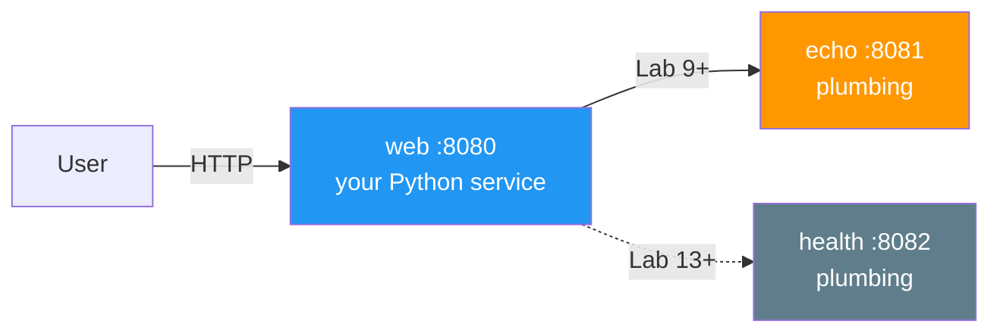
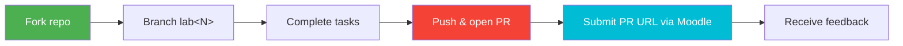

# DevOps Engineering: Core Practices


Master **production-grade DevOps** through hands-on labs. You take a single web service and, week by week, containerize it, wire CI/CD, provision its infrastructure, make it observable, orchestrate it on Kubernetes, and ship it through GitOps and progressive delivery — ending with a multi-service, self-healing, fully-observable system and a portfolio that proves you can run software in production.

> *"You build it, you run it."* — Werner Vogels

---

## Course Roadmap

The arc is **build → integrate → provision → observe → orchestrate → deliver → operate at scale**. Each lab builds on the last; your service grows from one container to a three-service cluster.

| Week | Lab | Module | Key Topics & Tooling (May 2026) |
|:---:|:---:|--------|---------------------------------|
| 1 | 1 | Web Application Development | Python 3.13, Flask/FastAPI, health endpoints |
| 2 | 2 | Containerization | Docker 29, multi-stage, distroless, Trivy scan, GHCR |
| 3 | 3 | Continuous Integration | GitHub Actions, testing pyramid, supply-chain safety |
| 4 | 4 | Infrastructure as Code | Terraform 1.15 **+ Pulumi 3.243**, state, OpenTofu |
| 5 | 5 | Configuration Management | ansible-core 2.21, roles, idempotency, Vault |
| 6 | 6 | Continuous Deployment | Advanced Ansible, Compose v2, CI/CD with OIDC |
| 7 | 7 | Logging | Loki 3.7, **Grafana Alloy 1.16** (Promtail EOL), LogQL |
| 8 | 8 | Monitoring | Prometheus 3.x, PromQL, RED/USE, Grafana 13 |
| 9 | 9 | Kubernetes | K8s 1.36 "Haru", Deployments, Services — **2nd service joins** |
| 10 | 10 | Helm | **Helm 4.1**, charts, templating, hooks, OCI registries |
| 11 | 11 | Secrets Management | K8s Secrets, **OpenBao 2.5**, External Secrets Operator |
| 12 | 12 | Configuration & Storage | ConfigMaps, PV/PVC, StorageClass, hot-reload |
| 13 | 13 | GitOps | **ArgoCD 3.4**, ApplicationSet — **3rd service joins** |
| 14 | 14 | Progressive Delivery | Argo Rollouts 1.8, canary, blue-green, AnalysisTemplate |
| 15 | 15 | StatefulSets | Headless services, volumeClaimTemplates, operators |
| 16 | 16 | Cluster Monitoring | kube-prometheus, ServiceMonitor, init containers |
| — | **Bonus Labs** | | |
| — | 17 | Edge Deployment | Cloudflare Workers, V8 isolates, global edge |
| — | 18 | Reproducible Builds | Nix flakes, deterministic builds |

> 📅 **16-week schedule.** If your semester runs shorter, lectures pair up (two per week) so the lab cadence stays one-per-week. Lectures 1-16 map 1:1 to Labs 1-16; bonus labs 17-18 are covered by Lecture 16.

---

## The Project: a service that grows into a system

You start with **one** Python service (Lab 1) and never throw it away — every lab adds a production capability to the *same* project. Two course-provided plumbing services join later to make orchestration concepts real:



| Service | Role | Owner | When it appears |
|---------|------|-------|-----------------|
| **web** | Your Python web service — the project spine | **You build it** | Lab 1 |
| **echo** | Go companion — makes `Service` + kube-DNS meaningful | Course plumbing (`plumbing/echo/`) | Lab 9 |
| **health** | Go companion — gives ArgoCD ApplicationSet a 3rd target | Course plumbing (`plumbing/health/`) | Lab 13 |

You never write the plumbing services — you deploy and wire them. They expose Prometheus metrics so your Lab 7-8-16 observability stack picks them up automatically.

---

## What Ships vs. What You Produce

| In this repo (course-provided) | In YOUR fork (you produce) |
|--------------------------------|----------------------------|
| `lectures/` — 16 lectures | `app_python/` — your service |
| `labs/` — 18 lab specs | `k8s/` — your manifests (Lab 9+) |
| `plumbing/` — echo + health services | `ansible/`, `terraform/` — your IaC (Labs 4-6) |
| `README.md` — this file | `.github/workflows/` — your CI (Lab 3+) |
| | `monitoring/` — your Prometheus/Loki config (Labs 7-8) |

Student-produced directories are gitignored in this repo so the upstream stays clean. You commit them to *your* fork.

---

## Lab Structure

Each main lab (1-16) is worth **10 points of main tasks + up to 2 bonus points**:

- **Main tasks** sum to **10 pts**. Split varies by lab (e.g. 6+4, or 2+3+3+2) — Task 1 is always standalone so later labs never depend on a task you skipped.
- **Bonus tasks** sum to **2 pts**, flat. Genuinely challenging extensions, not busywork.
- **Bonus labs (17, 18)** follow the same 10 + 2 shape and are the exam-alternative track.

Acceptance criteria and a rubric table close every lab. Minimum passing per lab: 6/10.

---

## Grading

Five components. Maximum contributions sum to **139%**, capped at **100%** — so there are multiple paths to an A and no single component is mandatory.

| Component | Raw | Weight | Rewards |
|-----------|----:|-------:|---------|
| **Main labs 1-16** (main tasks) | 160 | **70%** | Diligent weekly project work — the floor |
| **Bonus tasks** (2 pts × 16 labs, flat) | 32 | **14%** | Going beyond on weekly topics |
| **Quiz leaderboards** (5 rolling windows, top-10 share a pool) | — | **5%** | Engagement + lecture mastery |
| **Bonus labs 17 + 18** (10 pts each) | 20 | **20%** | Edge + reproducible-build mastery; the exam alternative |
| **Final exam** | — | **30%** | Optional — written, comprehensive |
| **Sum (capped at 100%)** | | **139%** | |

### Paths to an A (≥90%)

- **Practice path:** all main labs (70%) + bonuses (14%) + both bonus labs (20%) → 104% → capped A, no exam.
- **Exam path:** all main labs (70%) + bonuses (14%) + a solid exam (30%) → A, no bonus labs.
- **Mixed:** main labs + some bonuses + one bonus lab + a decent exam.

<details>
<summary>📊 Grade scale</summary>

| Grade | Percentage |
|-------|-----------|
| **A** | 90-100% |
| **B** | 75-89% |
| **C** | 60-74% |
| **D** | below 60% |

</details>

---

## Quiz Leaderboards

Each lecture has a 15-question post-quiz. Quizzes feed **5 rolling leaderboard windows** across the semester:

| Window | Lectures | Weeks |
|:---:|----------|:---:|
| 1 | lec 1-3 | 1-3 |
| 2 | lec 4-6 | 4-6 |
| 3 | lec 7-9 | 7-9 |
| 4 | lec 10-12 | 10-12 |
| 5 | lec 13-16 | 13-16 |

The top-10 students in each window split that window's small point pool (≈1% each, ~5% total). Late-joining students can still win later windows.

---

## Technology Stack (pinned May 2026)

| Layer | Tool | Version |
|-------|------|---------|
| Runtime | Python | 3.13 |
| Container | Docker Engine | 29.5 |
| Registry | GHCR | — |
| Scanning | Trivy | v0.69.3+ (post-CVE-2026-33634 safe) |
| CI/CD | GitHub Actions | ubuntu-24.04 runners |
| IaC | Terraform / OpenTofu / Pulumi | 1.15 / 1.12 / 3.243 |
| Config mgmt | ansible-core | 2.21 |
| Logs | Loki + Grafana Alloy | 3.7 / 1.16 |
| Metrics | Prometheus + Grafana | 3.x / 13 |
| Orchestration | Kubernetes | 1.36 "Haru" |
| Local cluster | k3d (k3s-in-Docker) | 5.7 |
| Packaging | Helm | 4.1 |
| Secrets | OpenBao | 2.5 |
| GitOps | ArgoCD | 3.4 |
| Progressive delivery | Argo Rollouts | 1.8 |

---

## Submission Workflow



```bash
git checkout -b lab1
# ... complete the lab ...
git add app_python/
git commit -m "Complete lab1"
git push -u origin lab1
# Open a PR from your-fork:lab1 → your-fork:main, submit the PR URL on Moodle
```

<details>
<summary>📝 Submission checklist</summary>

- [ ] All main tasks completed
- [ ] Documentation written (`docs/LABNN.md`)
- [ ] Screenshots/CLI output where required
- [ ] Code tested and working
- [ ] Markdown validated
- [ ] PR opened and URL submitted

</details>

---

## Key Books & Resources

**DevOps foundations**
- *The Phoenix Project* — Gene Kim et al. (2013)
- *The DevOps Handbook* (2e) — Kim, Humble, Debois, Willis (2021)
- *Accelerate* — Forsgren, Humble, Kim (2018)

**Tooling**
- *Docker Deep Dive* — Nigel Poulton
- *Terraform: Up & Running* (4e) — Yevgeniy Brikman
- *Ansible for DevOps* — Jeff Geerling
- *Kubernetes Up & Running* (3e) — Burns, Beda, Hightower
- *Learning Helm* (2e) — Butcher, Farina, Dolitsky

**Observability & reliability**
- *Observability Engineering* — Majors, Fong-Jones, Miranda
- *Site Reliability Engineering* — Beyer et al. (free at sre.google/books) — pairs with the SRE-Intro elective

**Online**
- [DORA State of DevOps](https://dora.dev/research/)
- [CNCF Cloud Native Landscape](https://landscape.cncf.io)
- [12 Factor App](https://12factor.net)

---

**Ready? Start with [Lab 1](labs/lab01.md).** Questions → course Moodle or office hours.
