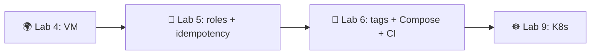

# Lab 5 — Ansible Fundamentals


> **Goal:** Configure the VM you provisioned in Lab 4 by writing three reusable Ansible roles (`common`, `docker`, `app_deploy`), then prove the whole thing is idempotent — second run, `changed=0`.
> **Deliverable:** A PR from `lab05` with the `ansible/` project (three roles, two playbooks, encrypted Vault file, docs).

---

## Overview

In this lab you will practice:
- Writing **idempotent** tasks with FQCN modules (`ansible.builtin.*`, `community.docker.*`)
- Organising tasks into **roles** (`tasks/`, `handlers/`, `defaults/`, `templates/`) instead of one giant playbook
- Using **handlers** so a service restarts only when its config actually changed
- Encrypting secrets with **Ansible Vault** so they live in Git safely
- Reading PLAY RECAP output: `changed=N` on run 1, `changed=0` on run 2 — the acceptance test of configuration management

> ⚠️ **Scope:** Lab 4 *provisioned* the box (Terraform/Pulumi gave it an IP). Lab 5 *configures* what's inside. Lab 6 will add tags, blocks, Compose, and a CI workflow on top of these roles — and will **rename `app_deploy` → `web_app`** via `git mv`. The role names you pick this week will not be permanent for `app_deploy`; everything else carries through unchanged.

> 💡 **No cloud VM? You can target localhost** — set `ansible_connection: local` in the inventory and skip `become:` on tasks that need root in a sudo-less sandbox. The role *logic* is what's graded; running cleanly against localhost with `--check` (where `become` is the only blocker) is accepted as a deliverable. Capture both PLAY RECAPs the same way (`changed=N` then `changed=0`).

> **A note on "LTS":** `ansible-core` has **no formal LTS label**. The open-source engine commits to ~6 months of security fixes per minor release; currently supported versions are **2.18, 2.19, 2.20, 2.21**. Use **2.21**. Red Hat's commercial *Ansible Automation Platform* offers extended support — that is a different product. Slides on the internet that say "2.17 LTS" predate the policy clarification.

---

## Project State

**You should have from previous labs:**
- Lab 2: a Docker image of your Python service pushed to Docker Hub (or any registry)
- Lab 4: a reachable Ubuntu VM (cloud or local libvirt) with passwordless `sudo` for your login user

**This lab adds:**
- `ansible/` — three roles, two playbooks, static inventory, encrypted Vault, docs

By Lab 6 these same roles get tags + blocks + a CI workflow; by Lab 9 the same image runs on Kubernetes. The decisions you make this week — role granularity, variable layout, FQCN — outlive Lab 5.

---

## Setup

Control node (your laptop or CI runner):

```bash
python3 --version          # 3.11+
python3 -m venv .venv && source .venv/bin/activate
pip install "ansible-core==2.21.*"
ansible --version          # expect: ansible [core 2.21.x] / python 3.11+
ansible-galaxy collection install community.docker community.general
```

Target VM (from Lab 4):
- Ubuntu 24.04 LTS (or 22.04)
- SSH access with your key
- **Passwordless `sudo`** for the login user (cloud-init's default — `become:` fails without it)
- Python 3 present (default on Ubuntu)

Create the directory layout (you'll fill the files yourself):

```
ansible/
├── ansible.cfg
├── inventory/
│   └── hosts.ini
├── group_vars/
│   └── all/
│       └── vault.yml             # encrypted; created in Task 3
├── roles/
│   ├── common/
│   │   ├── tasks/main.yml
│   │   └── defaults/main.yml
│   ├── docker/
│   │   ├── tasks/main.yml
│   │   ├── handlers/main.yml
│   │   ├── defaults/main.yml
│   │   └── templates/daemon.json.j2
│   └── app_deploy/
│       ├── tasks/main.yml
│       ├── handlers/main.yml
│       └── defaults/main.yml
├── playbooks/
│   ├── provision.yml             # applies common + docker
│   └── deploy.yml                # applies app_deploy
└── docs/
    └── LAB05.md                  # your submission report
```

> Only create the subdirectories you actually use. A role with no handlers needs no `handlers/`.

---

## Task 1 — Inventory & Role Scaffolding (2 pts)

### 1.1 — Why FQCN, and why now

Since the 2021 `ansible-core` / `ansible` split, modules are referenced by their **Fully-Qualified Collection Name**: `ansible.builtin.apt`, not bare `apt`; `community.docker.docker_container`, not bare `docker_container`. Two reasons it matters:

1. **Disambiguation.** Two collections can ship a module with the same short name. Bare names silently resolve to whichever loaded first — a Heisenbug waiting to happen on a CI runner with a different collection set.
2. **Future-proofing.** The short-name shortcut is deprecated; new modules ship FQCN-only. Lab 6's CI workflow will lint your roles for bare names.

Bare names "work" in 2026 the way `from __future__ import ...` "worked" in Python 2 — until the day they don't. Use FQCN everywhere.

### 1.2 — Static inventory

`YOUR TASK`: write `inventory/hosts.ini` that puts your Lab 4 VM in a `webservers` group. Required keys per host: `ansible_host` (the IP), `ansible_user` (`ubuntu`), and a `[webservers:vars]` block with `ansible_ssh_private_key_file` (path to your Lab 4 key) and `ansible_python_interpreter=/usr/bin/python3`.

Skeleton (fill the blanks; everything in `___` is yours):

```ini
[webservers]
lab-vm ansible_host=___ ansible_user=___        # YOUR TASK: VM IP + SSH user (Lab 4: ubuntu)

[webservers:vars]
ansible_ssh_private_key_file=___                 # YOUR TASK: path to your Lab 4 private key (Lab 4 default: ~/.ssh/lab04)
ansible_python_interpreter=___                   # YOUR TASK: usually /usr/bin/python3
```

<details>
<summary>💡 Targeting localhost instead (sudo-less sandbox)</summary>

If you don't have a Lab 4 VM handy and want to run on the control node itself:

```ini
[webservers]
lab-vm ansible_host=localhost ansible_user=___ ansible_connection=local   # local exec, don't SSH

[webservers:vars]
ansible_python_interpreter=/usr/bin/python3
```

`ansible_connection: local` makes Ansible skip SSH entirely and `exec` modules in-process. The same roles run; tasks needing root (`apt`, `service`) require local `sudo`. If your sandbox has no passwordless sudo, accept that those tasks won't apply for real but their *logic* still validates in `--check` mode — note that explicitly in your `docs/LAB05.md` and capture the `--check` PLAY RECAPs as your idempotency proof.

</details>

### 1.3 — `ansible.cfg`

`YOUR TASK`: write `ansible.cfg` with these keys (look up the exact section headers in the docs — don't copy from Stack Overflow, half the answers there set `host_key_checking=False` globally which is a lab convenience, not a prod practice):

- `[defaults]`: `inventory` (path to your inventory), `roles_path` (path to your roles dir), `host_key_checking` (False for lab; understand why prod sets it to True), `retry_files_enabled` (False)
- `[privilege_escalation]`: `become`, `become_method`, `become_user`

```ini
[defaults]
inventory = ___                                   # YOUR TASK
roles_path = ___                                  # YOUR TASK
host_key_checking = ___                           # YOUR TASK (lab: False; explain why prod is True)
retry_files_enabled = ___                         # YOUR TASK

[privilege_escalation]
become = ___                                      # YOUR TASK
become_method = ___                               # YOUR TASK
become_user = ___                                 # YOUR TASK
```

### 1.4 — Test connectivity

```bash
cd ansible/
ansible all -m ansible.builtin.ping
ansible webservers -a "uname -a"
```

The ping must return `pong` (illustrative — your hostname will differ):

```text
lab-vm | SUCCESS => { "changed": false, "ping": "pong" }
```

### 1.5 — Proof of work

Paste into `docs/LAB05.md`:

- `ansible --version` output (must show 2.21.x)
- `ansible all -m ansible.builtin.ping` output (the `pong`)
- `ansible webservers -a "uname -a"` output (proves SSH + shell access)
- Two sentences on **why FQCN matters** (in your own words)

---

## Task 2 — Provisioning Roles: `common` + `docker` (3 pts)

A *role* is a directory tree with conventional subfolders. Drop one into a playbook with one line. The rule: if you'd copy-paste the same tasks between two playbooks, it's a role.

### 2.1 — `common` role — base packages + timezone

`YOUR TASK`: write `roles/common/defaults/main.yml` and `roles/common/tasks/main.yml`. The defaults file holds *variables a user might want to override*; the tasks file holds the actual work.

`roles/common/defaults/main.yml`:

```yaml
---
common_packages:                                  # YOUR TASK: list at least 4 base packages
  - ___                                           #   (curl/git/vim/htop/ca-certificates — pick a sensible set)
  - ___
  - ___
  - ___
common_timezone: ___                              # YOUR TASK: Etc/UTC or your region
```

`roles/common/tasks/main.yml` — module names given (those are *the lecture's choice*); args are yours:

```yaml
---
- name: ___                                       # YOUR TASK: one-line action description
  ansible.builtin.apt:                            # module given
    update_cache: ___                             # YOUR TASK
    cache_valid_time: ___                         # YOUR TASK: why a value > 0? read the apt module's doc
  when: ___                                       # YOUR TASK: limit to Debian-family hosts (hint: ansible_os_family)

- name: ___                                       # YOUR TASK
  ansible.builtin.package:                        # module given — note: NOT `apt:`; see Common Pitfalls
    name: ___                                     # YOUR TASK: reference the variable from defaults
    state: ___                                    # YOUR TASK: present? latest? justify your choice in docs/LAB05.md
  become: ___                                     # YOUR TASK: true or false? why?
  tags: [___]                                     # YOUR TASK: pick a tag — Lab 6 will leverage tag taxonomy

- name: ___                                       # YOUR TASK: set system timezone
  community.general.timezone:                     # module given
    name: ___                                     # YOUR TASK: reference common_timezone
  become: ___                                     # YOUR TASK
  tags: [___]                                     # YOUR TASK
```

A few of the *whys* you must answer in `docs/LAB05.md` (one sentence each):

- **`become: true` is selective, not blanket.** Why does the timezone task need root but a `ping` doesn't? Why is `become: true` on the *play* a code smell when a single task is the only privilege escalator? (Hint: blast radius + readability.)
- **`state: present` vs `state: latest`.** Both install the package. Why does `present` produce reproducible runs and `latest` quietly break idempotency the moment upstream publishes a new version?
- **Why tag tasks now?** Lab 6 will run `ansible-playbook --tags docker` to deploy only the Docker bits. If you don't tag now, Lab 6's first step is "go back and tag everything." Build the habit.

### 2.2 — `docker` role — install Docker engine

`roles/docker/defaults/main.yml`:

```yaml
---
docker_user: ___                                  # YOUR TASK: the login user to add to the docker group
docker_log_max_size: ___                          # YOUR TASK: a sane value, e.g. "10m"
```

`roles/docker/templates/daemon.json.j2` — Jinja2 template rendered to `/etc/docker/daemon.json`:

```jinja
{
  "log-driver": "___",                            # YOUR TASK: choose a driver (json-file or local)
  "log-opts": { "max-size": "{{ ___ }}" }         # YOUR TASK: reference your default
}
```

`roles/docker/handlers/main.yml`:

```yaml
---
- name: ___                                       # YOUR TASK: handler name — keep it short, you'll `notify:` it
  ansible.builtin.service:                        # module given
    name: ___                                     # YOUR TASK
    state: ___                                    # YOUR TASK: restarted? reloaded? why?
```

`roles/docker/tasks/main.yml` — the heavy lifting. Module names are given (those follow the lecture's slide-20 example); the args are the skill:

```yaml
---
- name: ___                                       # YOUR TASK: install prerequisites
  ansible.builtin.apt:                            # module given
    name: ___                                     # YOUR TASK: list — apt-transport-https, ca-certificates, curl, gnupg, lsb-release
    state: ___                                    # YOUR TASK
    update_cache: ___                             # YOUR TASK

- name: ___                                       # YOUR TASK: add Docker's official APT key
  ansible.builtin.get_url:                        # module given (deb822_repository is also valid — pick one and justify)
    url: ___                                      # YOUR TASK: the Docker download URL for the gpg key
    dest: ___                                     # YOUR TASK: a path under /etc/apt/keyrings/
    mode: ___                                     # YOUR TASK: file mode (string, e.g. "0644")

- name: ___                                       # YOUR TASK: add the Docker APT repository
  ansible.builtin.apt_repository:                 # module given
    repo: ___                                     # YOUR TASK — use {{ ansible_distribution_release }} so it works on jammy + noble
    state: ___                                    # YOUR TASK
    filename: ___                                 # YOUR TASK: a stable filename in /etc/apt/sources.list.d/

- name: ___                                       # YOUR TASK: install docker-ce + cli + containerd.io
  ansible.builtin.apt:                            # module given
    name: ___                                     # YOUR TASK: list of three packages
    state: ___                                    # YOUR TASK
    update_cache: ___                             # YOUR TASK
  notify: ___                                     # YOUR TASK: name your handler from above

- name: ___                                       # YOUR TASK: render daemon.json
  ansible.builtin.template:                       # module given
    src: ___                                      # YOUR TASK: filename in templates/
    dest: ___                                     # YOUR TASK: /etc/docker/daemon.json
    mode: ___                                     # YOUR TASK
  notify: ___                                     # YOUR TASK: fires ONLY if the rendered file differs

- name: ___                                       # YOUR TASK: ensure docker service is started + enabled
  ansible.builtin.service:                        # module given
    name: ___                                     # YOUR TASK
    state: ___                                    # YOUR TASK
    enabled: ___                                  # YOUR TASK

- name: ___                                       # YOUR TASK: add the user to the docker group
  ansible.builtin.user:                           # module given
    name: ___                                     # YOUR TASK: {{ docker_user }}
    groups: ___                                   # YOUR TASK
    append: ___                                   # YOUR TASK: true — why is `append` critical here? what does the default do?

- name: ___                                       # YOUR TASK: install the Docker SDK for Python
  ansible.builtin.pip:                            # module given — without this, community.docker.* modules fail
    name: ___                                     # YOUR TASK: package name (it's not "docker-py" anymore)
    state: ___                                    # YOUR TASK
```

The *whys* you must answer:

- **Why `{{ ansible_distribution_release }}`?** It resolves to `noble` on Ubuntu 24.04 and `jammy` on 22.04 — one role, both distros. (Comes from `gather_facts: true` — leave it on.)
- **Why the `notify:` on the template task, not the apt task?** A package install is a one-shot. A config-file change should restart Docker only when the file *actually changes*. That's the handler's purpose: a fresh first run restarts Docker once; the second run sees the file unchanged and skips the handler entirely. No `changed`, no restart, no downtime.
- **Why `append: true` on the user task?** Without it, Ansible *replaces* the user's group list — booting them out of `sudo`, `adm`, every group they were already in. This is the single most common Ansible footgun on shared boxes.

### 2.3 — Provisioning playbook

`playbooks/provision.yml` — thin by design, all logic lives in the roles:

```yaml
---
- name: Provision web servers
  hosts: ___                                      # YOUR TASK: target group
  become: ___                                     # YOUR TASK: true at play level, OR false + per-task become — argue your choice
  gather_facts: ___                               # YOUR TASK: needed for ansible_distribution_release
  roles:
    - ___                                         # YOUR TASK
    - ___                                         # YOUR TASK
```

### 2.4 — Run and verify

```bash
ansible-playbook playbooks/provision.yml          # first real run
```

First run is mostly yellow (illustrative; your `changed` count will differ):

```text
PLAY RECAP **********************************************************
lab-vm : ok=11  changed=8  unreachable=0  failed=0
```

### 2.5 — Proof of work

Paste into `docs/LAB05.md`:

- Both files' content (`common/tasks/main.yml`, `docker/tasks/main.yml`) — fenced as YAML
- The **full PLAY RECAP** line from `ansible-playbook playbooks/provision.yml`
- `ansible webservers -a "docker --version"` output proving Docker is on the box
- Your one-paragraph answer to each *why* in 2.1 and 2.2

---

## Task 3 — Application Deployment Role + Vault (3 pts)

### 3.1 — Encrypt credentials with Ansible Vault

```bash
ansible-vault create group_vars/all/vault.yml
```

You'll be prompted for a Vault password. **Save that password now** in a gitignored file so the 4 reruns in Task 4 don't make you retype it:

```bash
echo 'your-vault-password' > .vault_pass
chmod 600 .vault_pass
# .vault_pass is already in your .gitignore (see "How to Submit")
```

Tell Ansible to use it (one of two ways — pick one):

- Per-command: `ansible-playbook playbooks/deploy.yml --vault-password-file .vault_pass`
- In `ansible.cfg`: add `vault_password_file = .vault_pass` under `[defaults]`

(The `--ask-vault-pass` form in §3.4 below is the prompt-each-time alternative — use whichever you prefer.)

`YOUR TASK`: put your Docker Hub credentials and app config inside (the file is AES-256 encrypted at rest — safe to commit; the password is NOT).

```yaml
---
dockerhub_username: ___                           # YOUR TASK: your Docker Hub username
dockerhub_password: ___                           # YOUR TASK: an ACCESS TOKEN (dckr_pat_…), not your login password
docker_image: ___                                 # YOUR TASK: e.g. "{{ dockerhub_username }}/devops-info-service"
docker_image_tag: ___                             # YOUR TASK: prefer an immutable tag (a SHA) over "latest"
app_port: ___                                     # YOUR TASK
app_container_name: ___                           # YOUR TASK
```

Confirm it decrypts:

```bash
ansible-vault view group_vars/all/vault.yml
```

> Why a Docker Hub *access token*, not your account password? An access token is scoped (read-only / read-write / admin), revocable per-token, and shows up in your DH audit log. A password leak compromises the whole account.

### 3.2 — `app_deploy` role

`roles/app_deploy/defaults/main.yml`:

```yaml
---
app_restart_policy: ___                           # YOUR TASK: unless-stopped or on-failure — why?
app_health_path: ___                              # YOUR TASK: /health (matches your Lab 1 service)
```

`roles/app_deploy/handlers/main.yml`:

```yaml
---
- name: ___                                       # YOUR TASK: handler name (`restart app` is fine)
  community.docker.docker_container:              # module given
    name: ___                                     # YOUR TASK: {{ app_container_name }}
    state: ___                                    # YOUR TASK
    restart: ___                                  # YOUR TASK
```

`roles/app_deploy/tasks/main.yml` — module names given (this is the lecture's `community.docker.*` choice); args are the skill:

```yaml
---
- name: ___                                       # YOUR TASK: log in to Docker Hub
  community.docker.docker_login:                  # module given
    username: ___                                 # YOUR TASK
    password: ___                                 # YOUR TASK
  no_log: ___                                     # YOUR TASK: true — why?

- name: ___                                       # YOUR TASK: pull the image
  community.docker.docker_image:                  # module given
    name: ___                                     # YOUR TASK: {{ docker_image }}
    tag: ___                                      # YOUR TASK
    source: ___                                   # YOUR TASK: pull
    force_source: ___                             # YOUR TASK: false — defend your answer (idempotency)

- name: ___                                       # YOUR TASK: run the container
  community.docker.docker_container:              # module given
    name: ___                                     # YOUR TASK
    image: ___                                    # YOUR TASK: "{{ docker_image }}:{{ docker_image_tag }}"
    state: ___                                    # YOUR TASK
    restart_policy: ___                           # YOUR TASK
    ports:
      - ___                                       # YOUR TASK: "host:container" — e.g. "{{ app_port }}:5000"
    pull: ___                                     # YOUR TASK: never/always/missing — why never on rerun?

- name: ___                                       # YOUR TASK: wait for the port to accept connections
  ansible.builtin.wait_for:                       # module given
    host: ___                                     # YOUR TASK
    port: ___                                     # YOUR TASK
    timeout: ___                                  # YOUR TASK

- name: ___                                       # YOUR TASK: verify /health returns HTTP 200
  ansible.builtin.uri:                            # module given
    url: ___                                      # YOUR TASK: full URL ending in {{ app_health_path }}
    status_code: ___                              # YOUR TASK
    return_content: ___                           # YOUR TASK
  register: ___                                   # YOUR TASK: capture the response so docs can show it
```

The *whys* (one sentence each in `docs/LAB05.md`):

- **`no_log: true` on the login task** — without it, your Docker Hub token shows up plaintext in the CI build log. CI logs are world-readable on public repos. There is no "delete" button.
- **`pull: never` on the run task** — the previous pull step already fetched the right image. `pull: always` on `docker_container` re-pulls every run, which (a) breaks idempotency cosmetically and (b) wastes a registry round-trip.
- **Why the `community.docker` collection and not `community.general`?** Docker modules were forked into a dedicated collection in 2020 for faster release cadence. `community.general.docker_*` doesn't exist anymore — bare-Stack-Overflow answers may still reference it; they're stale.

### 3.3 — Deployment playbook

`playbooks/deploy.yml`:

```yaml
---
- name: Deploy application
  hosts: ___                                      # YOUR TASK
  become: ___                                     # YOUR TASK: why true? what does the docker_container module need root for?
  gather_facts: ___                               # YOUR TASK
  roles:
    - ___                                         # YOUR TASK
```

### 3.4 — Run and verify

```bash
ansible-playbook playbooks/deploy.yml --ask-vault-pass    # or --vault-password-file .vault_pass
curl -fsS http://<VM-IP>:<app_port>/health | jq .         # expect HTTP 200 + JSON
```

### 3.5 — Proof of work

Paste into `docs/LAB05.md`:

- `app_deploy/tasks/main.yml` content (fenced YAML)
- The PLAY RECAP from `ansible-playbook playbooks/deploy.yml` (run #1)
- `ansible webservers -a "docker ps --format '{{.Names}}\t{{.Status}}'"` output (your container running)
- `curl -s http://<VM-IP>:<port>/health | jq .` against the VM (HTTP 200, the real JSON your Lab 1 service emits)
- Proof Vault file is encrypted: `head -1 group_vars/all/vault.yml` showing `$ANSIBLE_VAULT;1.1;AES256`

---

## Task 4 — Idempotency Proof (1 pt)

This is the headline acceptance test. Configuration management's killer feature is that running the same playbook twice has the same effect as running it once.

```bash
# Vault password file in place (see Task 3.1) OR add --ask-vault-pass to each line
ansible-playbook playbooks/provision.yml          # run #1
ansible-playbook playbooks/provision.yml          # run #2
ansible-playbook playbooks/deploy.yml             # run #1 (already done in Task 3)
ansible-playbook playbooks/deploy.yml             # run #2
```

> 💡 Once `group_vars/all/vault.yml` exists, **every** playbook (including `provision.yml`) loads it on start and needs the Vault password — even though `provision.yml` doesn't *use* the secrets. Either set `vault_password_file` in `ansible.cfg` once, or append `--ask-vault-pass` to all four commands above.

The **second run of each must report `changed=0`**. (Illustrative.)

```text
# provision.yml, run #1
lab-vm : ok=11  changed=8  unreachable=0  failed=0
# provision.yml, run #2
lab-vm : ok=11  changed=0  unreachable=0  failed=0       # ← changed=0 = idempotent ✓

# deploy.yml, run #1
lab-vm : ok=6   changed=4  unreachable=0  failed=0
# deploy.yml, run #2
lab-vm : ok=6   changed=0  unreachable=0  failed=0       # ← changed=0 = idempotent ✓
```

If anything still changes on run #2, **the task is not idempotent — fix it**. Usual culprits:

- A stray `ansible.builtin.shell` or `command` (no state model). Wrap with `creates:`/`removes:`, or replace with the proper module.
- A template that renders a timestamp or random value.
- `state: latest` on a package — the moment the upstream repo gets a new version, you'll see `changed=1` forever.
- `force_source: true` on `docker_image` — always re-pulls.

Confirm there's no drift with a dry-run:

```bash
ansible-playbook playbooks/provision.yml --check --diff
```

### 4.1 — Proof of work

Paste into `docs/LAB05.md`:

- Both PLAY RECAPs from `provision.yml` (run #1 changed=N, run #2 changed=0)
- Both PLAY RECAPs from `deploy.yml` (same shape)
- Output of the `--check --diff` dry-run (no changes, no diffs)
- A one-paragraph analysis: which tasks changed on run #1, why they reported `ok` on run #2, and if anything stayed `changed=1` — what you fixed

---

## Task 5 — Documentation (1 pt)

`ansible/docs/LAB05.md` — required sections, in order:

1. **Architecture** — `ansible-core` version, target OS, why three roles (not one monolithic playbook)
2. **Roles** — for each of `common`, `docker`, `app_deploy`: purpose, key variables, handler behaviour
3. **The *why* answers** from Tasks 2 and 3 (FQCN, selective `become`, `state: present` vs `latest`, `append: true`, handler on template vs on apt, `no_log`, `pull: never`)
4. **Idempotency proof** — both PLAY RECAPs (Task 4) with one-paragraph analysis
5. **Vault** — how credentials are stored, password-handling strategy, the encrypted-header proof
6. **Deployment verification** — `docker ps` and the `/health` `curl` output

---

## Bonus Task — Dynamic Inventory (2 pts)

Discover your Lab 4 VM(s) automatically via a cloud inventory plugin instead of hardcoding the IP. A static list rots the moment a VM is recreated and gets a new address — the inventory has to know that *before* Ansible can configure anything.

`YOUR TASK`:

1. Install the collection for your Lab 4 cloud:
   ```bash
   ansible-galaxy collection install ___        # YOUR TASK: amazon.aws / google.cloud / azure.azcollection / yandex.cloud
   ```
2. Write `inventory/<cloud>.yml` that:
   - Sets `plugin:` to the FQCN inventory plugin (e.g. `amazon.aws.aws_ec2`)
   - Filters to **running** instances tagged for this course (use `filters:`)
   - Uses `compose:` to set `ansible_host` to the public IP (the field name varies — see hints below)
   - Uses `keyed_groups:` to build a group automatically (e.g. `webservers` from a `Role` tag)
3. Point Ansible at it (`-i inventory/<cloud>.yml` or update `ansible.cfg`)
4. Run:
   ```bash
   ansible-inventory -i inventory/<cloud>.yml --graph
   ansible all -i inventory/<cloud>.yml -m ansible.builtin.ping
   ansible-playbook -i inventory/<cloud>.yml playbooks/provision.yml --check --diff
   ```

Skeleton (AWS — adapt field names for your cloud):

```yaml
# inventory/aws.yml
plugin: ___                                       # YOUR TASK: amazon.aws.aws_ec2
regions:
  - ___                                           # YOUR TASK
filters:
  ___: ___                                        # YOUR TASK: tag:Project=devops-core
  instance-state-name: ___                        # YOUR TASK: running
keyed_groups:
  - key: ___                                      # YOUR TASK: tags.Role
    prefix: ___                                   # YOUR TASK
compose:
  ansible_host: ___                               # YOUR TASK: public_ip_address (for AWS)
```

<details>
<summary>💡 Per-cloud field hints</summary>

| Cloud | Collection | Plugin | Public-IP field |
|---|---|---|---|
| AWS | `amazon.aws` | `aws_ec2` | `public_ip_address` |
| GCP | `google.cloud` | `gcp_compute` | `networkInterfaces[0].accessConfigs[0].natIP` |
| Azure | `azure.azcollection` | `azure_rm` | `public_ipv4_addresses[0]` |
| Yandex | `yandex.cloud` | `yandex_compute` | nested under `network_interfaces[0]` |

Docs: [Inventory plugins](https://docs.ansible.com/ansible-core/2.21/plugins/inventory.html) · [aws_ec2](https://docs.ansible.com/ansible/latest/collections/amazon/aws/aws_ec2_inventory.html)

</details>

### Bonus proof of work

Paste into `docs/LAB05.md`:

- The full `inventory/<cloud>.yml` (no secrets — auth is via env vars / IAM role)
- `ansible-inventory --graph` output showing the auto-discovered host(s)
- `ansible all -i inventory/<cloud>.yml -m ansible.builtin.ping` PLAY RECAP
- One paragraph: which plugin you used and why, how you authenticated (env vars? IAM instance profile? cloud SDK config?), and what happens when a VM's IP changes (nothing — no manual edits)

---

## How to Submit

```bash
git switch -c lab05

# Keep secrets out of Git
cat >> .gitignore <<'EOF'
# Ansible
*.retry
.vault_pass
__pycache__/
EOF

git add ansible/ .gitignore
git commit -m "feat(lab05): ansible roles — common, docker, app_deploy + idempotency proof"
git push -u origin lab05
```

**Verify before pushing:** `.vault_pass` absent, SSH private keys absent, only the *encrypted* `vault.yml` committed.

Open **two** PRs:

- `your-fork:lab05` → `course-repo:master` *(reviewed)*
- `your-fork:lab05` → `your-fork:master` *(merges into your own main when done)*

PR checklist:

```text
- [ ] Task 1 done — inventory + ansible.cfg + ping succeeds
- [ ] Task 2 done — common + docker roles applied; PLAY RECAP captured
- [ ] Task 3 done — app_deploy role + encrypted Vault; /health curl is HTTP 200
- [ ] Task 4 done — idempotency: both run #2 PLAY RECAPs show changed=0
- [ ] Task 5 done — docs/LAB05.md covers all six sections with the *why* answers
- [ ] Bonus — dynamic inventory: ansible-inventory --graph + ping against it
```

---

## Acceptance Criteria

### Task 1 (2 pts)
- ✅ `ansible-core` 2.21 installed (`ansible --version`)
- ✅ Three roles scaffolded (`common`, `docker`, `app_deploy`) with conventional subdirs
- ✅ Static inventory + `ansible.cfg` configured
- ✅ `ansible all -m ansible.builtin.ping` returns `pong`

### Task 2 (3 pts)
- ✅ `common` role installs base packages, sets timezone — passes with `become: true` only where root is needed
- ✅ `docker` role installs Docker Engine, renders `daemon.json`, manages the service, adds the user to the `docker` group with `append: true`
- ✅ All tasks use FQCN modules
- ✅ Handler restarts Docker **only** on template change (`notify:` on the template task)
- ✅ `provision.yml` applies both roles cleanly

### Task 3 (3 pts)
- ✅ Credentials stored in an encrypted Vault file (`head -1` shows `$ANSIBLE_VAULT;1.1;AES256`)
- ✅ `app_deploy` role pulls the Lab 2 image and runs it as a container
- ✅ `no_log: true` on the login task
- ✅ `/health` returns HTTP 200; `curl` output captured

### Task 4 (1 pt)
- ✅ Run #1 PLAY RECAP shows `changed > 0`
- ✅ Run #2 PLAY RECAP shows `changed=0` — for **both** `provision.yml` and `deploy.yml`
- ✅ `--check --diff` shows no drift

### Task 5 (1 pt)
- ✅ `docs/LAB05.md` covers all six sections

### Bonus Task (2 pts)
- ✅ Cloud inventory plugin configured for the Lab 4 provider
- ✅ `ansible-inventory --graph` shows auto-discovered hosts
- ✅ A playbook runs successfully against the dynamic inventory

---

## Rubric

| Task | Points | Criteria |
|------|-------:|----------|
| **Task 1** — Inventory & scaffolding | **2** | FQCN ping, cfg, three-role layout |
| **Task 2** — `common` + `docker` roles | **3** | Idempotent tasks, handler on template, FQCN, `append: true`, *whys* documented |
| **Task 3** — `app_deploy` + Vault | **3** | Lab 2 image runs, `/health` 200, encrypted Vault, `no_log` |
| **Task 4** — Idempotency | **1** | Run #2 `changed=0` on both playbooks |
| **Task 5** — Documentation | **1** | All six sections complete |
| **Bonus** — Dynamic inventory | **2** | Cloud plugin auto-discovers hosts |
| **Total** | **12** | 10 main + 2 bonus |

**Critical requirements:**
- MUST use role-based structure (not a monolithic playbook)
- MUST use FQCN modules everywhere
- MUST demonstrate idempotency (run #2 changed=0 for both playbooks — this is the lab's headline)
- MUST use Ansible Vault; MUST NOT commit `.vault_pass` or plaintext secrets

---

## Resources

<details>
<summary>📚 Ansible Core 2.21</summary>

- [ansible-core 2.21 docs](https://docs.ansible.com/ansible-core/2.21/)
- [Roles](https://docs.ansible.com/ansible-core/2.21/playbook_guide/playbooks_reuse_roles.html)
- [Handlers](https://docs.ansible.com/ansible-core/2.21/playbook_guide/playbooks_handlers.html)
- [Inventory](https://docs.ansible.com/ansible-core/2.21/inventory_guide/intro_inventory.html)
- [FQCN](https://docs.ansible.com/ansible-core/2.21/reference_appendices/glossary.html#term-FQCN)
- *Ansible for DevOps* — Jeff Geerling (2024 ed.)

</details>

<details>
<summary>🔒 Vault & secrets</summary>

- [Ansible Vault](https://docs.ansible.com/ansible-core/2.21/vault_guide/index.html)
- [no_log](https://docs.ansible.com/ansible-core/2.21/reference_appendices/logging.html)

</details>

<details>
<summary>🐳 Docker modules & dynamic inventory</summary>

- [community.docker collection](https://docs.ansible.com/ansible/latest/collections/community/docker/index.html)
- [docker_login](https://docs.ansible.com/ansible/latest/collections/community/docker/docker_login_module.html) · [docker_image](https://docs.ansible.com/ansible/latest/collections/community/docker/docker_image_module.html) · [docker_container](https://docs.ansible.com/ansible/latest/collections/community/docker/docker_container_module.html)
- [Install Docker on Ubuntu](https://docs.docker.com/engine/install/ubuntu/)
- [Inventory plugins](https://docs.ansible.com/ansible-core/2.21/plugins/inventory.html)

</details>

<details>
<summary>⚠️ Common Pitfalls (from real dry-runs)</summary>

- **`become: true` without passwordless sudo** — the play fails with `sudo: a password is required`. Fix on the VM (cloud-init usually creates the login user with `NOPASSWD: ALL` in `/etc/sudoers.d/`); on hand-built hosts, add the user yourself. Bare-bones containers won't have it at all.
- **`ansible.builtin.apt` on a non-Debian host** — fails immediately on RHEL/Fedora/Alpine. If your `common` role might ever target a non-Debian box, use `ansible.builtin.package` (auto-dispatches to apt/dnf/yum/zypper) and let the module pick. For Debian-specifics (PPA, repo files), keep `apt:` but gate with `when: ansible_os_family == "Debian"`.
- **`community.docker.docker_container` fails with `Failed to import the required Python library (Docker SDK for Python)`** — the *target* needs `pip install docker`. That's why the `docker` role's last task installs it via `ansible.builtin.pip`. Without it, `docker_container` errors before doing anything.
- **Dynamic inventory says `No inventory was parsed`** — the cloud collection isn't installed (`ansible-galaxy collection install amazon.aws`), the file isn't named `*.aws_ec2.yml` / `*.yml` matching `plugin:`, or your auth env vars (`AWS_ACCESS_KEY_ID` / `GOOGLE_APPLICATION_CREDENTIALS` / `AZURE_*`) aren't set. Run `ansible-inventory -i inventory/<cloud>.yml --list -vvv` to see the real error — `--graph` swallows it.
- **`append: true` forgotten on the user task** — Ansible *replaces* the user's group list, booting them out of `sudo`/`adm`. If you SSH'd in as `ubuntu` and ran that, the next login fails. Always `append: true` when adding to a group.
- **`state: latest` on a package** — every new upstream release flips run #2 from `changed=0` to `changed=1`. Use `state: present` for reproducible runs.
- **Vault file gets committed without `--encrypt`** — `git diff` shows your tokens in plaintext. Recovery: `git reset --hard HEAD~1`, rotate the token (it's burned), re-encrypt. Always `ansible-vault create` (not `vi`).
- **`provision.yml` suddenly prompts for a Vault password.** Once `group_vars/all/vault.yml` exists, Ansible loads it on every play — even `provision.yml` that doesn't reference the secrets. Either set `vault_password_file = .vault_pass` in `ansible.cfg` once, or pass `--ask-vault-pass`/`--vault-password-file` to *all four* runs in Task 4. Skipping this is the #1 reason students retype their password 8 times during the idempotency proof.

</details>

<details>
<summary>🛠️ Dev tools worth knowing</summary>

- [ansible-lint](https://ansible.readthedocs.io/projects/lint/) — catches FQCN violations, missing `name:`, `state: latest` smells. Lab 6's CI uses this.
- [Molecule](https://ansible.readthedocs.io/projects/molecule/) — spins each role in a container and tests it in isolation.
- `ansible-playbook -vvv` — three v's print the SSH command + module JSON. Indispensable for debugging "why did it say `changed`?"

</details>

---

## Looking Ahead

| Lab | What it adds to these roles |
|---:|---|
| 6 | Tags (`--tags docker`), blocks + `rescue:`/`always:`, Compose templates, CI workflow |
| 9 / 10 | Same image deployed to k3d via Helm — Ansible becomes the bootstrapper, not the deployer |
| 11 | Replace Ansible Vault with OpenBao as the runtime secret store |



---

**Good luck.** 🚀

> **Remember:** Tell the server *where to end up*, not *how* to get there. The acceptance test is `changed=0` on run #2. Keep credentials in Vault, keep roles small, document the *why*.
