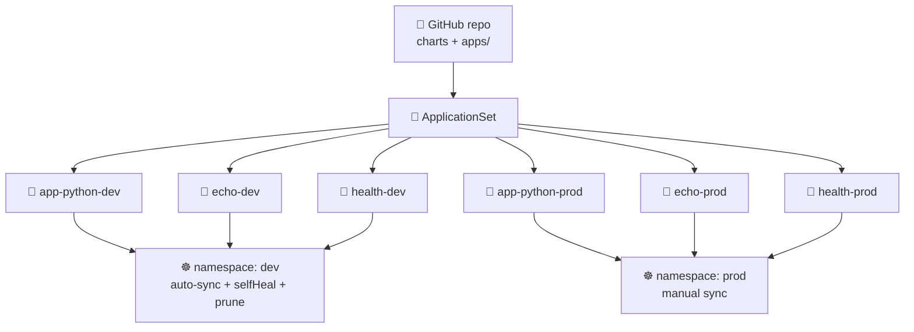

# Lab 13 — GitOps with ArgoCD


> **Goal:** Make Git the single source of truth for your cluster. Install **ArgoCD 3.4**, declare `Application` manifests for **three** services across **two** environments by hand, then collapse all six into one **ApplicationSet** that the cluster reconciles continuously.
> **Deliverable:** A PR from `lab13` with `k8s/argocd/` (apps + ApplicationSet + values) and `docs/LAB13.md`. No more `helm upgrade` from your laptop.

---

## Overview

Through Lab 12 you deployed by typing `helm upgrade` from a laptop (or a CI runner). That is the **push** model: a human or pipeline reaches *into* the cluster with cluster-admin credentials. **GitOps** inverts this — an agent *inside* the cluster watches Git, pulls the desired state, and reconciles it continuously. The cluster reaches out to Git; nothing reaches in.

In this lab you will practice:

- Picking and **pinning an ArgoCD chart version whose `appVersion` is in the 3.4.x line** (no tutorial copy-paste — read the chart index)
- Writing an `Application` CRD from the bare shape — `source` / `destination` / `syncPolicy` in your own hand
- Two sync disciplines: dev with `automated{prune,selfHeal}`, prod with manual sync — and writing down *why*
- Generating **six** Applications from one **ApplicationSet** Matrix(List, List) template — the pattern that only earns its keep at ≥ 3 apps
- Proving the GitOps loop: delete a workload, ArgoCD recreates it; `kubectl edit` a Service, ArgoCD reverts it within 3 minutes

> ⚠️ **Scope:** no Argo Rollouts (that's Lab 14), no multi-cluster, no SSO/OIDC. Stick to one in-cluster ArgoCD managing one cluster. Pick a *different* bonus instead of installing more controllers.

> ⚠️ **Version note:** ArgoCD **2.x is EOL** (the 3.2 release in November 2025 ended 2.x support). This lab uses **3.4**. If a tutorial you find online uses 2.x manifests, the `Application`/`ApplicationSet` CRDs are compatible, but cross-check against the 3.x docs linked at the end.

---

## Project State

**You should have from previous labs:**

- A k3d cluster on Kubernetes **1.36** (Lab 9)
- A Helm chart for `app-python` under `k8s/lab10-app/` with `values-dev.yaml` / `values-prod.yaml` (Lab 10) — Lab 13 will deploy this chart through ArgoCD instead of `helm upgrade`
- The **`echo`** plumbing service from Lab 9 (`ghcr.io/inno-devops-labs/echo:v1`, port 8081)

**This lab adds:**

- ArgoCD 3.4 installed via the `argo/argo-cd` Helm chart (in `argocd` namespace)
- The **`health`** plumbing service — the **third** service in your topology, shipped in `plumbing/health/` (`ghcr.io/inno-devops-labs/health:v1`, port 8082)
- `k8s/argocd/apps/` — six hand-written `Application` manifests (Tasks 2–3), later replaced by one `ApplicationSet` (Task 4)
- `docs/LAB13.md` — your submission report

By Lab 14 the same six Applications get progressive-delivery `Rollout` CRDs in front of them, so the GitOps loop you build here is the substrate everything else runs on.

---

## The Three Services

| Service | Origin | Image | Port | You build it? |
|---|---|---|---|---|
| 🐍 **app-python** | Your Lab 1 → Lab 12 service | from your CI | 8080 | ✅ Yes — your code |
| 🦫 **echo** | Course plumbing (Lab 9+) | `ghcr.io/inno-devops-labs/echo:v1` | 8081 | ❌ No — pre-built |
| 💚 **health** | Course plumbing — **new this lab** | `ghcr.io/inno-devops-labs/health:v1` | 8082 | ❌ No — pre-built |

`health` is shipped in `plumbing/health/` (see `plumbing/health/README.md`). Reference the published image directly — **do not** `docker build` it. It exposes `GET /`, `GET /healthz`, and `GET /metrics`. Its only purpose in this lab is to be a third deployment target so `ApplicationSet` stops being a toy pattern.



---

## Setup

Confirm prereqs from prior labs are alive: `kubectl get nodes` (3 Ready nodes on v1.36.x from Lab 9) and `helm version` (4.1.x from Lab 10). Then add the Argo chart repo — `helm repo add argo https://argoproj.github.io/argo-helm && helm repo update`. You'll search it in Task 1.

Directory layout you will produce — `k8s/argocd/install/argocd-values.yaml` (Task 1), six Application manifests under `k8s/argocd/apps/` (Tasks 2 & 3 — `{app-python,echo,health}-{dev,prod}.yaml`), and `k8s/argocd/applicationset.yaml` (Task 4, which deletes the six). Your write-up goes in `docs/LAB13.md`. Plumbing files (`plumbing/health/Dockerfile`, `main.go`, …) you do **not** edit — they are given, complete.

---

## Task 1 — Install ArgoCD 3.4 (2 pts)

### 1.1 — Find a chart version with `appVersion` in 3.4.x

`YOUR TASK`: the `argo/argo-cd` Helm chart and the ArgoCD application itself version independently. Pick a **chart** version whose **`appVersion`** falls inside **3.4.x** (2.x is EOL — you will lose this point if your server reports 2.x or a 3.3.x preview).

Hint: `helm search repo argo/argo-cd --versions` lists `CHART VERSION` and `APP VERSION` side by side. Read the table; pick the most recent stable row with `APP VERSION` starting `3.4.`.

In `docs/LAB13.md`, write the **two** version numbers you chose and a sentence explaining how chart-version and appVersion differ.

### 1.2 — Install via Helm, with a pinned values file

`YOUR TASK`: create **`k8s/argocd/install/argocd-values.yaml`** with the *minimum* overrides for a k3d-friendly install. Don't blindly upstream-default. At a minimum, decide and configure:

- whether `server.service.type` should be `ClusterIP` (you'll `kubectl port-forward`) or `LoadBalancer` (k3d's klipper publishes it) — pick one and justify in the report
- `configs.params."server.insecure"` — true is fine for the lab (you'll terminate TLS at port-forward); document the tradeoff
- a `resources:` block for at least `controller` and `repoServer` that fits inside k3d's two-agent budget

Then install — fill in the chart version you picked:

```bash
# YOUR TASK below:
#   --version: the chart version you picked in 1.1
#   --values:  path to your overrides file (e.g. k8s/argocd/install/argocd-values.yaml)
kubectl create namespace argocd
helm install argocd argo/argo-cd \
  --namespace argocd \
  --version YOUR-TASK \
  --values YOUR-TASK
# wait for the server with `kubectl rollout status deploy/argocd-server -n argocd --timeout=180s`
```

`k8s/argocd/install/argocd-values.yaml` skeleton — write the inside yourself:

```yaml
# k8s/argocd/install/argocd-values.yaml
# Overrides for the argo/argo-cd chart on a k3d cluster.
# Leave defaults for anything you don't have a reason to change.

server:
  service:
    type: YOUR-TASK            # ClusterIP or LoadBalancer — your call, document why
  # YOUR-TASK: any other server overrides (e.g. resource requests/limits)

configs:
  params:
    server.insecure: "YOUR-TASK"   # "true" if you want plain HTTP over port-forward

controller:
  resources:
    requests:
      cpu: YOUR-TASK
      memory: YOUR-TASK
    limits:
      cpu: YOUR-TASK
      memory: YOUR-TASK

repoServer:
  resources:
    requests:
      cpu: YOUR-TASK
      memory: YOUR-TASK
```

### 1.3 — Access UI + install matching CLI

`YOUR TASK`: port-forward `svc/argocd-server` to your laptop, retrieve the initial admin password from the `argocd-initial-admin-secret` Secret in the `argocd` namespace (it's base64-encoded in `.data.password`), install the matching **3.4.x** CLI binary, and log in. The CLI's `argocd version` must report **both** `argocd: v3.4.x` (client) **and** `argocd-server: v3.4.x` (server).

Hint: the password lives in a Secret — `kubectl get secret -n argocd` lists what's there. Don't copy the base64; decode it.

### 1.4 — Proof of work

**Paste into `docs/LAB13.md`:**

- `helm search repo argo/argo-cd --versions | head -5` — your chosen row highlighted
- `kubectl get pods -n argocd -o wide` — all core pods Running (expect ≥ 6: `argocd-server`, `argocd-application-controller`, `argocd-applicationset-controller`, `argocd-repo-server`, `argocd-redis`, `argocd-notifications-controller`; `dex-server` only if you enabled it)
- `argocd version` — client + server both **3.4.x**
- The full contents of `k8s/argocd/install/argocd-values.yaml`
- One sentence on your `server.service.type` choice + one sentence on `server.insecure`

---

## Task 2 — Application CRDs for Three Services (3 pts)

### 2.1 — Lay out the GitOps repo path

`YOUR TASK`: under `k8s/argocd/apps/`, you will produce **six** `Application` manifests in Tasks 2 and 3 (3 services × 2 envs). For now, start with the three **dev** Applications. In `docs/LAB13.md`, include a one-paragraph note explaining: which **chart** each Application references (Lab 10 chart for `app-python`; small charts you write for `echo` and `health` that just deploy the pre-built images + a Service).

> Tip: the simplest `echo`/`health` chart is a `Chart.yaml` + `templates/deployment.yaml` + `templates/service.yaml` — three files each. The image must be `ghcr.io/inno-devops-labs/echo:v1` and `ghcr.io/inno-devops-labs/health:v1`. Do **not** rebuild them.

### 2.2 — Write three `Application` CRDs by hand (dev environment)

`YOUR TASK`: write `app-python-dev.yaml`, `echo-dev.yaml`, `health-dev.yaml` in `k8s/argocd/apps/`. The shape is shown; **every** value is yours to choose. For now start with **manual sync** (no `automated:` block) — you will turn it on in Task 3.

```yaml
# k8s/argocd/apps/app-python-dev.yaml   (echo-dev.yaml and health-dev.yaml are analogous)
apiVersion: argoproj.io/v1alpha1
kind: Application
metadata:
  name: YOUR-TASK                # e.g. app-python-dev — the controller indexes by this
  namespace: argocd              # ArgoCD watches Applications in its OWN namespace
  finalizers:
    - YOUR-TASK                  # the resources-finalizer that cascade-deletes K8s
                                 # resources on `kubectl delete app`. Look it up.
spec:
  project: default
  source:
    repoURL: YOUR-TASK           # https://github.com/<you>/<your-fork>.git
    targetRevision: YOUR-TASK    # branch (dev) or tag/SHA (prod) — pick one, explain in report
    path: YOUR-TASK              # e.g. k8s/lab10-app for app-python; k8s/charts/echo for echo
    helm:                        # if your chart takes values, declare them here
      valueFiles:
        - YOUR-TASK               # e.g. values-dev.yaml
  destination:
    server: https://kubernetes.default.svc       # in-cluster API server
    namespace: YOUR-TASK         # the K8s namespace the WORKLOAD lands in (e.g. dev)
  syncPolicy:
    # NO `automated:` block YET — Task 3 turns it on for dev only.
    syncOptions:
      - YOUR-TASK                # the option that auto-creates the destination namespace
```

Things to figure out as you write these:

- `metadata.name` lives in `argocd` namespace but `spec.destination.namespace` is where the **workload** goes — these are two different namespaces. Do not conflate them.
- `repoURL` must be the **GitOps repo** (your fork), reachable from the cluster. For HTTPS public repos no credential is needed; for private repos you'd register an `argocd-repo-creds` Secret (out of scope, but worth a sentence in the report).
- The `finalizers:` block is **load-bearing**. Without it, `kubectl delete app` leaves the Deployment/Service running in the workload namespace. Try it both ways if you want to see the difference.

### 2.3 — Deploy and trigger the first sync manually

Apply the three Application CRs (`kubectl apply -f k8s/argocd/apps/`) and confirm they appear in `argocd app list` as **OutOfSync** (no `automated:` block yet means the CRs exist but nothing has been reconciled). Then trigger each one with `argocd app sync <name>` — this is the manual sync click-equivalent. Confirm each reaches **`Synced / Healthy`** with `kubectl get app -n argocd -o wide`.

### 2.4 — Prove the GitOps loop

`YOUR TASK`: change something cheap in Git (e.g. `replicaCount: 1` → `2` in your `app-python` chart's `values.yaml`), commit, push. Then **without running any `kubectl apply` or `helm upgrade`**, watch ArgoCD:

1. Mark the Application **OutOfSync** within ~3 min (default reconcile interval), or sooner if you click **REFRESH** in the UI
2. Apply the change (manual sync) and return to **Synced / Healthy**

This is the headline of GitOps — Git changed, the cluster followed. No human reached into the cluster.

### 2.5 — Proof of work

**Paste into `docs/LAB13.md`:**

- The contents of the three Application manifests
- `kubectl get app -n argocd -o wide` — three rows, **Synced / Healthy**
- `kubectl get deploy,svc -n dev` — six resources (one Deployment + one Service per service) that you **never** `kubectl apply`'d by hand
- The git commit SHA of your "GitOps loop" change + a screenshot or `argocd app history app-python-dev` showing the sync after that commit

---

## Task 3 — Multi-Environment: dev (auto) vs prod (manual) (3 pts)

### 3.1 — Two namespaces, two value sets

`YOUR TASK`: provide `values-dev.yaml` and `values-prod.yaml` for **each** chart (your `app-python` chart already has them from Lab 10; you need to add equivalents for the `echo` and `health` mini-charts you wrote in Task 2). They must differ **meaningfully** — at minimum two of: replica count, resource requests/limits, image tag pin, service type. Document the table in `docs/LAB13.md`.

### 3.2 — Convert dev to auto-sync, add three prod Applications

`YOUR TASK`: edit your three dev Applications to add an `automated:` block, and **write three new** prod Applications (`app-python-prod.yaml`, `echo-prod.yaml`, `health-prod.yaml`) that target the `prod` namespace **without** an `automated:` block.

**Dev sync policy — `YOUR-TASK` to fill:**

```yaml
syncPolicy:
  automated:
    prune: YOUR-TASK              # delete cluster resources removed from Git?
    selfHeal: YOUR-TASK           # revert manual cluster edits back to Git state?
    allowEmpty: YOUR-TASK         # apply when render produces zero manifests? (read the docs)
  syncOptions:
    - CreateNamespace=true
    - YOUR-TASK                    # the option that uses K8s server-side apply
                                   # — required for clean HPA/VPA coexistence
```

**Prod sync policy — `YOUR-TASK` to fill:**

```yaml
spec:
  source:
    repoURL: YOUR-TASK
    targetRevision: YOUR-TASK     # a TAG or release/* branch — NOT `main`. Why? See 3.3.
    path: YOUR-TASK
    helm:
      valueFiles:
        - YOUR-TASK                # e.g. values-prod.yaml
  destination:
    namespace: YOUR-TASK           # prod
  syncPolicy:
    # NO `automated:` block — prod is manual. A human clicks SYNC or runs `argocd app sync`.
    syncOptions:
      - YOUR-TASK
```

### 3.3 — Explain the operational tradeoff

In `docs/LAB13.md`, write 4–6 sentences answering:

- Why is `prune: true` + `selfHeal: true` reasonable for **dev** but dangerous for **prod**?
- Why does `targetRevision: main` on a prod Application defeat the point of a release process?
- What is the failure mode if you turn `prune: true` on with a wrong `path:` — and what's your mitigation?

This is the actual learning — the YAML is mechanical; the *policy choice* is the skill.

### 3.4 — Verify both environments and trigger prod manually

Apply the six Applications. Dev should auto-sync within ~3 min (or immediately if you click REFRESH); prod stays **OutOfSync** until you run `argocd app sync app-python-prod` / `echo-prod` / `health-prod` by hand. Confirm with `kubectl get app -n argocd -o wide`, then compare `kubectl get pods -n dev` vs `kubectl get pods -n prod` — replica counts (and any other deltas you put in your values files) should differ.

### 3.5 — Proof of work

**Paste into `docs/LAB13.md`:**

- The dev-vs-prod values table (replicas, resources, image tag pin, anything else)
- All six Application manifests
- `kubectl get app -n argocd -o wide` — six rows, every one **Synced / Healthy**
- The 4–6 sentence operational-tradeoff write-up

---

## Task 4 — ApplicationSet (the headline of the 3rd-service intro) (2 pts)

### 4.1 — Why one template for six apps

With **three** services × **two** environments, the six hand-written Applications you just wrote share ~95% of their YAML — only `name`, `path`, and `namespace` vary. Adding a fourth service today means writing two new files and remembering to keep them in lock-step with the existing six. That's the pain `ApplicationSet` solves: one template + a **generator** that enumerates the combinations.

A single List generator over six elements would work but loses the structure (services and envs are conceptually independent). The right shape is a **Matrix(List services, List envs)** — cross-join of two small lists. Add a fourth service? One line in the services list. Add a third env (staging)? One line in the envs list.

> 💡 This is **the** pedagogical reason the lab introduces a third service. With one or two services, ApplicationSet is `kubectl apply` with extra steps. With six generated Applications, the value is obvious. Less than 3 = toy; 3 = real.

### 4.2 — Write the ApplicationSet

`YOUR TASK`: write `k8s/argocd/applicationset.yaml` that generates all six Applications. The kind, the outer `spec.generators` shape, and the destination server are shown; the **matrix body, the list elements, and every `{{...}}` placeholder reference inside the template are yours**.

```yaml
# k8s/argocd/applicationset.yaml
apiVersion: argoproj.io/v1alpha1
kind: ApplicationSet
metadata:
  name: all-apps
  namespace: argocd
spec:
  # goTemplate: true enables {{- if eq ... }} / | default — needed if you want
  # per-env sync policy in ONE ApplicationSet. Default is fasttemplate (no logic).
  goTemplate: YOUR-TASK                # true or false — your call, document it
  generators:
    - matrix:
        generators:
          - list:
              elements:
                # YOUR-TASK: three rows, one per service. Each row needs at least:
                #   svc:  short name  (e.g. app-python)
                #   path: chart path in the repo (e.g. k8s/lab10-app)
                - YOUR-TASK
                - YOUR-TASK
                - YOUR-TASK
          - list:
              elements:
                # YOUR-TASK: two rows, one per env. Each row needs at least:
                #   env:      dev or prod
                #   autoSync: "true" / "false"  (you'll branch on this in the template)
                - YOUR-TASK
                - YOUR-TASK
  template:
    metadata:
      name: YOUR-TASK                  # use both generator values, e.g. {{.svc}}-{{.env}}
      finalizers:
        - resources-finalizer.argocd.argoproj.io
    spec:
      project: default
      source:
        repoURL: YOUR-TASK             # your fork URL
        targetRevision: YOUR-TASK      # branch for dev, tag for prod — see hint below
        path: YOUR-TASK                # reference the path from the services list
        helm:
          valueFiles:
            - YOUR-TASK                # e.g. values-{{.env}}.yaml
      destination:
        server: https://kubernetes.default.svc
        namespace: YOUR-TASK           # reference the env value
      syncPolicy:
        # YOUR-TASK: ApplicationSet has no `if` in fasttemplate mode. Pick ONE:
        #   (a) goTemplate: true above, then {{- if eq .autoSync "true" }}automated: {...}{{- end }}
        #   (b) leave fasttemplate, write TWO ApplicationSets (one with `automated:`, one without)
        #       and put the env list in each — three services per ApplicationSet.
        # Whichever you pick, EXPLAIN it in docs/LAB13.md.
        syncOptions:
          - CreateNamespace=true
          - ServerSideApply=true
```

Pitfalls you must navigate while writing this (these are the actual gotchas — see Common Pitfalls at the bottom):

- **fasttemplate vs goTemplate.** The default templating engine (fasttemplate) is dumb string-substitution — `{{ values.foo | default "bar" }}` will break. Set `goTemplate: true` if you want pipes / `if` / `default`. The placeholder syntax also flips: `{{svc}}` → `{{.svc}}`.
- **Per-env sync policy.** ArgoCD does not have an inline `if` in fasttemplate mode. You either flip on `goTemplate: true` (Go template `if`) or write **two** ApplicationSets. The hint above shows both — pick one.
- **`targetRevision` per env.** If you use a Matrix List for envs, every Application gets the **same** `targetRevision` unless you put it in the env list element itself. Adding `targetRevision: main` for dev and `targetRevision: v1.0.0` for prod into the env-list rows is the cleanest fix.

### 4.3 — Replace the six hand-written manifests

Once the ApplicationSet generates Applications whose names match the ones from Task 2/3 (`app-python-dev`, `echo-dev`, `health-dev`, `app-python-prod`, `echo-prod`, `health-prod`), `kubectl apply -f k8s/argocd/applicationset.yaml`, confirm with `kubectl get applications -n argocd` that exactly six show up, then **`git rm`** the six standalone files from `k8s/argocd/apps/` in the same PR.

If a standalone Application has the same name as a generated one, ArgoCD will refuse to take ownership — `kubectl delete app <name> -n argocd` first, then re-apply the ApplicationSet.

### 4.4 — Prove the GitOps reconcile loop (selfHeal)

`YOUR TASK`: trigger ArgoCD self-healing in **dev** and capture the evidence. Two scenarios:

1. **Delete a workload** — select by label, not name (the rendered Deployment name is helper-dependent — for `app-python` with release `app-python-dev` and chart `lab10-app`, the canonical helper renders `app-python-dev-lab10-app-web`, not `app-python-dev`):
   ```bash
   kubectl delete deploy -l app.kubernetes.io/instance=app-python-dev -n dev
   ```
   With `selfHeal: true`, ArgoCD recreates the Deployment within the next reconcile cycle (default 3 min; click REFRESH in the UI to do it sooner). This is **ArgoCD self-healing** (config drift → revert), distinct from Kubernetes self-healing (a deleted Pod gets recreated by its ReplicaSet).
2. **Drift a label** — `kubectl label deploy -l app.kubernetes.io/instance=echo-dev -n dev owner=me --overwrite`. Watch the diff in the UI and the revert.

In `docs/LAB13.md`, explain the difference between Kubernetes self-healing (ReplicaSet → Pod) and ArgoCD self-healing (Git → cluster state). They operate at different layers; selfHeal would not save you from a CrashLoopBackOff.

### 4.5 — Proof of work

**Paste into `docs/LAB13.md`:**

- The full `applicationset.yaml` contents
- A note on which path you took (goTemplate or two ApplicationSets) and why
- `kubectl get app -n argocd -o wide` — **six** rows generated by `all-apps`, every one **Synced / Healthy**, all six pulled from Git with no manual `kubectl apply` of the workload
- The two self-heal captures (delete + label drift) with timestamps showing the revert
- One sentence on the K8s-vs-ArgoCD self-healing distinction

---

## Bonus Task — Pick ONE Day-2 Capability (2 pts)

`YOUR TASK`: pick **one** of the three problem statements below and ship it. Less hand-holding than the main tasks — you choose the design.

### Option A — ArgoCD Notifications on sync failure

Wire the **argocd-notifications-controller** (it's already in your install from Task 1) to fire a webhook when an Application's sync fails or its health degrades. The minimum bar: configure a trigger + template + a webhook delivery service (request-bin works offline) in `argocd-notifications-cm`, subscribe one Application via annotation, force a failure (push a manifest with a bogus image tag), and capture the alert payload.

### Option B — Sync waves + a PreSync hook

Order resources within a single Application so that a `Namespace` + `ConfigMap` come up at wave `-1`, the `Deployment` at wave `0`, and a `Service` at wave `1`. Add a **PreSync** hook `Job` (e.g. a fake "DB migration" that just `sleep 5; echo done`) with `hook-delete-policy: HookSucceeded` so the Job auto-cleans. Capture `kubectl get jobs -n dev` showing the hook ran and was deleted.

### Option C — Multi-cluster: deploy `health` to a second k3d cluster

Stand up a second k3d cluster (`k3d cluster create devops-edge`), register it with ArgoCD (`argocd cluster add <context>` — this creates a `Secret` in the `argocd` namespace with the kubeconfig), then write an ApplicationSet using the **Cluster** generator that deploys **only** `health` to clusters matching a label. Two clusters × one service = two new Applications.

Whichever you pick, document the design in `docs/LAB13.md` (a paragraph), the change you made, and one piece of CLI evidence proving it worked.

---

## How to Submit

```bash
git switch -c lab13
git add k8s/argocd/ docs/LAB13.md
git commit -m "feat(lab13): gitops with argocd 3.4 — applicationset for 3 services × 2 envs"
git push -u origin lab13
```

Open **two** PRs:

- `your-fork:lab13` → `course-repo:master` *(reviewed)*
- `your-fork:lab13` → `your-fork:master` *(merges into your own main when done)*

PR checklist:

```text
- [ ] Task 1 — ArgoCD 3.4 installed; chart version + server/CLI versions documented
- [ ] Task 2 — three dev Applications, manual first sync, GitOps loop proven
- [ ] Task 3 — six Applications across dev (auto) + prod (manual), tradeoff written up
- [ ] Task 4 — ApplicationSet Matrix(List, List) replaces the six manifests; selfHeal proven
- [ ] Bonus — Notifications / sync waves / multi-cluster (one of three)
```

---

## Acceptance Criteria

### Task 1 (2 pts)
- ✅ Chart version chosen has `appVersion` in **3.4.x** (visible in `helm search`)
- ✅ `k8s/argocd/install/argocd-values.yaml` written, not vendored from a tutorial
- ✅ `argocd version` reports **client + server both 3.4.x**
- ✅ All core pods Running in `argocd` namespace

### Task 2 (3 pts)
- ✅ Three dev Applications written by hand under `k8s/argocd/apps/`
- ✅ Each has `finalizers` and a real `repoURL` (your fork)
- ✅ All three reach **Synced / Healthy** after a manual `argocd app sync`
- ✅ GitOps loop proven: a Git commit caused a sync (history shows it)

### Task 3 (3 pts)
- ✅ `values-dev.yaml` and `values-prod.yaml` per chart, with **meaningful** deltas
- ✅ Six Applications: dev with `automated:{prune,selfHeal}`, prod with **no** `automated:`
- ✅ Prod `targetRevision` is a tag or `release/*` branch (not `main`)
- ✅ 4–6 sentence operational tradeoff write-up in `docs/LAB13.md`

### Task 4 (2 pts)
- ✅ One `ApplicationSet` with a Matrix(List × List) generator under `k8s/argocd/`
- ✅ Generates **six** Applications whose names match the Task-3 ones
- ✅ Standalone Task-3 manifests removed in the same PR
- ✅ Per-env sync policy handled (goTemplate `if` OR two ApplicationSets) and explained
- ✅ selfHeal proven with delete + label-drift captures

### Bonus (2 pts)
- ✅ One option fully wired (Notifications, sync waves, or multi-cluster)
- ✅ Real evidence — alert payload, hook Job logs, or second-cluster pod list

---

## Rubric

| Task | Points | Criteria |
|------|-------:|----------|
| **Task 1** — Install ArgoCD 3.4 | **2** | Pinned chart with 3.4.x appVersion, hand-written values, UI + CLI verified |
| **Task 2** — Three Application CRDs | **3** | Hand-written app-python/echo/health dev Applications; manual sync; GitOps loop |
| **Task 3** — Multi-env (dev auto / prod manual) | **3** | Six Applications, distinct values, prod pinned, tradeoff written up |
| **Task 4** — ApplicationSet Matrix(List, List) | **2** | One template generates 6 apps; selfHeal proven; standalone manifests removed |
| **Bonus** — Day-2 capability | **2** | Notifications OR sync waves OR multi-cluster — pick one and prove it |
| **Total** | **12** | 10 main + 2 bonus |

---

## Resources

<details>
<summary>📚 Documentation (ArgoCD 3.x)</summary>

- [ArgoCD Documentation](https://argo-cd.readthedocs.io/en/stable/) (3.x)
- [argo-helm chart — version / appVersion mapping](https://github.com/argoproj/argo-helm/tree/main/charts/argo-cd)
- [Declarative Setup (Application CRD)](https://argo-cd.readthedocs.io/en/stable/operator-manual/declarative-setup/)
- [Automated Sync, selfHeal, prune](https://argo-cd.readthedocs.io/en/stable/user-guide/auto_sync/)
- [ApplicationSet — Generators](https://argo-cd.readthedocs.io/en/stable/operator-manual/applicationset/Generators/)
- [Sync Waves & Resource Hooks](https://argo-cd.readthedocs.io/en/stable/user-guide/sync-waves/)
- [Notifications](https://argo-cd.readthedocs.io/en/stable/operator-manual/notifications/)
- [OpenGitOps — the four principles](https://opengitops.dev/)

</details>

<details>
<summary>📦 Course plumbing</summary>

- `plumbing/health/README.md` — the **third** service (port 8082, `ghcr.io/inno-devops-labs/health:v1`)
- `plumbing/echo/README.md` — the second service (port 8081, `ghcr.io/inno-devops-labs/echo:v1`)

</details>

<details>
<summary>⚠️ Common Pitfalls (from real dry-runs)</summary>

- **`kubectl apply -f install.yaml` returns non-zero on the first pass.** ArgoCD ships `Application`/`AppProject` CRDs alongside CRs that *use* them; the CRs are applied before their CRDs are Established. Workaround: **apply twice**, or `kubectl apply --server-side`. This isn't an ArgoCD bug — it's how `kubectl apply -f` orders resources alphabetically. The Helm install in Task 1 sidesteps this because Helm orders resources by kind.
- **`prune: true` deleting a manually-applied Secret.** Classic "where did my Secret go" trap: you `kubectl apply -f my-secret.yaml` in `dev`, ArgoCD reconciles, sees the Secret in the cluster but not in Git, marks it for pruning, and deletes it on the next sync. Either commit the Secret to Git (encrypted — use the Lab 11 OpenBao pattern) or move it to a namespace ArgoCD doesn't manage. Don't disable `prune` to "fix" it — that hides drift.
- **`selfHeal: true` masking real bugs.** A pod with a wrong env var crashes, you `kubectl set env` to fix it during an incident; 3 minutes later selfHeal reverts and you're crashing again. selfHeal is *reverting* drift from Git — the fix has to go *into* Git. Symptom: "every 3 minutes the pod recovers and then breaks again" — that's selfHeal doing its job, not a bug.
- **Repo permissions.** Public HTTPS repo works with no credentials. Private repo needs either: (a) HTTPS + a GitHub PAT registered as an `argocd-repo-creds` Secret, or (b) SSH + a deploy key. Without credentials, the Application shows `Unknown` sync status and `repo-server` logs say `authentication required`. The UI's "Repository Connection Status" panel under Settings → Repositories is the fastest debugger.
- **ApplicationSet `goTemplate: true` vs default fasttemplate.** Fasttemplate is dumb string substitution — `{{ values.foo | default "bar" }}` does **not** parse and you'll get a literal `default` string in your manifest. Set `goTemplate: true` to use Sprig-style pipes, `if`, `default`. The placeholder syntax also changes: fasttemplate uses `{{svc}}`, goTemplate uses `{{.svc}}`. The `controller` logs say `template: ...` when this is the bug.
- **Forgetting the `finalizers:` block.** `kubectl delete app health-dev -n argocd` removes the Application CR but **leaves** the underlying Deployment + Service in the `dev` namespace. Without the finalizer, ArgoCD never gets the chance to cascade-delete the workload. Add it from day 1.
- **`targetRevision: main` on prod.** Every merge to main silently deploys to prod. Pin to a tag or a `release/*` branch — that's why prod exists separately.

</details>

<details>
<summary>🛠️ Tools worth knowing</summary>

- [`argocd` CLI](https://argo-cd.readthedocs.io/en/stable/cli_installation/) — install the same patch as the server
- [`argocd app diff`](https://argo-cd.readthedocs.io/en/stable/user-guide/commands/argocd_app_diff/) — inspect drift before a sync
- [`argocd app history` / `rollback`](https://argo-cd.readthedocs.io/en/stable/user-guide/commands/argocd_app_history/) — per-app revision history
- [Sealed Secrets](https://github.com/bitnami-labs/sealed-secrets) — encrypt Secrets into Git
- [External Secrets Operator](https://external-secrets.io/) — pulls Secret values from OpenBao/Vault/AWS SM (Lab 11 path)

</details>

---

## Looking Ahead

| Lab | What it adds to this service |
|---:|---|
| 14 | Replace the `Deployment` in each chart with an Argo `Rollout` — canary `25→50→75→100` and blue-green |
| 15 | StatefulSets for stateful workloads (stable identity, headless Service, per-pod PVC) |
| 16 | kube-prometheus-stack — scrape `health` and `echo` `/metrics` via `ServiceMonitor` |

The cluster now reaches out to Git; nothing reaches in. From here on, every change you ship is a pull request that ArgoCD discovers and reconciles. From "I deployed it" to "Git deployed it" — one merge at a time. 🔄
