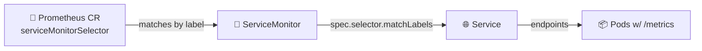

# Lab 16 — Kubernetes Monitoring & Init Containers


> **Goal:** Replace Lab 8's hand-edited `prometheus.yml` with the operator-driven **kube-prometheus-stack**, then teach `kubectl` how to start your pods *in the right order* with **init containers** (and learn how `restartPolicy: Always` turns the same primitive into a sidecar).
> **Deliverable:** A PR from `lab16` adding `monitoring-values.yaml`, `k8s/servicemonitor-app-python.yaml` (bonus), `k8s/init-demo.yaml`, and `k8s/MONITORING.md`.

---

## Overview

In Lab 8 you ran one `prom/prometheus` container in Docker Compose with a hand-written `scrape_configs` block. On Kubernetes, pods come and go, IPs churn, and you cannot re-edit `prometheus.yml` every time the scheduler reschedules. The **Prometheus Operator** solves this by watching **`ServiceMonitor`** / **`PodMonitor`** CRDs and regenerating Prometheus configuration when they change — exactly the GitOps philosophy you applied to apps in Labs 13–14, now applied to **scrape configuration**.

You will:

- Install the **kube-prometheus-stack** Helm chart (operator + Prometheus + Alertmanager + Grafana + kube-state-metrics + node-exporter — your choice of how much).
- Write **a ServiceMonitor from scratch** for your `app-python` service. The chart's default selectors require it to carry the `release:` label — that's the whole **two-level selector pattern** the operator is built around.
- Use **init containers** to do work *before* the main container runs (download a file into a shared `emptyDir`, then prove the main container reads it).
- See the same primitive promoted to a **sidecar** by flipping one field — `restartPolicy: Always` on an init container, GA in Kubernetes 1.33.

> ⚠️ **Scope:** no AlertmanagerConfig CRD writing, no recording-rules-as-code, no full SLO stack. Those land in the SRE-Intro elective. Today's lesson is *operator-driven scrape discovery* and *pod-startup ordering primitives*.

**What you'll practice:**

- The Prometheus Operator CRDs (`Prometheus`, `ServiceMonitor`, `PodMonitor`, `PrometheusRule`) and how the operator reconciles them into scrape config
- The **two-level selector pattern** (Prometheus picks ServiceMonitors by label → ServiceMonitor picks Services by label → Service picks Pods)
- Helm 4 values overrides for an opinionated upstream chart (lean vs full install)
- Init containers as a Kubernetes-native solution to "wait for dependency" / "fetch a config" / "run a migration"
- Sidecar containers — init containers with `restartPolicy: Always`, GA since 1.33

> 📚 Pairs with **Lecture 8 — Metrics & Monitoring with Prometheus** (the scrape model and PromQL) and **Lecture 15 — StatefulSets** (where the sidecar pattern was introduced at the GA boundary). Reread Lec 8 slide on Lab 16 preview and Lec 15 slide on sidecar containers before you start.

---

## Project State

**You should have from previous labs:**

- A k3d cluster on Kubernetes 1.36 (Lab 9).
- Your `lab10-app` Helm chart from Labs 10–13 deploying `app-python` (your code, port **8080**, `/metrics` from Lab 8) plus the course plumbing `echo` (`ghcr.io/inno-devops-labs/echo:v1`, port 8081) and `health` (`ghcr.io/inno-devops-labs/health:v1`, port 8082). All three expose `GET /metrics` in Prometheus text format. Throughout this lab, "app-python" refers to the conceptual *service* (the Python app you wrote); the actual K8s Service name from your chart will be `lab10-app-web` (chart fullname `lab10-app` + `-web` component suffix per Lab 10). Your ServiceMonitor will select by the **label** `app.kubernetes.io/name=lab10-app`, which is helper-independent of the Service name.
- `kubectl`, `helm` v4.1.x, working `port-forward`.

**This lab adds:**

- `monitoring-values.yaml` — Helm values override for the chart (chart version pinned, components you keep, resources/retention)
- `k8s/servicemonitor-app-python.yaml` — your custom ServiceMonitor (the bonus, but you'll likely write it during Task 2)
- `k8s/init-demo.yaml` — single Pod showing both the init pattern and the sidecar variant
- `k8s/MONITORING.md` — your submission report

> 📦 **Course plumbing recap:** `app-python` is **your** app. `echo` and `health` are pre-built, never built by you, and all three expose `/metrics`. The whole point of Task 2 / Bonus is that you *write a ServiceMonitor* — you do not edit any Prometheus config files.

---

## Setup

```bash
helm version              # v4.1.x — same as Lab 10
helm repo add prometheus-community https://prometheus-community.github.io/helm-charts
helm repo update
kubectl get nodes         # your k3d cluster from Lab 9 must be up
kubectl create namespace monitoring
```

Find a current chart version (don't float on `latest` — pin it):

```bash
helm search repo prometheus-community/kube-prometheus-stack --versions | head
# As of May 2026 the chart is in the ~85.x line. Pin whatever is current when you do the lab.
```

You'll write `monitoring-values.yaml` next; **do not** install the chart with defaults — defaults run the full stack (alertmanager + node-exporter + kube-state-metrics + push gateway) and may not fit a laptop cluster.

---

## Task 1 — Deploy the kube-prometheus-stack (2 pts)

**Objective:** Install the operator-based monitoring stack. The skill being graded is **picking a chart version, picking which components to keep, and writing values to widen ServiceMonitor discovery** — *not* copying our install command.

### 1.1 — Document what each component does

`YOUR TASK`: in `MONITORING.md`, fill the role of each component in **your own words** (one sentence each — not copied from the chart README):

| Component | What it does in the stack |
|---|---|
| Prometheus Operator | ___ |
| Prometheus (server) | ___ |
| Alertmanager | ___ |
| Grafana | ___ |
| kube-state-metrics | ___ |
| node-exporter | ___ |

You may decide to **disable** some of these (Task 1.2). You still document all six.

### 1.2 — Write `monitoring-values.yaml`

The chart is ~85 different YAML knobs deep. You only need a handful — but those handful are the lesson:

`YOUR TASK`: write a values file that sets **at least** the four blocks below.

```yaml
# monitoring-values.yaml — your overrides for kube-prometheus-stack

prometheus:
  prometheusSpec:
    # YOUR TASK: widen ServiceMonitor discovery so your custom monitor (Task 2 / Bonus)
    # is found regardless of which namespace + which labels it carries.
    # Hint: there are TWO sibling fields here, both starting with
    # serviceMonitorSelector...  and  podMonitorSelector... — read the
    # chart README's "Selector Defaults" section. Why two? Because the operator
    # has DIFFERENT defaults when the field is nil vs {} — that's the trap.
    ___: ___
    ___: ___

    # YOUR TASK: set resource requests + limits AND data retention.
    # Hints: defaults ask for ~1Gi memory which a laptop k3d may not have spare.
    # Retention is a string ('10d' / '24h') under prometheusSpec, NOT under storage.
    resources: { ___ }
    retention: ___

grafana:
  # YOUR TASK: set the admin password ONLY (lab — never hardcode a prod password).
  # Default is 'prom-operator'; pick anything but document it in MONITORING.md.
  adminPassword: ___

# YOUR TASK: pick a profile and disable the components you don't keep.
# Two profiles are acceptable; pick ONE and justify it in MONITORING.md:
#   - LEAN  — operator + Prometheus + Grafana only (laptop k3d, no node metrics)
#   - FULL  — operator + Prometheus + Grafana + KSM + node-exporter + alertmanager
# To disable a component, set its top-level block to { enabled: false }.
# (kube-state-metrics + node-exporter live under their OWN top-level keys at the
#  chart root, not under prometheus.* — look at `helm show values` output.)
```

> 🧠 **Why the two selector fields exist:** the chart bakes a default selector `release: <release-name>` into the operator's `Prometheus` CR. If you leave `serviceMonitorSelector` *nil*, the operator behaves as if you set that label match — meaning your ServiceMonitor needs `labels: { release: monitoring }` to be picked up. Setting `serviceMonitorSelectorNilUsesHelmValues: false` tells the operator *"if I gave you nil, treat it as an empty selector — match everything"*. Same trick for PodMonitors. It's confusingly named but it's the canonical knob.

### 1.3 — Install with your pinned version

`YOUR TASK`: write the `helm install` command using your **pinned** chart version, the `monitoring` namespace, and `monitoring-values.yaml`:

```bash
helm install ___ prometheus-community/kube-prometheus-stack \
  --namespace ___ --create-namespace \
  --version ___ \
  -f ___
```

After install, verify *every* pod in `monitoring` reaches `Running`/`Ready` and the operator's CRDs landed. **YOUR TASK** — write the two `kubectl` commands (one to list pods in the monitoring namespace, one to list only the CRDs in the `monitoring.coreos.com` group):

```bash
kubectl ___
kubectl ___
# Expect (at minimum, in the CRD output): servicemonitors, podmonitors,
# prometheuses, alertmanagers, prometheusrules, probes, scrapeconfigs.
```

If a pod is `Pending`, it's almost always resources — re-tune your `resources:` block or disable the heavier components.

### 1.4 — Proof of work

Paste into `MONITORING.md`:

- The pinned chart version (e.g. `85.10.1`) and which profile you picked (lean / full) with one-sentence justification
- Your six-component table from 1.1
- `kubectl get pods -n monitoring` showing every chosen pod `Running`/`Ready`
- `kubectl get crd | grep monitoring.coreos.com` showing the operator CRDs
- `kubectl get prometheus -n monitoring -o jsonpath='{.items[0].spec.serviceMonitorSelector}'` — proves the selector is `{}` (i.e. matches everything), not the default `release: <release-name>` match

---

## Task 2 — Explore Grafana & Verify Scrape Targets (3 pts)

**Objective:** Use the bundled dashboards and the Prometheus UI to read the health of *your* cluster, and write the ServiceMonitor that connects your app to the operator-driven scrape config. **This is where the operator pattern earns its keep.**

### 2.1 — Access the UIs

`YOUR TASK`: find your Service names (`kubectl get svc -n monitoring`) and write three `port-forward` commands — Grafana on `3000:80`, Prometheus on `9090:9090`, Alertmanager on `9093:9093` (only if you kept it). The chart prefixes every Service with your release name; if your release was `kps`, the Grafana service is `kps-grafana`, etc.

```bash
kubectl port-forward svc/___ -n monitoring 3000:___
kubectl port-forward svc/___ -n monitoring 9090:___
# (Alertmanager only if you kept it enabled in Task 1.2)
kubectl port-forward svc/___ -n monitoring 9093:___
```

### 2.2 — Read the cluster with the bundled dashboards

Answer each question below with a screenshot and a **one-line reading**. Values will differ on your cluster; the question is what the graph *means*, not its number.

1. **Node resources (USE method):** node CPU utilisation and memory used. *Dashboard: "Node Exporter / Nodes"* — if you went lean and disabled node-exporter, swap in *"Kubernetes / Compute Resources / Cluster"* and explain the swap.
2. **Namespace compute:** which pods in `<your-app-ns>` use the most/least CPU and memory? *Dashboard: "Kubernetes / Compute Resources / Namespace (Pods)".*
3. **Per-pod detail:** CPU throttling and memory working-set for one `app-python` pod. *Dashboard: "Kubernetes / Compute Resources / Pod".*
4. **Cluster state (kube-state-metrics):** count of pods per phase — write `sum by (phase) (kube_pod_status_phase)` if you kept KSM; if not, explain why this query has no result on your lean install.
5. **Alerts:** how many alerts are firing? (A fresh kube-prometheus-stack cluster runs a `Watchdog` always-firing alert — explain in one sentence what `Watchdog` is *for*.)

### 2.3 — Write a ServiceMonitor for `app-python` (this is the lesson)

The whole point of the operator is that **you never edit a Prometheus config file again**. You write a `ServiceMonitor` and the operator writes the scrape block for you. The two-level selector pattern:



Three labels, three matches, in this order. Break any one and the target silently fails to appear.

`YOUR TASK`: write `k8s/servicemonitor-app-python.yaml` from scratch. The shape is given, the **fields that ARE the skill** are blank.

```yaml
apiVersion: monitoring.coreos.com/v1
kind: ServiceMonitor
metadata:
  name: app-python
  # YOUR TASK: which namespace?  Two valid answers:
  #   - your app's namespace (then your monitoring-values.yaml MUST have
  #     serviceMonitorSelectorNilUsesHelmValues: false from Task 1)
  #   - the monitoring namespace (then add a sibling 'namespaceSelector' below
  #     that points at the app's namespace — the Service is across namespaces)
  # Pick one, document the choice in MONITORING.md.
  namespace: ___
  labels:
    # YOUR TASK: at minimum the chart's release-discriminator label so the
    # operator's DEFAULT selector would also pick it up. (Belt-and-braces:
    # works even if Task 1's serviceMonitorSelectorNilUsesHelmValues regresses.)
    # If your release was `monitoring`, the label key/value pair is...
    ___: ___
spec:
  # Level 2: ServiceMonitor → Service. Match the Service by its labels.
  selector:
    matchLabels:
      # YOUR TASK: a label that uniquely identifies your app-python Service.
      # Hint: your Lab 10 helpers emit  app.kubernetes.io/name=<chart-name>
      ___: ___
  # OPTIONAL — only needed if this ServiceMonitor lives in a DIFFERENT namespace
  # from the Service it selects. Default behaviour is "same namespace only".
  # namespaceSelector:
  #   matchNames: [<your-app-ns>]
  endpoints:
    # YOUR TASK: which port of the Service to scrape, which path, how often.
    # CRITICAL: 'port' is the Service port's NAME (a string), not a number.
    # Your app-python Service MUST already have a named port — check Lab 10's
    # service.yaml. If not, add one and `helm upgrade` first.
    - port: ___
      path: ___
      interval: ___
```

After applying, verify from the CLI (port-forward to Prometheus first). The skeleton:

```bash
kubectl apply -f k8s/servicemonitor-app-python.yaml
# Wait ~30s for the operator to reconcile, then:
kubectl get servicemonitor -A          # yours should appear

# YOUR TASK: pipe Prometheus's /api/v1/targets through jq to extract ONLY your
# app-python target, showing its health + last scrape time + URL. The filter is:
#   .data.activeTargets[] | select(.labels.job == "<your-job-name>") | {health, lastScrape, scrapeUrl}
curl -s localhost:9090/api/v1/targets | jq '___'
```

> ⚠️ **If your target doesn't appear**, in this order: (1) `kubectl describe prometheus -n monitoring <release>-kube-prometheus-prometheus` and grep for your ServiceMonitor in the Status (operator tells you why it skipped you); (2) `kubectl get svc <app-python> -o yaml | grep -A3 ports:` — is the port **named**? (3) does your ServiceMonitor's `spec.selector.matchLabels` exactly match a label on the Service? (4) does the ServiceMonitor's metadata.labels include `release: <release>` *or* did you disable that selector in Task 1? You only get to skip step 4 if you did Task 1's `nilUsesHelmValues: false`.

### 2.4 — PromQL on a live cluster

Once your three services are scraped (`app-python` via your ServiceMonitor, `echo` + `health` via separate monitors you write the same way — *or* via the operator's default service-discovery if they carry the right labels), the same RED/USE queries from Lab 8 work, against more interesting data:

`YOUR TASK`: write **three** PromQL queries into `MONITORING.md` with one-line readings each. The shape of each is given — fill the body. Don't reuse Lab 8 verbatim; the data shape changed (more labels, k8s-native `job=` labels, namespace/pod selectors).

```promql
# 1) "Are all three of my services being scraped right now?"
#    YOUR TASK: one query returning 1 per UP target, filtered to your three jobs.
#    Hint: the metric is `up`; filter with {job=~"<regex>"} to match a|b|c.
___

# 2) RED — per-service request rate over a 5-minute window.
#    YOUR TASK: aggregate the per-pod counter into a per-service rate.
#    Hint: rate() of a Counter, summed by `job` (k8s ServiceMonitor sets job=<SM-name>).
sum by (___) (rate(___[5m]))

# 3) USE — pick ONE: node-level if you kept node-exporter,
#    OR cluster-level CPU saturation if you went lean (use kube-state-metrics).
#    YOUR TASK: write the query you'd graph on a SRE on-call dashboard.
___
```

### 2.5 — Proof of work

Paste into `MONITORING.md`:

- Your `servicemonitor-app-python.yaml` (full contents)
- A screenshot of Prometheus → Status → Targets with `app-python` `UP`
- Output of `kubectl get servicemonitor -A` (yours appears in the list)
- The three PromQL queries + one-line readings
- The five dashboard answers from 2.2 with screenshots
- One-line explanation of the `Watchdog` alert

---

## Task 3 — Init Containers & Sidecars (3 pts)

**Objective:** Use init containers to do setup work *before* the main container starts, then turn the same primitive into a sidecar by flipping one field.

> 📚 **Init containers** run sequentially, each must exit `0` before the next, and **all** init containers must succeed before the app container starts. They're how you wait-for-dependency, fetch-a-config, or run-a-migration *without* baking that logic into your app image. A **sidecar** is `restartPolicy: Always` on an init container — GA since Kubernetes 1.33. Same list, different semantics: an init container *ran-to-completion*; a sidecar *keeps running* alongside the main container and is torn down with it.

### 3.1 — Init container: download-then-serve

`YOUR TASK`: in `k8s/init-demo.yaml`, write a single `kind: Pod` that proves an init container ran-to-completion *before* the main container started, and the main container *consumes* what the init container wrote.

The data flow is:

```
init container → writes /work/index.html → emptyDir volume → main container reads /usr/share/nginx/html/index.html
```

Shape is given; the lines that ARE the skill are blank.

```yaml
apiVersion: v1
kind: Pod
metadata:
  name: initdemo
  labels: { app: initdemo }
spec:
  initContainers:
    - name: fetch-content
      # YOUR TASK: pick a tiny image with a shell + an echo or wget.
      # Hints: busybox:1.37, alpine:3.21. The image MUST be able to run `sh -c`.
      image: ___
      # YOUR TASK: a shell one-liner that ends with exit 0.
      # Requirements:
      #   - writes a NON-EMPTY file to /work/index.html
      #   - the file content must contain a string ('ready', a date, anything)
      #     that you can later assert from the main container
      # Hint: `sh -c 'echo "ready @ $(date -u +%FT%TZ)" > /work/index.html'`
      command: ['sh', '-c']
      args: ['___']
      volumeMounts:
        # YOUR TASK: mount the shared emptyDir at /work
        - { name: ___, mountPath: ___ }

  containers:
    - name: app
      # YOUR TASK: a webserver image that serves files from a docroot.
      # Hint: nginx:1.27-alpine reads /usr/share/nginx/html by default.
      image: ___
      ports: [{ containerPort: 80 }]
      volumeMounts:
        # YOUR TASK: mount the SAME emptyDir at the webserver's docroot.
        # The init wrote /work/index.html — what's nginx's docroot path?
        - { name: ___, mountPath: ___ }

  volumes:
    - name: workdir
      emptyDir: {}
```

Verify — `YOUR TASK` is to fill in two `kubectl` commands and one `curl`:

```bash
kubectl apply -f k8s/init-demo.yaml
kubectl get pod initdemo -w        # watch: Init:0/1 → PodInitializing → Running

# YOUR TASK: print ONLY the terminated reason of the first init container
# (must be the string 'Completed'). Hint: jsonpath against .status.initContainerStatuses[0].
kubectl get pod initdemo -o jsonpath='___'

# YOUR TASK: prove the main container is serving the file the init wrote.
# Hint: port-forward, then curl localhost:8080/index.html (or whichever filename
# you wrote in 3.1) — the response body must contain the string init wrote.
kubectl port-forward pod/initdemo ___
curl -s localhost:___/___
```

### 3.2 — Sidecar: same primitive, different restart policy

`YOUR TASK`: add a **second** entry to `initContainers:` in the same Pod — but make it a *sidecar* (long-running, alongside the main container) by setting `restartPolicy: Always` on that init container only.

```yaml
spec:
  initContainers:
    - name: fetch-content     # from 3.1 — unchanged, run-to-completion
      # ...

    # NEW: a sidecar — long-running, NOT run-to-completion.
    - name: log-tail
      image: busybox:1.37
      # YOUR TASK: pick the field that flips this from init → sidecar.
      # Hint: lives on the container, valid values are 'Always' / 'OnFailure' / 'Never'.
      # GA in K8s 1.33 — your k3d 1.36 supports it natively. NO feature gate flip needed.
      ___: ___
      command: ['sh', '-c']
      # YOUR TASK: a command that runs FOREVER (never exits 0).
      # Suggested: tail -F /work/index.html  — prints any new writes for the lifetime of the pod.
      args: ['___']
      volumeMounts:
        - { name: workdir, mountPath: /work }
```

The sidecar entry **stays in `initContainers:`** — that's not a typo. Kubernetes 1.29 introduced the feature; 1.33 made it GA. A *sidecar* is just an init container with `restartPolicy: Always`; the API didn't move, the *semantic* did. Verify both behaviours coexist — `YOUR TASK` to write the three commands:

```bash
kubectl apply -f k8s/init-demo.yaml

# YOUR TASK: show the pod with its READY count. Once the sidecar is up alongside
# the main container, READY must be 2/2 — that's the headline of the 1.33 GA.
kubectl ___

# YOUR TASK: tail the sidecar's logs (it should stream forever).
kubectl logs initdemo -c ___

# YOUR TASK: prove the OTHER init container (fetch-content) STILL ran-to-completion.
# Hint: a jsonpath over .status.initContainerStatuses[*] showing each entry's name and state.
kubectl get pod initdemo -o jsonpath='___'
```

### 3.3 — Pick the right primitive

In `MONITORING.md`, answer (≤2 sentences each) with **init / sidecar / neither**:

1. Wait for a Postgres Service to accept connections before the API starts.
2. Stream the app's `/var/log/app.log` to stdout so the kubelet picks it up.
3. Run a one-off DB migration on every chart upgrade.
4. Refresh a JWT signing key every 10 minutes for the lifetime of the pod.

> 💡 The first one is the textbook trap: the wrong answer is "init container with `sleep` until the port opens" — fragile and hides the real fix. One of the four is **not** an init *or* a sidecar at all — it's a primitive you wrote in Lab 10. Explain which and why.

### 3.4 — Proof of work

Paste into `MONITORING.md`:

- The full `k8s/init-demo.yaml`
- `kubectl get pod initdemo -o jsonpath='{.status.initContainerStatuses[0].state.terminated.reason}'` showing `Completed`
- The `curl` against `localhost:8080/index.html` returning the string your init wrote
- `kubectl logs initdemo -c log-tail` capture (a few lines is enough)
- Your four-question pick-the-primitive answers

---

## Task 4 — Documentation (2 pts)

`YOUR TASK`: write `k8s/MONITORING.md` covering, in this order:

1. **Chart selection** — pinned version, lean vs full profile, six-component table
2. **Discovery** — your `monitoring-values.yaml` (selector widening + resources + retention), the `kubectl get prometheus -o jsonpath` proving the selector is wide, and a one-paragraph explanation of the **two-level selector pattern** in your own words
3. **ServiceMonitor** — your `servicemonitor-app-python.yaml`, the Prometheus UI screenshot, the `up{...}` query
4. **Dashboards** — the five Task 2 readings with screenshots, plus the `Watchdog` explanation
5. **Init + sidecar** — the manifest, the `Completed` proof, the curl, the sidecar logs, the four pick-the-primitive answers
6. **Challenges & learnings** — at least one real one (selector mismatch, missing named port, lean profile sizing, etc.)

> 📸 Screenshots count. "It works on my machine" with no evidence scores zero for that item.

---

## Bonus Task — Custom Metric Through a Second ServiceMonitor (2 pts)

**Objective:** Ship a *custom business metric* from `app-python` and prove the operator scrapes it without any further config edits — the operator-native replacement for the hand-written `scrape_config` you used in Lab 8.

Less hand-holding here.

`YOUR TASK`:

1. **Add a bounded-cardinality business metric** to `app-python` using `prometheus_client`. Pick the metric **type** and **labels** yourself — but **bounded labels only**. Pass cardinality review: a `Counter` over a small enumeration (one of `/`, `/health`, `/info`), or a `Gauge` for a single global number. Fail it: anything with `user_id`, `request_id`, or unbounded path segments. **YOUR TASK** — write ≤ 10 Python lines and paste the diff into `MONITORING.md`.
2. **Confirm your `app-python` Service has a NAMED port** for `/metrics`. If Lab 10 only exposes an un-named `port:`, add a second port — the SM matches by name:

   ```yaml
   # Edit your chart's templates/service.yaml ports: block.
   ports:
     - { name: http, port: ___, targetPort: ___ }      # YOUR TASK: existing app port
     - { name: ___, port: ___, targetPort: ___ }       # YOUR TASK: NAMED metrics port for the SM
                                                      # (only needed if you separate /metrics onto a
                                                      # different port; the simpler path is reusing the
                                                      # existing `http` port since the app serves /metrics
                                                      # on the same listener as the app endpoints)
   ```

3. **Write a second ServiceMonitor (or edit the one from Task 2)** so it scrapes the new named port. Add a `relabelings:` block to set the `job` label to something readable. The shape:

   ```yaml
   spec:
     endpoints:
       - port: ___                       # YOUR TASK: the name from the Service port above
         path: ___                       # YOUR TASK: where prometheus_client serves metrics
         interval: ___
         relabelings:
           # YOUR TASK: one rewrite that sets the `job` label to a custom value.
           # Hint: action: replace, targetLabel: job, replacement: <your-value>
           - ___
   ```

4. **Verify** in Prometheus UI (Status → Targets) that the new endpoint is `UP` and the metric is queryable. **YOUR TASK** — paste the exact PromQL query you used to graph your custom metric over time (hint: `rate(<your-counter>[5m])` over the appropriate label aggregation).

Paste into `MONITORING.md`:

- The Python diff adding the metric (≤ 10 lines)
- The named-port block of your Service
- The new/edited ServiceMonitor
- Screenshot of Prometheus → Targets with the new endpoint `UP`
- Screenshot of the Grafana panel graphing your custom metric

> 🧠 **Operator vs Lab 8 (the headline):** in Lab 8 you added a `- job_name: app` to `prometheus.yml`, restarted the container, and prayed. Here you add a `ServiceMonitor` object and the operator regenerates the scrape config for you — declaratively, reconciled, surviving pod churn and operator upgrades. Same outcome, Kubernetes-native plumbing.

---

## How to Submit

```bash
git switch -c lab16
git add monitoring-values.yaml k8s/
git commit -m "feat(lab16): kube-prometheus-stack + ServiceMonitor + init/sidecar demo"
git push -u origin lab16
```

Open **two** PRs:

- `your-fork:lab16` → `course-repo:master` *(reviewed)*
- `your-fork:lab16` → `your-fork:master` *(merges into your own main when done)*

PR checklist:

```text
- [ ] Task 1 — chart version pinned, profile + components documented, all pods Running, CRDs present
- [ ] Task 2 — ServiceMonitor written from scratch, app-python visible in Targets as UP, three PromQL queries documented, five dashboard answers with screenshots
- [ ] Task 3 — initdemo Pod with both an init container (Completed) and a sidecar (Running), four pick-the-primitive answers
- [ ] Task 4 — MONITORING.md with all six sections + evidence
- [ ] Bonus — custom bounded metric + named port + second ServiceMonitor scraped and graphed
```

---

## Acceptance Criteria

### Task 1 — Deploy the stack (2 pts)
- ✅ Chart **version pinned** (not `latest`); installed into the `monitoring` namespace
- ✅ All chosen pods reach `Running`/`Ready`; operator CRDs present (`servicemonitors`, `podmonitors`, `prometheuses`, …)
- ✅ `serviceMonitorSelectorNilUsesHelmValues: false` (or equivalent) set so monitors are discovered cluster-wide
- ✅ `kubectl get prometheus -o jsonpath='{...serviceMonitorSelector}'` returns `{}`
- ✅ Six-component table filled in your own words

### Task 2 — Grafana + ServiceMonitor (3 pts)
- ✅ Grafana + Prometheus reachable via port-forward (Alertmanager only if you kept it)
- ✅ Five dashboard answers with screenshots
- ✅ **Your own** `ServiceMonitor` for `app-python` written from scratch (no copy from chart README)
- ✅ Prometheus → Targets shows `app-python` `UP`
- ✅ Three PromQL queries with one-line readings; `up{job=~"app-python|echo|health"}` = 1 for all
- ✅ `Watchdog` alert explained

### Task 3 — Init + Sidecar (3 pts)
- ✅ Init container writes a non-empty file to a shared `emptyDir`; main container serves it
- ✅ `initContainerStatuses[0].state.terminated.reason` = `Completed`
- ✅ `curl` against the main container returns the string the init wrote
- ✅ Sidecar (`restartPolicy: Always` on a second init entry) is `Running` alongside the main container
- ✅ Four pick-the-primitive answers correct

### Task 4 — Documentation (2 pts)
- ✅ `MONITORING.md` covers all six required sections with evidence
- ✅ Chart version + `monitoring-values.yaml` recorded
- ✅ All screenshots present and legible

### Bonus — Custom metric (2 pts)
- ✅ New bounded-cardinality business metric in `app-python`
- ✅ Service exposes a **named** port for `/metrics`
- ✅ New/edited ServiceMonitor scrapes it; appears `UP` in Targets
- ✅ Metric graphed in Grafana

---

## Rubric

| Task | Points | Criteria |
|------|-------:|----------|
| **Task 1** — Deploy stack | **2** | Chart pinned, components documented, all pods healthy, selector widened |
| **Task 2** — ServiceMonitor + dashboards | **3** | SM written from scratch, target UP, dashboards answered |
| **Task 3** — Init + sidecar | **3** | Both patterns proven in one pod, primitives picked correctly |
| **Task 4** — Documentation | **2** | `MONITORING.md` complete with screenshots |
| **Bonus** — Custom metric | **2** | Custom metric + named port + SM scraped + graphed |
| **Total** | **12** | 10 main + 2 bonus |

**Grading:**
- **10/10:** Stack healthy, ServiceMonitor written cleanly, init + sidecar both proven, thorough docs
- **8–9/10:** Monitoring works end-to-end; minor gaps in dashboard answers or init evidence
- **6–7/10:** Stack installs but ServiceMonitor relies on chart defaults, or sidecar variant missing
- **<6/10:** Stack not healthy, scrape unverified, or `init-demo.yaml` not in repo

---

## Resources

<details>
<summary>📚 Documentation</summary>

- [kube-prometheus-stack chart](https://github.com/prometheus-community/helm-charts/tree/main/charts/kube-prometheus-stack)
- [Prometheus Operator — design](https://prometheus-operator.dev/docs/getting-started/design/)
- [ServiceMonitor & PodMonitor](https://prometheus-operator.dev/docs/developer/getting-started/)
- [Selector defaults in the chart](https://github.com/prometheus-community/helm-charts/tree/main/charts/kube-prometheus-stack#prometheusspec)
- [Prometheus 3.x docs](https://prometheus.io/docs/)
- [Grafana docs](https://grafana.com/docs/)
- [Init containers](https://kubernetes.io/docs/concepts/workloads/pods/init-containers/)
- [Sidecar containers (GA 1.33)](https://kubernetes.io/docs/concepts/workloads/pods/sidecar-containers/)
- [USE method (Brendan Gregg)](https://www.brendangregg.com/usemethod.html) · [RED method (Tom Wilkie)](https://grafana.com/blog/the-red-method-how-to-instrument-your-services/)

</details>

<details>
<summary>⚠️ Common Pitfalls (from real dry-runs)</summary>

- **ServiceMonitor in the wrong namespace.** By default a ServiceMonitor only selects Services in its **own** namespace. Put the SM in `monitoring/` while the Service lives in your app namespace and nothing matches. Fix: either put the SM in the app namespace, or add `spec.namespaceSelector.matchNames: [<app-ns>]` to the SM in `monitoring/`.
- **Missing `release:` label on the ServiceMonitor.** The chart's default `serviceMonitorSelector` requires `release: <release-name>` on every monitor. If you didn't set `serviceMonitorSelectorNilUsesHelmValues: false` AND didn't add the `release:` label, the operator silently ignores your SM. `kubectl describe prometheus -n monitoring <release>` shows which monitors were skipped and why.
- **Service port not named.** `endpoints.port` in a ServiceMonitor is the Service port **NAME** (a string), not a number. `port: 5000` looks valid and lints fine — but the operator can't resolve it and your target never appears. Always: `ports: [{ name: http, port: 80, targetPort: 5000 }]` and `endpoints: [{ port: http, ... }]`.
- **Pre-existing Prometheus CRD conflict.** kube-prometheus-stack ships its own opinionated CRDs. If you already installed the upstream Prometheus Operator separately, or another Helm release of the same chart, the CRDs collide. Helm 4 will refuse the install with a "resource already exists" error. Clean uninstall: `helm uninstall <other-release> -n <ns>` AND `kubectl delete crd $(kubectl get crd -o name | grep monitoring.coreos.com)` before re-installing.
- **Init container waiting for a Service with `sleep N` is a smell.** "Wait for the database" by polling is fragile (`sleep 5; nc -z db 5432; if [ $? -ne 0 ]; then sleep 10; fi` — works until it doesn't). The Kubernetes-native fix: use a **readiness gate** + a sidecar that flips the gate, or fix the app to retry its own DB connect on startup. Init containers should run *to completion*, not *until* something is true.
- **Sidecar containers need Kubernetes ≥ 1.29 (beta) / 1.33 (GA).** `restartPolicy: Always` on an `initContainers[]` entry is a no-op on older clusters — the container becomes a regular init and exits when its command exits. Your k3d 1.36 has GA support; check `kubectl version` if you target a managed cluster older than 1.33.
- **Lean profile + `node-exporter`-dependent dashboards.** If you disable `nodeExporter` and `kube-state-metrics` to fit a laptop, the "Node Exporter / Nodes" and "Kubernetes / Cluster" dashboards go blank. That's expected, not a bug. Swap in "Kubernetes / Compute Resources / Cluster" (KSM only) or stand up the full profile.
- **Watchdog isn't an error.** kube-prometheus-stack ships an `Watchdog` `PrometheusRule` that *always fires* — its purpose is to *prove the alerting pipeline is working*. If `Watchdog` ever stops firing, your monitoring is broken. Many graders see "1 alert firing" on day 0 and panic; don't.

</details>

<details>
<summary>📖 Learning Resources</summary>

- [Prometheus Operator docs — design notes on selectors](https://prometheus-operator.dev/docs/getting-started/design/)
- [Kubernetes Sidecar Containers — GA blog (1.33)](https://kubernetes.io/blog/2025/04/01/kubernetes-v1-33-sidecar-containers-ga/)
- *Cloud Native Observability with Prometheus* (2023) — Wakeling & Hartmann, Manning — chapter on the operator pattern

</details>

---

## Looking Ahead

You've now built the full DevOps lifecycle on Kubernetes: an app (Labs 1–3), containers (Lab 2), CI/CD (Labs 3–5), config + logs + metrics (Labs 6–8), a cluster (Labs 9–12), GitOps and progressive delivery (Labs 13–14), stateful workloads (Lab 15), and operator-driven cluster monitoring (this lab). The observability stack you ran locally in Compose for Labs 7–8 is now operator-managed and Kubernetes-native — same metrics, same PromQL, discovered automatically through a CRD instead of a hand-edited config file.

**Optional electives (exam alternatives):**

- **Lab 17:** Deploy your Lab 1 service to **Cloudflare Workers** (V8 isolates on the edge)
- **Lab 18:** Package it reproducibly with **Nix** flakes

---

**Good luck!** 📊

> **Remember:** with the operator you declare *what* to scrape; the platform handles *how*. If you wrote a ServiceMonitor by hand and never touched `prometheus.yml`, you got the lesson.
