# 📌 Lecture 1 — Introduction to DevOps: From Chaos to Flow

## 📍 Slide 1 – 🚀 Welcome to DevOps

* 🌍 **Software is eating the world** — but shipping it reliably is hard
* 😰 Teams struggle with slow releases, broken deploys, and finger-pointing
* 🌉 **DevOps bridges the gap** between **building** and **running** software
* 🎯 This course: practical skills to deliver software the way modern teams actually do

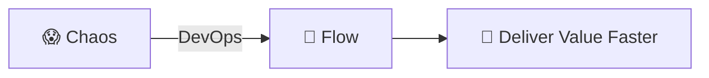

> 📚 **Frame for the semester:** every lab in this course traces back to a problem that DevOps solves. Today we name the problems; over the next 16 weeks you build the solutions yourself.

---

## 📍 Slide 2 – 🎯 Learning Outcomes

* ✅ Define DevOps and its core principles (CAMS, Three Ways)
* ✅ Recognize pre-DevOps anti-patterns in real teams
* ✅ Map DevOps practices (CI/CD, IaC, observability) to the problems they fix
* ✅ Read DORA metrics and tell elite teams from low performers
* ✅ Navigate the DevOps lifecycle and locate this course's labs inside it

**🎓 By the end of this lecture:**

| # | Outcome |
|---|---------|
| 1 | 🧠 Define DevOps in your own words |
| 2 | 🔍 Recognize the silos, fear, and toil that DevOps formed to fight |
| 3 | 🛠️ Match each DevOps practice to the failure mode it addresses |
| 4 | 🗺️ Place every course lab on the DevOps lifecycle |

---

## 📍 Slide 3 – 📜 A Brief History

* 📅 **2009** — Patrick Debois organizes **DevOpsDays** in Ghent, Belgium. The term *"DevOps"* is coined.
* 📅 **2009** — John Allspaw & Paul Hammond present *"10+ Deploys per Day"* at Velocity — the cultural manifesto.
* 📅 **2011** — Werner Vogels (Amazon CTO) reports Amazon deploys to production **every 11.7 seconds** at peak.
* 📅 **2013** — **Docker** open-sourced. Containers become mainstream.
* 📅 **2014** — **Kubernetes** announced by Google. Container orchestration takes off.
* 📅 **2016** — **The DevOps Handbook** published (Kim, Humble, Debois, Willis).
* 📅 **2018** — Nicole Forsgren's *Accelerate* publishes the four DORA metrics.
* 📅 **2024** — DORA *State of DevOps* reports **19% elite + 22% high performers** (41% combined; final report with this taxonomy).
* 📅 **2025** — DORA retires the Elite/High/Medium/Low ladder; replaces it with **seven team archetypes** that combine delivery performance with human factors (burnout, friction, perceived value).

> 🤔 **Notice:** DevOps started as a *culture* movement, not a tool announcement.

---

## 📍 Slide 4 – ❓ The Big Question

* 📊 **70%+** of large-scale IT projects experience significant cost or schedule overruns (McKinsey)
* ⏱️ Pre-DevOps lead time from commit to production: **weeks to months**
* 💥 The biggest source of outages is **changes** — deploys, config edits, dependency bumps

> 💬 *"It worked on my machine."* — Every developer, ever

**🤔 Discussion:**
* Why is software delivery so hard?
* Why do teams fear deployments?
* What would "good" look like for your team?

---

## 📍 Slide 5 – 🔥 Section 1: The Problem Before DevOps

* 👨‍💻 **Development** and ⚙️ **Operations** were separate teams with opposing goals
* 🚀 Dev wanted: **ship features fast** (rewarded for velocity)
* 🛡️ Ops wanted: **keep systems stable** (rewarded for uptime)
* 💥 Result: **structural conflict, blame, and slow delivery**

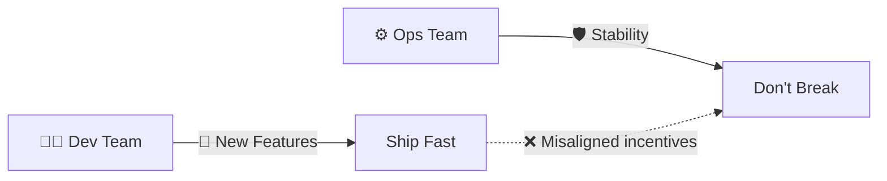

> 📖 *The Phoenix Project* (Kim, Behr, Spafford, 2013) dramatizes this exact conflict — required reading for this course.

---

## 📍 Slide 6 – 🧱 The Wall of Confusion

* 🧱 **The Wall** = invisible barrier between Dev and Ops
* 📦 Dev "throws code over the wall"; Ops catches the blame when it breaks
* 🔄 Ops rejects changes to avoid risk; Dev routes around Ops

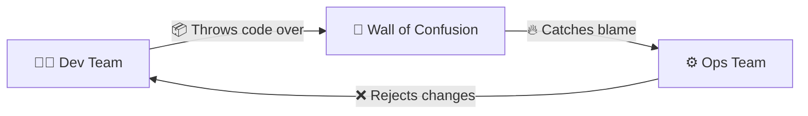

> 🤔 **Think:** in your last student project, who would have been "Dev" and who "Ops"?

---

## 📍 Slide 7 – 😱 Manual Release Hell

* 📅 Deployments are rare events (monthly or quarterly)
* 🎰 Each release = **high-risk, all-hands-on-deck**
* 📋 Manual checklists, weekend work, no rollback plan
* 💀 One mistake = hours of recovery, frustrated users

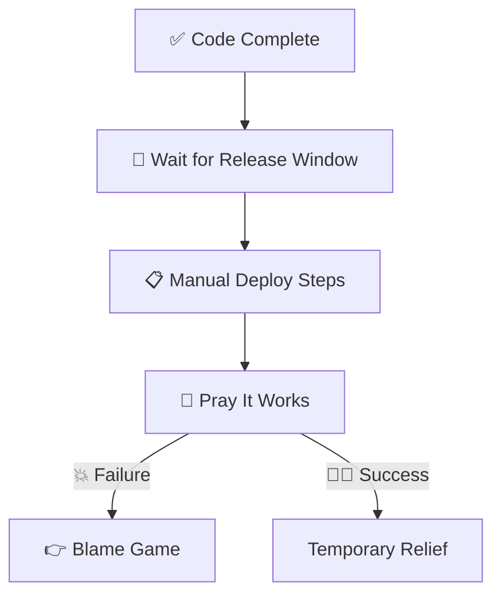

**📊 Pre-DevOps numbers (Accelerate, 2018):**
* 🐢 Lead time for changes: **months** (low performers)
* 📉 Change failure rate: **40–60%** for low performers
* ⏱️ Recovery from incident: **a week or more**

---

## 📍 Slide 8 – 😨 Fear and Blame Culture

* 🌙 Incident happens at 2am — first question is *"Who did this?"*
* 🙈 Engineers hide mistakes; nobody deploys on Friday
* 💀 Innovation freezes; the safest move is to do nothing

> ⚠️ **Fear kills velocity.**

**Symptoms of a blame culture:**
* 🔇 People afraid to speak up in postmortems
* 📝 Excessive documentation written defensively
* 🐌 Slow decision-making, escalations on everything
* 🚪 High turnover among senior engineers

> 📖 *"Without blameless postmortems, organisations never learn from incidents."* — Google SRE Book (Beyer et al.)

---

## 📍 Slide 9 – 💸 The Cost of Chaos

| 🔥 Problem | 💥 Impact |
|------------|-----------|
| 🐢 Slow releases | Lost market opportunity, competitors ship first |
| 📋 Manual processes | Human error, burnout, on-call fatigue |
| 👉 Blame culture | Senior talent leaves, knowledge bleeds |
| 🙈 No observability | Firefighting mode, MTTR in hours not minutes |

**📈 Concrete examples:**
* 🏢 **Amazon pre-DevOps (early 2000s):** monolithic deploys took **weeks**
* 🚀 **Amazon today:** ~50 million deploys/year across services (Werner Vogels, re:Invent)
* 💰 **IBM Cost of a Data Breach:** peaked at **$4.88M (2024)**, then **dropped to $4.44M in 2025** as AI-assisted detection cut containment time; **U.S. average hit a record $10.22M** in 2025

> 🔥 **Hot take:** every hour of downtime is paid for. The question is whether *you* or *your users* pay.

---

## 📍 Slide 10 – 💡 Section 2: What DevOps Really Is

* 🤝 **DevOps** = development + operations working as **one team**
* 🌱 A **culture** of collaboration and shared responsibility
* 🔧 A set of **practices** for fast, reliable delivery
* 🚫 NOT just tools, NOT a job title, NOT a separate team

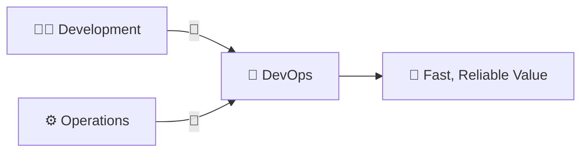

**📖 Working definition (Humble & Farley, *Continuous Delivery*, 2010):**
> DevOps is a set of practices that combines software development and IT operations to shorten the development lifecycle while delivering features, fixes, and updates frequently in close alignment with business objectives.

---

## 📍 Slide 11 – 🚫 What DevOps is NOT

| ❌ Myth | ✅ Reality |
|---------|-----------|
| "We hired a DevOps engineer, we're done" | 👥 Everyone participates |
| "DevOps means using Kubernetes" | 🛠️ Tools support culture, not the reverse |
| "DevOps replaces developers or ops" | 🤝 It unites them |
| "DevOps = just automation" | 🧩 Automation + culture + measurement + sharing |
| "DevOps is a team" | 🌍 It's a way of working |

> 🔥 **Hot take:** You can't buy DevOps. You build it.

---

## 📍 Slide 12 – 🔄 The Three Ways

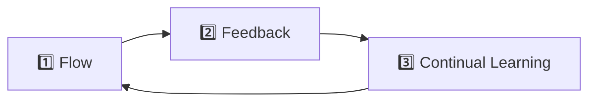

| 🛤️ Way | 🎯 Focus | 💡 Practical Example |
|--------|---------|-----------|
| 1️⃣ **Flow** | Fast Dev → Prod | 🚀 CI/CD pipelines, trunk-based development |
| 2️⃣ **Feedback** | Fast Prod → Dev | 📊 Monitoring, alerting, error budgets |
| 3️⃣ **Continual Learning** | Experiment safely | 📝 Blameless postmortems, chaos engineering |

> 📚 **Source:** *The Phoenix Project* and *The DevOps Handbook* (Kim et al.)

---

## 📍 Slide 13 – 🧩 The CAMS Model

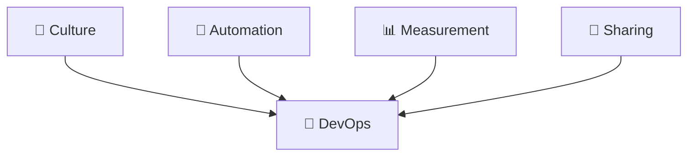

* 🌱 **Culture** — trust, collaboration, shared ownership
* 🤖 **Automation** — eliminate manual, error-prone toil
* 📊 **Measurement** — track metrics, decide with data
* 🔗 **Sharing** — knowledge flows freely, postmortems are blameless

> 📖 Coined by Damon Edwards and John Willis (2010). Jez Humble later added **L** for *Lean* → **CALMS**.

---

## 📍 Slide 14 – ⚡ Before vs. After DevOps

| 😰 Before | 🚀 After |
|----------|---------|
| 📅 Releases every few months | 📆 Releases daily or hourly |
| 📋 Manual deployments | 🤖 Automated, version-controlled pipelines |
| 👉 Blame when things break | 📝 Blameless postmortems |
| 🙅 "Not my problem" | 🤝 Shared ownership ("you build it, you run it") |
| 😨 Fear of change | 💪 Small, reversible changes embraced |
| 🐌 Hours of manual deploy | ⚡ Minutes to deploy, seconds to roll back |

> 🤔 Which column describes a team you've worked on?

---

## 📍 Slide 15 – 🎮 Section 3: DevOps as a Game

## 🕹️ Simulation — You're the CTO

* 🏢 **FlowStart Inc.** — a growing startup
* 👥 5 developers, 2 ops engineers, 10K users
* 📈 Pressure from leadership: ship faster, but stop breaking things
* ❓ **What could go wrong?**

> 💀 *Everything.*

Let's walk through four real failure modes and the DevOps practice that fixes each. Each scenario maps to a lab you'll do this semester.

---

## 📍 Slide 16 – 💥 Scenario 1: Release Failure → CI/CD

**The failure:**
* 📤 Friday 5pm push, no tests, no review, straight to production
* 💥 Login broken, 10K users locked out, 4 hours of downtime
* 🤷 Nobody knows what changed because nobody can replay the deploy

**The fix — Continuous Integration & Continuous Delivery:**

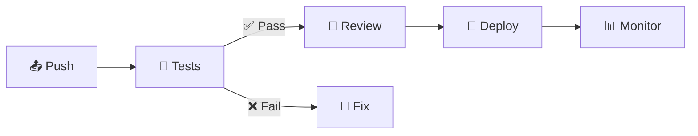

* ✅ Every change runs automated tests before merging
* ✅ Code review is non-optional
* ✅ Deployment is one command (or one git push)
* ✅ Rollback is one click

> 🔗 **Course tie-in:** Lab 3 builds this exact pipeline in GitHub Actions.

---

## 📍 Slide 17 – 🐾 Scenario 2: Snowflake Servers → Infrastructure as Code

**The failure:**
* 🖥️ Production server hand-configured over 2 years by the ops engineer who just quit
* 📈 Need to scale to 3 servers — but no one can reproduce the config
* 😱 The "documentation" is in someone's head and Slack DMs

> 🐶 **"Pets vs. cattle"** — Bill Baker, Microsoft (2012). Pets are nursed; cattle are replaced.

**The fix — Infrastructure as Code:**

```hcl
# 🌍 Terraform (1.10+) — declarative infra
resource "aws_instance" "web" {
  ami           = "ami-0c55b159cbfafe1f0"
  instance_type = "t3.micro"
  count         = 3  # three identical, replaceable servers
}
```

* 📝 Infrastructure lives in version-controlled files
* 🔄 Servers are reproducible, not unique
* ⚡ Identical environments spin up in minutes

> 🔗 **Course tie-in:** Labs 4 (Terraform + Pulumi) and 5–6 (Ansible) build this skill.

---

## 📍 Slide 18 – 🔓 Scenario 3: Secret Leak → Secrets Management

**The failure:**
* 👨‍💻 Developer commits `database.password = "hunter2"` to a public repo
* 🤖 Scanner bots find it in **under 5 minutes** (verified by GitGuardian reports)
* 💥 Attackers exfiltrate the database

**The fix — Secrets Management:**

```yaml
# ❌ Bad — secret in source
DATABASE_PASSWORD: "super_secret_123"

# ✅ Good — reference, not value
DATABASE_PASSWORD: ${vault:secret/db/password}
```

* 🚫 Never store secrets in code or unencrypted config
* 🔐 Use a secret manager: HashiCorp Vault, OpenBao, AWS Secrets Manager, GCP Secret Manager
* 🔍 Pre-commit hooks scan for secrets (gitleaks, trufflehog)
* 🔄 Rotate credentials automatically

> 🔗 **Course tie-in:** Lab 11 integrates Kubernetes Secrets with **OpenBao** (the BSL-licensed Vault's open-source fork).

---

## 📍 Slide 19 – 🙈 Scenario 4: Blind Operations → Observability

**The failure:**
* 👥 Users on Twitter: *"App is slow."*
* 🤷 Team has no metrics, no logs, no traces
* ⏱️ Hours wasted guessing; finally restart the server out of desperation

**The fix — Observability (the three pillars):**

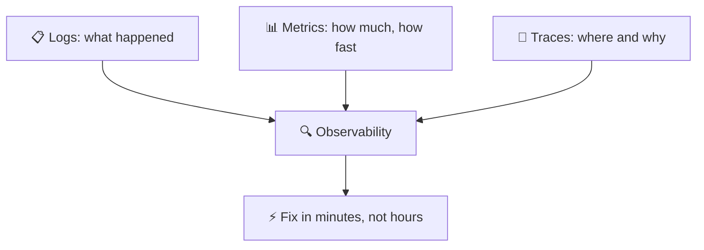

| 📊 Pillar | 🛠️ Tools you'll use this course |
|-----------|---------------------------------|
| 📋 Logs | Loki + Promtail (Lab 7) |
| 📊 Metrics | Prometheus + Grafana (Lab 8, Lab 16) |
| 🔗 Traces | Out of scope for Core — covered in SRE-Intro |

> 🔗 **Course tie-in:** Labs 7, 8, and 16 build a complete observability stack from scratch.

---

## 📍 Slide 20 – ♾️ Section 4: The DevOps Lifecycle

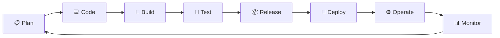

* ♾️ DevOps is **continuous** — there is no "done"
* 🔄 Each stage feeds the next; monitoring informs the next plan
* 🔁 Forever improving — the loop is the point

---

## 📍 Slide 21 – 🔁 Lifecycle Phases → Tools (May 2026 baseline)

| 📍 Phase | 🎯 Activity | 🛠️ Representative Tools |
|----------|------------|-------------------------|
| 📋 Plan | Requirements, design | Jira, Linear, GitHub Issues |
| 💻 Code | Write & review | Git, GitHub, VS Code, JetBrains |
| 🔨 Build | Compile, package | Docker **29.x**, Buildah, Maven, npm |
| 🧪 Test | Automated testing | pytest 8.3, Jest 30, Playwright, k6 |
| 📦 Release | Version, approve | GitHub Releases, Conventional Commits |
| 🚀 Deploy | Push to environment | **ArgoCD 3.4**, **Argo Rollouts 1.8**, **Helm 4.1** |
| ⚙️ Operate | Run, scale | **Kubernetes 1.36** "Haru", **Terraform 1.15**, **ansible-core 2.21** |
| 📊 Monitor | Observe, alert | **Prometheus 3.11+**, Grafana 11, Loki 3.7, **Alloy 1.16** (Promtail EOL Mar 2026) |

> 🔧 **Note on versions:** every tool above is pinned to a current May-2026 stable. The labs match. *Helm 4 is a major release — most online tutorials still show Helm 3 syntax; we deliberately use 4.*

---

## 📍 Slide 22 – 🗺️ Course Map

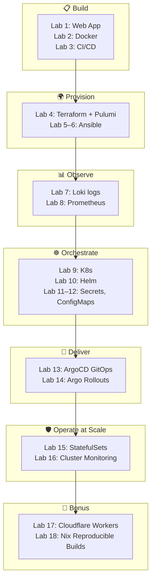

✅ **16 main labs + 2 bonus labs. Every one maps to a real DevOps skill.**

---

## 📍 Slide 23 – 📊 DORA Metrics — How We Measure DevOps

The DORA team (Nicole Forsgren et al.) identified four metrics that predict software delivery performance. The DORA *State of DevOps* report has tracked them yearly since 2014.

| 📊 Metric | 📏 What it measures | 🏆 Elite (2024) | 🐢 Low (2024) |
|-----------|--------------------|--------------|--------------|
| ⏱️ **Lead Time for Changes** | Commit → production | < 1 hour | > 1 month |
| 📦 **Deployment Frequency** | How often you deploy | On-demand (multi/day) | < 1/month |
| ❌ **Change Failure Rate** | % deploys that cause incidents | 0–5% | 46–60% |
| 🔧 **Failed Deployment Recovery Time** | MTTR after a bad deploy | < 1 hour | > 1 month |

> 📚 **Source:** DORA *State of DevOps Report 2024* — the last report to use this four-tier ladder. The fifth metric (reliability) was added in 2021. The 2025 report retired the ladder in favour of seven team archetypes blending delivery + human factors — but the four metrics themselves remain the industry standard for measurement.

**🤔 Question:** which metric is hardest to improve, and why?

---

## 📍 Slide 24 – 🌊 From Chaos to Flow

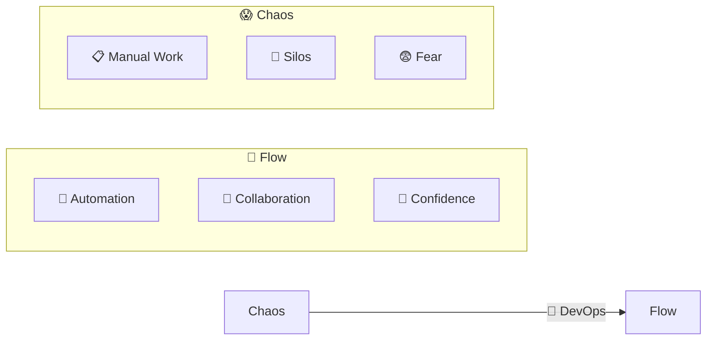

**🎯 Flow State (Gene Kim's definition):**
* ⚡ Changes flow smoothly from idea to production
* 🔄 Feedback loops are fast and trustworthy
* 📈 Teams continuously experiment and improve

---

## 📍 Slide 25 – 🏢 Section 5: DevOps in Real Life

**🎬 Netflix** — the canonical DevOps case study
* 🚀 1000+ production deploys/day across services
* 🐒 *Chaos Monkey* (open-sourced 2012) — kills production instances on purpose to verify resilience
* 🔄 Self-healing infrastructure; on-call engineers rarely paged

**📦 Amazon**
* ⚡ Every 11.7 seconds on average (Werner Vogels, 2011) — still cited as a benchmark
* 🔧 *"You build it, you run it"* — Werner's two-pizza team rule
* 🛠️ AWS itself was built to dogfood Amazon's internal platform

**🔍 Google**
* 🛡️ Invented **Site Reliability Engineering (SRE)** in 2003 — Ben Treynor Sloss
* 📊 *Error budgets* balance velocity against reliability
* 📝 Blameless postmortems are a hiring criterion

> 🔗 **Want more of this?** SRE-Intro (elective) goes deep on Google's playbook.

---

## 📍 Slide 26 – 👥 DevOps Roles (2025/26)

| 👤 Role | 🎯 Focus |
|---------|---------|
| 🔧 **DevOps Engineer** | Pipelines, automation, infra-as-code |
| 🛡️ **SRE** | Reliability, SLOs, incident response |
| 🏗️ **Platform Engineer** | Internal developer platform, golden paths |
| ☁️ **Cloud Engineer** | Cloud infra, cost optimization, FinOps |

**🔗 Common thread:** collaboration, automation, ownership of production.

> 💼 Platform Engineering is the fastest-growing of the four (Gartner 2024). Many companies now treat the *internal developer platform* as a product.

---

## 📍 Slide 27 – 🤝 Team Collaboration in Practice

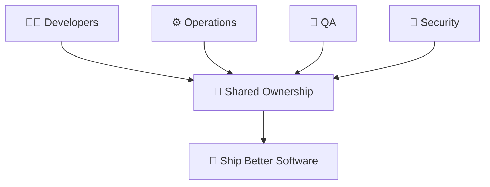

**🤝 Practices you'll see in healthy teams:**
* 📟 Shared on-call rotations across Dev and Ops
* 📝 Blameless incident reviews with action items
* 👥 Cross-functional squads — feature teams own from idea to operations
* 🔓 Self-service deploy — every engineer can ship, with guardrails

---

## 📍 Slide 28 – 🎯 Key Takeaways

1. 🧩 **DevOps = culture + practices + tools** — in that order
2. 🧱 **Break down silos** between Dev and Ops
3. 🤖 **Automate everything** repeatable
4. 📊 **Measure with DORA** — lead time, deploy frequency, change failure rate, MTTR
5. 📝 **Learn from failures**, don't assign blame
6. 🔄 **Small changes, fast feedback** — the safest path to production

> 💡 DevOps isn't a destination. It's a direction.

---

## 📍 Slide 29 – 🧠 The Mindset Shift

| 😰 Old Mindset | 🚀 DevOps Mindset |
|---------------|------------------|
| 🙅 "Not my job" | 🤝 "Our responsibility" |
| 🚫 "Don't touch prod" | 💪 "Deploy with confidence, roll back fast" |
| 👉 "Who broke it?" | 🔍 "How do we prevent this class of failure?" |
| 😨 "Change is risky" | ✅ "Small frequent changes are safer than rare big ones" |
| 💻 "Works on my machine" | 🌍 "Works in every environment — proved by pipeline" |

> ❓ Which mindset describes the team you want to work on?

---

## 📍 Slide 30 – 🚀 What Comes Next

**📚 Next lecture: *Containerization with Docker*** — packaging your app so "works on my machine" finally means "works everywhere."

* 🐳 Why containers won (and where they don't)
* 🔧 Writing production-ready Dockerfiles
* 🛡️ Rootless, distroless, multi-stage builds
* 🌐 Docker Hub workflow

**🔬 Your Lab 1 work:** build a Python web service exposing `/` and `/health`. That service will be your project for the rest of the semester — by Lab 16, it'll be running on Kubernetes with GitOps, monitoring, secrets, and StatefulSet-backed storage.

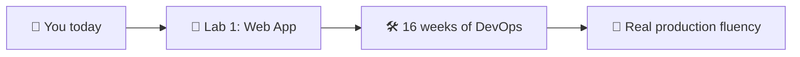

**👋 See you in Lecture 2.**

> 🌊 From chaos to flow — one commit at a time.

---

## 📚 Resources & Further Reading

**📕 Books — read at least one this semester:**
* *The Phoenix Project* — Gene Kim, Kevin Behr, George Spafford (2013). The novel that introduced DevOps to mainstream IT.
* *The DevOps Handbook* (2nd ed.) — Kim, Humble, Debois, Willis (2021). The reference manual.
* *Accelerate* — Forsgren, Humble, Kim (2018). The science behind DORA metrics.
* *Site Reliability Engineering* — Beyer, Jones, Petoff, Murphy (2016). Free at sre.google/books.

**🔗 Links:**
* 🌐 [DORA State of DevOps reports](https://dora.dev/research/) — yearly research, free
* 🌐 [12 Factor App](https://12factor.net) — Heroku's foundational principles
* 🌐 [CNCF Cloud Native Landscape](https://landscape.cncf.io) — the tool universe

**🎓 Quiz:** post-lecture quiz feeds the weeks 1–3 leaderboard (see `README.md` → Grading).
