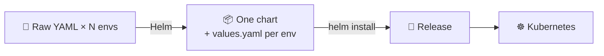
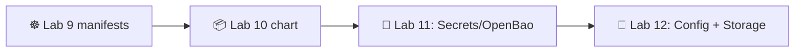

# 📌 Lecture 10 — Helm Package Management: Templating Kubernetes

## 📍 Slide 1 – 📦 Welcome to Helm

* 🌍 **Lecture 9 left you with raw YAML** — a Deployment + Service per environment, copied and edited by hand. That scales to maybe two environments before it bites.
* 📦 **Helm** = the package manager for Kubernetes. It bundles your manifests into a **chart**, parameterizes them with **values**, and tracks installs as **releases**.
* 🎯 This lecture: write a chart, template it cleanly, and ship the same chart through dev/stage/prod with one value file change per environment.
* 🔗 **Tie-in to Lab 10:** convert your Lab 9 manifests into a Helm chart, support 3 environments via values, add pre/post-install hooks, push the chart to GHCR as an OCI artifact.



---

## 📍 Slide 2 – 🎯 Learning Outcomes

| # | Outcome |
|---|---------|
| 1 | 🧱 Read & write Helm 4 chart structure: `Chart.yaml`, `values.yaml`, `templates/`, `_helpers.tpl`, `charts/` |
| 2 | 🎨 Use Go templates + Sprig functions, named templates, `tpl`, `include` |
| 3 | 🚦 Drive releases with `install / upgrade / rollback / uninstall / template / lint / test` |
| 4 | 🌳 Compose charts with dependencies and library charts |
| 5 | 🪝 Use hooks for pre-install / post-upgrade / pre-delete logic |
| 6 | 🌐 Push and pull charts via OCI registry (GHCR) |

**Tech stack pinned for May 2026:** **Helm 4.1.4** (released April 8 2026). Helm 3 is in support mode through July 8 2026 (bug fixes) / November 11 2026 (security only). New work uses Helm 4.

---

## 📍 Slide 3 – ❓ Why Helm Exists

You wrote three manifests in Lab 9 (Deployment, Service, ConfigMap). Now imagine:
* 🌳 Three environments — dev, staging, prod — each needs different replica counts, image tags, resource limits
* 🔁 Twelve services — same shape, different names

**Without Helm:** copy-and-edit YAML, eyeball diffs, hope no env drifts. Fails by service 4.

**With Helm:** *one* set of templates, *one* `values.yaml` per environment, one command per install. Templates render to YAML; Helm pushes through `kubectl apply`.

> 🔥 **Hot take:** Helm is not the only K8s templating tool (Kustomize, Jsonnet, cdk8s, Carvel ytt). It's the most popular by ~5x because charts are *shareable artifacts* — `helm pull oci://…` and you have someone else's working stack.

---

## 📍 Slide 4 – 📜 Helm Evolution: 1 → 2 → 3 → 4

* 📅 **2015** — Helm 1 created by Deis (acquired by Microsoft 2017). Client-side templating only.
* 📅 **2016** — Helm 2 introduces **Tiller** — an in-cluster server-side component. Loved for power, hated for cluster-wide RBAC.
* 📅 **2019** — Helm 3 **drops Tiller**, stores release state in K8s Secrets/ConfigMaps. The default everyone uses today.
* 📅 **2022** — OCI registries become first-class for chart distribution (charts pushed/pulled like Docker images).
* 📅 **2026 (Apr 8)** — Helm **4.1.4** released. Backwards-compatible chart format for `apiVersion: v2`; engine rewrites + better dependency resolution + WASM plugin support.

> 📝 **Migration story:** most Helm 3 charts work unmodified on Helm 4. Helm 3's CLI is still available; expect both in shops through mid-2026. The labs in this course use Helm 4.

---

## 📍 Slide 5 – 🧱 Chart Anatomy

A chart is a directory with this shape:

```
mychart/
├── Chart.yaml          # 📇 Metadata: name, version, appVersion, dependencies
├── values.yaml         # 🎚️ Default values (overridable per install)
├── values.schema.json  # 📐 (Optional) JSON schema for values validation
├── templates/
│   ├── deployment.yaml
│   ├── service.yaml
│   ├── ingress.yaml
│   ├── configmap.yaml
│   ├── _helpers.tpl    # 🛠️ Named template definitions (no underscore = file is rendered)
│   ├── NOTES.txt       # 📋 Printed after install/upgrade
│   └── tests/
│       └── test-connection.yaml
├── charts/             # 📦 Subcharts (dependencies)
└── README.md
```

Key rules:
* 📁 Files starting with `_` are **partials** — included via `{{ include ... }}`, never rendered as standalone YAML
* 🧪 Files in `templates/tests/` run only on `helm test <release>`
* 🔒 Anything under `charts/` is a vendored subchart (managed by `helm dependency update`)

---

## 📍 Slide 6 – 📇 Chart.yaml

```yaml
apiVersion: v2                # ⚠️ Helm 3+; Helm 4 reads v2; v1 is Helm 2 (deprecated)
name: lab10-app
description: DevOps Core lab 10 — Python service + Go echo
type: application             # 'application' (default) or 'library'
version: 1.3.0                # 📌 Chart version (SemVer) — bumped on chart changes
appVersion: "1.0.0"           # 📌 App version (string) — bumped on image changes
kubeVersion: ">=1.33.0"       # 🚦 Refuse install on older clusters

dependencies:
  - name: postgresql
    version: 16.x
    repository: oci://registry-1.docker.io/bitnamicharts
    condition: postgresql.enabled
```

* 🎯 **Two versions** matter: `version` (the chart YOU publish) and `appVersion` (the image it deploys). They evolve independently.
* 🔧 `type: library` charts contribute only `_helpers.tpl` templates — they don't install anything themselves.

---

## 📍 Slide 7 – 🎨 Go Templates + Sprig

Helm uses Go's `text/template` package + the **Sprig** function library (~200 extra helpers).

```yaml
apiVersion: apps/v1
kind: Deployment
metadata:
  name: {{ include "lab10-app.fullname" . }}
  labels:
    {{- include "lab10-app.labels" . | nindent 4 }}
spec:
  replicas: {{ .Values.replicaCount | default 2 }}
  template:
    spec:
      containers:
        - name: web
          image: "{{ .Values.image.repository }}:{{ .Values.image.tag | default .Chart.AppVersion }}"
          env:
            - name: ECHO_URL
              value: "http://{{ include "lab10-app.fullname" . }}-echo:80"
          {{- with .Values.resources }}
          resources:
            {{- toYaml . | nindent 12 }}
          {{- end }}
```

Common idioms:
* `{{ include "name" . }}` — invoke a named template (better than `template` because it returns a string you can pipe)
* `| nindent N` — indent a block by N spaces *after* a newline (the most common formatting bug fix)
* `| default X` — fallback when the value is absent
* `{{- ... -}}` — strip whitespace on the left/right of the action
* `{{ toYaml . | nindent N }}` — render a structure as YAML

> 🔥 **The #1 Helm bug:** indentation. `nindent` (newline + indent) is what you want 90% of the time. `indent` produces invalid YAML if the action is on its own line.

---

## 📍 Slide 8 – 🛠️ `_helpers.tpl` — Named Templates Done Right

Avoid copy-pasting label blocks. Define once, include everywhere.

```handlebars
{{/*
Standard labels — matches the K8s recommended labels namespace.
*/}}
{{- define "lab10-app.labels" -}}
helm.sh/chart: {{ printf "%s-%s" .Chart.Name .Chart.Version | replace "+" "_" | trunc 63 | trimSuffix "-" }}
app.kubernetes.io/name: {{ .Chart.Name }}
app.kubernetes.io/instance: {{ .Release.Name }}
app.kubernetes.io/version: {{ .Chart.AppVersion | quote }}
app.kubernetes.io/managed-by: {{ .Release.Service }}
{{- end }}

{{/*
Selector labels — subset that should never change after install.
*/}}
{{- define "lab10-app.selectorLabels" -}}
app.kubernetes.io/name: {{ .Chart.Name }}
app.kubernetes.io/instance: {{ .Release.Name }}
{{- end }}
```

Selector labels are a strict subset of `.labels` because **Service/Deployment selectors are immutable after creation**. Don't put `version` in selector labels or you'll break rolling updates.

---

## 📍 Slide 9 – 🚦 The Release Lifecycle

```bash
helm install web ./mychart -n dev \
  -f values-dev.yaml \
  --create-namespace

helm upgrade web ./mychart -n dev \
  -f values-dev.yaml \
  --set image.tag=v1.0.5

helm rollback web 3 -n dev          # ⏪ to revision 3
helm history web -n dev             # 📜 every revision is in K8s Secrets
helm uninstall web -n dev           # 🗑️ removes everything Helm tracked

helm template ./mychart -f values-prod.yaml  # 🔍 render to stdout (CI / GitOps friendly)
helm lint ./mychart                          # 🔍 syntax + schema check
helm test web -n dev                         # 🧪 run templates/tests/ pods
```

* 📜 Every `install` and `upgrade` creates a **revision** stored as a `helm.sh/release.v1` Secret in the release's namespace. `helm rollback` is just "apply the manifests from revision N".
* 🔍 `helm template` is the gateway to GitOps: render once, commit the YAML, let ArgoCD apply.

---

## 📍 Slide 10 – 🌳 Multi-Environment via Values Hierarchy

The flexible pattern is a base `values.yaml` + an override per environment.

```yaml
# values.yaml (defaults)
replicaCount: 2
image:
  repository: ghcr.io/innodevops/lab2-app
  tag: ""                            # falls back to .Chart.AppVersion
resources:
  requests: {cpu: 100m, memory: 64Mi}
  limits:   {cpu: 500m, memory: 256Mi}
ingress:
  enabled: false
```

```yaml
# values-prod.yaml (overrides)
replicaCount: 5
image:
  tag: v1.2.0
resources:
  requests: {cpu: 500m, memory: 256Mi}
  limits:   {cpu: 2000m, memory: 1Gi}
ingress:
  enabled: true
  host: app.prod.example.com
```

```bash
helm upgrade --install web ./mychart -n prod -f values.yaml -f values-prod.yaml
```

Order of precedence (lowest → highest):
1. `values.yaml` (chart default)
2. `-f file.yaml` (later files override earlier)
3. `--set key=value` (explicit on CLI)

---

## 📍 Slide 11 – 🪝 Hooks: pre-install, post-upgrade, …

Hooks let you run a Job, Pod, or any resource at a specific point in the release lifecycle.

```yaml
apiVersion: batch/v1
kind: Job
metadata:
  name: {{ include "lab10-app.fullname" . }}-db-migrate
  annotations:
    "helm.sh/hook": pre-upgrade,pre-install
    "helm.sh/hook-weight": "-5"
    "helm.sh/hook-delete-policy": before-hook-creation,hook-succeeded
spec:
  template:
    spec:
      restartPolicy: Never
      containers:
        - name: migrate
          image: "{{ .Values.image.repository }}:{{ .Values.image.tag }}"
          command: ["python", "manage.py", "migrate"]
```

Common hook points: `pre-install`, `post-install`, `pre-upgrade`, `post-upgrade`, `pre-delete`, `post-delete`, `test`.

`hook-weight` orders multiple hooks (lower runs first; ties broken alphabetically).
`hook-delete-policy` controls cleanup: `before-hook-creation` (default), `hook-succeeded`, `hook-failed`.

> ⚠️ **Hook gotcha:** hook resources are *not* tracked in the release — `helm uninstall` won't delete a hook Job. Use `hook-delete-policy: hook-succeeded` for cleanup.

---

## 📍 Slide 12 – 📦 Dependencies & Subcharts

Charts can depend on other charts. Run `helm dependency update` to fetch them into `charts/`.

```yaml
# Chart.yaml
dependencies:
  - name: postgresql
    version: 16.x
    repository: oci://registry-1.docker.io/bitnamicharts
    condition: postgresql.enabled
    alias: db                        # 🏷️ rename in values
```

```yaml
# values.yaml
postgresql:                          # 🎚️ subchart values nest under its alias
  enabled: true
  auth:
    username: app
    database: lab10
```

Helm 4 added improved dependency resolution — multiple charts can pull the same transitive dep without conflicts.

---

## 📍 Slide 13 – 📚 Library Charts

A chart with `type: library` contributes only `_helpers.tpl` templates. Use it when 10 application charts share boilerplate (labels, security context, image-pull secrets).

```yaml
# common-lib/Chart.yaml
apiVersion: v2
name: common-lib
type: library                        # 🚫 no templates rendered, only helpers contributed
version: 1.0.0
```

```yaml
# mychart/Chart.yaml
dependencies:
  - name: common-lib
    version: 1.x
    repository: oci://ghcr.io/innodevops/charts
```

```handlebars
# mychart/templates/deployment.yaml
{{ include "common-lib.labels" . | nindent 4 }}    # 🔁 reused from the library
```

> 🔗 **Lab 10 bonus** asks you to extract `_helpers.tpl` into a library chart and consume it from your app chart.

---

## 📍 Slide 14 – 🌐 OCI Registries — Charts as OCI Artifacts

Since 2022, Helm pushes charts to OCI registries (same protocol as Docker images). GHCR / Docker Hub / Harbor / ECR all support OCI artifacts.

```bash
# 📦 Package
helm package ./mychart                       # produces mychart-1.3.0.tgz

# 🔑 Auth (GHCR uses GitHub PAT or GITHUB_TOKEN in CI)
echo $GITHUB_TOKEN | helm registry login ghcr.io -u $GITHUB_ACTOR --password-stdin

# 📤 Push
helm push mychart-1.3.0.tgz oci://ghcr.io/innodevops/charts

# 📥 Pull (in another repo / cluster)
helm install web oci://ghcr.io/innodevops/charts/mychart --version 1.3.0
```

> 🔥 **Why OCI:** one auth model, one registry, one set of access controls for images *and* charts. Drops the legacy `helm repo add` HTTP indexing model.

---

## 📍 Slide 15 – 🧪 Testing Charts

* 🔍 `helm lint ./mychart` — schema + YAML parse check
* 📐 `values.schema.json` — JSON Schema validates `values.yaml`. Helm errors out before install if values are wrong.
* 🧪 `helm template ./mychart | kubectl apply --dry-run=server -f -` — server-side validation
* ✅ `helm test <release>` — runs Pods in `templates/tests/` against the live release

A typical `templates/tests/test-connection.yaml`:
```yaml
apiVersion: v1
kind: Pod
metadata:
  name: "{{ include "lab10-app.fullname" . }}-test"
  annotations:
    "helm.sh/hook": test
spec:
  restartPolicy: Never
  containers:
    - name: curl
      image: curlimages/curl:8.10.1
      args: ["-fsS", "http://{{ include "lab10-app.fullname" . }}:80/healthz"]
```

---

## 📍 Slide 16 – 🚫 Anti-Patterns and Common Bugs

1. ❌ **Hard-coding image tags in templates** — put them in `values.yaml` so upgrades flow through `--set image.tag=...`
2. ❌ **`indent` instead of `nindent`** — produces invalid YAML when the action is on its own line
3. ❌ **Mutable selector labels** — once a Deployment exists, K8s rejects selector changes; use a stable subset
4. ❌ **Skipping `helm lint` in CI** — every chart change should fail CI on lint error
5. ❌ **Hooks that don't clean up** — set `hook-delete-policy: hook-succeeded` or you accumulate failed Jobs
6. ❌ **Putting secrets in `values.yaml`** — git-tracked. Use **OpenBao + the secrets injector** (Lab 11) or `helm secrets` plugin
7. ❌ **One huge umbrella chart for 12 services** — each service should have its own chart; share via library chart
8. ❌ **Using `latest` in `appVersion`** — kills reproducibility. Pin a SemVer or git SHA.

---

## 📍 Slide 17 – 🌍 Helm in the Wild

* 📦 **Artifact Hub** indexes **15,000+ Helm charts** across hundreds of publishers
* 🏢 **Bitnami** ships production-grade charts for ~150 popular open-source apps (Postgres, MongoDB, Redis, RabbitMQ, Kafka …) — though IPO/license changes in 2024 led many to move to community forks
* 🎬 **Netflix, Shopify, Spotify** all publish internal Helm charts as the standard packaging unit
* 🪐 **Crossplane, ArgoCD, kube-prometheus-stack** are all distributed as Helm charts — the K8s ecosystem assumes you have Helm

> 📊 **CNCF survey 2024:** Helm is the #1 K8s package manager by margin. The "K8s deployment story" is still mostly Helm + ArgoCD + Kustomize in 2026.

---

## 📍 Slide 18 – 🎯 Key Takeaways

1. 📦 **Helm = templating + packaging + release lifecycle** — three jobs in one tool
2. 🧱 **Chart structure is rigid** — `Chart.yaml`, `values.yaml`, `templates/`, `_helpers.tpl`. Memorize.
3. 🎨 **Go templates + Sprig + named templates** — `nindent`, `include`, `default` cover 80% of use cases
4. 🌳 **One chart, N value files** — the multi-environment story; never copy-edit YAML
5. 🪝 **Hooks** run Jobs/Pods at lifecycle moments — set `hook-delete-policy` to clean up
6. 📚 **Library charts** share helpers across application charts
7. 🌐 **OCI artifacts** are the modern distribution path — same registry as your images
8. ✅ **`helm lint` + `values.schema.json` + `helm template` in CI** — catch errors before the cluster does

> 💡 **The Helm 4 reality:** the syntax you write today will install fine on Helm 3.x clusters too. Adopt Helm 4 now; you're already future-proof.

---

## 📍 Slide 19 – 🚀 What Comes Next

**📚 Next lecture: *Secret Management with Kubernetes + OpenBao*** — because `values.yaml` is git-tracked and your DB password isn't.

* 🔐 K8s `Secret` — what it actually does (and doesn't)
* 🪦 HashiCorp Vault → OpenBao migration (BSL fallout, August 2023)
* 🤖 External Secrets Operator (ESO)
* 🎯 Vault Agent Injector for templated config

**🔬 Lab 10 deliverables:**
* Package your Lab 9 manifests into a `lab10-app` chart
* Support `values-dev.yaml` / `values-staging.yaml` / `values-prod.yaml`
* Add a pre-install hook for DB migration (even if fake)
* Push the chart to GHCR via `helm push oci://`
* Bonus 2 pts: extract `_helpers.tpl` into a library chart consumed by your app chart



> 🌊 From YAML to packages — one template at a time.

---

## 📚 Resources

* 📕 *Learning Helm* (2e, 2024) — Butcher, Farina, Dolitsky (O'Reilly). The canonical reference.
* 📕 *Mastering Helm* — Sumesh Kumar (2023) — chart patterns
* 🌐 [helm.sh/docs](https://helm.sh/docs/) — official docs (Helm 4)
* 🌐 [helm.sh/docs/chart_best_practices](https://helm.sh/docs/chart_best_practices/) — chart authoring conventions
* 🌐 [Artifact Hub](https://artifacthub.io/) — search public charts
* 🌐 [Sprig functions](https://masterminds.github.io/sprig/) — the function reference you'll consult weekly
* 🌐 [Helm 4 release notes](https://helm.sh/blog/) — what changed from 3

**🎓 Quiz:** post-lecture quiz feeds the weeks 10-12 leaderboard window.
