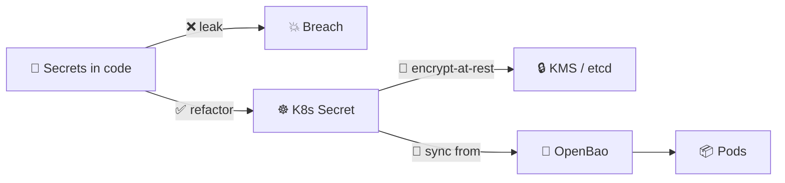
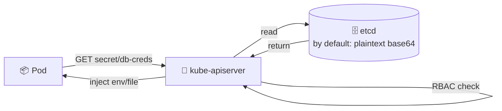
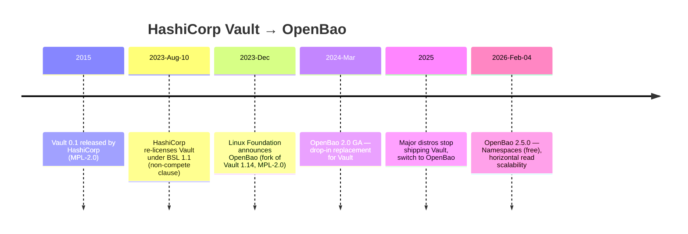
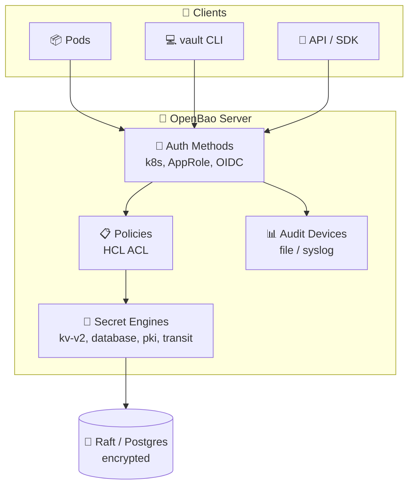
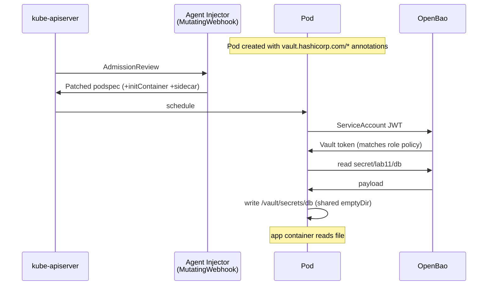
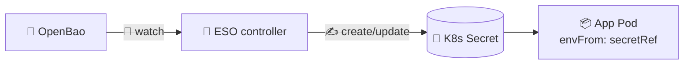
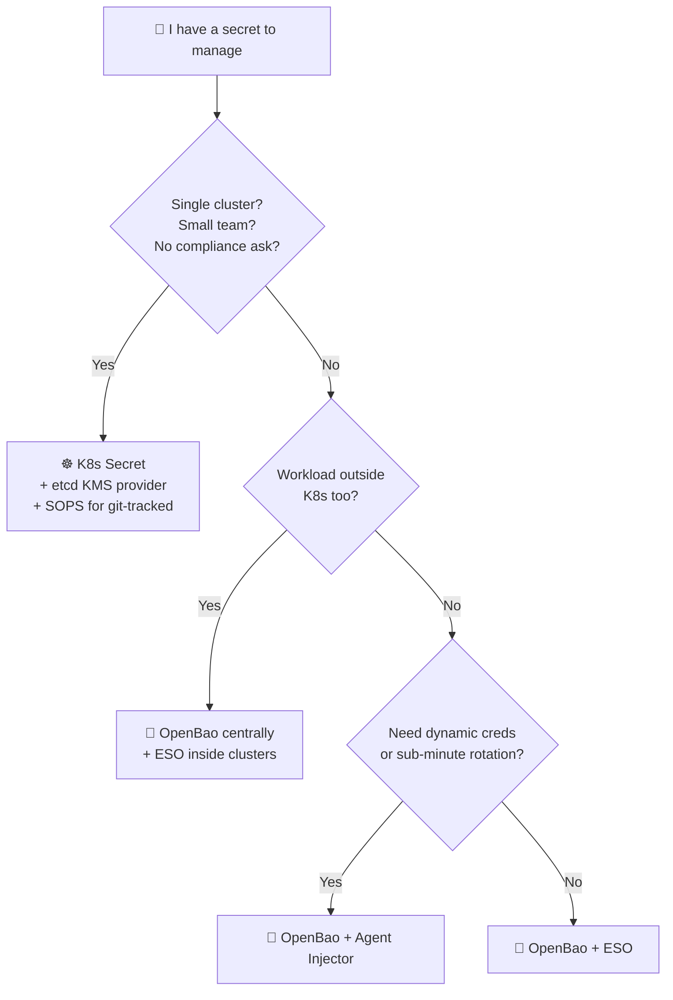
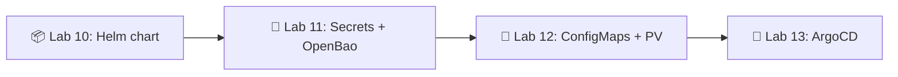

# 📌 Lecture 11 — Secrets & OpenBao: Stop Putting Passwords in Git

## 📍 Slide 1 – 🔐 Welcome to Secret Management

* 🌍 **Lab 10 left you with a clean Helm chart** — Deployment, Service, Ingress, values per environment. One problem: a real app needs a DB password, an API key, a TLS cert. You can't put those in `values.yaml` and push to GitHub.
* 😱 **Secrets in code is the #1 cause of cloud breaches** — and the cheapest to prevent.
* 🎯 This lecture: K8s `Secret` (what it actually is), encryption-at-rest, the **OpenBao** project (Vault's open-source successor), and the two patterns to inject secrets into pods — **Vault Agent Injector** and **External Secrets Operator**.
* 🔗 **Tie-in to Lab 11:** add a `templates/secrets.yaml` to your Lab 10 chart, install **OpenBao** via Helm, configure Kubernetes auth, and inject a secret via Vault Agent annotations.



---

## 📍 Slide 2 – 🎯 Learning Outcomes

| # | Outcome |
|---|---------|
| 1 | 🧠 Explain why a K8s `Secret` is **not encrypted** by default (it's base64) |
| 2 | 🔐 Enable **encryption-at-rest** in etcd using an `EncryptionConfiguration` + KMS provider |
| 3 | 🏰 Run **OpenBao 2.5.0** in Kubernetes; configure KV-v2 + Kubernetes auth + a read policy |
| 4 | 💉 Use the **Vault Agent Injector** sidecar pattern to render secrets to a file in the pod |
| 5 | 🤖 Use the **External Secrets Operator** (ESO) to sync from OpenBao → native K8s `Secret` |
| 6 | 🗺️ Choose the right pattern (Agent Injector vs ESO vs CSI vs Sealed Secrets vs SOPS) |

**Tech stack pinned for May 2026:** Kubernetes **1.36**, **OpenBao 2.5.0** (Linux Foundation, MPL-2.0), External Secrets Operator **v2.5.0**, `vault` CLI (still works against OpenBao — wire-compatible).

---

## 📍 Slide 3 – 💀 The Cost of Getting It Wrong

> 💬 *"The only truly secure system is one that is powered off, cast in a block of concrete and sealed in a lead-lined room with armed guards."* — Gene Spafford

* 💸 **IBM Cost of a Data Breach 2025:** global average **$4.44M** per breach; US record **$10.22M**
* 🔍 **Credential abuse** is the #1 initial-access vector in the Verizon DBIR every year since 2019
* ⏱️ **Mean time to detect** a credential breach: ~204 days (IBM 2025)
* 🤖 **GitGuardian 2024:** ~12.8M new secrets leaked to public GitHub in a single year — most never rotated

> 🤔 **Think:** how many `.env` files do you have on your laptop right now that contain a real production password?

---

## 📍 Slide 4 – 📜 Real Incidents — Learn From Their Pain

| Year | Who | What |
|------|-----|------|
| 2014 | **Code Spaces** | AWS root keys in code → attacker wiped all backups + all customer data → **company shut down within 12 hours** |
| 2016 | **Uber** | AWS creds hardcoded in a private GitHub repo (compromised dev account) → S3 dump of **57M users** → **$148M settlement** |
| 2022 | **Dropbox** | 130 private GH repos stolen via phishing — leaked internal API keys + 3rd-party creds |
| 2022 | **Toyota** | `.git` directory served from a public asset → customer-data DB credentials leaked **for 10 years** |
| 2025 | **tj-actions/changed-files** | CVE-2025-30066, compromised popular GitHub Action **dumped every secret** in CI logs of 23,000+ repos |

> 🔥 **Pattern:** every single one of these was a **secret stored in the wrong place** (code, git, CI logs, public asset). Not zero-days. Not 0-click. Just a credential in the wrong file.

---

## 📍 Slide 5 – ☸️ The Kubernetes `Secret` Object

A `Secret` is a first-class K8s API object, separate from `ConfigMap` because it's *intended* for sensitive data.

```yaml
apiVersion: v1
kind: Secret
metadata:
  name: db-creds
  namespace: lab11
type: Opaque
data:                                  # ⚠️ values must be base64-encoded
  username: YWRtaW4=
  password: U3VwZXJTZWNyZXQxMjM=
# stringData:                          # ✅ alternative: K8s base64-encodes for you
#   username: admin
#   password: SuperSecret123
```

* 📦 Three creation patterns: `kubectl create secret` (imperative), YAML `kind: Secret` (declarative), Helm `templates/secrets.yaml`
* 🔑 **Built-in types:** `Opaque` (generic), `kubernetes.io/dockerconfigjson` (image pulls), `kubernetes.io/tls` (cert + key), `kubernetes.io/service-account-token`
* 🚦 Consumed by pods as **env vars** (`envFrom`/`secretKeyRef`) or as a **file mount** (`projected` / `secret` volume)

---

## 📍 Slide 6 – ⚠️ Base64 Is Not Encryption

> ⚠️ **The single most-tested fact in K8s exams** — and the misunderstanding behind every junior breach.

```bash
$ echo "SuperSecret123" | base64
U3VwZXJTZWNyZXQxMjMK
$ echo "U3VwZXJTZWNyZXQxMjMK" | base64 -d
SuperSecret123                         # 🔓 No key. No password. Just decode.
```

| 🔄 Encoding (base64) | 🔐 Encryption (AES-GCM, KMS, …) |
|----------------------|----------------------------------|
| ✅ Reversible by anyone with the string | 🔑 Requires a key to decrypt |
| 🎯 Designed for binary-safe text transport | 🛡️ Designed for confidentiality |
| 📦 Same data, different format | 🔒 Different data, mathematically secure |

> 🔥 **Why base64 then?** Because `Secret.data` values must be valid JSON/YAML strings — binary like a TLS key wouldn't fit otherwise. Confidentiality is the API server's + etcd's job, not base64's.

---

## 📍 Slide 7 – 🗄️ Where Secrets Actually Live: etcd



Two hard truths about etcd:

* 🔓 **By default, etcd stores Secrets as base64 (plaintext-equivalent).** Anyone with disk access to an etcd member, an etcd backup, or a snapshot can dump all your secrets.
* 🛡️ **RBAC protects the API path, not the data at rest.** A node with `etcdctl get /registry/secrets/...` skips the API server entirely.

> 🤔 **Question:** does your managed control plane (EKS, GKE, AKS) encrypt etcd? **Often yes** — but at the *disk* level (cloud-provider encryption), not the K8s `EncryptionConfiguration` level. They're different threat models.

---

## 📍 Slide 8 – 🔐 Encryption-at-Rest in etcd

K8s ships an `EncryptionConfiguration` API: the kube-apiserver encrypts Secret payloads **before** writing to etcd.

```yaml
# /etc/kubernetes/enc/enc-config.yaml
apiVersion: apiserver.config.k8s.io/v1
kind: EncryptionConfiguration
resources:
  - resources: ["secrets"]
    providers:
      - kms:                           # 🥇 prefer KMS provider (AWS KMS, GCP KMS, Vault)
          name: aws-kms
          endpoint: unix:///var/run/kmsplugin/socket.sock
          cachesize: 1000
      - aescbc:                        # 🥈 fallback: local AES-256-CBC
          keys:
            - name: key1
              secret: <base64-32-byte-key>
      - identity: {}                   # ⚠️ identity = no encryption; must be LAST
```

Activation:
* 🛠️ kube-apiserver flag: `--encryption-provider-config=/etc/kubernetes/enc/enc-config.yaml`
* 🔄 **Re-encrypt existing secrets** after enabling: `kubectl get secrets -A -o json | kubectl replace -f -`
* 🔑 **Rotation** = add a new key at top of the list, replace all secrets, then move the old key down or remove it

> ⚠️ **Gotcha:** if `identity` isn't last, secrets stay unencrypted. Order matters.

---

## 📍 Slide 9 – 🪦 The Vault → OpenBao Story



* ⚖️ **BSL 1.1** = source-available but you may not offer Vault as a commercial managed service competing with HashiCorp.
* 🍴 The OpenBao fork is governed by the **Linux Foundation**, MPL-2.0 (true open source), wire-compatible with the `vault` CLI.
* 💡 The **paid HashiCorp features** (Namespaces, horizontal read scaling, MFA) are **free in OpenBao 2.5.0**.

> 🔥 **Why we teach OpenBao, not Vault:** the lab will run on student laptops. BSL says you can do that. But every reusable manifest you build today is going to a production cluster tomorrow — start with the license that doesn't get re-litigated.

---

## 📍 Slide 10 – 🏰 OpenBao Architecture



**Three concepts you must know:**
* 🔐 **Secret Engines** = where secrets live or are generated. `kv-v2` (versioned static), `database` (dynamic creds), `pki` (cert issuance), `transit` (encryption-as-a-service).
* 🔑 **Auth Methods** = how clients prove who they are. For K8s pods: `kubernetes` (validates the pod's ServiceAccount JWT against the K8s TokenReview API).
* 📋 **Policies** = HCL files describing path-level capabilities (`read`, `list`, `create`, `update`, `delete`, `sudo`, `deny`).

---

## 📍 Slide 11 – 🛠️ Install OpenBao via Helm

```bash
helm repo add openbao https://openbao.github.io/openbao-helm
helm repo update

helm install openbao openbao/openbao \
  --namespace openbao --create-namespace \
  --set "server.dev.enabled=true" \         # 🚨 dev mode = unsealed + in-memory, NEVER prod
  --set "injector.enabled=true" \           # 💉 deploy the Agent Sidecar Injector
  --set "server.image.tag=2.5.0"

kubectl get pods -n openbao
# NAME                                    READY   STATUS
# openbao-0                               1/1     Running
# openbao-agent-injector-7f...            1/1     Running
```

* 🚨 **Dev mode** auto-initializes, auto-unseals, stores in RAM. Restart = secret loss. **Lab only.**
* 🏢 **Prod:** integrated storage (Raft) on 3-5 nodes, auto-unseal via KMS, audit device → log aggregator, TLS everywhere.

> 🔥 **The `vault` CLI works.** OpenBao kept the API + CLI compatible. `vault status`, `vault kv put`, `vault login` — same commands.

---

## 📍 Slide 12 – 🔑 Configure: KV-v2 + Kubernetes Auth + Policy

```bash
kubectl exec -n openbao -it openbao-0 -- /bin/sh

# 🔐 Enable KV v2 (versioned secrets)
vault secrets enable -path=secret kv-v2

# 📝 Write a secret
vault kv put secret/lab11/db \
  username=app password='S3cure!2026'

# 🔑 Enable Kubernetes auth (validates pod ServiceAccount JWT)
vault auth enable kubernetes
vault write auth/kubernetes/config \
  kubernetes_host="https://$KUBERNETES_PORT_443_TCP_ADDR:443"

# 📋 Policy: read-only on this exact path
vault policy write lab11-read - <<EOF
path "secret/data/lab11/db" {
  capabilities = ["read"]
}
EOF

# 🎯 Bind the policy to a ServiceAccount + namespace
vault write auth/kubernetes/role/lab11 \
  bound_service_account_names=lab11-sa \
  bound_service_account_namespaces=lab11 \
  policies=lab11-read \
  ttl=1h
```

* 🎯 The **role** ties three things together: which SA can authenticate, which policy gets attached, and how long the resulting token lasts.

---

## 📍 Slide 13 – 💉 Vault Agent Injector: The Sidecar Pattern



* 🪝 The injector is a **MutatingAdmissionWebhook** — it edits the podspec at admission time, transparent to the chart author beyond annotations.
* 🔄 An **init container** fetches the secret before the app starts (so the file exists at app boot). A **sidecar** keeps renewing the token + refreshing the file.
* 📁 Secrets land in `/vault/secrets/<name>` on a shared `emptyDir` volume.

---

## 📍 Slide 14 – 🏷️ Vault Agent Annotations

```yaml
spec:
  template:
    metadata:
      annotations:
        vault.hashicorp.com/agent-inject: "true"
        vault.hashicorp.com/role: "lab11"
        # 🎯 Plain key=value file at /vault/secrets/db
        vault.hashicorp.com/agent-inject-secret-db: "secret/data/lab11/db"
        # 🎨 Custom template — render as .env
        vault.hashicorp.com/agent-inject-template-db: |
          {{- with secret "secret/data/lab11/db" -}}
          DB_USER={{ .Data.data.username }}
          DB_PASS={{ .Data.data.password }}
          {{- end -}}
        # 🔄 Re-render every 30s; signal SIGHUP to PID 1
        vault.hashicorp.com/agent-inject-default-template: "json"
        vault.hashicorp.com/agent-inject-command-db: "kill -HUP 1"
    spec:
      serviceAccountName: lab11-sa
      containers: [...]
```

* 🎨 `agent-inject-template-*` lets you render the secret in **any format** — `.env`, JSON, YAML, HCL, a full app config file.
* 🔁 `agent-inject-command-*` runs an in-pod command after re-rendering (signal the app to reload config).

---

## 📍 Slide 15 – 🤖 External Secrets Operator (ESO): The Other Pattern

ESO **syncs** secrets from an external store → a native K8s `Secret`. No sidecar. Apps read a normal `Secret` and don't know ESO exists.



```yaml
apiVersion: external-secrets.io/v1
kind: SecretStore
metadata: {name: openbao, namespace: lab11}
spec:
  provider:
    vault:                                   # ✅ ESO's vault provider works with OpenBao
      server: "http://openbao.openbao:8200"
      path: "secret"
      version: "v2"
      auth:
        kubernetes:
          mountPath: "kubernetes"
          role: "lab11"
          serviceAccountRef: {name: lab11-sa}
---
apiVersion: external-secrets.io/v1
kind: ExternalSecret
metadata: {name: db, namespace: lab11}
spec:
  refreshInterval: 1h                        # ⏱️ controller polls every hour
  secretStoreRef: {name: openbao, kind: SecretStore}
  target: {name: db-creds}                   # ⬅️ produces a K8s Secret with this name
  data:
    - secretKey: password
      remoteRef: {key: lab11/db, property: password}
```

---

## 📍 Slide 16 – 💉 Agent Injector vs ESO vs CSI: Pick One

| Concern | Agent Injector | ESO | Secrets Store CSI |
|---------|----------------|-----|-------------------|
| 📦 Secret lives in K8s `Secret`? | ❌ file only | ✅ yes | ⚠️ optional sync |
| 🔁 Auto-refresh on rotation | ✅ live (template + signal) | ⚠️ poll interval | ⚠️ on pod restart |
| 🧊 Pod resource cost | ❌ sidecar per pod | ✅ one controller | ✅ daemonset per node |
| 🔑 Supported auth methods | ✅ all Vault methods | ✅ all | ⚠️ k8s only |
| 🎯 Best when | dynamic creds, short TTL, signal-driven reloads | most pods want `envFrom`, polling is fine | strict no-K8s-Secret rules, file mounts |
| 🚦 Complexity | 🟡 medium | 🟢 low | 🟡 medium |

> 🔥 **Most teams in 2026 pick ESO** as the default and add Agent Injector only for the pods that need dynamic database creds or sub-minute rotation.

---

## 📍 Slide 17 – 🌳 Alternatives: SOPS and Sealed Secrets

Not every team can run a Vault/OpenBao cluster. Two GitOps-friendly alternatives:

* 🔏 **Mozilla SOPS** — encrypt YAML/JSON **file-level** with AWS KMS / GCP KMS / age / PGP. Encrypted file is safe to commit. The CI/CD pipeline (or `helm-secrets` plugin) decrypts at apply time.
  ```bash
  sops --encrypt --age $AGE_RECIPIENT secrets.yaml > secrets.enc.yaml
  # commit secrets.enc.yaml, *.gitignore secrets.yaml
  ```
* 🔒 **Sealed Secrets** (Bitnami) — a CRD + controller in-cluster. Encrypt with the controller's public key locally; only that one cluster can decrypt. Encrypted resource is safe to commit and apply.
  ```bash
  kubeseal --controller-namespace=kube-system < secret.yaml > sealed.yaml
  ```

| | SOPS | Sealed Secrets | OpenBao + ESO |
|---|------|----------------|---------------|
| 🔄 Rotation | ❌ manual re-encrypt | ❌ manual re-encrypt | ✅ central |
| 🔍 Audit log | ❌ git history | ❌ git history | ✅ Vault audit |
| 🌍 Multi-cluster sharing | ✅ | ❌ per-cluster key | ✅ |
| 🎚️ Complexity | 🟢 low | 🟢 low | 🟡 medium |

---

## 📍 Slide 18 – 🪞 OpenBao 2.5.0: What's New (Feb 4 2026)

* 🏷️ **Namespaces** are now free — multi-tenant secret isolation that used to be a HashiCorp Enterprise paywall feature. Each namespace gets its own policies/auth/mounts.
* 🚀 **Horizontal read scalability** — standby Raft nodes can now answer **read** requests locally without forwarding to the leader. Read-heavy workloads (think 10K pods all polling a config secret) suddenly become cheap.
* 🔒 **`disable_unauthed_rekey_endpoints: true` by default** — closes an unauth attack surface (CVE-class concern in older Vault).
* 🛠️ Auto-unseal hardening for managed keys (AWS KMS / GCP KMS / Azure Key Vault).
* 🧹 Identity-group cleanup on unseal — fixes a long-standing Vault bug where corrupted entries blocked startup.

> 🔥 **Practical impact:** the `vault` CLI commands you write today against OpenBao will run unchanged on production setups at any scale. Old Vault tutorials remain ~95% accurate.

---

## 📍 Slide 19 – 🚫 Anti-Patterns

1. ❌ **`echo $PASSWORD | base64` and committing the result** — base64 is encoding, not encryption. Git history is forever.
2. ❌ **Plain `Secret` with no etcd encryption** — anyone with an etcd snapshot owns your prod.
3. ❌ **One Vault token per app, never rotated** — defeats the entire point of a secret manager.
4. ❌ **Vault dev mode in production** — RAM storage, single key, auto-unseal. Process restart = total secret loss.
5. ❌ **Long-lived ServiceAccount tokens mounted by default** — set `automountServiceAccountToken: false` on SAs that don't need Vault auth.
6. ❌ **`vault.hashicorp.com/role: admin` on every pod** — least privilege; one role per app per environment.
7. ❌ **No secret rotation cadence** — pick a number (30/60/90 days), automate it, audit deviations.
8. ❌ **Putting real values in `values.yaml`** — that file lands in git via your Helm chart. Use ESO or Agent Injector, never `--set` from a CI step that logs.

---

## 📍 Slide 20 – 🧪 Detection: How Leaks Get Found

The good news: secret-scanning is cheap, fast, and CI-friendly.

* 🔍 **gitleaks**, **trufflehog**, **detect-secrets** — pre-commit hooks + CI gates. Find AWS keys, GCP service accounts, PEM keys, GH tokens.
* 🐙 **GitHub Secret Scanning** — built into github.com; partner integrations auto-revoke leaked tokens for AWS, GCP, Slack, Stripe, …
* 📊 **OWASP Top 10 (A07: Identification and Authentication Failures)** — explicitly calls out credential management as a top-tier risk.

```yaml
# .pre-commit-config.yaml
repos:
  - repo: https://github.com/gitleaks/gitleaks
    rev: v8.21.2
    hooks: [{id: gitleaks}]
```

> 🔥 **Run gitleaks on every PR.** It catches the human moments. Tools beat policy.

---

## 📍 Slide 21 – 🗺️ Decision Tree



* 🟢 **Start small:** K8s Secret + etcd encryption gets you 80% of the way.
* 🟡 **Add OpenBao + ESO** when you have ≥2 clusters or non-K8s consumers.
* 🔴 **Add Agent Injector + dynamic creds** when audit/compliance demands it.

---

## 📍 Slide 22 – 🎯 Key Takeaways

1. 🔓 **K8s `Secret` is base64, not encryption.** Confidentiality comes from RBAC + etcd-at-rest, not the resource itself.
2. 🔐 **Turn on `EncryptionConfiguration`** with a KMS provider; `identity` always last.
3. 🪦 **HashiCorp Vault went BSL in Aug 2023.** The community moved to **OpenBao** (LF / MPL-2.0). The `vault` CLI still works.
4. 🏰 **OpenBao 2.5.0** gives you free Namespaces + horizontal read scaling.
5. 💉 **Two injection patterns:** Agent Injector (sidecar, dynamic, signal-driven) and ESO (controller-synced K8s Secret). Pick by workload, not by hype.
6. 🌳 **SOPS / Sealed Secrets** are valid GitOps-friendly fallbacks when you can't run a Vault cluster.
7. 🔍 **Scan every commit** with gitleaks/trufflehog. Detection is cheaper than rotation.

> 💬 *"Security is not a product, but a process."* — Bruce Schneier

---

## 📍 Slide 23 – 🚀 What Comes Next

**📚 Next lecture: *ConfigMaps & Persistent Volumes*** — non-sensitive configuration, mounting strategies, and how stateful apps survive pod restarts.

* 📁 `ConfigMap` vs `Secret` — when each is the right answer
* 💾 PersistentVolume / PersistentVolumeClaim / StorageClass — dynamic provisioning
* 🔧 Mount strategies: subPath, projected volumes, immutable configs
* 🗂️ StatefulSets vs Deployments — when ordering matters

**🔬 Lab 11 deliverables:**
* Create an `app-credentials` Secret with `kubectl create secret`, view + decode it
* Add `templates/secrets.yaml` to your Lab 10 chart, inject via `envFrom`
* Install **OpenBao** in dev mode via the OpenBao Helm chart
* Enable KV-v2 + Kubernetes auth + a read policy + a role bound to your SA
* Add Vault Agent annotations to your Deployment; verify `/vault/secrets/...` appears in the pod
* Document everything in `k8s/SECRETS.md`
* **Bonus (+2.5 pts):** custom `agent-inject-template-*` rendering a `.env`, named template in `_helpers.tpl`, document the refresh mechanism



> 🌊 You've stopped putting passwords in git. Now let's configure everything else.

---

## 📚 Resources

* 📕 *Container Security* — Liz Rice (O'Reilly, 2020) — chapter on Secrets and threat model
* 📕 *Kubernetes Security and Observability* — Brendan Creane & Amit Gupta (O'Reilly, 2021)
* 🌐 [openbao.org/docs](https://openbao.org/docs/) — OpenBao official docs
* 🌐 [OpenBao 2.5.0 release notes](https://openbao.org/community/release-notes/2-5-0/) — Feb 4 2026
* 🌐 [external-secrets.io](https://external-secrets.io/) — ESO docs + provider list
* 🌐 [kubernetes.io/docs/concepts/configuration/secret](https://kubernetes.io/docs/concepts/configuration/secret/) — K8s Secrets reference
* 🌐 [kubernetes.io/docs/tasks/administer-cluster/encrypt-data](https://kubernetes.io/docs/tasks/administer-cluster/encrypt-data/) — encryption-at-rest setup
* 🌐 [getsops.io](https://getsops.io/) — SOPS docs
* 🌐 [github.com/bitnami-labs/sealed-secrets](https://github.com/bitnami-labs/sealed-secrets) — Sealed Secrets
* 🎥 *Kubernetes Secrets Are Not Secret* — KubeCon talk by Liz Rice (covers etcd attack surface)

**🎓 Quiz:** Post-lecture quiz feeds the weeks 10-12 leaderboard window.
