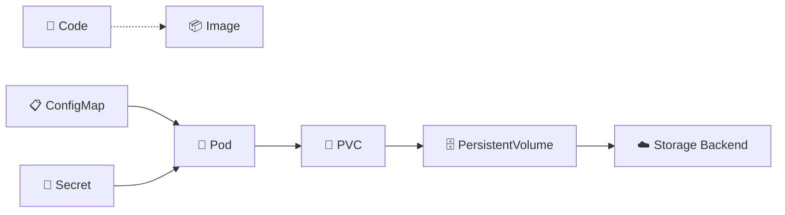
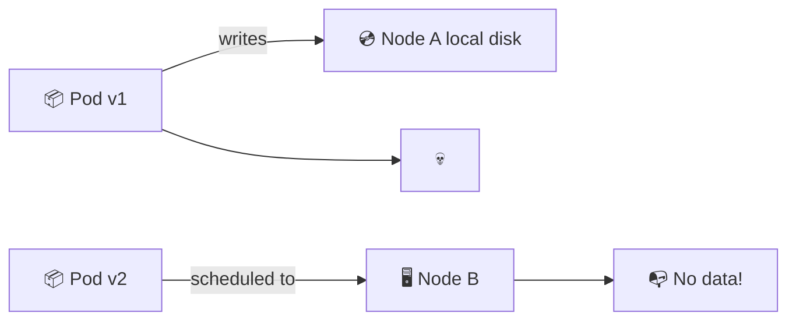
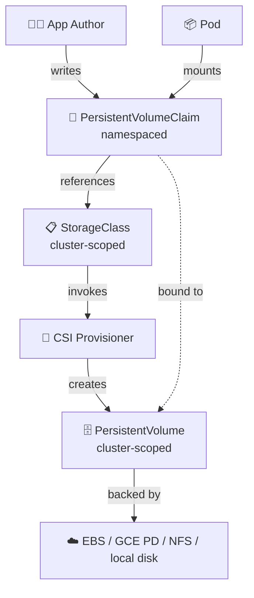
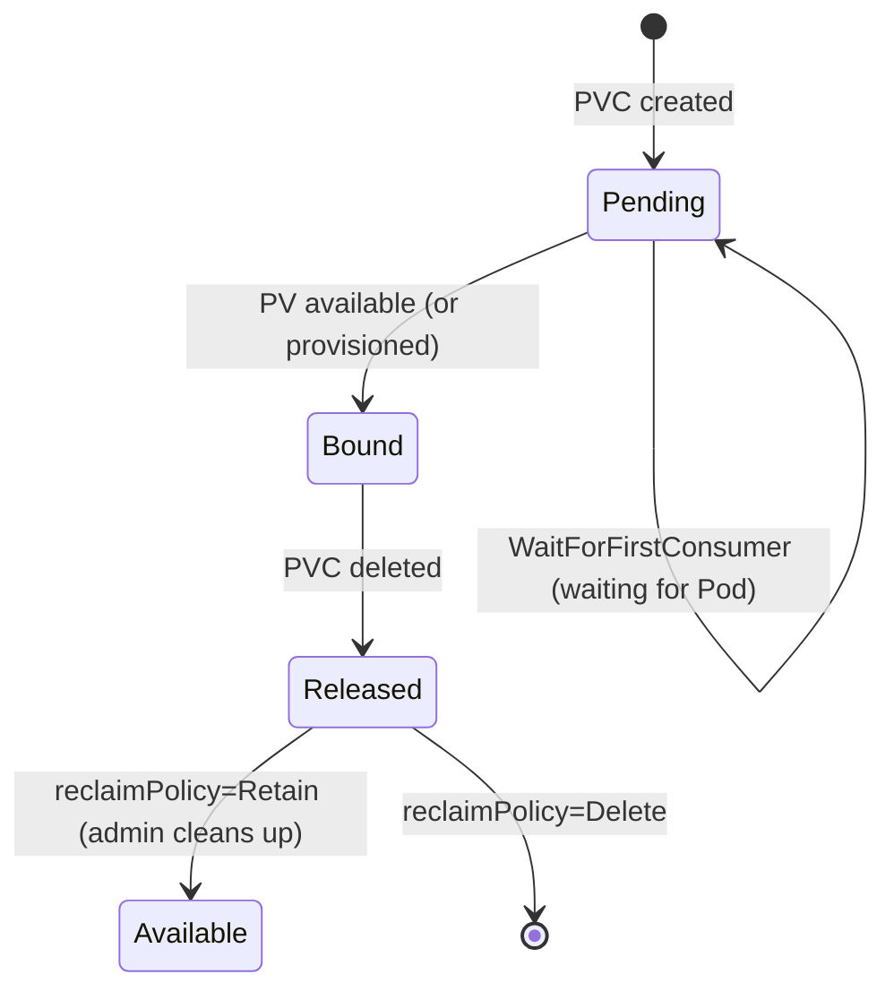
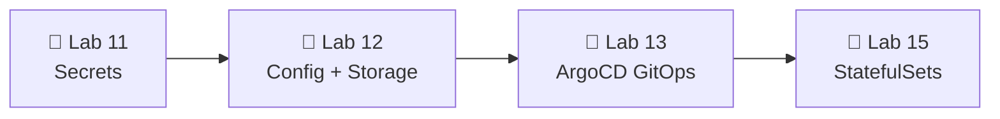

# 📌 Lecture 12 — Configuration & Storage: ConfigMaps and Persistent Volumes

## 📍 Slide 1 – 💾 Welcome to Config + Storage

* 🌍 **Lecture 11 hid your secrets** in Kubernetes Secrets + OpenBao. But not every value is a secret — log levels, feature flags, DB hostnames, NGINX configs — these belong in **ConfigMaps**.
* 📦 **The 12-Factor rule (Factor III):** "Store config in the environment, not in the code." One image, three environments, zero rebuilds.
* 💾 And then there's **state**. Containers are ephemeral; user uploads, database files, and visit counters need storage that **survives a pod restart**. Enter `PersistentVolumeClaim`.
* 🎯 This lecture: ConfigMaps (injection patterns + immutability), PVs/PVCs (claim model + dynamic provisioning), and the hot-reload trap.
* 🔗 **Tie-in to Lab 12:** add a `config.json` ConfigMap mounted as a file, an env-var ConfigMap injected via `envFrom`, and a PVC-backed `/data/visits` counter that survives `kubectl delete pod`.



---

## 📍 Slide 2 – 🎯 Learning Outcomes

| # | Outcome |
|---|---------|
| 1 | 📋 Create ConfigMaps from literals, files, and YAML; pick the right injection pattern |
| 2 | 🚪 Inject config three ways: single env var, `envFrom`, volume mount |
| 3 | 🔒 Use `immutable: true` ConfigMaps where appropriate; understand the perf win + hot-reload cost |
| 4 | 💾 Tell `PersistentVolume` (cluster-scoped) from `PersistentVolumeClaim` (namespaced) |
| 5 | 🤖 Use `StorageClass` for dynamic provisioning; pick the right `AccessMode` and `reclaimPolicy` |
| 6 | 🔄 Implement hot-reload via checksum annotation, Reloader, or app-level fsnotify |

**Tech stack pinned for May 2026:** Kubernetes **1.36 "Haru"** (released Apr 22 2026). CSI drivers: **AWS EBS CSI**, **GCE PD CSI**, **local-path-provisioner** (for `kind`). ConfigMap immutability stable since **1.21**. `ReadWriteOncePod` GA since **1.29**. VolumeSnapshot GA since **1.20**.

---

## 📍 Slide 3 – ❓ Why Baked-In Config Is Bad

Imagine you bake `DATABASE_URL=postgres://prod-db:5432/app` into the image. Now:

* 🔄 **Three environments → three image builds.** CI runs 3× per merge. Test coverage on dev image ≠ prod image.
* 🐛 **One typo, one rebuild.** Want to lower `LOG_LEVEL` from `DEBUG` to `INFO`? Build, scan, sign, push, deploy. 10 minutes for a string change.
* 💀 **Secrets in image layers.** `docker history` reveals every `ENV DB_PASSWORD=...`. Layers stay in the registry forever.
* 🚦 **Promotion ≠ promotion.** "Dev container goes to prod" — except dev's image has dev's config, so you actually rebuild for prod. The artifact you tested is not the artifact you ship.

> 🔥 **The 12-Factor App** (Heroku, 2011) made this universal: **the artifact is the same across environments; configuration is injected at runtime**. Containers + Kubernetes operationalize that rule with ConfigMaps and Secrets.

---

## 📍 Slide 4 – 📋 What a ConfigMap Actually Is

A `ConfigMap` is a **namespaced** Kubernetes object holding non-confidential key-value data. The API is in core `v1` (stable since 1.2 — older than most of your students).

```yaml
apiVersion: v1
kind: ConfigMap
metadata:
  name: app-config
  namespace: dev
data:
  LOG_LEVEL: "info"
  CACHE_TTL: "3600"
  config.yaml: |              # ← multi-line file content
    server:
      port: 8080
      timeout: 30s
binaryData:                   # ← base64 for non-UTF-8 (rare)
  tls.crt: <base64-blob>
```

* 📏 **Size limit: 1 MiB** per object (etcd value limit). Hit it? Split into multiple ConfigMaps or use a real config-distribution system.
* 🚫 **Not encrypted at rest by default.** Anyone with `get configmap` RBAC reads everything. Plain text in etcd.
* ❌ **Not for secrets.** DB passwords, API keys, TLS keys → `Secret` (Lecture 11). Even though `Secret` is also base64 in etcd, the RBAC verbs and audit story are separate.

---

## 📍 Slide 5 – 🛠️ Three Ways to Create One

```bash
# 1️⃣ From literals — fastest for one-off values
kubectl create configmap app-config \
  --from-literal=LOG_LEVEL=info \
  --from-literal=CACHE_TTL=3600

# 2️⃣ From a file — preserves structure (nginx.conf, prometheus.yml)
kubectl create configmap nginx-config \
  --from-file=nginx.conf=./nginx.conf

# 3️⃣ From an env-file — bulk import .env-style config
kubectl create configmap app-env --from-env-file=./prod.env

# 4️⃣ From YAML — the only one that belongs in git
kubectl apply -f configmap.yaml
```

> ✅ **In real life only `4️⃣` is used.** `create` is for ad-hoc debugging. Everything in production is declarative YAML in a Helm chart or Kustomize overlay, applied via GitOps (Lecture 13).

---

## 📍 Slide 6 – 🚪 Injection Pattern 1: Single Env Var

```yaml
spec:
  containers:
    - name: web
      env:
        - name: LOG_LEVEL                  # ← env var name in the container
          valueFrom:
            configMapKeyRef:
              name: app-config
              key: LOG_LEVEL               # ← key inside the ConfigMap
              optional: false              # ← pod won't start if key missing
```

When to use it:
* 🎯 You want to **rename** the env var (`LOG_LEVEL` in CM → `APP_LOG_LEVEL` in container)
* 🎯 You only need **a couple of keys** from a large ConfigMap
* 🎯 You want explicit per-key control over `optional` behavior

> ⚠️ **Env vars are baked at pod start.** Update the ConfigMap, the running pod still sees the old value until it restarts. Always.

---

## 📍 Slide 7 – 🚪 Injection Pattern 2: `envFrom` (Bulk)

```yaml
spec:
  containers:
    - name: web
      envFrom:
        - configMapRef:
            name: app-env           # ← every key becomes an env var
            optional: false
        - secretRef:
            name: app-secrets       # ← Secrets work the same way
        - prefix: APP_              # ← optionally prefix all keys
          configMapRef:
            name: feature-flags
```

* 🚀 **One line per source.** All keys in `app-env` become env vars verbatim.
* 🚫 **Invalid env-var names are silently skipped** (e.g. keys with dots or leading digits). Stick to `[A-Z_][A-Z0-9_]*`.
* 🏷️ **`prefix`** namespaces a ConfigMap when two sources have colliding keys.

> 🔥 **Gotcha:** `envFrom` does *not* let you rename or filter keys. If your ConfigMap has 30 keys, the container gets all 30 env vars. Curate the ConfigMap, not the injection.

---

## 📍 Slide 8 – 🚪 Injection Pattern 3: Volume Mount

```yaml
spec:
  volumes:
    - name: config-vol
      configMap:
        name: nginx-config
        items:                      # ← optional: project specific keys
          - key: nginx.conf
            path: nginx.conf
            mode: 0644
  containers:
    - name: nginx
      volumeMounts:
        - name: config-vol
          mountPath: /etc/nginx     # ← whole dir, files auto-update
        # ✅ OR with subPath: single file, but NO auto-update:
        # - name: config-vol
        #   mountPath: /etc/nginx/nginx.conf
        #   subPath: nginx.conf
```

* 📁 **Whole-directory mount** → kubelet reflects ConfigMap updates within ~`kubelet --sync-frequency` (default 60s) + cache TTL. Files appear via a `..data` symlink swap (atomic).
* 🚫 **`subPath` is a one-shot copy** — file is materialized once at pod start and **never updates**. Trade-off: clean mount path, but lose live-reload.
* 🎚️ **`defaultMode` / `mode`** control file permissions (default `0644`).

---

## 📍 Slide 9 – 🔒 Immutable ConfigMaps (Stable in 1.21)

```yaml
apiVersion: v1
kind: ConfigMap
metadata:
  name: app-config-v3
immutable: true                     # ← cannot be edited; can only be deleted+recreated
data:
  LOG_LEVEL: "info"
  CACHE_TTL: "3600"
```

Why it exists:
* ⚡ **Perf:** kubelet stops `watch`ing the ConfigMap. At 10k Pods × 20 ConfigMaps = 200k fewer watches.
* 🛡️ **Safety:** prevents accidental edits. `kubectl edit configmap app-config-v3` fails with "field is immutable".

The pattern:
* 🏷️ **Version in the name** — `app-config-v1`, `app-config-v2`, …
* 🔁 **Deployment references the versioned name** — bumping `app-config-v2 → v3` is a Deployment template change → rolling update for free.
* 🗑️ **Cleanup old versions** with a GC job once nothing references them.

> 🔥 **Trade-off:** immutable kills hot-reload. If your app reads the file on a timer, immutable is fine. If you want zero-restart config swaps, stick with mutable + the patterns on Slide 16.

---

## 📍 Slide 10 – 📊 ConfigMap vs Secret — Quick Diff

| Aspect | `ConfigMap` | `Secret` |
|---|---|---|
| API kind | `v1.ConfigMap` | `v1.Secret` (typed: `Opaque`, `kubernetes.io/tls`, …) |
| Storage in etcd | Plain text | Base64-encoded (NOT encryption — encryption-at-rest needs `EncryptionConfiguration`) |
| Audience | Non-sensitive config | Passwords, tokens, certs |
| RBAC verb | `get configmaps` | `get secrets` (usually more restricted) |
| Volume tmpfs? | No (regular fs) | Yes (mounted as `tmpfs`, never touches disk) |
| Size limit | 1 MiB | 1 MiB |
| Immutable field | ✅ since 1.21 | ✅ since 1.21 |

> 🔥 **Rule of thumb:** if losing it tomorrow would force you to file a security incident, it's a Secret.

---

## 📍 Slide 11 – 💾 Section Break — Why Storage is Hard

The container model is **immutable + ephemeral**:
* 📦 Pod dies → its writable layer dies with it
* 🔄 Rolling update → new pod, fresh empty filesystem
* 🧭 Pod rescheduled to another node → previous node's local disk unreachable

For **stateless** workloads (web, API) that's perfect. For **stateful** workloads (DB, file uploads, queues) it's a disaster:



Kubernetes' answer: **decouple the storage object from the pod**. The pod claims storage by name; whichever node runs the pod, the volume follows it.

---

## 📍 Slide 12 – 🏗️ The PV / PVC / StorageClass Trio



* 💾 **PVC (PersistentVolumeClaim)** — the *request*. "I want 10Gi, RWO, fast SSD." Lives in a namespace. Written by app authors.
* 🗄️ **PV (PersistentVolume)** — the *resource*. Cluster-scoped (no namespace). Created by an admin (static) or provisioner (dynamic).
* 📋 **StorageClass** — the *template*. "Here's how to provision new PVs of type `fast-ssd`." Cluster-scoped.

> 🎯 **Mental model:** PVC is to PV what a Pod is to a Node. The pod doesn't pick a node; the scheduler does. The PVC doesn't pick a PV; the binder does.

---

## 📍 Slide 13 – 🤖 Static vs Dynamic Provisioning

**Static (pre-1.6 style, still valid):** an admin pre-creates PVs; PVCs bind to one that fits.

```yaml
# Admin creates this once
apiVersion: v1
kind: PersistentVolume
metadata: {name: pv-data-01}
spec:
  capacity: {storage: 10Gi}
  accessModes: [ReadWriteOnce]
  hostPath: {path: /mnt/data}        # ← demo only; never in prod
```

**Dynamic (default since 1.6):** PVC names a `StorageClass`; the cluster auto-provisions a PV.

```yaml
apiVersion: storage.k8s.io/v1
kind: StorageClass
metadata: {name: fast-ssd}
provisioner: ebs.csi.aws.com         # ← AWS EBS CSI driver
parameters:
  type: gp3
  iops: "3000"
  throughput: "125"
reclaimPolicy: Delete
volumeBindingMode: WaitForFirstConsumer    # ← bind only when a Pod uses the PVC
allowVolumeExpansion: true
```

> 🔥 **`WaitForFirstConsumer`** is what you want in multi-AZ clusters. Without it, the PV is provisioned in zone X but the Pod ends up scheduled to zone Y — and `kubectl describe pod` reads `volume node affinity conflict`. Welcome to debugging EBS at midnight.

---

## 📍 Slide 14 – 🔓 Access Modes

| Mode | Abbrev | Meaning | Typical backend |
|---|---|---|---|
| `ReadWriteOnce` | RWO | Mountable RW by one **node** (multiple Pods on that node OK) | EBS, GCE PD, Azure Disk |
| `ReadOnlyMany` | ROX | Mountable RO by many nodes | NFS, S3-CSI, content-distribution |
| `ReadWriteMany` | RWX | Mountable RW by many nodes simultaneously | NFS, EFS, Azure Files, CephFS |
| `ReadWriteOncePod` | RWOP | Mountable RW by exactly **one Pod** in the whole cluster | Any CSI driver since K8s 1.29 GA |

* 🔒 **`ReadWriteOncePod`** (GA in K8s 1.29) is stricter than RWO — RWO permits N pods on the same node; RWOP is exactly one pod, cluster-wide. Use for leader-election, single-writer DBs.
* 🧨 **Cloud block storage is RWO only.** EBS, GCE PD, Azure Disk — they're block devices; the cloud kernel can't share them RW across hosts.
* 📡 **Need RWX?** That's NFS, EFS, Azure Files, or CephFS. Slower, more expensive, eventually-consistent in places.

---

## 📍 Slide 15 – ♻️ Reclaim Policies

When a PVC is deleted, what happens to the underlying disk?

| Policy | Behavior | When to use |
|---|---|---|
| `Delete` | PV and the backing disk are deleted (cloud volume vanishes) | Default for cloud SC; OK for caches & scratch |
| `Retain` | PV remains; disk untouched. Operator must clean up manually | Databases, anything with valuable data |
| `Recycle` | `rm -rf /thevolume/*` then makes PV available again | ⚠️ **Deprecated**, NFS/hostPath only, unsupported on CSI — don't use |

```yaml
spec:
  persistentVolumeReclaimPolicy: Retain    # ← override the StorageClass default per-PV
```

> 🔥 **Production rule:** for any PVC that holds business data, set `Retain` and write a documented runbook for cleanup. `Delete` is convenient until the day you delete a namespace and lose 200 GB of customer uploads.

---

## 📍 Slide 16 – 🔄 Hot Reload — Three Strategies

ConfigMap updates **don't restart pods**. Pods keep their startup snapshot of env vars; volume-mounted files do update (eventually) but most apps don't `inotify`-watch their config. Three workable patterns:

**1. Pod restart on config change (the GitOps way) — checksum annotation:**
```yaml
spec:
  template:
    metadata:
      annotations:
        checksum/config: {{ include "myapp.configmapHash" . }}
```
Helm computes the hash; any change to the CM changes the annotation → Deployment rollout → fresh pods. Clean, declarative, GitOps-native.

**2. Reloader controller** — `stakater/Reloader` watches ConfigMaps and Secrets, then patches owning Deployments/StatefulSets to trigger a rollout. Zero app code changes. Set an annotation: `reloader.stakater.com/auto: "true"`.

**3. App-level in-place reload:**
* Mount ConfigMap as a volume (not env var, not subPath).
* App watches the file with `fsnotify` (Go), `inotify` (Linux), or a 30s polling loop.
* On change → re-read, swap config atomically, log it. NGINX, Envoy, Prometheus, Loki all do this natively.

> ⚠️ **`subPath` mounts never auto-update.** This is the #1 "my hot reload isn't working" cause.

---

## 📍 Slide 17 – 📸 VolumeSnapshots (GA in 1.20)

Backups inside Kubernetes — CSI-driver-backed.

```yaml
# 1. Take a snapshot of a PVC
apiVersion: snapshot.storage.k8s.io/v1
kind: VolumeSnapshot
metadata: {name: data-snap-2026-05-26}
spec:
  volumeSnapshotClassName: csi-aws-ebs
  source:
    persistentVolumeClaimName: app-data
---
# 2. Restore by creating a new PVC from the snapshot
apiVersion: v1
kind: PersistentVolumeClaim
metadata: {name: app-data-restored}
spec:
  accessModes: [ReadWriteOnce]
  resources: {requests: {storage: 10Gi}}
  dataSource:
    name: data-snap-2026-05-26
    kind: VolumeSnapshot
    apiGroup: snapshot.storage.k8s.io
```

* 📸 **`VolumeSnapshot`** (namespaced) + **`VolumeSnapshotContent`** (cluster) mirror the PVC/PV duality.
* 🧰 Needs a CSI driver with snapshot support: AWS EBS CSI ✅, GCE PD CSI ✅, local-path-provisioner ❌.
* 🆕 **K8s 1.36** (Apr 2026) promoted **VolumeGroupSnapshot to GA** — atomic multi-PVC snapshots for apps that span volumes (e.g., DB + WAL).

---

## 📍 Slide 18 – ☁️ CSI Drivers in 2026

| Driver | Backend | Access | Snapshot | Expand | Notes |
|---|---|---|---|---|---|
| `ebs.csi.aws.com` | AWS EBS | RWO, RWOP | ✅ | ✅ | gp3 default in new clusters |
| `efs.csi.aws.com` | AWS EFS | RWX | ❌ | n/a | NFSv4, pay per GB+IOPS |
| `pd.csi.storage.gke.io` | GCE PD | RWO, RWOP | ✅ | ✅ | regional PD = ROX/RWX flavors |
| `disk.csi.azure.com` | Azure Disk | RWO, RWOP | ✅ | ✅ | similar to EBS |
| `file.csi.azure.com` | Azure Files | RWX | ✅ | ✅ | SMB or NFS protocol |
| `rancher.io/local-path` | host disk | RWO | ❌ | ❌ | the default in `kind`/k3d/Rancher |

* 🔌 **CSI (Container Storage Interface)** went GA in K8s 1.13. Every modern storage driver is CSI. In-tree drivers (`kubernetes.io/aws-ebs`, etc.) are all migrated or deprecated.
* 🧪 **For Lab 12**, you'll use `local-path-provisioner` (k3d's default StorageClass). It's RWO-only, no snapshots — fine for the visits counter; not what you'd run in prod.

---

## 📍 Slide 19 – 📜 PVC State Machine



States to recognize in `kubectl get pvc`:
* ⏳ **Pending** — no matching PV yet. With `WaitForFirstConsumer`, normal until a Pod consumes it.
* ✅ **Bound** — happy path.
* 🔓 **Released** — PVC gone, PV (and data) still around — for `Retain` policies.
* ❌ **Failed** — provisioner returned an error. `kubectl describe pvc <name>` → check Events.

> 🐛 **The classic stuck PVC:** `Pending` forever because no `StorageClass` is the cluster default and the PVC didn't specify `storageClassName`. Fix: `kubectl patch storageclass <name> -p '{"metadata":{"annotations":{"storageclass.kubernetes.io/is-default-class":"true"}}}'`.

---

## 📍 Slide 20 – 🧱 Stateful vs Stateless (Foreshadowing Lec 15)

| Property | Stateless | Stateful |
|---|---|---|
| K8s workload | `Deployment` | `StatefulSet` (Lecture 15) |
| Pod identity | Interchangeable, `app-7d-xyz` | Sticky: `db-0`, `db-1`, `db-2` |
| Storage | `emptyDir` or none | One PVC per pod, auto-provisioned by `volumeClaimTemplates` |
| Scale | `kubectl scale --replicas=10` instantly | Ordered: 0 → 1 → 2 → … with health-check gating |
| Examples | Web frontend, API, worker | Postgres, Kafka, Elasticsearch, Redis cluster |

* 🍱 **Today's lab uses a Deployment + PVC** — fine for one replica writing to one volume.
* 🪜 **Lecture 15 introduces StatefulSet** — when you need three Postgres replicas, each with its own PVC, surviving rescheduling with stable network IDs.

> 💡 **Pets vs cattle** (Bill Baker, 2012): Deployments are cattle, StatefulSets are pets. Both are valid; pick by data model.

---

## 📍 Slide 21 – 🚫 Anti-Patterns

1. ❌ **Secrets in ConfigMaps** — git-tracked + plain etcd + broad RBAC. Use a `Secret` or External Secrets Operator.
2. ❌ **`hostPath` volumes in production** — ties the pod to a node, breaks rescheduling, exfiltration risk. Demo-only.
3. ❌ **`emptyDir` for data you care about** — wiped when the pod dies. Use a PVC.
4. ❌ **`Delete` reclaim on prod data** — one `kubectl delete pvc` and the AWS volume is gone. Set `Retain` for anything precious.
5. ❌ **`subPath` mount + expecting hot reload** — never happens. Use directory mount.
6. ❌ **RWX cloud block volumes** — they don't exist. EBS/PD/Azure Disk are RWO. You need EFS/Files/NFS.
7. ❌ **ConfigMap > 1 MiB** — etcd refuses. Split it, or move bulk data to a real config server.
8. ❌ **Mutable ConfigMaps in hot paths** — every Pod watches; at 10k Pods it's a control-plane drag. Use `immutable: true` + versioned names.
9. ❌ **No `volumeBindingMode: WaitForFirstConsumer`** in multi-AZ clusters — guaranteed zone mismatch.
10. ❌ **Trusting "Bound"** — that means a PV exists, not that the data is what you wrote. Backups (VolumeSnapshot) live on a different axis.

---

## 📍 Slide 22 – 🎯 Key Takeaways

1. 📋 **ConfigMap = non-sensitive runtime config**, namespaced, 1 MiB cap, plain in etcd. Three injection patterns: single env, `envFrom`, volume mount.
2. 🔒 **`immutable: true`** (stable since 1.21) is the perf + safety move for high-Pod-count clusters; pairs with versioned names.
3. 💾 **PVC (namespaced, the request) ↔ PV (cluster-scoped, the resource) ↔ StorageClass (the template).** Dynamic provisioning is the default since 1.6.
4. 🔓 **AccessModes:** RWO (one node), ROX (many RO), RWX (many RW, file-only), RWOP (one Pod, since K8s 1.29 GA). Cloud block storage is RWO/RWOP only.
5. ♻️ **Reclaim policy:** `Retain` for data you'd cry over; `Delete` for caches; never `Recycle`.
6. 🔄 **Hot reload:** checksum annotation OR Reloader OR app-level fsnotify on a directory mount. `subPath` blocks updates.
7. 📸 **VolumeSnapshot GA since 1.20**; group-snapshot GA in 1.36 for multi-volume apps.
8. 🧱 **Deployment + PVC** is fine for one replica. Three Postgres replicas need a **StatefulSet** (Lecture 15).

> 💬 *"The artifact is the same across environments; configuration is injected at runtime."* — the 12-Factor App, still right after 15 years.

---

## 📍 Slide 23 – 🚀 What Comes Next

**📚 Next lecture: *Lecture 13 — GitOps with ArgoCD*** — because every ConfigMap, every PVC, every value file we wrote today belongs in git, and **ArgoCD** is what watches git and reconciles the cluster.

* 🔄 The **pull model**: cluster pulls desired state from git, not CI pushing into the cluster
* 🤖 **ArgoCD 3.4** — App-of-Apps, sync waves, ApplicationSets
* 🎯 Drift detection: "the cluster diverged from git → fix it (or alert me)"
* ↩️ Rollback = `git revert`

**🔬 Lab 12 deliverables (10 + 2.5 bonus):**
* Visits counter persisted to `/data/visits` (file-based, survives restart)
* ConfigMap mounted as `config.json` file + a second ConfigMap injected via `envFrom`
* PVC for `/data`, verified by `kubectl delete pod` → counter survives
* `k8s/CONFIGMAPS.md` with command outputs + screenshots
* Bonus: hot-reload via checksum annotation, Reloader, or fsnotify; document `subPath` limitation



> 🌊 From hardcoded values to dynamic, persistent, GitOps-managed config — one volume at a time.

---

## 📚 Resources

* 📕 *Kubernetes Up & Running* (3e, 2022) — Burns, Beda, Hightower — ConfigMap + Volume chapters
* 📕 *Kubernetes Patterns* (2e, 2023) — Bilgin Ibryam & Roland Huß — pattern catalog
* 🌐 [kubernetes.io/docs/concepts/configuration/configmap](https://kubernetes.io/docs/concepts/configuration/configmap/)
* 🌐 [kubernetes.io/docs/concepts/storage/persistent-volumes](https://kubernetes.io/docs/concepts/storage/persistent-volumes/)
* 🌐 [kubernetes.io/docs/concepts/storage/volume-snapshots](https://kubernetes.io/docs/concepts/storage/volume-snapshots/)
* 🌐 [12factor.net/config](https://12factor.net/config) — Factor III
* 🌐 [github.com/stakater/Reloader](https://github.com/stakater/Reloader) — auto-restart on CM/Secret change
* 🌐 [github.com/kubernetes-sigs/aws-ebs-csi-driver](https://github.com/kubernetes-sigs/aws-ebs-csi-driver)
* 🌐 [github.com/rancher/local-path-provisioner](https://github.com/rancher/local-path-provisioner) — default in `kind`/k3d

**🎓 Quiz:** post-lecture quiz feeds the weeks 10-12 leaderboard window.
