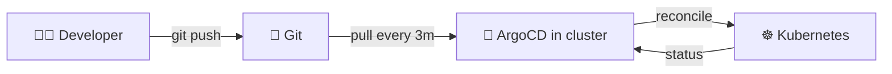
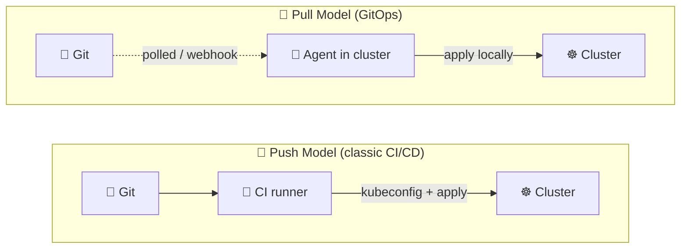
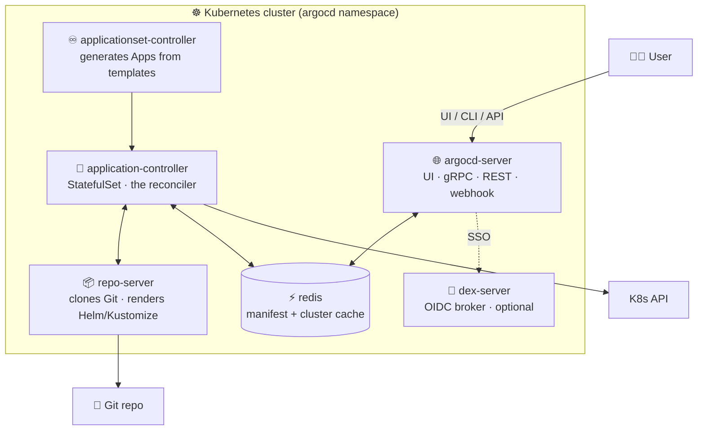
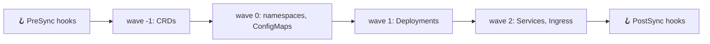
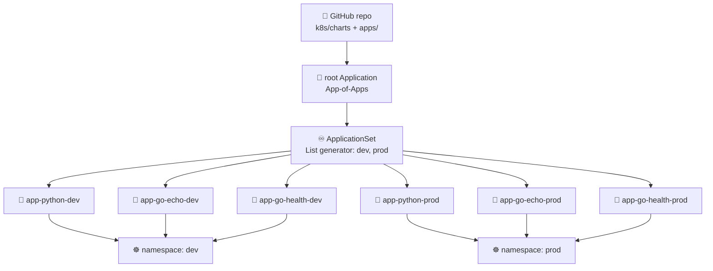
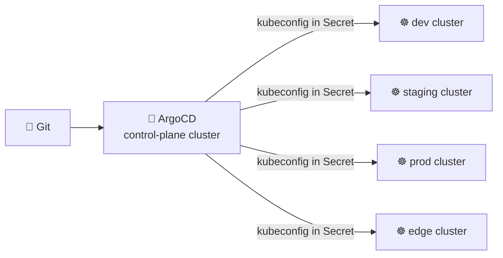
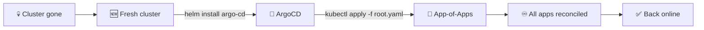
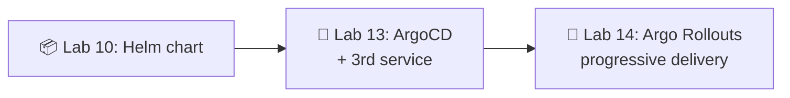

# 📌 Lecture 13 — GitOps with ArgoCD: Git as the Source of Truth

## 📍 Slide 1 – 🚀 Welcome to GitOps

* 🌍 **Lectures 9-12 left you with a real cluster** running a Helm-packaged Python service plus a Go echo sidecar, with secrets in OpenBao and persistent state on PVCs. Deployment is still you typing `helm upgrade` from a laptop.
* 🤖 **GitOps** moves that "laptop" *inside* the cluster: an agent watches Git, pulls the desired state, and reconciles continuously. No more out-of-band `kubectl` from human hands.
* 🎯 This lecture: the GitOps mental model + **ArgoCD 3.4** (May 2026) architecture, Application + ApplicationSet CRDs, sync policies, the App-of-Apps pattern, and why this only becomes interesting once you have **three** services.
* 🔗 **Tie-in to Lab 13:** install ArgoCD via Helm, declare Application manifests for `app-python`, `app-go-echo`, **and a third `app-go-health` plumbing service**, and let an `ApplicationSet` generate dev + prod copies from one template.



---

## 📍 Slide 2 – 🎯 Learning Outcomes

| # | Outcome |
|---|---------|
| 1 | 📜 Name the **four OpenGitOps principles** and explain why each matters |
| 2 | 🔁 Contrast **push vs pull** deployment models on credential surface, drift, audit |
| 3 | 🏗️ Sketch the **ArgoCD 3.4 architecture**: argocd-server, application-controller, repo-server, redis, Dex |
| 4 | 📝 Read & write an **Application** CRD with `source`, `destination`, `syncPolicy` |
| 5 | 🌳 Compose deployments with the **App-of-Apps pattern** and **ApplicationSet** generators |
| 6 | 🛡️ Reason about **sync waves, hooks, self-heal, prune**, and when manual sync wins |

**Tech stack pinned for May 2026:** **ArgoCD 3.4.x** (GA early May 2026; **2.x is EOL since November 2025 with the 3.2 release**), Kubernetes **1.36** "Haru", a single GitOps repo on GitHub, deployments driven from your Lab 10 Helm chart.

---

## 📍 Slide 3 – ❓ Why Pull Beats Push

You shipped Lab 12 with a CI workflow that runs `helm upgrade` against the cluster. It works. So why move?

* 🔑 **Credentials.** CI needs a kubeconfig with cluster-admin to apply. That kubeconfig lives in GitHub secrets, on developer laptops, in scripts. Every leak is a cluster compromise.
* 🌊 **Drift.** Someone `kubectl edit`s a Deployment at 3am to "fix" a prod incident. The Helm chart in Git no longer matches reality. Next `helm upgrade` silently overwrites the fix.
* 🕵️ **Audit.** "Who scaled the prod ingress to 12 replicas?" — the answer lives in shell history, not Git.
* 🚑 **Recovery.** Cluster gone? With push CI/CD you re-run pipelines; with GitOps you `helm install argo-cd && kubectl apply -f root.yaml` and the cluster rebuilds itself.

> 🔥 **Hot take:** GitOps is not a tool, it's an *inversion of control*. The cluster reaches out to Git; nothing reaches into the cluster.

---

## 📍 Slide 4 – 📜 The Four OpenGitOps Principles

The CNCF **OpenGitOps** working group ratified four principles (v1.0.0). Memorize them — every GitOps tool implements these or it isn't GitOps.

1. 📝 **Declarative** — the desired state is described in declarative form (YAML, HCL, …), never imperative commands.
2. 🔒 **Versioned and Immutable** — that desired state is stored with full history; you can always check out commit `abc123` and know what was deployed.
3. 🤖 **Pulled Automatically** — software agents *inside* the target system pull the desired state. Nobody pushes from outside.
4. ♾️ **Continuously Reconciled** — agents compare actual to desired and automatically act to converge them. Forever.

> 💡 **Litmus test:** if you removed the agent, would the cluster drift from Git? If yes, you have GitOps. If no (because nothing was reconciling), you just had "YAML in Git".

---

## 📍 Slide 5 – 🔄 Push vs Pull, Side by Side



| Aspect | 🔄 Push CI/CD | 🚀 Pull GitOps |
|--------|--------------|----------------|
| Cluster credentials | Live in CI secrets | Stay inside the cluster |
| Drift detection | None — CI runs and forgets | Continuous, every 3 minutes |
| Audit trail | CI logs (rotated) | `git log` (immutable) |
| Disaster recovery | Re-run pipeline against new cluster | Install agent, point at Git |
| What blocks deploy | CI runner availability | Git availability |

---

## 📍 Slide 6 – 🛠️ The GitOps Tools Landscape

| Tool | Lineage | Sweet spot |
|------|---------|-----------|
| **ArgoCD** | CNCF graduated (Intuit, 2018) | UI-first, declarative `Application` CRD, sync waves |
| **Flux CD v2** | CNCF graduated (Weaveworks, 2020) | CLI-first, controller-per-resource (Kustomization, HelmRelease, GitRepository) |
| **Rancher Fleet** | SUSE/Rancher | Massive multi-cluster fleets (edge, retail) |
| **Codefresh GitOps** | Octopus (commercial) | ArgoCD under the hood + dashboards, drift, multi-team RBAC |
| **Jenkins X** | CD Foundation | If you must keep Jenkins |

The course uses **ArgoCD** because (a) it's the most-adopted GitOps tool, (b) the UI makes drift visible to non-Kubernetes humans, and (c) the `Application` + `ApplicationSet` CRDs map cleanly onto multi-environment + multi-service teaching.

> 🔥 **Honest take:** Flux is genuinely good — lighter, more Unix-y, no UI to keep alive. Pick it for a homelab. ArgoCD wins in enterprises because dashboards are how non-engineers tell that deploys worked.

---

## 📍 Slide 7 – 🏗️ ArgoCD Architecture



* 🌐 **argocd-server** — UI + gRPC/REST API; what humans and CI talk to. Stateless, horizontally scalable.
* 🔄 **application-controller** — the heart. Reconciles every `Application` CR against the cluster. StatefulSet for sharding across many clusters.
* 📦 **repo-server** — clones Git, runs `helm template` / `kustomize build`, returns rendered manifests to the controller. Stateless, cache-heavy.
* ⚡ **redis** — caches manifests, cluster state, Git revisions. Lose it and reconciliation gets slow, not wrong.
* 🔐 **dex-server** — OIDC broker for GitHub/Google/Okta SSO. Optional; you can use local users for labs.
* ♾️ **applicationset-controller** — turns one template + a generator into many `Application` CRs.

---

## 📍 Slide 8 – 📝 The Application CRD

The atomic unit of ArgoCD is one `Application` — a pointer to "this folder in this repo at this revision goes into this namespace on this cluster".

```yaml
apiVersion: argoproj.io/v1alpha1
kind: Application
metadata:
  name: app-python-dev
  namespace: argocd
  finalizers:
    - resources-finalizer.argocd.argoproj.io   # 🗑️ cascade-delete K8s resources on app delete
spec:
  project: default
  source:
    repoURL: https://github.com/innodevops/student-repo.git
    targetRevision: main                         # 📌 branch, tag, or commit SHA
    path: k8s/charts/app-python
    helm:
      valueFiles:
        - values-dev.yaml
  destination:
    server: https://kubernetes.default.svc        # in-cluster
    namespace: dev
  syncPolicy:
    automated:
      prune: true                                 # 🗑️ delete resources removed from Git
      selfHeal: true                              # 💚 revert manual cluster edits
    syncOptions:
      - CreateNamespace=true
```

Key concepts:
* 📌 **`targetRevision: main`** vs **a SHA**: branch tracks moving HEAD (fine for dev), SHA pins exactly (use for prod releases).
* 🗑️ **`finalizers:`** without this, deleting the `Application` leaves K8s resources orphaned.
* 🔄 **`automated`** turns on auto-sync; *omitting it* makes the app **manual-sync** (click the button or `argocd app sync`).

---

## 📍 Slide 9 – 🔄 Sync, Health, and Operation States

Every `Application` tracks two orthogonal states, plus a transient operation.

| Sync state | Meaning |
|------------|---------|
| 🟢 **Synced** | Live cluster matches the rendered manifests |
| 🟡 **OutOfSync** | Drift between Git and cluster (good — you can see it!) |
| ❓ **Unknown** | Repo unreachable or controller hasn't checked yet |

| Health state | Meaning |
|--------------|---------|
| 💚 **Healthy** | All resources report ready (Deployment available, Pod running, etc.) |
| 🔵 **Progressing** | Rollout in flight, give it a minute |
| 🔴 **Degraded** | Something failed (CrashLoopBackOff, schema error) |
| ⚪ **Suspended** | Hooks paused or app paused |
| 🚫 **Missing** | Resource not in cluster |

> 💡 An app can be **Synced + Degraded** (Git correctly says "deploy this broken Pod") or **OutOfSync + Healthy** (cluster runs fine but doesn't match Git). Both states are diagnostic.

ArgoCD 3.4 added an **Operation Status** filter alongside Sync and Health, so the UI now shows "what's actively syncing right now" — useful during incident response.

---

## 📍 Slide 10 – 🎚️ Sync Policies: Manual, Auto, Self-Heal, Prune

```yaml
syncPolicy:
  automated:
    prune: true
    selfHeal: true
    allowEmpty: false       # 🛡️ refuse to apply if rendering produced 0 manifests
  syncOptions:
    - CreateNamespace=true
    - ServerSideApply=true
    - PruneLast=true
    - ApplyOutOfSyncOnly=true
  retry:
    limit: 5
    backoff:
      duration: 5s
      factor: 2
      maxDuration: 3m
```

* 🔄 **No `automated:` block → manual sync.** The UI shows a big "SYNC" button. Standard for prod.
* 🤖 **`automated:` → auto-sync** on every Git change *and* every periodic reconcile (default 3 min).
* 💚 **`selfHeal: true`** — revert manual cluster edits back to Git state. Disable if a controller owns the resource (e.g., HPA writing `replicas`).
* 🗑️ **`prune: true`** — delete resources that were *removed* from Git. Without it, deleting a file in Git leaves an orphan running.
* ⚙️ **`ServerSideApply=true`** uses K8s server-side apply (avoids the "last-applied-configuration" annotation problem and plays nice with HPA/VPA).

> ⚠️ **Sane default for prod:** manual sync, `prune: false`, `selfHeal: false`. Humans review every change. Dev environments turn everything on.

---

## 📍 Slide 11 – 🌊 Sync Waves and Hooks

Some resources must come up *before* others — CRDs before custom resources, namespaces before everything, DB migrations before the app.

```yaml
metadata:
  annotations:
    argocd.argoproj.io/sync-wave: "-1"           # 🌊 negative = earlier, positive = later (default 0)
    argocd.argoproj.io/hook: PreSync             # 🪝 PreSync | Sync | PostSync | SyncFail | PostDelete
    argocd.argoproj.io/hook-delete-policy: HookSucceeded
```



* 🪝 **Hooks** are arbitrary K8s resources (typically Jobs) that run at lifecycle points. Classic use: a `pre-sync` Job that runs `flyway migrate` before the new app pods start.
* 🌊 **Waves** order Sync-phase resources. The controller applies everything at wave `N`, waits for health, then proceeds to `N+1`.
* 🧹 **`hook-delete-policy`** keeps the cluster tidy — `HookSucceeded` deletes the Job once it finishes green.

---

## 📍 Slide 12 – 🌳 The App-of-Apps Pattern

Bootstrap problem: ArgoCD manages your apps via `Application` CRs in the `argocd` namespace. But who manages *those* `Application` CRs? Answer: another `Application`.

```
gitops-repo/
└── apps/
    ├── root.yaml              # 👈 the "App-of-Apps" — points at ./apps
    ├── app-python.yaml        # Application CR for the Python service
    ├── app-go-echo.yaml       # Application CR for the Go echo service
    └── app-go-health.yaml     # Application CR for the Go health service
```

```yaml
# root.yaml — the seed
apiVersion: argoproj.io/v1alpha1
kind: Application
metadata:
  name: root
  namespace: argocd
spec:
  project: default
  source:
    repoURL: https://github.com/innodevops/student-repo.git
    targetRevision: main
    path: apps                                # 📂 directory full of Application YAMLs
  destination:
    server: https://kubernetes.default.svc
    namespace: argocd
  syncPolicy:
    automated: { prune: true, selfHeal: true }
```

One `kubectl apply -f root.yaml` and ArgoCD discovers and syncs every child `Application`. The cluster is now self-managing — recovery = reinstall ArgoCD + reapply `root.yaml`.

---

## 📍 Slide 13 – 🧬 The 3-Service ArgoCD Topology



* 🐍 **app-python** — your Lab 2 → Lab 10 service (FastAPI).
* 🦫 **app-go-echo** — Lab 9's plumbing companion (Go HTTP echo).
* 💚 **app-go-health** — **new in Lab 13** — a tiny Go health/static service shipped as plumbing. It exists *specifically* so that ApplicationSet and App-of-Apps stop being toy patterns.

> 💡 **Pedagogical point:** ApplicationSet with one service is just `kubectl apply` with extra steps. With **two** services in **two** environments it starts to earn its keep. With **three services × two environments = six Applications** generated from one 30-line template, the value is obvious. Hence Lab 13 introduces `app-go-health`.

---

## 📍 Slide 14 – ♾️ ApplicationSet: One Template, Many Apps

```yaml
apiVersion: argoproj.io/v1alpha1
kind: ApplicationSet
metadata:
  name: all-apps
  namespace: argocd
spec:
  generators:
    - matrix:
        generators:
          - list:                       # 1️⃣ which apps
              elements:
                - { svc: app-python,     path: k8s/charts/app-python }
                - { svc: app-go-echo,    path: k8s/charts/app-go-echo }
                - { svc: app-go-health,  path: k8s/charts/app-go-health }
          - list:                       # 2️⃣ which environments
              elements:
                - { env: dev,  autoSync: "true" }
                - { env: prod, autoSync: "false" }
  template:
    metadata:
      name: '{{svc}}-{{env}}'
    spec:
      project: default
      source:
        repoURL: https://github.com/innodevops/student-repo.git
        targetRevision: main
        path: '{{path}}'
        helm:
          valueFiles:
            - 'values-{{env}}.yaml'
      destination:
        server: https://kubernetes.default.svc
        namespace: '{{env}}'
      syncPolicy:
        syncOptions: [CreateNamespace=true]
```

The **matrix** generator cross-joins two **list** generators → 3 services × 2 envs = **6 `Application` CRs** materialized automatically. Add a fourth service? One line in the first list.

---

## 📍 Slide 15 – 🧰 The Other ApplicationSet Generators

| Generator | What it iterates over | Use when |
|-----------|----------------------|----------|
| **List** | Inline literals | Small, stable set (dev/staging/prod) |
| **Cluster** | All clusters registered with ArgoCD | Multi-cluster fleet rollouts |
| **Git (Directory)** | Folders under a path in a repo | One folder per app — auto-discover new apps |
| **Git (File)** | YAML/JSON files at a path | One config file per tenant |
| **Matrix** | Cross-join of two generators | Apps × environments, services × clusters |
| **Merge** | Inner-join + override | Layer cluster-specific overrides onto a base list |
| **SCM Provider** | Repos in a GitHub/GitLab org | Org-wide GitOps for many service repos |
| **Pull Request** | Open PRs in a repo | Ephemeral preview environments per PR |
| **Cluster Decision** | A CRD that picks clusters | External logic decides where apps land |
| **Plugin** | An HTTP service you write | Anything the above can't express |

> 💡 **Lab 13 uses List + Matrix.** Bonus: try the Git Directory generator pointed at `k8s/charts/` — adding a new chart folder automatically creates an Application.

---

## 📍 Slide 16 – 🔐 RBAC and AppProjects

Out of the box, every `Application` lands in the `default` project, which can deploy anywhere. In production, you carve up access with **AppProject** CRs.

```yaml
apiVersion: argoproj.io/v1alpha1
kind: AppProject
metadata:
  name: team-payments
  namespace: argocd
spec:
  sourceRepos:
    - https://github.com/innodevops/payments-*    # 🔒 only these repos
  destinations:
    - namespace: payments-*                       # 🔒 only these namespaces
      server: https://kubernetes.default.svc
  clusterResourceWhitelist:                       # 🔒 only these cluster-scoped kinds
    - group: ''
      kind: Namespace
  namespaceResourceBlacklist:
    - group: ''
      kind: ResourceQuota
  roles:
    - name: deployer
      policies:
        - p, proj:team-payments:deployer, applications, sync, team-payments/*, allow
      groups: [innodevops:payments]
```

The user-facing **argocd-rbac-cm** ConfigMap maps OIDC groups → roles → permissions. Pattern: one project per team, no `default` use in prod, OIDC groups for human role bindings.

---

## 📍 Slide 17 – 🔒 Secrets in a GitOps World

GitOps demands "everything in Git" — but plaintext secrets in Git are an immediate breach. Three production-grade answers:

| Pattern | How it works | Tradeoff |
|---------|--------------|----------|
| **Sealed Secrets** (Bitnami) | Controller in cluster has a keypair; you `kubeseal` a `Secret` into a `SealedSecret` (cipher in YAML); controller decrypts on apply | Per-cluster key — re-seal on rotation |
| **External Secrets Operator + OpenBao** | Git holds only an `ExternalSecret` *reference*; ESO pulls the actual value from OpenBao/Vault/SSM at sync time | Operational dependency on the secret store |
| **SOPS + KMS / age** | Files encrypted in Git with `sops`; ArgoCD plugin (`argocd-vault-plugin`, `helm-secrets`) decrypts at render time | Plugin install + key management |

Your **Lab 11** already wired OpenBao + ESO — that's the pattern Lab 13 keeps using. The `Secret` resources never appear in Git; only `ExternalSecret` references do.

> 🔥 **Never** put plaintext secrets in the GitOps repo, even private. Git history is forever.

---

## 📍 Slide 18 – 🌐 Multi-Cluster GitOps

ArgoCD running in **one** "control plane" cluster can manage **many** workload clusters.



* 🔑 Each target cluster is registered with `argocd cluster add <context>`, which creates a `Secret` with its kubeconfig in the `argocd` namespace.
* ♾️ The **Cluster generator** in an ApplicationSet pairs this with one template → "deploy this app to every cluster labelled `tier=edge`".
* ⏸️ **ArgoCD 3.4 added Pause Reconciliation per cluster** — flip a toggle to freeze a misbehaving cluster mid-incident without touching others.

> 💡 **Hub-and-spoke vs federated:** the hub model is simpler; for >50 clusters or strict network isolation, consider **Argo CD Argocd in each cluster** + a higher-level fleet controller (Fleet, Cluster API).

---

## 📍 Slide 19 – 🩺 Observing ArgoCD Itself

ArgoCD ships Prometheus metrics out of the box (your Lab 8 stack scrapes them).

| Metric | Watch for |
|--------|-----------|
| `argocd_app_info{sync_status="OutOfSync"}` | Persistent drift |
| `argocd_app_info{health_status="Degraded"}` | Broken apps |
| `argocd_app_sync_total{phase="Failed"}` | Failing syncs |
| `argocd_app_reconcile_bucket` | Reconcile latency histogram |
| `argocd_cluster_api_resource_objects` | Object count growth (scaling signal) |
| `argocd_redis_request_total` | Cache load |

Wire these into your Lab 8 Grafana stack and alert on **Degraded > 5 minutes** and **OutOfSync > 30 minutes** (auto-sync clusters should never sit OutOfSync that long; if they do, something is wedged).

---

## 📍 Slide 20 – 🚨 Disaster Recovery: Git Is Your Backup

The clean GitOps recovery story:



1. 🆕 Provision a new cluster (Terraform / kubeadm / kOps).
2. 📦 `helm install argo-cd argo/argo-cd -n argocd --create-namespace`.
3. 🌱 `kubectl apply -f apps/root.yaml`.
4. ☕ Wait. Everything else is in Git.

> ⚠️ **What's *not* recovered:** stateful data (PVCs, databases). GitOps restores **configuration**, not **state**. Pair with PV snapshots / Velero / database backups. This is the same lesson Labs 11 (secrets) and 12 (PVCs) hammered.

---

## 📍 Slide 21 – 🧰 Anti-Patterns and Common Bugs

1. ❌ **`kubectl apply` to a GitOps-managed namespace** — self-heal reverts it in 3 minutes and you wasted everyone's afternoon debugging. Make the change in Git.
2. ❌ **`prune: true` on first install** — if your `path:` is wrong, ArgoCD happily deletes everything it doesn't see. Start with `prune: false`, verify, then turn it on.
3. ❌ **Pointing `targetRevision` at `HEAD`** for prod — silent rollouts on every commit to `main`. Use a tag or `release/*` branch.
4. ❌ **Storing plaintext `Secret` YAML in Git** — even in a private repo. Use Sealed Secrets / ESO / SOPS.
5. ❌ **One giant `Application` for "everything"** — you lose per-app sync, per-app status, per-app RBAC. One Application per (service × env).
6. ❌ **Mixing repo concerns** — keep **app code** and **GitOps manifests** in *different* repos (or at least different paths). CI builds the image; GitOps repo references the new tag.
7. ❌ **Forgetting the finalizer** — orphan resources on `kubectl delete app` are how rogue Pods survive in production for a year.
8. ❌ **selfHeal on resources with HPA** — the HPA writes `spec.replicas`, ArgoCD reverts it, fight ensues. Use `ignoreDifferences:` on `/spec/replicas`.

---

## 📍 Slide 22 – 🌍 GitOps in the Wild

* 🏢 **Intuit** open-sourced ArgoCD in 2018 to manage ~2,000 microservices; they run hundreds of deploys/day off Git.
* 🛒 **BlackRock, Adobe, Tesla, Red Hat OpenShift GitOps** all ship ArgoCD in production at large scale.
* 📊 **CNCF Annual Survey 2024:** GitOps adoption is the #1-growing K8s practice; **ArgoCD** is the dominant tool in survey responses.
* 🏷️ **Argo project graduated CNCF** in December 2022 — same maturity tier as Kubernetes, Prometheus, Envoy.
* 🚀 **ArgoCD 3.4** (early May 2026) doubled down on Day-2 ops: pause-per-cluster, richer UI filters, K8s version stored as Major.Minor.Patch, OpenTelemetry tracing through the OIDC flow.

> 📊 **One number:** Codefresh's 2024 "State of GitOps" survey put **ArgoCD at ~70% of GitOps deployments**, Flux at ~25%, the rest in the long tail.

---

## 📍 Slide 23 – 🎯 Key Takeaways

1. 📜 **GitOps = the four OpenGitOps principles** — declarative, versioned, pulled, continuously reconciled. Everything else is implementation detail.
2. 🚀 **Pull beats push** on credential surface, drift detection, and disaster recovery.
3. 🏗️ **ArgoCD = 5 components** — argocd-server, application-controller, repo-server, redis, dex (+ applicationset-controller). Memorize their jobs.
4. 📝 **Application CRD** is the atomic unit; **App-of-Apps** bootstraps the whole cluster from one seed.
5. ♾️ **ApplicationSet** with Matrix(List × List) generates N services × M environments from one template — the lab pattern.
6. 🎚️ **Sync policy = manual for prod, automated+selfHeal+prune for dev** is a sane default.
7. 🌊 **Sync waves + hooks** order DB migrations before app pods and cleanup jobs after.
8. 🔒 **Secrets stay out of Git** — Sealed Secrets / ESO + OpenBao / SOPS. Forever.

> 💬 *"Operations by Pull Request."* — Kelsey Hightower

---

## 📍 Slide 24 – 🚀 What Comes Next

**📚 Next lecture: *Progressive Delivery with Argo Rollouts*** — because once GitOps deploys instantly on merge, the next question is *"how do we deploy **carefully**?"* Canary, blue-green, automated analysis.

* 🐤 **Canary deployments** — 10% → 50% → 100%, gated by Prometheus queries
* 🔵 **Blue-green** — two full stacks, instant switch, instant rollback
* 📊 **AnalysisTemplate** — metric-driven promotion / rollback
* 🔄 **Argo Rollouts** vs Flagger — the two contenders

**🔬 Lab 13 deliverables:**
* Install ArgoCD 3.4 via Helm in your cluster
* Add a **third service** — `app-go-health` (plumbing files shipped in `app_go_health/`)
* Declare an `Application` for each of the **three** services, in **two** environments (dev + prod) — six Applications total
* Replace the six with one **ApplicationSet** using a Matrix(List, List) generator
* Wrap the lot in an **App-of-Apps** root Application
* Auto-sync dev with selfHeal + prune; keep prod **manual**
* Bonus 2.5 pts: switch to the Git Directory generator that auto-discovers new charts under `k8s/charts/*`



> 🌊 From "I deployed it" to "Git deployed it" — one merge at a time.

---

## 📚 Resources

* 📕 *GitOps and Kubernetes* — Yuen, Matyushentsev, Ekenstam, Suen (Manning, 2021) — canonical book on the pattern
* 📕 *The Path to GitOps* — Christian Hernandez (Red Hat e-book, 2024) — short, practitioner-focused
* 🌐 [argo-cd.readthedocs.io](https://argo-cd.readthedocs.io/en/stable/) — official ArgoCD docs
* 🌐 [opengitops.dev](https://opengitops.dev/) — the four principles, ratified
* 🌐 [github.com/argoproj/argo-cd](https://github.com/argoproj/argo-cd) — source + releases
* 🌐 [fluxcd.io](https://fluxcd.io/) — the other CNCF GitOps tool worth knowing
* 🌐 [Codefresh "State of GitOps" survey](https://codefresh.io/) — annual adoption numbers
* 🎙️ KubeCon 2023 keynote — *"GitOps at Intuit"* (Hong Wang) — origin story of ArgoCD at scale

**🎓 Quiz:** Post-lecture quiz feeds the weeks 13-16 leaderboard window.
