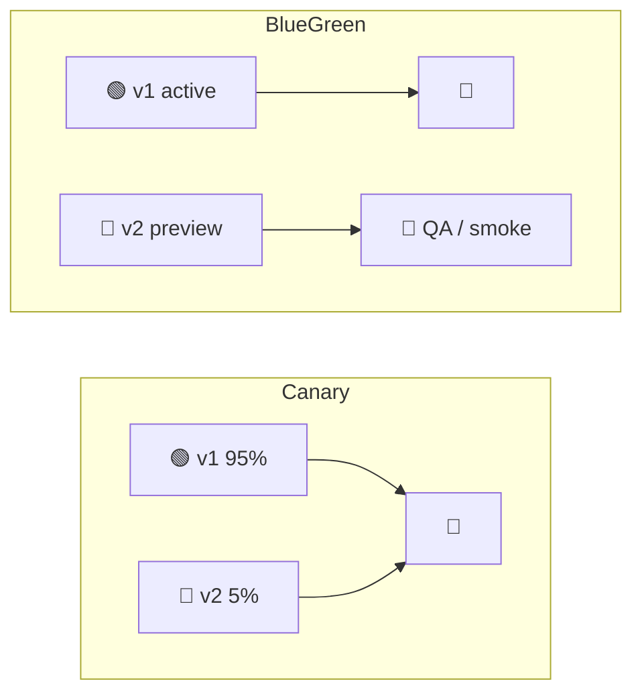
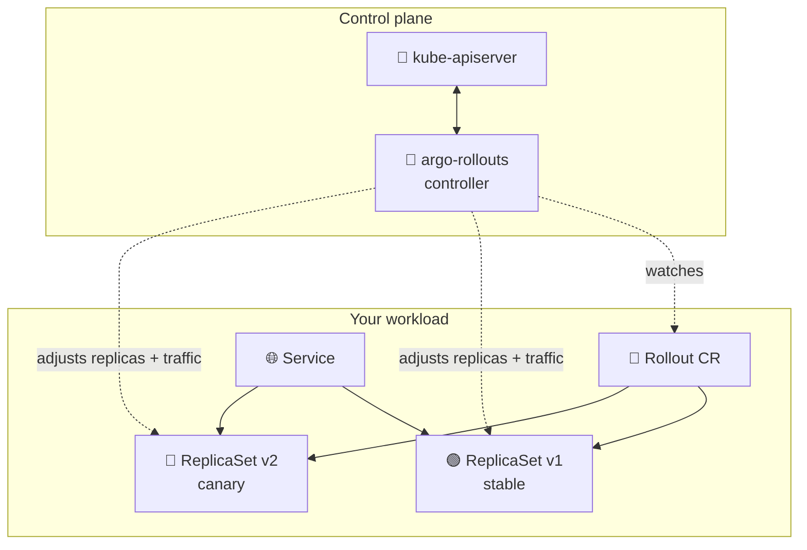
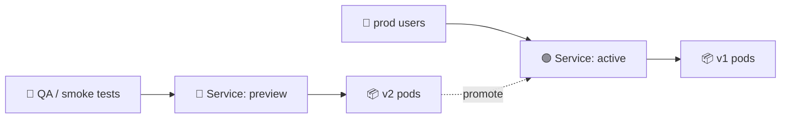
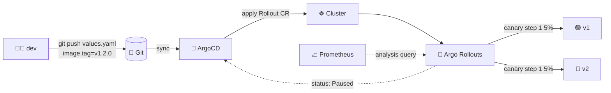
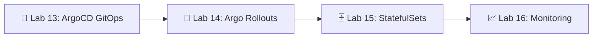

# 📌 Lecture 14 — Progressive Delivery with Argo Rollouts

## 📍 Slide 1 – 🚦 Welcome to Progressive Delivery

* 🌍 **Lecture 13 gave you GitOps.** ArgoCD now reconciles your Helm chart from Git → cluster within seconds. Source of truth: solved.
* 🐤 **But "deployed" ≠ "released".** A Deployment rollout swaps pods 25% at a time and stops measuring once they pass a liveness probe. The bug in your new image — the one that only fires on 5% of requests — ships to 100% of users.
* 🎯 This lecture: replace `kind: Deployment` with `kind: Rollout`, shape traffic in steps (5% → 25% → 50% → 100%), let metrics decide whether to promote or roll back — **without a human watching Grafana at 5pm on a Friday**.
* 🔗 **Tie-in to Lab 14:** convert your Lab 13 chart from `Deployment` → `Rollout`, ship a canary strategy with 5-step traffic shifting, then add a parallel blue-green strategy with a `previewService`, plus a Prometheus `AnalysisTemplate` for the bonus.

```mermaid
flowchart LR
  Deploy[📦 kind: Deployment] -->|25% pods at a time, no metrics| Done[✅ "Deployed"]
  Rollout[🐤 kind: Rollout] -->|5% → 25% → 50% → 100%<br/>+ metric gates| Released[🎯 "Released"]
```

---

## 📍 Slide 2 – 🎯 Learning Outcomes

| # | Outcome |
|---|---------|
| 1 | 🧠 Distinguish **deployment** (pods running new code) from **release** (users seeing new code) |
| 2 | 🐤 Configure **canary** strategy with step-based weights and pauses |
| 3 | 🔵 Configure **blue-green** strategy with an `activeService` + `previewService` |
| 4 | 📊 Write an **`AnalysisTemplate`** that queries Prometheus and auto-promotes / auto-aborts |
| 5 | 🚦 Wire **traffic shaping** through NGINX, ALB, Istio, or the Gateway API plugin |
| 6 | 🛠️ Drive a rollout with `kubectl argo rollouts`: `get`, `promote`, `abort`, `retry`, `undo` |

**Tech stack pinned for May 2026:** **Argo Rollouts 1.8.4** (released Feb 13 2026), Kubernetes **1.36 "Haru"**, ArgoCD **3.4.x** for sync, **Prometheus 3.11.3** (or the 3.5 LTS line) for analysis metrics — the same Prometheus you stood up in Lab 8.

---

## 📍 Slide 3 – ❓ Deployment ≠ Release

You've done rolling updates with vanilla `kind: Deployment` since Lab 9. So why isn't that enough?

* 🩺 **A Deployment's only health signal is the pod-level probe.** Once readiness flips green, K8s shifts traffic. Memory leaks, slow tail-latency, and 5xx spikes are invisible to the rollout.
* ⏱️ **`maxSurge` and `maxUnavailable` are blunt knobs.** 25% maxSurge means by minute 2 you have 25% of traffic on a broken build with no automatic abort.
* 🌐 **No traffic-percentage primitive.** Deployments can't say "send 5% of HTTP requests to v2 and 95% to v1." They can only say "swap N pods."
* 🚫 **No metric integration.** You can't tell a Deployment "rollback if 5xx > 1%." You can tell *Argo Rollouts* exactly that.

> 🔥 **Hot take:** "Move fast and break things" is dead; "move fast with feedback loops" is what elite teams actually do. Progressive delivery is what closes the loop between *deploying code* and *knowing it works*.

---

## 📍 Slide 4 – 📜 A Brief History of Progressive Delivery

* 📅 **2010** — Humble & Farley publish *Continuous Delivery*. The book introduces the canary metaphor as "deploy to one server, watch, then promote."
* 📅 **2014** — Netflix open-sources **Spinnaker** with built-in canary stages backed by their internal "ACA" (Automated Canary Analysis).
* 📅 **2018** — Netflix + Google open-source **Kayenta**, the statistical canary judge (Mann-Whitney U test). Spinnaker users get free metric-driven promotion.
* 📅 **2019** — Weaveworks coin the term **"progressive delivery"** in a blog post; they ship **Flagger** alongside Flux. Argo team ships **Argo Rollouts** alongside ArgoCD the same year.
* 📅 **2021** — Argo Rollouts **v1.0 GA**. Joins ArgoCD/Workflows/Events as CNCF incubating, graduates to Graduated in **December 2022**.
* 📅 **2024** — CNCF archives the **SMI** (Service Mesh Interface) spec. **Gateway API** + the Argo Rollouts Gateway API plugin become the recommended path for traffic shaping across meshes.
* 📅 **2026 (Feb 13)** — **Argo Rollouts 1.8.4** — bug fix release for blue-green analysis (the "premature success when ReplicaSet becomes unsaturated" issue), plus dependency bumps.

> 📚 *The Phoenix Project* and *Accelerate* both call progressive delivery the single largest predictor of low change-failure-rate. DORA 2024: elite teams have **< 5% change failure rate**; low performers sit at 15-30%.

---

## 📍 Slide 5 – 🐤 Canary, Blue-Green, and Friends

Four strategies you'll see in the wild. Argo Rollouts implements the first two natively; the others are application-level patterns.

| Strategy | How it shifts traffic | Resource cost | Best for |
|----------|----------------------|----------------|----------|
| 🟰 **Rolling** (built into Deployment) | Pod count, not request % | 1x + maxSurge | Stateless, low-risk changes |
| 🐤 **Canary** | Request % via traffic router (5 → 25 → 50 → 100) | 1x + canary replicas | Most production deploys |
| 🔵 **Blue-Green** | All-or-nothing service swap | 2x during cutover | DB migrations, breaking API changes |
| 🚩 **Feature flag** | Per-request, in-app | 1x (it's just code) | Internal-only or A/B experiments |



> 🤔 **Think:** which strategy would you pick for a database schema change that v1 can't read? *(Hint: not canary — 5% of users hitting a broken schema is still 5% of users.)*

---

## 📍 Slide 6 – 🤖 Argo Rollouts: the Drop-in Replacement

Argo Rollouts is a Kubernetes controller that owns a CRD called `Rollout`. The shape is 95% identical to `Deployment` — same `replicas`, `selector`, `template` — plus a `strategy` block where you declare *how* to roll out.



* 📜 **One CRD replaces Deployment.** The controller manages two ReplicaSets — stable and canary — and shifts pods and/or HTTP weights between them.
* 🔧 **kubectl plugin** (`kubectl argo rollouts`) gives you `get`, `promote`, `abort`, `retry`, `undo`, plus the `dashboard` subcommand for a local UI.
* 🤝 **ArgoCD already speaks Rollouts.** Once you swap your chart's `Deployment` for a `Rollout`, ArgoCD's UI renders rollout progress as a first-class object — no extra config.

> 🔥 **Migration is mechanical:** `sed -i 's/kind: Deployment/kind: Rollout/' templates/*.yaml`, then add a `strategy:` block. The pod template is unchanged.

---

## 📍 Slide 7 – 📜 A Minimal Rollout

```yaml
apiVersion: argoproj.io/v1alpha1
kind: Rollout
metadata:
  name: lab14-app
spec:
  replicas: 10
  selector:
    matchLabels:
      app: lab14-app
  template:
    metadata:
      labels:
        app: lab14-app
    spec:
      containers:
        - name: web
          image: ghcr.io/innodevops/lab2-app:v1.2.0
          ports: [{containerPort: 8080}]
          readinessProbe:
            httpGet: {path: /ready, port: 8080}
  strategy:
    canary:
      steps:
        - setWeight: 5
        - pause: {duration: 2m}
        - setWeight: 25
        - pause: {duration: 5m}
        - setWeight: 50
        - pause: {duration: 5m}
        - setWeight: 100
```

* 🐤 **Step list runs top-to-bottom.** Each `setWeight` is a percentage of *replicas* (with no traffic router) or a percentage of *requests* (with a traffic router — see slide 12).
* ⏸️ **`pause: {duration: ...}`** is a timed pause; **`pause: {}`** is a hard manual gate — the rollout sits there until you run `kubectl argo rollouts promote`.
* 🎯 **No `setWeight: 100` needed at the end** — the controller assumes 100% is the final state once all steps complete.

---

## 📍 Slide 8 – ⏱️ What Happens at Each Step

| Time | Stable replicas | Canary replicas | Traffic to v2 | State |
|------|----------------|----------------|----------------|-------|
| T+0   | 10 | 0 | 0%   | `Progressing` (deploying canary) |
| T+0.5 | 10 | 1 | 5%   | `Paused` (2 min timer) |
| T+2.5 | 8  | 3 | 25%  | `Paused` (5 min timer) |
| T+7.5 | 5  | 5 | 50%  | `Paused` (5 min timer) |
| T+12.5 | 0 | 10 | 100% | `Healthy` ✅ |

* 🔄 **Without a traffic router,** Argo Rollouts approximates the weight by adjusting the *replica count ratio* and relying on the `Service`'s round-robin to do the rest. At 10 replicas total, 5% rounds to 1 canary pod.
* 🚦 **With a traffic router** (NGINX, ALB, Istio, Gateway API), the weight is exact at the HTTP layer regardless of replica count. You can run 5% traffic on 10% of pods.
* 💥 **`Degraded`** appears if the canary ReplicaSet fails progress deadlines or an `analysis` step fails.

---

## 📍 Slide 9 – 🔵 Blue-Green Strategy

When you can't afford to mix versions — say, a backwards-incompatible schema migration — switch all traffic at once.

```yaml
strategy:
  blueGreen:
    activeService: lab14-app
    previewService: lab14-app-preview
    autoPromotionEnabled: false      # require manual `promote`
    scaleDownDelaySeconds: 300       # keep old pods 5 min for fast rollback
    prePromotionAnalysis:
      templates: [{templateName: smoke-tests}]
```



* 🟢 **`activeService`** is what production traffic uses. The selector is rewritten by the controller to point at the current "live" ReplicaSet.
* 🔵 **`previewService`** points at the new ReplicaSet — your QA team / smoke tests / synthetic monitors hit this URL.
* ⏪ **`scaleDownDelaySeconds`** keeps the old pods alive for N seconds post-promotion. Roll back instantly by running `kubectl argo rollouts undo` before the timer expires.

> ⚠️ **Cost reality:** during cutover you're running 2x the pods (active + preview), 2x the cluster cost for that window. Budget it.

---

## 📍 Slide 10 – 📊 AnalysisTemplate — Metric-Driven Decisions

The most powerful Argo Rollouts feature: define a query, a success condition, and a failure threshold. Reference it from a rollout step and the controller will *automatically* abort on regression.

```yaml
apiVersion: argoproj.io/v1alpha1
kind: AnalysisTemplate
metadata:
  name: success-rate
spec:
  args:
    - name: service-name
  metrics:
    - name: success-rate
      interval: 1m              # query every minute
      count: 5                  # take 5 samples
      successCondition: result[0] >= 0.99
      failureLimit: 2           # 2 failures → abort
      provider:
        prometheus:
          address: http://prometheus.monitoring:9090
          query: |
            sum(rate(http_requests_total{
              service="{{args.service-name}}",
              status!~"5.."
            }[2m]))
            /
            sum(rate(http_requests_total{
              service="{{args.service-name}}"
            }[2m]))
```

* 🎯 **`successCondition`** is a Go expression over `result` — Prometheus returns a `[]float64`, take index 0 for instant queries.
* ❌ **`failureLimit: 2`** means up to 2 failed measurements are tolerated; the third aborts the rollout.
* ⚠️ **`inconclusiveLimit`** (not shown) pauses (rather than aborts) when data is missing — useful if Prometheus is slow to scrape new pods.

---

## 📍 Slide 11 – 🔗 Hooking Analysis into a Canary

Drop an `analysis` step between weight changes. The rollout will not proceed until the analysis returns `Successful`.

```yaml
strategy:
  canary:
    steps:
      - setWeight: 5
      - pause: {duration: 2m}
      - analysis:
          templates: [{templateName: success-rate}]
          args:
            - name: service-name
              value: lab14-app-canary
      - setWeight: 25
      - analysis:
          templates: [{templateName: success-rate}]
          args:
            - name: service-name
              value: lab14-app-canary
      - setWeight: 100
```

Analysis outcomes:

| Result | Rollout action |
|--------|----------------|
| ✅ `Successful` | Move to next step |
| ❌ `Failed` | Auto-abort, scale canary down, reset traffic to stable |
| ⚠️ `Inconclusive` | Pause; resume manually with `promote` |
| 🐢 `Running` | Keep sampling until count or failureLimit reached |

> 🔥 **Pro tip:** also configure `analysis` as `backgroundAnalysis` at the spec level — it runs in parallel with every step from the moment it's started, so a regression mid-step aborts immediately rather than waiting for the next gate.

---

## 📍 Slide 12 – 🚦 Traffic Routing: Replica Ratio vs Real HTTP Weights

Without a traffic router, "5% traffic" is approximated by the replica count ratio. That's coarse and inaccurate at small N. A **traffic router** integration lets the controller program real HTTP weights into your ingress or mesh.

| Router | Resource Argo Rollouts edits | When |
|--------|------------------------------|------|
| 🌐 **NGINX Ingress** | A second `Ingress` with `nginx.ingress.kubernetes.io/canary: true` + `canary-weight` | Most common K8s ingress |
| 🚢 **AWS ALB** | `TargetGroupBinding` weight in the `ListenerRule` | EKS shops on managed ALB |
| 🕸️ **Istio** | `VirtualService` HTTP route weights | Existing Istio mesh |
| 🔗 **Linkerd** | Via the **SMI** TrafficSplit (legacy) or **Gateway API** (recommended) | Linkerd users |
| 🌉 **Gateway API plugin** | Native `HTTPRoute` weighted backends — works on any GW API impl | New deployments (mesh-agnostic) |

Example with NGINX:

```yaml
strategy:
  canary:
    canaryService: lab14-app-canary
    stableService: lab14-app-stable
    trafficRouting:
      nginx:
        stableIngress: lab14-app-ingress
    steps:
      - setWeight: 5
      - pause: {duration: 2m}
      - setWeight: 100
```

> 📚 **CNCF archived the SMI spec in 2024.** New work should target the **Kubernetes Gateway API** via the `argoproj-labs/rollouts-plugin-trafficrouter-gatewayapi` plugin — one plugin, any conformant mesh.

---

## 📍 Slide 13 – 🛠️ kubectl argo rollouts — The Survival Toolkit

```bash
# 📊 Live status — refreshes in place, shows weight, pods, analysis
kubectl argo rollouts get rollout lab14-app --watch

# ⏯️ Move past a manual `pause: {}`
kubectl argo rollouts promote lab14-app

# ⏩ Skip ALL remaining steps and go to 100% (use sparingly)
kubectl argo rollouts promote lab14-app --full

# 💥 Abort the in-progress rollout — traffic flips back to stable
kubectl argo rollouts abort lab14-app

# 🔁 Restart a Degraded rollout from step 0 (after you've fixed the image)
kubectl argo rollouts retry rollout lab14-app

# ⏪ Roll back to the previous stable ReplicaSet (after promotion)
kubectl argo rollouts undo lab14-app

# 🖥️ Local dashboard at http://localhost:3100
kubectl argo rollouts dashboard
```

> 🔧 **Tip:** alias the long command — `alias kr='kubectl argo rollouts'`. You'll thank yourself by mid-Lab-14.

---

## 📍 Slide 14 – 🔁 ArgoCD + Argo Rollouts — Full GitOps Loop

Lab 13 wired ArgoCD; Lab 14 swaps the workload type. ArgoCD treats the `Rollout` as a first-class resource, watching its `.status.phase` for `Healthy` / `Paused` / `Degraded`.



* ✅ ArgoCD reports the app `Healthy` *only* when the Rollout is `Healthy` — a paused canary shows as `Progressing`, an aborted one as `Degraded`. No more "synced but actually broken" footguns.
* 🚫 **Don't enable ArgoCD auto-sync `selfHeal: true` on the Rollout CR's `status` fields.** ArgoCD diffs spec only by default — but if you've widened that, you can fight the rollout controller.

---

## 📍 Slide 15 – 🐦 Flagger — The Other Option

Argo Rollouts isn't alone. **Flagger** (Weaveworks, now Flux subproject) is the other major progressive-delivery controller.

| | 🐤 **Argo Rollouts** | 🐦 **Flagger** |
|---|------------------------|----------------|
| Resource model | Replaces Deployment with `Rollout` CRD | Keeps your existing Deployment, adds `Canary` CR |
| Rollout shape | Explicit `steps:` list (you write each weight) | Declarative `stepWeight`/`maxWeight` — controller increments automatically |
| GitOps pairing | ArgoCD (same project family) | Flux CD (same project family) |
| Mesh support | Native: NGINX, ALB, Istio, Traefik, AppMesh, plugins (Gateway API, Contour, Consul…) | Native: Istio, Linkerd, AppMesh, Contour, NGINX, Gloo, Gateway API |
| Metric providers | Prometheus, Datadog, NewRelic, Wavefront, CloudWatch, Graphite, InfluxDB, Kayenta, Web | Prometheus, Datadog, CloudWatch, NewRelic, Graphite, custom webhooks |
| Manual gates | First-class (`pause: {}`) | Possible via webhook, less ergonomic |

> 🔥 **Rule of thumb:** if you're on ArgoCD, use Argo Rollouts. If you're on Flux, use Flagger. The two are spiritual siblings — same goals, slightly different ergonomics. This course uses Argo Rollouts because Lab 13 already stood up ArgoCD.

---

## 📍 Slide 16 – 🔥 Common Anti-Patterns

1. ❌ **Canary with no analysis.** A time-based pause "5 minutes at 5%" is just slow Russian roulette. Always wire an `AnalysisTemplate`.
2. ❌ **`successCondition: result[0] >= 0.95`.** Too lax — that allows a 5% error rate. Real SLOs are 99.9%+.
3. ❌ **No `failureLimit`.** Without it, a single Prometheus blip aborts every rollout. Default to `failureLimit: 2` or `3`.
4. ❌ **Selecting on `version: v1` labels.** Service selector + rollout label conflict — Argo Rollouts injects its own `rollouts-pod-template-hash` label and you'll break the service.
5. ❌ **`scaleDownDelaySeconds: 0` on blue-green.** Old pods are gone the instant you promote; if you find a bug 10 seconds later, there's nothing to roll back *to*.
6. ❌ **Mixing canary + database migration.** 5% of users hit v2 → v2 writes a column v1 can't read → 95% of users get 500s. Use blue-green for schema changes, with the migration as a pre-promotion analysis.
7. ❌ **Skipping the kubectl plugin in CI.** Your CI job runs `kubectl rollout status` (Deployment command), gets confused, and reports "success" while the canary is still at 5%. Use `kubectl argo rollouts status` instead.

---

## 📍 Slide 17 – 🏭 Progressive Delivery in the Wild

* 🎬 **Netflix** — pioneered automated canary analysis with Kayenta (2018, joint with Google). Every Spinnaker pipeline at Netflix gates production behind a statistical comparison of canary-vs-baseline metrics. Their canary "judge" uses a Mann-Whitney U test for time-series significance.
* 🏢 **Google** — uses canary + blue-green internally; one Borg job per region, with traffic-shifted releases across regions over hours, not minutes. SRE book chapter 8.
* 🐙 **GitHub** — ships a "preview" environment for every internal change before merge; production rollout is region-by-region with metric gates.
* 🐦 **Twitter (now X)** — public engineering blog (2023) on rolling out the timeline algorithm changes via 0.1% → 1% → 10% canaries with 24-hour observation windows.
* 💸 **Capital One** — case study (2022): moved from blue-green-only to canary + analysis after a $20M outage caused by an instant 100% promotion of a broken auth service.

> 📊 **DORA 2024:** organizations using progressive delivery report **41% lower change-failure rate** than those still on rolling Deployments.

---

## 📍 Slide 18 – 🎚️ Choosing Your Step Sizes

There's no universal "right" canary step list. Calibrate by **expected error budget** and **traffic volume**.

| Service type | Traffic | Recommended steps |
|--------------|---------|--------------------|
| 🌐 Internal admin tool | < 100 rpm | `25 → 50 → 100`, 2 min pauses |
| 🏬 Mid-traffic API | 1k-10k rpm | `5 → 25 → 50 → 100`, 5 min pauses + analysis |
| 🌍 High-traffic public service | > 100k rpm | `1 → 5 → 10 → 25 → 50 → 100`, 30 min pauses + background analysis |
| 💳 Payment / auth (high blast radius) | any | `1 → 5 → 25 → 50 → 100`, manual gates between EACH step + multi-window analysis |

* 📏 **Rule:** smaller first step + longer pause when the cost of a bad deploy is high. A 5% canary on a service handling 1M req/min still exposes 50,000 req/min to bugs.
* ⏱️ **Pause length** should be ≥ the analysis sample window (e.g., 5 min query rate → 5 min pause minimum) so the first analysis sees only canary traffic.

---

## 📍 Slide 19 – 🧪 Lab 14 in Detail

You'll build on the Helm chart from Lab 13 (ArgoCD-managed).

**Task 1 — Fundamentals (2 pts):** install Argo Rollouts controller + `kubectl argo rollouts` plugin + dashboard. Verify with `kubectl argo rollouts version`.

**Task 2 — Canary (3 pts):** convert `templates/deployment.yaml` → `templates/rollout.yaml`. Configure 5-step canary `20 → 40 → 60 → 80 → 100` with a manual gate after step 1. Trigger a rollout via image tag bump, promote through the dashboard, then abort mid-rollout and confirm traffic returns to stable.

**Task 3 — Blue-Green (3 pts):** add a second values file `values-bluegreen.yaml`. Configure `activeService` / `previewService`. Deploy v1, then v2, hit the preview service, promote, then immediately `undo` and watch the active service flip back.

**Task 4 — Documentation (2 pts):** write `k8s/ROLLOUTS.md` documenting both strategies, screenshots from the Argo Rollouts dashboard, CLI command reference, and your recommendation on which strategy to use for what.

**Bonus (+2.5 pts):** wire an `AnalysisTemplate` against the Prometheus you stood up in Lab 8. Use a `web` provider against `/health` as a low-bar option, or a real `prometheus` provider with `rate(http_requests_total{status=~"5.."}[2m])` for the full experience. Demonstrate **auto-rollback** by intentionally deploying an image that returns 500s.

> 🔗 **Carry-over to Lab 16:** the AnalysisTemplate you write here is exactly what Lab 16's "monitoring + alerting" picks up — Prometheus rules + rollout gates close the loop between *observe* and *react*.

---

## 📍 Slide 20 – 📊 Dashboard + Notifications

```bash
kubectl argo rollouts dashboard           # http://localhost:3100
```

The dashboard shows every Rollout in the cluster, its current step, the canary/stable replica counts, traffic weight, and the live status of any in-flight analysis. Three buttons matter: `Promote`, `Abort`, `Restart`.

For **notifications** (Slack, MS Teams, email), install `argo-rollouts-notifications` and define `NotificationConfiguration` triggers:

```yaml
apiVersion: notifications.argoproj.io/v1alpha1
kind: NotificationConfiguration
spec:
  triggers:
    - name: on-rollout-aborted
      condition: rollout.status.phase == 'Degraded'
      template: rollout-aborted
  templates:
    - name: rollout-aborted
      slack:
        attachments: |
          [{"title": "Rollout {{.rollout.metadata.name}} aborted",
            "color": "#E96D76"}]
```

> 🚨 **Production rule:** every team should get a Slack ping on `Degraded` rollouts. Silent failures are how you find out a week later that production has been on v1.1 because every promotion since auto-aborts.

---

## 📍 Slide 21 – ✨ What's New in Argo Rollouts 1.8.x

Argo Rollouts is a stable project — 1.8 is incremental refinement, not revolution.

* 🩹 **1.8.4 (Feb 13 2026)** — fix for "bluegreen analysis prematurely succeeds if new ReplicaSet becomes unsaturated" (PR #4604). Bumps `hashicorp/go-plugin` to 1.6.3. **This is the version to pin in Lab 14.**
* 🔌 **Plugin maturation** — the traffic-router and metric-provider plugin systems are now the recommended path for non-core integrations. Gateway API, Contour, kgateway, Consul plugins all live under `argoproj-labs/`.
* 📜 **`apisix` traffic router** GA earlier in the 1.8 line.
* 🏃 **Performance** — controller now uses informer caches more aggressively for large clusters (10k+ rollouts).
* 🚫 **Deprecation reminder:** the in-tree `smi` traffic router still works but is on borrowed time after CNCF archived the SMI spec. Move to Gateway API plugin for new work.

> 📚 **Source:** [Argo Rollouts releases](https://github.com/argoproj/argo-rollouts/releases). Pin to `v1.8.4` for stability; `v1.9` ships in mid-2026.

---

## 📍 Slide 22 – 🎯 Key Takeaways

1. 🐤 **A Rollout is a Deployment + a strategy.** Same pod template, different controller, vastly safer release.
2. 🎚️ **Canary shifts traffic in steps;** blue-green flips it all at once. Both are first-class in Argo Rollouts.
3. 📊 **`AnalysisTemplate` is the unlock.** Without metric gates, you've just slowed down a bad deploy; with them, you've automated rollback.
4. 🚦 **Traffic router > replica ratio** for accurate small percentages. NGINX for most, Gateway API plugin for mesh-agnostic.
5. 🧰 **`kubectl argo rollouts` is your daily driver** — `get --watch`, `promote`, `abort`, `undo`. Alias it.
6. 🔁 **ArgoCD + Argo Rollouts is the canonical GitOps + progressive delivery combo.** Lab 13 + Lab 14 sit together by design.
7. 🚫 **Avoid mixing canary with breaking changes.** 5% of users on an incompatible schema is still a bad day. Reach for blue-green.

> 💡 **The pattern:** Git push → ArgoCD sync → Rollout starts → analysis queries Prometheus → step or rollback. The whole loop runs without a human.

---

## 📍 Slide 23 – 🧠 The Mindset Shift

| 😰 Vanilla Deployment | 🐤 Progressive Delivery |
|---|---|
| "It rolled out, ship it" | "It rolled out *and the metrics held* — ship it" |
| `kubectl rollout undo` (manual) | `kubectl argo rollouts abort` (auto on regression) |
| 100% blast radius from minute 1 | 5% blast radius gated behind analysis |
| Friday deploys = scary | Friday deploys = same as Tuesday deploys |
| Rollback is a postmortem | Rollback is a controller decision |
| "Did it deploy?" | "Did it deploy *and release*?" |

---

## 📍 Slide 24 – 🚀 What Comes Next

**📚 Next lecture: *StatefulSets & Persistent Storage*** — because stateless rollouts are easy. Databases, Kafka, Elastic, Redis: those are different.

* 🗄️ **StatefulSets:** ordered, stable network identity, per-pod PVCs
* 💾 **PersistentVolumes & PersistentVolumeClaims:** the storage abstraction
* 🪣 **StorageClasses:** dynamic provisioning (gp3, ssd, nfs)
* 📦 **Volume snapshots & restore:** for backups inside K8s
* 🔄 **OnDelete vs RollingUpdate strategies:** why StatefulSet updates aren't progressive in the Rollout sense

**🔬 Lab 14 deliverables (recap):**
* Argo Rollouts 1.8.4 controller + dashboard
* Helm chart with `Rollout` resource, both canary and blue-green strategies
* `kubectl argo rollouts` walkthrough: promote, abort, retry, undo
* Bonus: `AnalysisTemplate` + intentional-failure rollback demo



> 🌊 From "deployed" to "released" — one weighted step at a time.

---

## 📚 Resources

* 📕 *Continuous Delivery* (2010) — Humble & Farley. Where the canary metaphor enters the mainstream.
* 📕 *Accelerate* (2018) — Forsgren, Humble, Kim. DORA data on change failure rate.
* 🌐 [Argo Rollouts docs](https://argoproj.github.io/argo-rollouts/) — official; the *Features* section is excellent
* 🌐 [Argo Rollouts releases](https://github.com/argoproj/argo-rollouts/releases) — pin v1.8.4
* 🌐 [Gateway API plugin](https://github.com/argoproj-labs/rollouts-plugin-trafficrouter-gatewayapi) — mesh-agnostic traffic routing
* 🌐 [Flagger docs](https://flagger.app/) — the Flux-side alternative
* 🌐 [Kayenta on Netflix Tech Blog](https://netflixtechblog.com/automated-canary-analysis-at-netflix-with-kayenta-3260bc7acc69) — statistical canary analysis from the team that pioneered it
* 🌐 [CNCF: Progressive Delivery primer](https://www.cncf.io/blog/2024/02/27/flagger-vs-argo-rollouts-vs-service-meshes-a-guide-to-progressive-delivery-in-kubernetes/)
* 🎥 [Argo vs Flagger (KubeCon panel)](https://www.cncf.io/online-programs/) — direct controller-vs-controller comparison

**🎓 Quiz:** post-lecture quiz feeds the weeks 13-16 leaderboard window.
