# 📌 Lecture 15 — StatefulSets & Persistent Storage: Running the Stuff That Remembers

> 🎯 **From stateless cattle to stateful identity — when "any pod will do" stops being true**

---

## 📍 Slide 1 – 🗄️ The Workloads That Won't Forget

Up through Lab 14 every pod we ran was disposable. Kill it, get a new one with a random name and a fresh empty disk; the user never noticed. That worked because nothing on those pods *remembered* anything between requests — state lived in the request itself or in someone else's database.

* 📦 Most workloads are stateless: web apps, APIs, workers, edge proxies
* 🗄️ A few aren't: databases, message queues, search clusters, caches with warm working sets
* 💥 Treating the second group like the first is how production data disappears

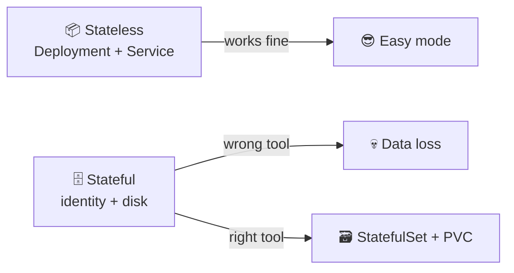

> 🔗 **Lab 15 tie-in:** you convert your Lab 12 Helm chart from a `Deployment` to a `StatefulSet` with `volumeClaimTemplates` and a headless `Service`, then prove that each pod owns its own visit counter that survives a pod kill.

---

## 📍 Slide 2 – 🎯 Learning Outcomes

| # | Outcome |
|---|---------|
| 1 | 🧠 Tell stateless from stateful workloads and pick the right controller |
| 2 | 🏗️ Read and write `StatefulSet` manifests with `volumeClaimTemplates` |
| 3 | 🌐 Configure a headless `Service` (`clusterIP: None`) and resolve per-pod DNS |
| 4 | 🔢 Reason about ordered vs `Parallel` pod management for stateful clusters |
| 5 | 🔄 Pick between `RollingUpdate` (with partitions) and `OnDelete` update strategies |
| 6 | 🤖 Know when to drop StatefulSets entirely and reach for an operator (CloudNativePG, Strimzi, Rook) |

**Tech stack pinned for May 2026:** Kubernetes **1.36** "Haru", **CloudNativePG 1.29** (PostgreSQL operator), **Rook v1.18+ (Ceph 19 Squid)**, **Longhorn 1.9** as the lightweight CNCF storage option. Apps-API `apps/v1` `StatefulSet` has been GA since **Kubernetes 1.9 (Dec 2017)** — the API surface is rock-solid; the failure modes aren't.

---

## 📍 Slide 3 – ⚠️ Why a Deployment Is Wrong for Postgres

Everything that makes a `Deployment` great for a stateless web app is *exactly* what hurts a stateful one.

| Deployment behaviour | Why it's great for web | Why it's terrible for Postgres |
|---|---|---|
| 🎲 Random pod names (`web-7b9c4-x4f2k`) | Pods are interchangeable | Replica needs to know *which* pod is the primary |
| 📦 Shared `PersistentVolumeClaim` (or none) | Stateless = no disk | Two Postgres processes writing the same WAL = corruption |
| ⚡ Parallel pod startup | Faster scale-up | Bootstrap election races; split-brain |
| 🔁 Pod IPs change on restart | `Service` smooths it over | Replica connection strings break mid-stream |
| 📉 Scale to zero is safe | Just a restart | "Scale to zero" = data still on a PVC, *but is it?* |

> 🔥 **Hot take:** the day someone files an incident titled *"the database pod restarted and the data is gone"* is the day they learn that `Deployment` + `emptyDir` is not a database. That's why we have `StatefulSet`.

---

## 📍 Slide 4 – 🐾 Pets vs Cattle, Revisited

Lecture 1 introduced **pets vs cattle** (Bill Baker, 2012). Stateless workloads are cattle: replaceable, numbered by chance. Stateful workloads are pets — but **managed pets**, not snowflakes.

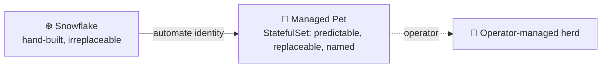

* 🐶 **Pet** = stable identity, stable storage, you know exactly who pod-0 is
* 🐮 **Cattle** = pick any one, it doesn't matter — Deployments
* 🏥 **Managed herd** = an operator (CloudNativePG, Strimzi) treats every pet for you so a human doesn't have to

> 💡 StatefulSet is the K8s primitive for *managed pets*. Operators are the primitive for *managed herds*.

---

## 📍 Slide 5 – 🏗️ StatefulSet Guarantees

Three guarantees you don't get from a Deployment. Memorize them.

* 🔢 **Stable, unique network identity** — pod names are `<sts-name>-<ordinal>`: `postgres-0`, `postgres-1`, `postgres-2`. The name *survives reschedule, restart, node failure*.
* 💾 **Stable, persistent storage** — each ordinal owns its own `PersistentVolumeClaim` provisioned from a `volumeClaimTemplates` block. Reschedule pod-1, the same PVC follows it.
* 📊 **Ordered, graceful deployment, scaling, and termination** — pod-0 must be Ready before pod-1 starts. On scale-down, the highest ordinal goes first.

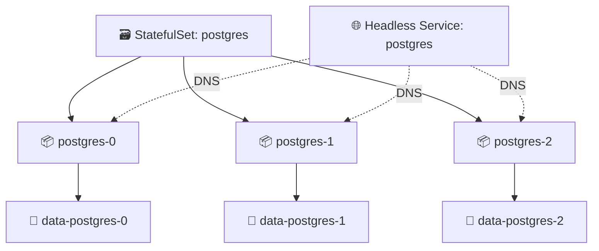

> 📚 **Source:** [Kubernetes docs — StatefulSet](https://kubernetes.io/docs/concepts/workloads/controllers/statefulset/) (apps/v1, GA since 1.9).

---

## 📍 Slide 6 – 🌐 Headless Services — DNS Without an LB

A regular `Service` gets a virtual `clusterIP`; `kube-proxy` load-balances across endpoints. A **headless** Service has `clusterIP: None` and behaves differently: the cluster DNS returns the **A records of every pod**, not one virtual IP.

```yaml
# 🌐 Regular Service — one virtual IP, round-robin to pods
apiVersion: v1
kind: Service
metadata:
  name: postgres
spec:
  selector: { app: postgres }
  ports: [{ port: 5432 }]
---
# 🌐 Headless Service — no IP, returns every pod's IP
apiVersion: v1
kind: Service
metadata:
  name: postgres-headless
spec:
  clusterIP: None              # 🔑 the magic
  selector: { app: postgres }
  ports: [{ port: 5432 }]
```

| DNS query | Regular Service | Headless Service |
|-----------|-----------------|------------------|
| `postgres.default.svc` | `10.96.0.42` (one virtual IP) | `10.244.1.7, 10.244.2.3, 10.244.3.9` (every pod) |
| `postgres-0.postgres-headless.default.svc` | ❌ doesn't exist | `10.244.1.7` (pod-0 only) |

> 🔑 **Why we need it:** the StatefulSet ↔ DNS bond *requires* a headless governing Service. Without it, you can't address `pod-0` directly, which means you can't write a Postgres connection string for the primary.

---

## 📍 Slide 7 – 🔗 Per-Pod DNS Names

Every pod in a `StatefulSet` gets a stable DNS record under the governing headless Service:

```
<pod-name>.<headless-service>.<namespace>.svc.cluster.local
```

For a StatefulSet `postgres` with `serviceName: postgres-headless` in namespace `prod`:

```
postgres-0.postgres-headless.prod.svc.cluster.local
postgres-1.postgres-headless.prod.svc.cluster.local
postgres-2.postgres-headless.prod.svc.cluster.local
```

* ✅ Names **never change** for a given ordinal — `postgres-0` is `postgres-0` forever
* ✅ Resolution works **from any pod in the cluster** — that's how the replicas find the primary
* ✅ If `postgres-0` is rescheduled to a different node, the name still resolves to the new pod IP

> 🔧 **Test it in Lab 15:** `kubectl exec postgres-0 -- nslookup postgres-1.postgres-headless` — you should see one A record matching pod-1's current IP.

---

## 📍 Slide 8 – 💾 volumeClaimTemplates: One PVC Per Pod, For Free

The killer feature. A `volumeClaimTemplates` block tells the StatefulSet controller: *for every pod ordinal, provision a PVC from this template*. No human writes the PVCs.

```yaml
apiVersion: apps/v1
kind: StatefulSet
metadata: { name: postgres }
spec:
  serviceName: postgres-headless
  replicas: 3
  selector: { matchLabels: { app: postgres } }
  template:
    metadata: { labels: { app: postgres } }
    spec:
      containers:
        - name: postgres
          image: postgres:17.5
          volumeMounts:
            - { name: data, mountPath: /var/lib/postgresql/data }
  volumeClaimTemplates:                  # 🔑 per-pod PVC provisioning
    - metadata: { name: data }
      spec:
        accessModes: [ReadWriteOnce]
        storageClassName: standard
        resources: { requests: { storage: 20Gi } }
```

**Result after `kubectl apply`:**

```
PVC data-postgres-0   →   PV   →   bound to postgres-0
PVC data-postgres-1   →   PV   →   bound to postgres-1
PVC data-postgres-2   →   PV   →   bound to postgres-2
```

> ⚠️ **Critical:** PVCs created by `volumeClaimTemplates` are **NOT deleted** when you scale the StatefulSet down or delete the StatefulSet itself. This is a feature — your data outlives mistakes. The trade-off is you have to clean them up manually with `kubectl delete pvc`.

---

## 📍 Slide 9 – 🔄 Ordered Deployment and Scaling

Default behaviour: pod-N waits for pod-(N-1) to be Ready before it starts. Scale-down is reverse.

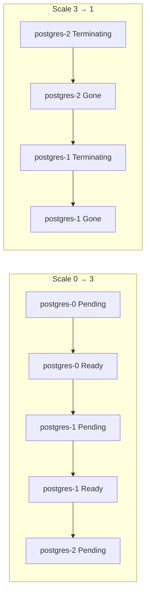

* 🔢 Sequential start: pod-0 becomes primary → pod-1 joins as replica → pod-2 joins
* 📉 Reverse termination: pod-2 drains → pod-1 drains → pod-0 (the primary) stays until last
* ⏱️ A wedged pod-1 **blocks** pod-2 from ever starting — slow but safe

**Override with `podManagementPolicy: Parallel`** when you don't need the ordering — e.g., a stateless cluster of shards that all discover each other lazily. Default is `OrderedReady`.

```yaml
spec:
  podManagementPolicy: Parallel   # start all pods at once; PVCs still per-ordinal
```

> 🔥 **When `Parallel` makes sense:** a Cassandra-style cluster where every node is equal and discovery is via gossip, not via "find pod-0". Most databases want `OrderedReady`.

---

## 📍 Slide 10 – 🔄 Update Strategies: RollingUpdate vs OnDelete

A StatefulSet upgrade matters more than a Deployment one — you're upgrading the *primary database*, not a web frontend.

**RollingUpdate (default)** — replaces pods one at a time, *highest ordinal first*:

```yaml
spec:
  updateStrategy:
    type: RollingUpdate
    rollingUpdate:
      partition: 0           # update everything from ordinal 0 upward (i.e., all pods)
```

**OnDelete** — controller does *nothing* on a spec change; you delete pods yourself when ready:

```yaml
spec:
  updateStrategy:
    type: OnDelete
```

| Strategy | Triggered by | When to use |
|---|---|---|
| `RollingUpdate` | `kubectl apply` of new pod template | Most cases — let K8s drive |
| `RollingUpdate` + `partition` | apply + manual partition decrement | Canary one replica before the rest |
| `OnDelete` | manual `kubectl delete pod` | Strict change windows; coordinated DB upgrades |

> 🔧 **Lab 15 bonus:** try both. The `OnDelete` workflow is what most production database upgrades actually look like — a human is in the loop because the cost of an automated mistake is "restore from backup".

---

## 📍 Slide 11 – 🎯 Partitioned Rollout (Canary for Stateful Apps)

The `partition` field is the StatefulSet equivalent of a canary. Pods with ordinal `>= partition` get the new template; the rest stay on the old one.

```yaml
spec:
  replicas: 5
  updateStrategy:
    type: RollingUpdate
    rollingUpdate:
      partition: 4           # 🐤 only postgres-4 updates
```

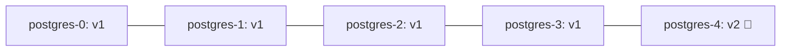

* 🐤 Update lands only on pod-4 — your canary
* ✅ Validate metrics, replication lag, application errors
* 🔽 Drop `partition: 4 → 3 → 2 → 1 → 0` to roll the upgrade forward
* ⏪ Set `partition` back to a high number and re-apply old image to roll back

> 📊 **Compare to Lab 14 (Rollouts):** Argo Rollouts gives you weighted traffic shifting for *stateless* apps. StatefulSet partitions give you "this ordinal runs the new version" for *stateful* apps. Different problems, different tools.

---

## 📍 Slide 12 – ⏱️ Common Failure Modes

| Symptom | Likely cause | Fix |
|---|---|---|
| 🟡 `postgres-1` stuck `Pending` forever | PVC can't bind: storage class missing, quota exceeded, RWO PVC on a node that already has it mounted | `kubectl describe pvc data-postgres-1`; check `StorageClass`; check node where pod-0 sits |
| 🔁 Pod restarts every minute | Liveness probe failing; readiness on the wrong port | `kubectl logs --previous`; tighten probe paths |
| ❌ Pod-2 never starts | Pod-1 isn't Ready (controller waits) | Fix pod-1 first; or switch to `podManagementPolicy: Parallel` if your app supports it |
| 💾 Scale-down "deleted" my data | It didn't — PVCs were retained on purpose; you scaled the StatefulSet but the PVC is still there | `kubectl get pvc` — your data is still there; bump `replicas` back up |
| 🌐 `postgres-0.postgres-headless` doesn't resolve | Headless Service missing or has the wrong selector | Confirm `serviceName` in STS matches a `clusterIP: None` Service whose selector matches pod labels |
| 🐢 Scale 0→10 takes 20 minutes | Default `OrderedReady` waits for each pod | Use `podManagementPolicy: Parallel` if you don't need ordering |

> 🔍 **Debugging order:** `kubectl get sts,pod,pvc,svc` — these four together tell the whole story.

---

## 📍 Slide 13 – 💽 Persistent Volumes: The Two-Layer Model

A `PersistentVolumeClaim` is a *request*; a `PersistentVolume` is the actual disk. The cluster's `StorageClass` provisions PVs dynamically — without one, your PVCs hang forever.

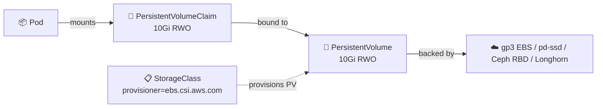

| Access mode | Meaning | Typical backend |
|---|---|---|
| `ReadWriteOnce` (RWO) | One node R/W at a time | Block storage (EBS, GCE PD, Ceph RBD) — the default for StatefulSets |
| `ReadOnlyMany` (ROX) | Many nodes, read only | Object storage layered on top |
| `ReadWriteMany` (RWX) | Many nodes R/W simultaneously | NFS, CephFS, EFS — needed for shared-filesystem apps, rare for databases |
| `ReadWriteOncePod` (RWOP, GA 1.29) | Exactly one pod R/W cluster-wide | Stricter than RWO; prevents multi-attach on the same node |

> ⚠️ **Reclaim policy:** PVs come with a `persistentVolumeReclaimPolicy`. `Retain` keeps the data after the PVC is deleted (safer); `Delete` wipes it. Most cloud `StorageClass` defaults are `Delete`. **Set `Retain` for anything that matters.**

---

## 📍 Slide 14 – 🌩️ Cloud-Native Storage Options (May 2026)

Not every cluster runs on EBS or GCE PDs. For on-prem or multi-cloud, you bring storage with you.

| Project | Style | Strengths | Trade-offs |
|---|---|---|---|
| **Rook v1.18 + Ceph 19 Squid** | Distributed (block + file + object) | Battle-tested at scale; unified block/file/object; CNCF graduated | Heavy — needs ≥3 nodes, careful capacity planning |
| **Longhorn 1.9** (SUSE → CNCF) | Distributed block, native to K8s | Simple UI, easy snapshots, S3 backups, small clusters | Block only; per-volume replica overhead |
| **OpenEBS Mayastor** | NVMe-over-TCP, hyperconverged | Highest performance for NVMe; default engine in new installs | Newer; requires kernel features |
| **CSI cloud drivers** (EBS, GCE PD, Azure Disk) | Single-cloud block | Managed, fast, cheap | Vendor lock-in; RWO only |

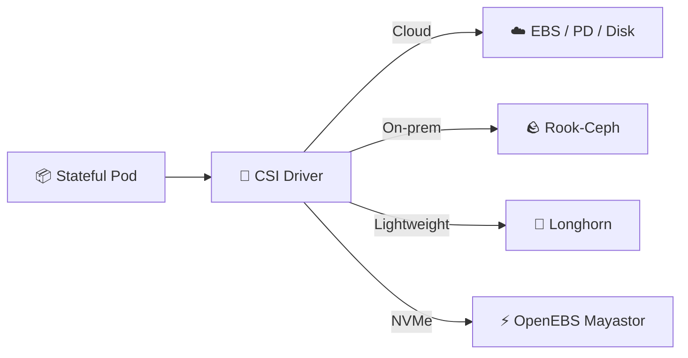

> 🔧 **Course tie-in:** Lab 15 uses k3d's default `StorageClass` (the local-path-provisioner). The principles transfer; production swaps in EBS or Rook.

---

## 📍 Slide 15 – 🏥 Past StatefulSets: When You Need an Operator

A StatefulSet gets you *identity + storage*. It doesn't give you:

* 🩺 Failover orchestration (promote replica when primary dies)
* 💾 Coordinated backups (`pg_basebackup`, WAL archiving)
* 🔄 Point-in-time restore from S3
* 📊 Replication lag monitoring
* 🔐 Per-tenant credential rotation

That's an **operator** — a controller that understands your specific database. Operators ship as CRDs (Custom Resource Definitions) plus a controller pod that watches them.

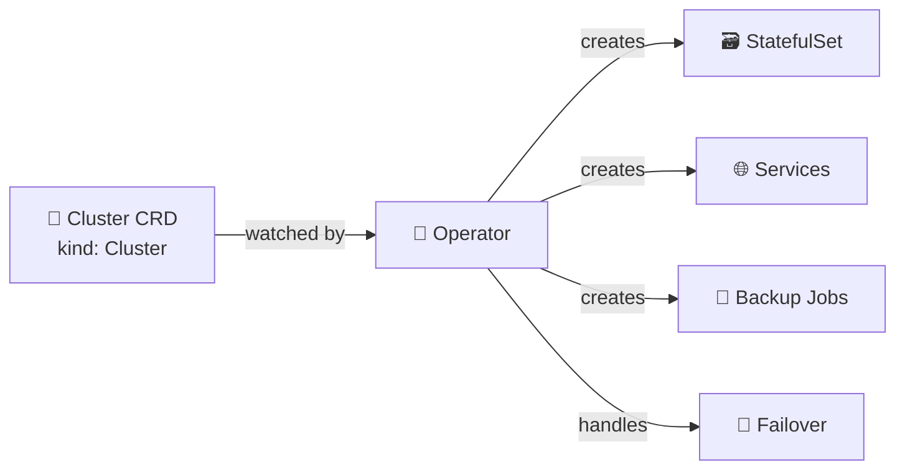

**Production-grade operators in 2026:**

| Workload | Operator | Notes |
|---|---|---|
| 🐘 PostgreSQL | **CloudNativePG 1.29** (CNCF Sandbox) | Default for many platform teams; PG 18.3 supported; quorum failover stable |
| 🐬 MySQL | **MySQL Operator for K8s** (Oracle) or **Percona XtraDB Operator** | Two viable choices; Percona for high availability |
| 🟢 MongoDB | **MongoDB Community Operator** | Stays under the SSPL license boundary |
| 🍂 Redis | **Redis Operator** (OT/Spotahome) or **Dragonfly Operator** | Dragonfly is a Redis-compatible drop-in |
| 📨 Kafka | **Strimzi** (CNCF) | The de-facto K8s Kafka operator |
| 🐘 ClickHouse | **Altinity ClickHouse Operator** | |

> 💡 **Rule of thumb:** if you'd page yourself at 3 AM for that database's failure, run it with an operator, not a raw StatefulSet.

---

## 📍 Slide 16 – 🐘 CloudNativePG in 90 Seconds

A taste of what an operator buys you. Compare this to writing a 3-pod Postgres StatefulSet by hand.

```yaml
apiVersion: postgresql.cnpg.io/v1
kind: Cluster
metadata:
  name: app-db
spec:
  instances: 3                        # 🔢 1 primary + 2 replicas
  imageName: ghcr.io/cloudnative-pg/postgresql:18.3
  storage:
    size: 50Gi
    storageClass: standard
  backup:
    barmanObjectStore:
      destinationPath: s3://my-backups/app-db
      s3Credentials:
        accessKeyId:     { name: backup-creds, key: ACCESS_KEY_ID }
        secretAccessKey: { name: backup-creds, key: SECRET_ACCESS_KEY }
    retentionPolicy: "30d"
  monitoring:
    enablePodMonitor: true            # 📊 Prometheus scraping out of the box
```

* 🔄 Automatic primary election (quorum-based failover, stable since 1.28)
* 💾 Continuous WAL archiving to S3
* ♻️ Rolling minor version upgrades coordinated across the cluster
* 📊 `PodMonitor` + dashboards bundled

> 📚 **Source:** [cloudnative-pg.io](https://cloudnative-pg.io/) — 1.29 GA released 2026; PostgreSQL 18.3 the default image.

---

## 📍 Slide 17 – 💾 Backup & Restore (Briefly)

> 📘 **Deeper coverage:** SRE-Intro (elective) has a full lecture on backup strategies, RPO/RTO, and chaos-testing your restore. We just plant the flag here.

**Three rules for stateful K8s in 2026:**

1. 💾 **A snapshot is not a backup.** EBS snapshots are application-unaware; restoring a half-written WAL is corruption. Use the database's native tool (`pg_basebackup`, `mongodump`, `xtrabackup`).
2. 🔁 **An untested backup is a wish.** Restore drills, on a schedule, to a fresh cluster. The 2017 GitLab.com incident lost data because 5 of 5 backup mechanisms were broken — nobody had checked.
3. 📦 **Store backups outside the cluster.** S3, GCS, or an external Ceph object store. If the cluster goes, your backups can't go with it.

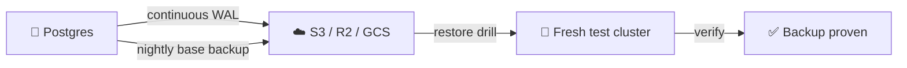

> 🔥 **Operator advantage again:** CloudNativePG, Strimzi, and friends ship backup *and* restore as CRDs. You declare `kind: Backup` and `kind: ScheduledBackup`; you declare `kind: Cluster.spec.bootstrap.recovery` to restore. No bash scripts.

---

## 📍 Slide 18 – 📋 Complete StatefulSet Example (Lab 15 Template)

The minimum viable StatefulSet — what your Lab 15 chart converges on:

```yaml
apiVersion: v1
kind: Service
metadata: { name: visits-headless }
spec:
  clusterIP: None
  selector: { app: visits }
  ports: [{ port: 8000, name: http }]
---
apiVersion: apps/v1
kind: StatefulSet
metadata: { name: visits }
spec:
  serviceName: visits-headless        # 🔑 must match the headless Service
  replicas: 3
  selector: { matchLabels: { app: visits } }
  template:
    metadata: { labels: { app: visits } }
    spec:
      containers:
        - name: app
          image: ghcr.io/innodevops/lab12-app:v1.2.0
          ports: [{ containerPort: 8000, name: http }]
          volumeMounts:
            - { name: data, mountPath: /data }
          readinessProbe:
            httpGet: { path: /health, port: http }
            initialDelaySeconds: 3
            periodSeconds: 5
  volumeClaimTemplates:
    - metadata: { name: data }
      spec:
        accessModes: [ReadWriteOnce]
        resources: { requests: { storage: 1Gi } }
```

**Verify in Lab 15:**

```bash
kubectl get sts,pod,pvc,svc                                  # all four resources present
kubectl exec visits-0 -- nslookup visits-1.visits-headless   # 🔗 per-pod DNS works
for i in 0 1 2; do                                           # 💾 per-pod state
  kubectl exec visits-$i -- cat /data/visits
done
kubectl delete pod visits-0                                  # pod-0 restarts, same PVC, same data
```

---

## 📍 Slide 19 – ⚠️ Gotchas in Production

| Gotcha | Symptom | Mitigation |
|---|---|---|
| 🗑️ Forgotten PVCs | Cluster fills up with orphan PVCs | `kubectl delete pvc data-postgres-{0..N}` when retiring a StatefulSet |
| 🔄 Reclaim policy `Delete` | Wiped data on PVC deletion | Patch `StorageClass` to `Retain` for prod; verify on the PV |
| 🌐 Missing headless Service | DNS resolution silently broken | Apply Service *before* the StatefulSet; CI lint for it |
| 📊 Liveness probe too aggressive | Pods restart mid-WAL flush | Use readiness for traffic; liveness only on deep deadlocks |
| 🐢 Two-replica clusters | Worst of both worlds | Stateful clusters want **odd** numbers ≥3 for quorum; or single-instance with backups |
| 🔁 `volumeClaimTemplates` change | Field is **immutable** after creation | To resize: edit the PVC directly (if `allowVolumeExpansion: true` in the StorageClass) |
| 📦 Pod-0 fails first; rest never start | Default `OrderedReady` blocks | Fix pod-0 root cause; switch to `Parallel` only if app supports it |

> 🔥 **Resizing trap:** you cannot edit `volumeClaimTemplates.spec.resources` and have it propagate. The StatefulSet controller silently ignores it. Resize the PVCs *manually*; recreate the StatefulSet with `--cascade=orphan` if the template diff matters.

---

## 📍 Slide 20 – 🆚 Deployment vs StatefulSet vs DaemonSet vs Job

So far this course has touched all four. A quick consolidation:

| Controller | Pods named | Storage | Ordering | Use case |
|---|---|---|---|---|
| **Deployment** | random suffix | shared / none | parallel | Stateless apps (web, API, workers) |
| **StatefulSet** | ordinal (`-0`, `-1`) | per-pod via templates | sequential by default | Databases, queues, anything with identity |
| **DaemonSet** | one per node | hostPath / per-node | one-per-node | Node agents (log shipper, CSI driver, network plugin) |
| **Job / CronJob** | random; runs to completion | task-scoped | parallel or sequential | Batch work, migrations, scheduled tasks |

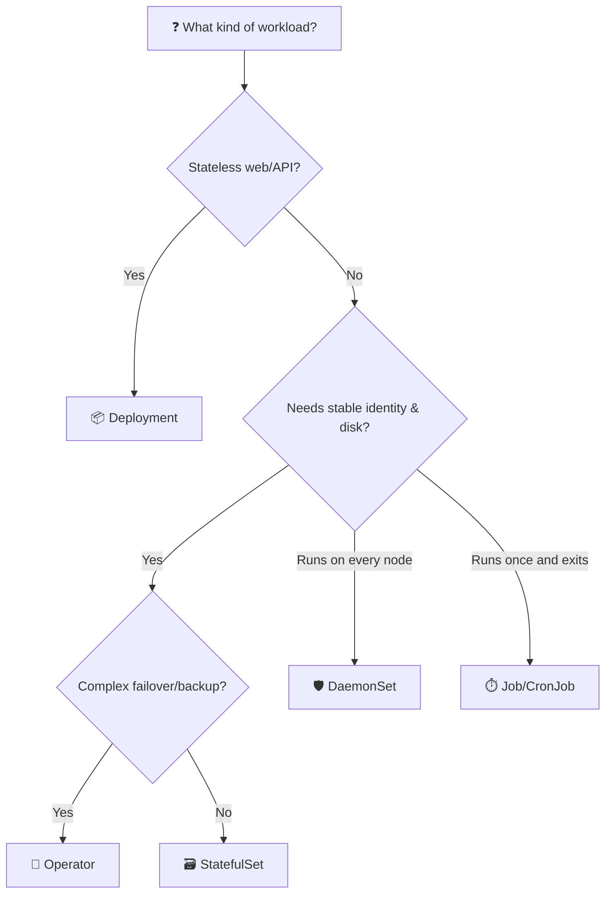

> 💡 **Most pods you'll ever write are Deployments.** Reach for StatefulSet only when you need identity *or* per-pod storage. Reach for an operator the moment failover, backups, or upgrade choreography enters the picture.

---

## 📍 Slide 21 – 🎯 Key Takeaways

1. 🗃️ **StatefulSet = identity + per-pod storage + ordered lifecycle.** Three guarantees Deployments don't offer.
2. 🌐 **Headless Services (`clusterIP: None`) are required** — they give you the per-pod DNS that makes identity useful.
3. 💾 **`volumeClaimTemplates` provisions one PVC per ordinal**, and the PVCs are deliberately retained on scale-down.
4. 🔢 **Default ordering is `OrderedReady`**; `Parallel` is opt-in for clusters that don't need pod-0 to bootstrap first.
5. 🔄 **`RollingUpdate` + `partition`** is your canary mechanism for stateful upgrades; **`OnDelete`** is for change-window-driven manual upgrades.
6. 🤖 **For real databases, use an operator** (CloudNativePG, Strimzi, Percona). StatefulSet alone is the *primitive*, not the *answer*.
7. 💾 **A snapshot is not a backup.** Application-aware tools + tested restore drills, or you don't have backups.
8. 🐾 **StatefulSets are managed pets.** Operators are managed herds. Both beat snowflakes.

> 💡 **Mantra:** *If you'd page yourself for its failure, don't run it as a Deployment.*

---

## 📍 Slide 22 – 🧠 The Mindset Shift

| 😰 Old | 🚀 StatefulSet-aware |
|---|---|
| "Just spin up another pod, they're all the same" | "pod-0 is the primary — name matters" |
| "We'll mount a shared PVC across all replicas" | "Each replica owns its own PVC via the template" |
| "It's a database, deploy it like the app" | "Operator handles failover, we just declare `kind: Cluster`" |
| "Backup is whatever the cloud snapshot does" | "Backups are app-aware, off-cluster, and restore-tested" |
| "Why is the deploy stuck on pod-1?" | "Because pod-0 isn't Ready — investigate the root cause, don't bypass with Parallel" |
| "Scale to zero, scale back up" | "PVCs stay; data stays; you can scale freely" |

> 🤔 Which row describes a team you've worked on?

---

## 📍 Slide 23 – 🚀 What Comes Next

**📚 Next lecture: *Lecture 16 — Beyond Kubernetes*** — when the cluster is overkill *and* when the cluster is the wrong shape.

* 🌐 **Cloudflare Workers** — V8 isolates on the edge; 0ms cold starts; tiny bundles
* ❄️ **Nix** — reproducible builds and dev shells without a container in sight
* 🤔 **Trade-offs** — when to skip K8s entirely; when to pair it with something else
* 🎁 **Bonus labs 17 & 18** — deploy your Lab 1 service to Cloudflare Workers; package it with Nix flakes

**🔬 Lab 15 deliverables:**

* Convert your Lab 12 Helm chart from `Deployment` → `StatefulSet`
* Add a headless `Service` (`clusterIP: None`) governed by `serviceName`
* Configure `volumeClaimTemplates` so each pod gets its own PVC
* Prove per-pod state: hit pods through `kubectl port-forward`, watch independent visit counters
* Kill `app-0`, watch the same data come back on reschedule
* **Bonus (2.5 pts):** demonstrate `RollingUpdate` with `partition` *and* an `OnDelete` rollout

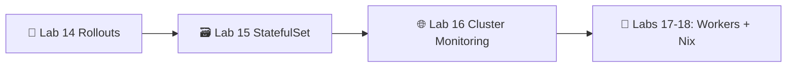

> 🌊 From cattle to managed pets — one ordinal at a time.

Post-lecture quiz feeds the weeks 13-16 leaderboard window.

---

## 📚 Resources

**📕 Books:**

* *Kubernetes Up & Running* (3e, 2022) — Burns, Beda, Hightower. Chapter on StatefulSets is the canonical text.
* *Kubernetes Patterns* (2e, 2024) — Ibryam & Huß. "Stateful Service" and "Service Discovery" patterns.
* *Database Reliability Engineering* (2017) — Campbell & Majors. Why operators exist, in book form.

**🔗 Links:**

* 🌐 [StatefulSet concepts](https://kubernetes.io/docs/concepts/workloads/controllers/statefulset/) — official
* 🌐 [Headless Services](https://kubernetes.io/docs/concepts/services-networking/service/#headless-services)
* 🌐 [Volume claim templates](https://kubernetes.io/docs/concepts/workloads/controllers/statefulset/#volume-claim-templates)
* 🌐 [Update strategies & partition rollout](https://kubernetes.io/docs/concepts/workloads/controllers/statefulset/#update-strategies)
* 🌐 [Operator pattern](https://kubernetes.io/docs/concepts/extend-kubernetes/operator/)
* 🌐 [OperatorHub.io](https://operatorhub.io/) — curated operator catalogue
* 🌐 [CloudNativePG](https://cloudnative-pg.io/) — the PostgreSQL operator we cite throughout
* 🌐 [Rook](https://rook.io/) — production storage on Ceph
* 🌐 [Longhorn](https://longhorn.io/) — lightweight CNCF block storage
