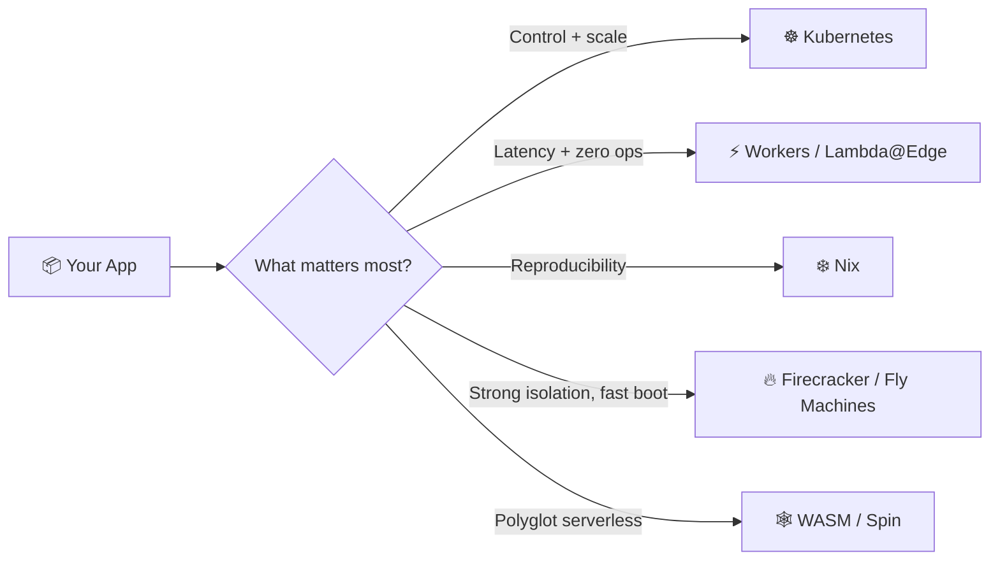
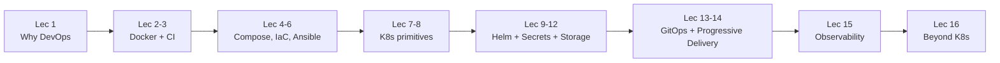
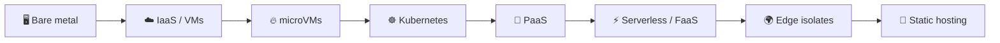
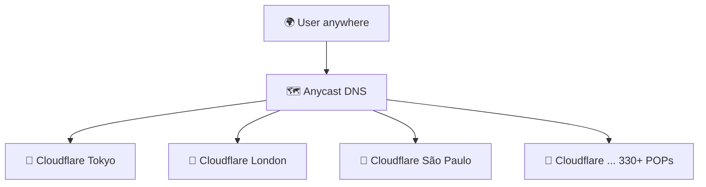
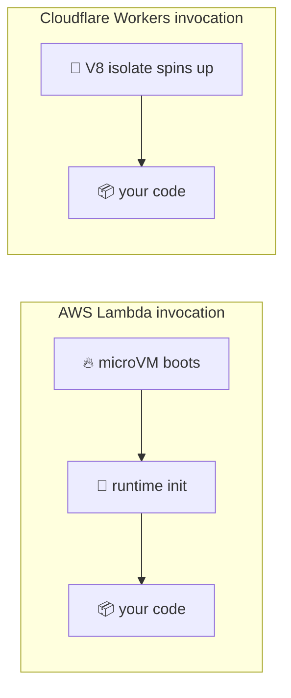
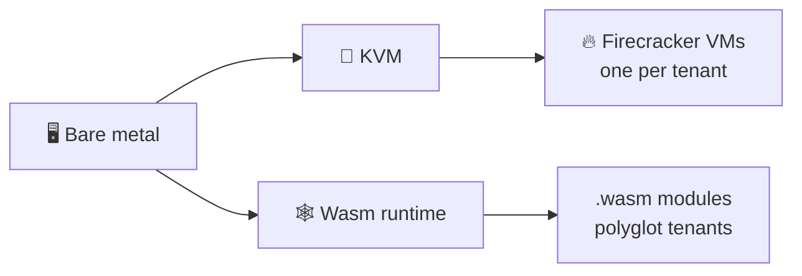
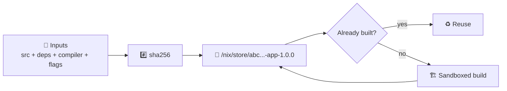
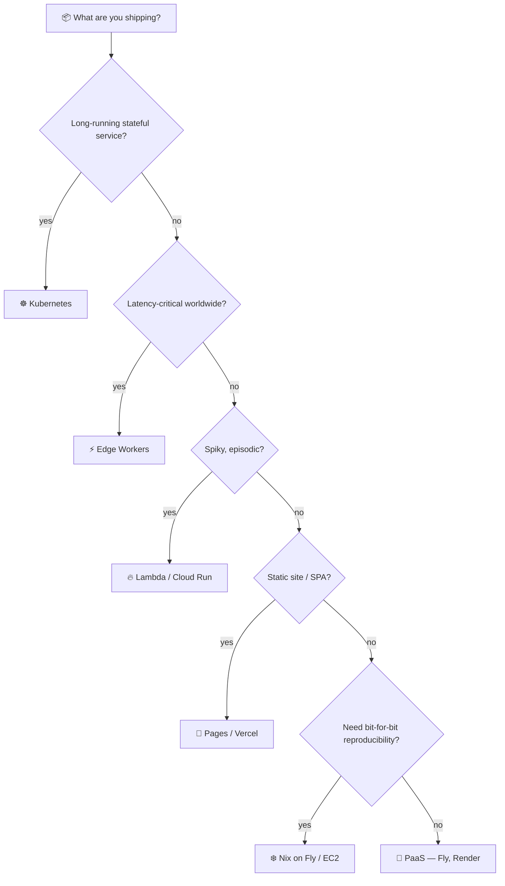
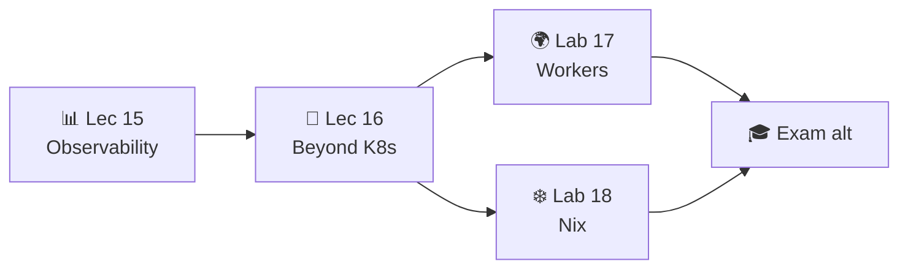

# 📌 Lecture 16 — Beyond Kubernetes: Alternative Deployment Models

> 🎯 **The course finale.** You spent 15 lectures learning how to run containers on a cluster. Now we ask the question every senior engineer eventually asks: *did we actually need the cluster?*

---

## 📍 Slide 1 – 🚀 The Question Every Architect Eventually Asks

* ☸️ You can deploy to Kubernetes. **You proved it across Labs 8–16.**
* 🤔 But for many workloads K8s is the **wrong abstraction** — too much surface area for too little payoff
* 🌍 In 2026 the deployment menu is no longer just "VM vs container" — it's a **spectrum** of runtimes optimized for very different problems
* 🎯 Today: edge serverless (lab 17) and reproducible builds (lab 18), plus when each beats K8s



> 📚 **Frame for today:** every model on this slide is *also* production-grade. The skill is knowing which problem each one solves — and which problems it doesn't.

---

## 📍 Slide 2 – 🎯 Learning Outcomes

By the end of this lecture you can:

| # | Outcome |
|---|---------|
| 1 | 🧠 Explain what a **V8 isolate** is and why its cold start is <5 ms |
| 2 | ⚖️ Compare **edge serverless** (Workers) with **regional FaaS** (Lambda) |
| 3 | ❄️ Describe what a **Nix derivation** guarantees that a Dockerfile does not |
| 4 | 📊 Choose between K8s, edge, microVM, PaaS, and static hosting from a use-case matrix |
| 5 | 🚀 Map Lab 17 (Cloudflare Workers) and Lab 18 (Nix) onto the deployment spectrum |
| 6 | 🔮 Name the next-wave runtimes (WASM, unikernels, Firecracker) and what they're for |

---

## 📍 Slide 3 – 🧰 Tech Stack for Today (May 2026)

| Tool | Version / Status | Notes |
|------|------------------|-------|
| **Cloudflare Workers** | workerd + V8 isolates, 330+ edge POPs | Cold start <5 ms; free tier 100k req/day, 10 ms CPU; $5/mo Paid = 10M req + 50 ms CPU |
| **Wrangler CLI** | **4.94+** | Local-first by default; `--remote` is now opt-in |
| **Workers KV / D1 / R2 / Durable Objects** | GA | Edge-attached state primitives |
| **Nix** | **2.25** (Nov 2024), 2.26+ in development | Determinate installer enables flakes by default |
| **Lix** | Community fork (forked Mar 2024) | Drop-in `nix` replacement; FlakeHub is the SemVer registry |
| **AWS Lambda runtime** | Firecracker microVM, ~125 ms boot | Per-invocation isolation |
| **Fly.io** | Fly Machines on Firecracker | Same microVM tech as Lambda; you keep the VM |
| **Fermyon Spin** | v3.5 (WASI 0.3 preview) | Acquired by Akamai Dec 2025 → Akamai Functions |

> 🧷 Two of these tools — **Cloudflare Workers** and **Nix** — are the entire content of Labs 17 and 18. The rest are context for the world you're about to enter.

---

## 📍 Slide 4 – 🗺️ Course Arc, One Last Time



You climbed the abstraction ladder from `chroot` → containers → orchestration → GitOps. Today we look **sideways** at runtimes that took a different path up the mountain.

---

## 📍 Slide 5 – ⚠️ The Kubernetes Tax

K8s gives you control. Control has a price tag:

* 🔧 **Cluster operations** — control plane upgrades, CRD migrations, etcd backups
* 🧠 **Team expertise** — kubectl, RBAC, networking, storage classes, ingress controllers
* 💰 **Idle cost** — control plane ($72/mo on EKS) + min 3 worker nodes even at zero traffic
* ⏱️ **Lead time to first deploy** — for a fresh team, days. With managed K8s + a platform team, still hours
* 🕵️ **Attack surface** — every CRD, every webhook, every operator is code running in your cluster

> 💬 **Kelsey Hightower, 2017 (still true):** *"Kubernetes is a platform for building platforms. It's a better place to start, not the endgame."*

For a single-region static site or a webhook that runs 200 times a day, the platform overhead eats the value.

---

## 📍 Slide 6 – 🚩 Signals K8s Is Overkill

| 🚩 Signal | 💡 Better fit |
|----------|---------------|
| 1–2 services, no horizontal scale demand | PaaS (Fly.io, Render, Railway) |
| Spiky traffic with long idle windows | Serverless (Lambda, Cloud Run) |
| Latency-sensitive globally | Edge runtime (Workers, Lambda@Edge) |
| Pure static site or SPA | Pages / Netlify / Vercel |
| Reproducibility > orchestration | Nix + bare metal or microVM |
| 1-person dev team, "must ship by Friday" | **Anything but K8s** |

> 💬 **DORA wisdom:** the highest-performing teams optimise for **flow**, not technology grandeur. The simplest deployment that delivers the business outcome is usually the right one.

---

## 📍 Slide 7 – 📊 The Abstraction Spectrum



| Layer | You manage | Platform manages | Boot time |
|-------|-----------|------------------|-----------|
| Bare metal | OS, drivers, runtime, app | nothing | minutes |
| VM (EC2) | OS, runtime, app | hardware | 30–60 s |
| microVM (Firecracker, Fly) | runtime, app | hypervisor + kernel | ~125 ms |
| Kubernetes | manifests + app | scheduling, networking | seconds (pod), days (cluster) |
| PaaS | app code + config | everything else | minutes |
| Serverless / FaaS | function | runtime, scaling | 100 ms – 1 s |
| Edge isolates | function | global routing | **<5 ms** |
| Static hosting | files | CDN | 0 (no compute) |

Each row trades **control** for **simplicity**. Pick the highest row you can tolerate.

---

## 📍 Slide 8 – 🌍 Section 1: Edge Compute — Code Where the Users Are

**Traditional cloud:**
```
Tokyo user → 200 ms → us-east-1 → response
```

**Edge compute:**
```
Tokyo user → 20 ms → Cloudflare Tokyo POP → response
```



* ⚡ **Latency cliff** disappears — your code is already where the user is
* 🌍 **No region picker** — there is no "us-east-1" in edge land
* 💸 **Pay per request, not per idle hour** — true scale-to-zero
* 📏 **Constrained** — short CPU budgets, smaller dep trees, no native binaries

---

## 📍 Slide 9 – 🧪 V8 Isolates — How Cloudflare Workers Skips the Container



* 🧬 **Isolate ≠ container.** It's a sandboxed JS heap inside an already-running V8 process
* ⏱️ **Cold start: <5 ms.** Lambda containers: 100 ms – 1 s+
* 🧠 **Memory: ~3 MB per isolate.** Lambda microVM: ≥128 MB
* 🏭 **Density:** one Worker node serves thousands of tenants on one V8 process
* 🚫 **Trade-off:** no filesystem, no native modules, 10 ms CPU on free tier (50 ms paid, burstable to 5 min)

> 🔬 **The architectural bet:** sandbox at the **language runtime** layer, not the **OS kernel** layer. Smaller blast radius, smaller boot cost.

---

## 📍 Slide 10 – 🛠️ Anatomy of a Worker

`src/index.ts`:
```ts
export interface Env {
  APP_NAME: string;          // wrangler.jsonc var
  API_TOKEN: string;         // wrangler secret put
  SETTINGS: KVNamespace;     // bound KV namespace
}

export default {
  async fetch(req: Request, env: Env): Promise<Response> {
    const url = new URL(req.url);
    if (url.pathname === "/health") return Response.json({ status: "ok" });
    if (url.pathname === "/edge")   return Response.json({
      colo: req.cf?.colo, country: req.cf?.country, tls: req.cf?.tlsVersion,
    });
    if (url.pathname === "/counter") {
      const n = Number(await env.SETTINGS.get("visits") ?? "0") + 1;
      await env.SETTINGS.put("visits", String(n));
      return Response.json({ visits: n });
    }
    return new Response("Not Found", { status: 404 });
  },
};
```

A whole HTTP API in one default export. No Dockerfile, no ingress, no HPA.

---

## 📍 Slide 11 – 🛫 Deploying a Worker

```bash
npm create cloudflare@latest -- edge-api    # scaffold
cd edge-api
npx wrangler login                           # OAuth in browser
npx wrangler dev                             # local; uses workerd locally
npx wrangler deploy                          # global rollout in seconds
```

**State primitives bound at the edge:**

| Binding | What it is | Use case |
|---------|-----------|----------|
| **KV** | eventually-consistent key/value | flags, config, counters |
| **D1** | SQLite per region with replication | small relational DB |
| **R2** | S3-compatible blobs, no egress fees | assets, backups |
| **Durable Objects** | strongly-consistent stateful actor | chat rooms, leaderboards |

> 🔗 **Lab 17 tie-in:** you ship a Worker with `/health`, `/edge`, secrets, a KV-backed counter, two deploys, a rollback — and a Kubernetes-vs-Workers comparison table in `WORKERS.md`.

---

## 📍 Slide 12 – ⚖️ Workers vs Lambda vs K8s, By Numbers

| Metric | ☸️ K8s pod | 🔥 AWS Lambda | ⚡ Cloudflare Workers |
|--------|-----------|---------------|----------------------|
| Cold start | seconds (scheduling + image pull) | 100–1000 ms | **<5 ms** |
| Memory floor | container request (e.g. 128 Mi) | 128 MB | ~3 MB |
| Global by default? | no — pick region(s) | no — pick region | **yes — all POPs** |
| Pricing model | nodes 24/7 | per-request + GB-s | per-request, no per-region |
| Free tier | local (k3d) only | 1M req/mo | **100k req/day** |
| Idle cost at 0 traffic | full node bill | ~$0 | ~$0 |
| Long-running tasks | yes (any) | up to 15 min | 30 s wall-clock (paid; CPU 50 ms–5 min) |
| Native binaries / Python wheels | yes | yes | limited (Python via Pyodide, no C extensions) |

**Read it as:** Workers win on latency + price floor; Lambda wins on per-request runtime flexibility; K8s wins on long-running, native, stateful workloads.

---

## 📍 Slide 13 – 🧭 Section 2: The Other Edge Players

Edge is not a Cloudflare monopoly:

| Platform | Runtime | Sweet spot |
|----------|---------|-----------|
| **Cloudflare Workers** | V8 isolates (workerd) | JS/TS at every POP |
| **Vercel Edge Functions** | V8 isolates on Cloudflare infra | Next.js middleware |
| **AWS Lambda@Edge** | Lambda in CloudFront POPs | request rewriting |
| **AWS CloudFront Functions** | JS, sub-ms | header rewrites only |
| **Deno Deploy** | V8 isolates, Deno API | TS-first |
| **Fastly Compute** | Wasmtime (WASM) | latency + portability |
| **Akamai Functions** (ex-Fermyon) | Spin / WASM | post-Akamai acquisition Dec 2025 |

> 💡 **Pattern:** every player is converging on **isolate-or-Wasm + global anycast**. The container is missing from the picture by design.

---

## 📍 Slide 14 – 🔥🕸️ microVMs and WASM — The Other Lightweight Runtimes

If V8 isolates are too constrained but a container is too heavy:

| Runtime | Boot | Isolation | Who picks it |
|---------|------|-----------|--------------|
| 🔥 **Firecracker microVM** | ~125 ms, <5 MiB overhead | Real KVM, hardware-enforced | AWS Lambda, Fargate, **Fly.io**, e2b.dev, modal.com |
| 🕸️ **WASM** (Wasmtime, workerd) | sub-ms | Language sandbox + capability-based WASI | Fermyon Spin, Fastly Compute, Shopify functions, Cloudflare |



* 🔥 **Firecracker** — AWS open-sourced it 2018, 150 microVMs/sec/host. **Lambda and Fly.io picked the same brick, exposed different APIs.**
* 🕸️ **WASM** — polyglot (Rust/Go/Python/TS → one binary). WASI 0.2 (Feb 2024, component model). WASI 0.3 (async I/O, late 2025).
* 🏭 **Production scale:** Fermyon Spin peaked at 75M req/sec before **Akamai acquired Fermyon in Dec 2025**, relaunching as Akamai Functions.
* ⚠️ **2026 caveat for WASM:** still gappy. No full network stack everywhere. Great at the edge today; not yet ready for general backends.

---

## 📍 Slide 15 – ❄️ Section 3: Reproducible Builds — A Different Frontier

Containers solved "works on my machine." **Did they really?**

* 🐳 `FROM python:3.13-slim` — what's actually in that tag *today* vs six months ago? Different.
* 📦 `pip install -r requirements.txt` — transitive deps drift even with `==` pins
* 🕒 Docker layers embed timestamps → same `Dockerfile`, different image SHA every build
* 🐛 The Toyota incident (2022) and the xz-utils backdoor (Mar 2024) both leaned on the gap between *"what you thought you built"* and *"what shipped"*

**Nix's promise:** *bit-for-bit identical output, on any machine, today and in 2036* — because every input (compilers, sources, flags) is hashed into the output path.

> 💬 **Eelco Dolstra's PhD thesis (2006) defined the model.** Twenty years later it's the only system that actually delivers it.

---

## 📍 Slide 16 – 🧬 Nix in One Slide

* 📦 **Package manager + build system + config system** — same tool, three jobs
* 🗄️ **The Nix store** — `/nix/store/<sha256>-<name>-<version>` — content-addressed, immutable
* 🔒 **Pure builds** — sandboxed, no network (except fixed-output derivations), no `/home`, no clock
* ❄️ **Same hash everywhere** — cache hit on `cache.nixos.org` = no rebuild
* 🌊 **Lazy evaluation** — 100k+ packages in nixpkgs, you only build what you reference



**One sentence:** Nix turns the build into a pure function of its inputs.

---

## 📍 Slide 17 – 🧪 A Derivation, Concretely

`default.nix` — your Lab 1 Flask service, Nix-built:

```nix
{ pkgs ? import <nixpkgs> {} }:
pkgs.python3Packages.buildPythonApplication {
  pname   = "devops-info-service";
  version = "1.0.0";
  src     = ./.;
  format  = "other";
  propagatedBuildInputs = with pkgs.python3Packages; [ flask ];
  nativeBuildInputs     = [ pkgs.makeWrapper ];
  installPhase = ''
    mkdir -p $out/bin
    cp app.py $out/bin/devops-info-service
    wrapProgram $out/bin/devops-info-service --prefix PYTHONPATH : "$PYTHONPATH"
  '';
}
```

```bash
nix-build           # → ./result symlink into /nix/store/<hash>-...
./result/bin/devops-info-service
nix-hash --type sha256 result   # this hash is the same on every machine, forever
```

---

## 📍 Slide 18 – 📦 dockerTools — Reproducible Containers Without a Dockerfile

```nix
# docker.nix
{ pkgs ? import <nixpkgs> {} }:
let app = import ./default.nix { inherit pkgs; }; in
pkgs.dockerTools.buildLayeredImage {
  name    = "devops-info-service-nix";
  tag     = "1.0.0";
  contents = [ app ];
  config = {
    Cmd          = [ "${app}/bin/devops-info-service" ];
    ExposedPorts = { "5000/tcp" = {}; };
  };
  created = "1970-01-01T00:00:01Z";   # ← THE reproducibility trick
}
```

```bash
nix-build docker.nix
docker load < result          # tarball → docker image
sha256sum result              # build twice → same hash. Try that with `docker build`.
```

**Why this works where `docker build` doesn't:**

| Problem | `docker build` | Nix `dockerTools` |
|---------|---------------|-------------------|
| Build timestamps | written into every layer | pinned to epoch |
| Base image drift | `python:3.13-slim` moves under you | nixpkgs revision is hashed into output |
| `apt-get install` | resolves to latest each run | every dep is a store path |
| Resulting image hash | changes every build | **identical every build** |

> 🔗 **Lab 18 tie-in:** you'll do exactly this — rebuild Lab 1's Python app and Lab 2's Docker image with Nix, then prove the hash equality with `sha256sum`.

---

## 📍 Slide 19 – 🌊 Flakes — Nix With a Lockfile

Pre-flakes Nix was reproducible *if you were disciplined.* Flakes make it the default.

`flake.nix`:
```nix
{
  description = "DevOps Info Service — reproducible build";

  inputs.nixpkgs.url = "github:NixOS/nixpkgs/nixos-24.11";

  outputs = { self, nixpkgs }:
    let
      system = "x86_64-linux";
      pkgs   = nixpkgs.legacyPackages.${system};
    in {
      packages.${system}.default    = import ./default.nix  { inherit pkgs; };
      packages.${system}.dockerImg  = import ./docker.nix   { inherit pkgs; };
      devShells.${system}.default   = pkgs.mkShell {
        buildInputs = [ pkgs.python313 pkgs.python313Packages.flask ];
      };
    };
}
```

```bash
nix flake update         # → flake.lock pins nixpkgs to an exact git SHA
nix build                # builds packages.default
nix develop              # drops you into a shell with pinned Python + Flask
```

**`flake.lock` is the missing piece** — like `package-lock.json` or `Cargo.lock`, but for the **entire dependency closure** down to libc.

---

## 📍 Slide 20 – 🪐 The Nix Ecosystem in 2026

| Player | One-liner |
|--------|-----------|
| **Classic CLI** (`nix-build`, `nix-shell`) | Still supported — what you'll run in Lab 18 first |
| **`nix` command** (Nix 2.4+, mature in 2.25) | Flakes-native UX: `nix build`, `nix develop`, `nix flake` |
| **Determinate Nix** | Curated installer + enterprise build; flakes on by default |
| **Lix** (community fork, Mar 2024) | Drop-in replacement; faster eval, friendlier governance |
| **NixOS** | A full Linux distro built on Nix derivations |
| **FlakeHub** (Determinate Systems) | SemVer + signed flakes registry |
| **`devenv`, `flox`** | Higher-level dev-shell front ends over Nix |

**Production adoption:** Mercury, Replit, Shopify, Anthropic, Cachix-style CI. **Honest caveat:** the learning curve is real — give it 2 weeks before judging.

---

## 📍 Slide 21 – 🧮 Section 4: The Decision Matrix



**Use-case cheatsheet:**

| Workload | Best fit |
|---------|---------|
| Multi-service backend, internal platform | ☸️ Kubernetes |
| Webhook receiver, low-latency API | ⚡ Cloudflare Workers |
| ML inference, cron job, batch | 🔥 Lambda / Cloud Run |
| Docs site, marketing page | 📄 Pages / Vercel / Netlify |
| Game backend, regional database | 🚂 Fly.io |
| Security-audited build artifact | ❄️ Nix |

---

## 📍 Slide 22 – 🚫 Anti-Patterns You'll See in the Wild

1. ❌ **K8s for a single-tenant marketing site** — costs $200/mo to do what `index.html` on Cloudflare Pages does for free
2. ❌ **Lambda for a 24/7 API** — connection re-init eats your latency budget; HPA on K8s is cheaper at steady state
3. ❌ **Cloudflare Workers for a long-running Python data job** — 30 s wall-clock and Pyodide-only Python isn't built for it
4. ❌ **Nix in a team that has never seen it** — without a champion, the learning curve sinks adoption (2-week ramp is real)
5. ❌ **"Edge everything"** — your database is in us-east-1; the edge round-trip back to origin negates the latency win
6. ❌ **microVMs for static content** — Firecracker is overkill for HTML

> 💡 **The fix is always the same:** name the problem first, pick the abstraction last.

---

## 📍 Slide 23 – 🏢 Real-World Picks

* 🟧 **Cloudflare itself** — `workers.cloudflare.com` dashboard runs on Workers + D1
* 🟦 **Shopify Functions** — WASM, custom checkout logic at edge
* ✈️ **Fly.io** — runs every customer container as a Firecracker microVM, no K8s in the stack
* 🟣 **Anthropic, Mercury, Replit** — Nix in production for reproducible builds and devshells
* 🟢 **GitHub Actions runners** — Firecracker microVMs since 2023 for hardened runners
* 🟡 **Discord** — V8 isolates for slash command execution
* 🟠 **Akamai (ex-Fermyon, Dec 2025)** — Spin/WASM serverless competing with Workers

**Pattern:** the unsexy default is still K8s for stateful backends. The exciting innovation is happening at the edges of the spectrum — both literally and figuratively.

---

## 📍 Slide 24 – 🔮 What's Next (Beyond 2026)

| Trend | Where it's going |
|-------|------------------|
| **WASI 0.3 + Component Model** | Polyglot serverless that actually works |
| **Unikernels** (`unikraft`, `nanos`) | Single-app VMs booting in <50 ms |
| **microVM density** | 1000+ Firecracker VMs/host with shared kernel snapshots |
| **Confidential compute** | AMD SEV / Intel TDX for tenant isolation in untrusted clouds |
| **AI-orchestrated platforms** | Cluster autoscaling and incident response by LLM agents |
| **Local-first apps** | CRDTs + edge sync; the server becomes optional |

> 💬 *"The cloud is just someone else's computer. The edge is everyone's computer. The future is no one's computer."*

Pick the abstraction that lets your team move fastest **today** — but read the trade press, because the floor keeps moving.

---

## 📍 Slide 25 – 🎯 Key Takeaways + Mindset Shift

1. ☸️ **K8s** = long-running, stateful, multi-service. **Not** a webhook.
2. ⚡ **V8 isolates ≠ containers** — language-layer sandbox, <5 ms cold start, ~3 MB memory floor
3. 🔥 **Firecracker** powers Lambda and Fly.io — same brick, very different products
4. 🕸️ **WASM** is the polyglot edge bet — great today at the edge, not yet for general backends
5. ❄️ **Nix** solves *reproducibility* — orthogonal to orchestration, not a substitute for it
6. 🧮 **Decision matrix > tech-stack tribalism** — name the workload first, pick the runtime last

| 😰 Lecture-1 you | 🚀 Lecture-16 you |
|------------------|-------------------|
| "Just dockerize it" | "Does it even need a container?" |
| "Where do I deploy this?" | "What deployment model fits the workload?" |
| "Kubernetes is the answer" | "K8s is **an** answer — which question are we asking?" |
| "Works on my machine" | "Works in the derivation — works on every machine" |
| "DevOps is YAML" | "DevOps is shortening the feedback loop, however we get there" |

> 💬 *"The best architecture is the one your team can operate successfully on a Friday afternoon."*

---

## 📍 Slide 26 – 🚀 What Comes Next

**This is the last lecture.** What's left:

* 🧪 **Lab 16** — Kube-Prometheus + init containers (required, completes the core track)
* 🌍 **Lab 17 (bonus / exam alternative)** — Cloudflare Workers edge API. 10 main + 2 bonus pts.
* ❄️ **Lab 18 (bonus / exam alternative)** — Nix reproducible Python + Docker. 10 main + 2 bonus pts.
* 🏆 **Lab 17 + Lab 18 together** = the bonus-lab track = **20% of the grade** = full **exam replacement** option



> 🎓 **Post-lecture quiz feeds the weeks 13–16 leaderboard window. You've finished the lecture series — go finish Lab 16 and pick your bonus labs.**

---

## 📚 Resources

**Cloudflare Workers:**
* 🌐 [Cloudflare Workers docs](https://developers.cloudflare.com/workers/) — runtime, KV, D1, R2, Durable Objects
* 🌐 [Wrangler v3 → v4 migration guide](https://developers.cloudflare.com/workers/wrangler/migration/update-v3-to-v4/) — local-by-default is the big change
* 🌐 [Workers pricing](https://developers.cloudflare.com/workers/platform/pricing/) — free tier still 100k req/day
* 📕 *Cloudflare Workers Up and Running* — Cordova & White, 2024

**Nix:**
* 🌐 [nix.dev](https://nix.dev/) — official tutorials
* 🌐 [Zero to Nix](https://zero-to-nix.com/) — Determinate Systems' beginner track
* 🌐 [Nix Pills](https://nixos.org/guides/nix-pills/) — deep dive for the curious
* 🌐 [FlakeHub](https://flakehub.com/) — semver flakes registry
* 📕 *Nix from the Ground Up* — Burkitt, 2024

**Edge / microVM / WASM:**
* 🌐 [Firecracker](https://firecracker-microvm.github.io/) — the microVM that powers Lambda and Fly.io
* 🌐 [Fly.io architecture](https://fly.io/docs/reference/architecture/) — microVMs in practice
* 🌐 [Fermyon Spin](https://www.fermyon.com/spin) — WASI serverless, now under Akamai
* 🎥 *Containers from Scratch* — Liz Rice, GopherCon 2017 (still the best 40 min on the runtime layer)

**Course closing reading:**
* 📕 *Accelerate* — Forsgren, Humble, Kim (2018) — the DORA evidence behind "ship small, ship often"
* 📕 *The DevOps Handbook* — Kim, Humble, Debois, Willis (2016, 2e 2021)
* 🌐 [CNCF Landscape](https://landscape.cncf.io/) — the map keeps changing; come back yearly

**🎓 Quiz:** post-lecture quiz feeds the **weeks 13–16 leaderboard window**. You've finished the lecture series — go finish Lab 16 and pick your bonus labs.
