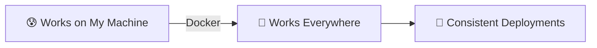
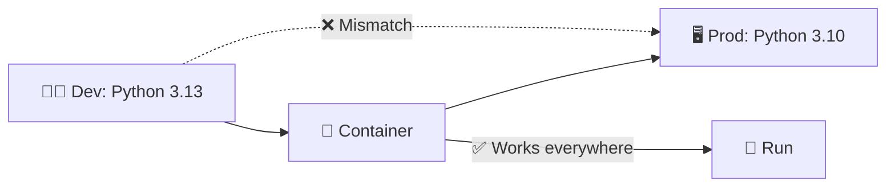
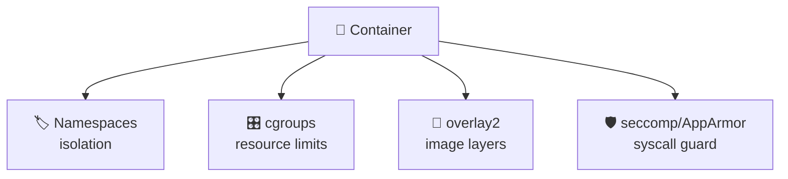
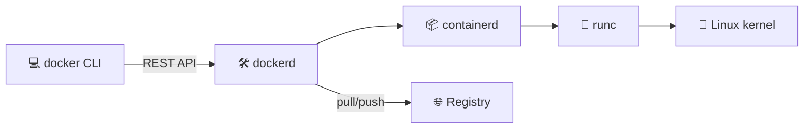
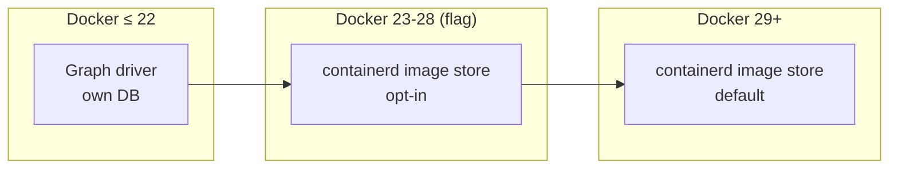
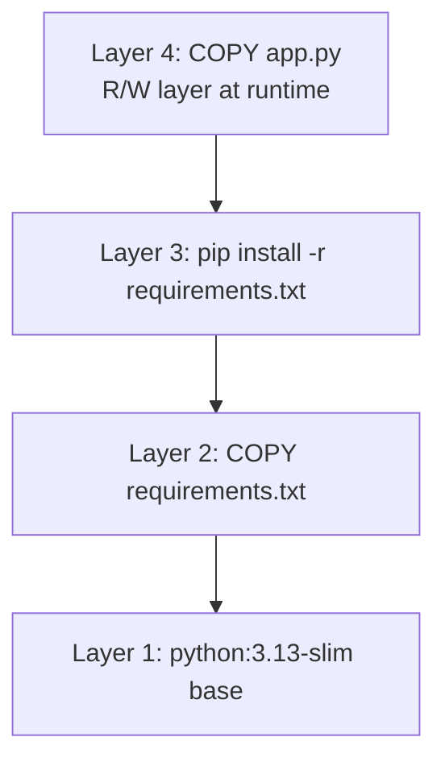
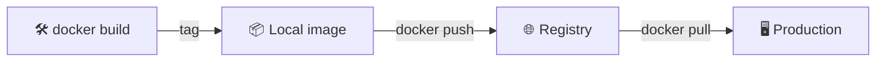
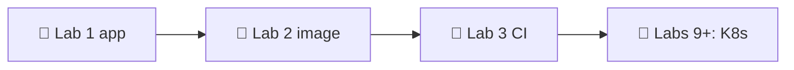

# 📌 Lecture 2 — Containerization with Docker: From "Works on My Machine" to Works Everywhere

## 📍 Slide 1 – 🐳 Welcome to Containerization

* 🌍 **"Works on my machine"** — the most expensive phrase in software (Lecture 1's running joke, now we fix it)
* 📦 **Containers** = package your app + dependencies + runtime into a single shippable unit
* 🚀 **Docker** = the tool that made containers mainstream in 2013
* 🎯 This lecture: build production-grade containers — small, secure, reproducible



> 🔗 **Tie-in to Lab 2:** you'll containerize the Python service from Lab 1. By the end you'll have a multi-stage Dockerfile under 100MB final image.

---

## 📍 Slide 2 – 🎯 Learning Outcomes

| # | Outcome |
|---|---------|
| 1 | 🧠 Explain how Linux namespaces and cgroups make containers possible |
| 2 | 📝 Write production-ready Dockerfiles |
| 3 | 🔐 Apply rootless and distroless patterns |
| 4 | 📦 Cut image size with multi-stage builds |
| 5 | 🚀 Push and pull from Docker Hub or GHCR |

**Tech stack pinned for May 2026:** Docker Engine **29.5+** (released May 2026; containerd image store is now default), BuildKit on by default, Compose v2 in Go (Python compose v1 reached EOL July 2023).

---

## 📍 Slide 3 – ❓ The Big Question

* 📊 **~65%** of organizations run containers in production (CNCF Annual Survey 2024)
* 🐳 Docker Hub holds **15M+** public images, serves **~17B** pulls per month
* 💥 Yet a 2024 Snyk scan found **~80%** of public images contain at least one HIGH-severity CVE

> 💬 *"Containers are the new deployment unit."* — Kelsey Hightower

**🤔 Discussion:** if every image is potentially vulnerable, what makes a "good" Dockerfile?

---

## 📍 Slide 4 – 🔥 The Dependency Problem

* 👨‍💻 **Dev box:** Python 3.13, glibc 2.40, OpenSSL 3.3
* 🖥️ **Prod box:** Python 3.10, glibc 2.31, OpenSSL 1.1
* 💥 App crashes in prod with `GLIBC_2.34 not found` — and nobody can reproduce locally



The container freezes the *entire userspace* — interpreter, libraries, system tools — into one immutable artifact. Only the kernel is shared.

---

## 📍 Slide 5 – 😱 The VM Solution (and Why Containers Won)

VMs solved isolation in the 2000s by virtualizing **hardware**: a full OS per app.

| 📊 | 🖥️ VM | 🐳 Container |
|----|------|-------------|
| Boot time | minutes | seconds |
| Overhead | full OS per app (~GB) | shared kernel (~MB) |
| Density per host | tens | hundreds to thousands |
| Image size | 1–10 GB | 5 MB – 1 GB |
| Isolation | hardware-level | process-level + namespaces |

> 🔥 **The trade-off:** containers are weaker isolation. A kernel CVE escapes containers but not VMs. That's why production K8s clusters often run on VMs.

---

## 📍 Slide 6 – 📜 A Brief History of Containers

* 📅 **1979** — `chroot()` added to Unix V7. The ancestor of all containers.
* 📅 **2000** — FreeBSD Jails: chroot + process isolation.
* 📅 **2008** — **LXC** (Linux Containers): namespaces + cgroups together.
* 📅 **2013** — **Docker** open-sourced by dotCloud (renamed). Solomon Hykes's PyCon demo goes viral.
* 📅 **2015** — Docker donates the container runtime spec (OCI). Containerd separates from Docker.
* 📅 **2016** — Kubernetes hits 1.0; container orchestration becomes the production story.
* 📅 **2020** — Kubernetes deprecates Docker as a runtime (uses containerd directly). Docker images still work — they're OCI.
* 📅 **2023** — Docker Compose v1 (Python) reaches EOL July 2023. **Compose v2 (Go)** is the standard.
* 📅 **2026** — Docker Engine **29** released (May 2026). Containerd image store becomes the default for new installs — finishes the "Docker is becoming containerd + tooling" trajectory that started in 2015.

---

## 📍 Slide 7 – 🐧 The Kernel Primitives That Make It Work

Containers are not a feature — they're a *composition* of Linux features:

| Primitive | What it isolates |
|-----------|------------------|
| 🏷️ **Namespaces** (PID, NET, MNT, UTS, IPC, USER, CGROUP) | Process trees, networks, mounts, hostname, IPC, UIDs, cgroup view |
| 🎛️ **cgroups (v2)** | CPU, memory, block I/O, PIDs — *quotas*, not isolation |
| 📂 **Union filesystems** (overlay2) | Stacked read-only layers + one R/W layer = the image model |
| 🛡️ **Capabilities + seccomp + AppArmor** | What syscalls a container is allowed to make |



> 📖 *Containers from Scratch* (Liz Rice talk, 2017) — builds a container in 100 lines of Go using these primitives.

---

## 📍 Slide 8 – 🏗️ Docker Architecture



* **`docker` CLI** — what you type
* **`dockerd`** — the daemon; talks to containerd via gRPC
* **`containerd`** — the OCI runtime manager (also used directly by K8s)
* **`runc`** — the actual process spawner that calls the kernel
* **Registry** — Docker Hub, GHCR, ECR, GAR, Harbor — stores images

> 📝 **Rootless Docker** (default since Docker 23): `dockerd` runs as your user, not root. Adopt it.

---

## 📍 Slide 9 – 🔁 Docker 29 and the containerd Image Store

For a decade, Docker had its own image store (the *graph driver* — `overlay2`, `aufs`, etc.). containerd had a *different* image store. Same OCI images on disk, but two databases describing them. Docker 23 introduced the containerd image store as a feature flag in 2023; **Docker 29 (May 2026) makes it the default for new installs**.

Why students should care:
* 🪞 **Lazy pulls** — pull only the layers you actually need (eStargz / SOCI)
* 🖥️ **Multi-platform images locally** — `docker buildx build --platform linux/amd64,linux/arm64` finally works without registry round-trips
* 📦 **Better disk reclamation** — image GC matches what `nerdctl` and Kubernetes already do
* 🧹 **One image database** on the host instead of two



> 🔥 **Hot take:** Docker the engine is now mostly a polished UX on top of containerd + BuildKit. That's a *good* thing for the ecosystem; it means Kubernetes, nerdctl, podman and Docker agree on the runtime.

---

## 📍 Slide 10 – 📚 Image Layers — The Mental Model

Every Dockerfile instruction creates a **read-only layer**. Layers are stacked via overlayfs; the running container adds one R/W layer on top.



**Why this matters:**
* 🚀 Layers are **cached** — unchanged steps don't rebuild
* 📦 Layers are **shared** — three images using the same base each store the base once
* 💀 Layers are **additive** — deleting a file in a later layer hides it but the layer above still has it

> 🔥 **Anti-pattern:** `COPY secrets.env / && rm secrets.env` does NOT remove the secret. It's still in the earlier layer. Treat every layer as forever.

---

## 📍 Slide 11 – 📝 Dockerfile Basics — Read This Twice

```dockerfile
# 🏗️ Base image — alpine, debian-slim, distroless, scratch
FROM python:3.13-slim

# 👤 Don't run as root (we'll harden this later)
RUN useradd --create-home --shell /bin/bash app
USER app
WORKDIR /home/app

# 📦 Dependencies FIRST (changes rarely → cached)
COPY --chown=app:app requirements.txt .
RUN pip install --user --no-cache-dir -r requirements.txt

# 💻 App code LAST (changes often → only this layer rebuilds)
COPY --chown=app:app . .

# 🚪 Document the port
EXPOSE 8080

# 🚀 Use exec form (PID 1 = your app → signals work)
CMD ["python", "app.py"]
```

> ⚠️ **PID 1 trap:** shell form (`CMD python app.py`) makes `/bin/sh` PID 1 and your app PID 2 — signals (SIGTERM) never reach it. Always use exec form `CMD ["python", "app.py"]`.

---

## 📍 Slide 12 – ⚡ Before vs After Docker

| 😰 Without Docker | 🚀 With Docker |
|---|---|
| README has 14 steps of `apt-get install` | `docker run myapp` |
| "Works on Linux, not Windows" | Works the same on Linux/macOS/Windows (with Linux containers) |
| Production drift accumulates | Image is immutable; rebuilds are reproducible |
| Onboarding a new dev takes hours | `docker compose up` and code |
| One bad dependency = whole-server reinstall | `docker stop && docker rm && docker run` — done |

---

## 📍 Slide 13 – 🎮 Scenario 1: Running as Root

**The failure:**
```dockerfile
FROM python:3.13-slim
COPY . /app
CMD ["python", "/app/server.py"]
```
This runs as **root inside the container**. A kernel CVE (e.g., CVE-2022-0185, the FILESYSTEM\_MOUNT escape) lets the process become root on the host. That's container escape.

**The fix — drop privileges:**
```dockerfile
FROM python:3.13-slim
RUN useradd --uid 10001 --create-home --shell /bin/bash app
WORKDIR /home/app
COPY --chown=app:app . .
USER 10001     # 👤 numeric UID survives renames
CMD ["python", "server.py"]
```

> 🔒 **Bonus:** add `--read-only` and `--cap-drop=ALL` at `docker run` time. Lab 2 walks through this.

---

## 📍 Slide 14 – 🐌 Scenario 2: Slow Builds (Bad Layer Order)

**Wrong order — every code change re-installs all dependencies (5 minute build):**
```dockerfile
COPY . /app                 # 🚫 Every change invalidates everything below
RUN pip install -r /app/requirements.txt
```

**Correct order — dependency layer cached until `requirements.txt` changes:**
```dockerfile
COPY requirements.txt .     # ✅ Rarely changes
RUN pip install -r requirements.txt
COPY . .                    # ✅ Code changes don't bust the deps layer
```

**Rule of thumb:** order layers from **least-frequently-changing** to **most**. Base → system packages → language deps → app code.

---

## 📍 Slide 15 – 📦 Scenario 3: Bloated Images

A naive Python image is **~1.2 GB**. That's a problem:
* 🐢 Slow `docker pull` → slow deploys, slow autoscale
* 💸 Storage and egress costs scale with image size
* 🛡️ Bigger image = more packages = more CVEs

**Slim it:**
| Base image | Size | Trade-off |
|------------|-----:|-----------|
| `python:3.13` (debian) | ~1.2 GB | comprehensive |
| `python:3.13-slim` | ~150 MB | no man pages, fewer system libs |
| `python:3.13-alpine` | ~60 MB | musl libc — some wheels break |
| `gcr.io/distroless/python3` | ~50 MB | no shell, no package manager |
| `scratch` (for Go/Rust) | ~10 MB | nothing but your binary |

---

## 📍 Slide 16 – 📁 Scenario 4: No `.dockerignore`

Without `.dockerignore`, `COPY . .` ships your local `node_modules/`, `.git`, `.venv`, IDE configs, and **secrets** into the image. The build context can be hundreds of MB.

```gitignore
# .dockerignore — same syntax as .gitignore
.git
.venv
venv/
__pycache__/
node_modules/
.env
*.pyc
docs/
tests/
README.md
.idea/
.vscode/
```

> 🔍 **Real story:** in 2022, Toyota leaked customer data because a `.git` folder was included in a deployed container. Always have a `.dockerignore`.

---

## 📍 Slide 17 – 🚀 Multi-Stage Builds: The Big Trick

Compile in a heavy image, **copy only the artifact** into a tiny final image.

```dockerfile
# 🏗️ Build stage: full toolchain
FROM golang:1.23 AS build
WORKDIR /src
COPY . .
RUN CGO_ENABLED=0 go build -o /app ./cmd/server

# 🚀 Final stage: just the binary
FROM gcr.io/distroless/static-debian12
COPY --from=build /app /app
USER nonroot:nonroot
ENTRYPOINT ["/app"]
```

Result for a typical Go service:
* Single-stage `golang:1.23` image: **~900 MB**
* Multi-stage distroless image: **~15 MB**
* Same binary, **60× smaller**, **zero shell**, **zero package manager**

> 🔗 **Lab 2 bonus:** rewrite your Lab 1 Go app as a multi-stage distroless build.

---

## 📍 Slide 18 – 🔐 Distroless and `scratch`

**Distroless** (Google, 2018): images with your runtime + your app, but **no shell, no apt, no busybox**. Drastically reduces attack surface.

```dockerfile
# ❌ Standard slim — debug-friendly, larger, more CVEs
FROM python:3.13-slim
COPY . /app
CMD ["python", "/app/server.py"]

# ✅ Distroless — production
FROM gcr.io/distroless/python3-debian12
COPY --from=build /app /app
CMD ["/app/server.py"]
```

**`scratch`** — the empty image. Use only for statically-linked binaries (Go with `CGO_ENABLED=0`, Rust with musl). 0 CVEs because there's literally nothing else.

> 📖 **Liz Rice's *Container Security* (O'Reilly, 2020)** — the reference on hardening images.

---

## 📍 Slide 19 – 🌐 Docker Hub & Registries



| Registry | Notes |
|----------|-------|
| 🐳 **Docker Hub** | Default; 1 free private repo; rate limits hurt CI |
| 🐙 **GHCR** (ghcr.io) | Free for public, integrated with GitHub Actions |
| ☁️ **ECR / GAR / ACR** | Cloud-native; IAM-gated; recommended for AWS/GCP/Azure prod |
| 🏠 **Harbor** | Self-hosted; CNCF graduated; image signing + vuln scan built in |

**Image references:** `[registry/]namespace/repo[:tag][@digest]`
- `nginx` → `docker.io/library/nginx:latest`
- `ghcr.io/innodevops/lab2-app:v1.2.3@sha256:abc…` — pin by digest for production

---

## 📍 Slide 20 – 🏷️ Tagging Strategies

> 🚫 **Never deploy `:latest` to production.** It's mutable; you can't reproduce yesterday's deploy.

| Strategy | Example | When |
|----------|---------|------|
| 📌 **SemVer** | `v1.4.2` | Library or product release |
| 🔢 **Git SHA** | `git-3a7f29c` | CI builds; always unique |
| 📅 **CalVer** | `2026.04.0` | Time-driven release cadence |
| 🌿 **Branch** | `main`, `develop` | Dev-time only |
| 🔒 **Digest pin** | `@sha256:…` | Production — immutable |

**Recommended:** push two tags per build — a SemVer-or-SHA tag for reproducibility, plus a moving `main` tag for convenience. Production references the immutable one.

---

## 📍 Slide 21 – 🛡️ Container Security Best Practices

A checklist you can apply to any Dockerfile:

1. ✅ **Pin base image versions** — `python:3.13-slim`, not `python:slim` or `python:latest`
2. ✅ **Drop to a non-root UID** — `USER 10001`
3. ✅ **Add a `HEALTHCHECK`** so the orchestrator knows when your app is alive
4. ✅ **Don't bake secrets in** — `--build-arg` is visible in `docker history`; use BuildKit secrets or runtime env
5. ✅ **Set `WORKDIR`** explicitly — `/app`, not `/` or `~`
6. ✅ **Use `COPY` not `ADD`** unless you specifically need URL fetching or tar auto-extract
7. ✅ **Scan images** — Trivy, Grype, or Snyk in CI; gate the build on HIGH/CRITICAL CVEs
8. ✅ **Sign images** — cosign + Sigstore; verify in admission controller (covered in DevSecOps elective)

```bash
# 🔍 Lab 2 will use this
trivy image --severity HIGH,CRITICAL --exit-code 1 myapp:v1.0.0
```

---

## 📍 Slide 22 – 🐙 Compose: Multi-Container Locally

`docker-compose.yml` describes a multi-container stack declaratively — perfect for local dev and CI smoke tests.

```yaml
services:
  app:
    build: ./app_python
    ports: ["8080:8080"]
    environment:
      DATABASE_URL: postgres://db:5432/app
    depends_on:
      db:
        condition: service_healthy
  db:
    image: postgres:17
    healthcheck:
      test: ["CMD-SHELL", "pg_isready -U postgres"]
      interval: 5s
    environment:
      POSTGRES_PASSWORD: dev
```

> 🔗 **You'll use Compose in Labs 6, 7, 8.** For production multi-container workloads, Kubernetes (Lab 9+) takes over.

---

## 📍 Slide 23 – 🌍 Container Patterns at Real Companies

* 🎬 **Netflix** — every microservice ships as a container image; thousands of builds/day pushed to S3-backed internal registry.
* 📦 **Amazon (Bottlerocket)** — container-optimized OS, the host runs almost nothing else.
* 🔍 **Google** — invented containers in production (Borg, 2003); pushes ~2 billion containers/week internally.
* 💬 **GitHub** — *every* PR runs in a container via Actions; ~100 million containers/month.
* 🏦 **Capital One** — moved core banking from VMs to containers on EKS; cut compute costs ~40%.

> 🔥 **Common thread:** containers are how modern engineering organisations ship at scale.

---

## 📍 Slide 24 – 🎯 Key Takeaways

1. 📦 **Containers are not magic** — namespaces + cgroups + overlayfs + a registry
2. 🏗️ **Order layers from stable to volatile** — keep caches warm
3. 👤 **Never run as root** — drop to a non-zero UID, ideally numeric
4. 🛡️ **Multi-stage + distroless** — smaller image, fewer CVEs, faster pulls
5. 🏷️ **Tag by SemVer or SHA; never deploy `:latest`**
6. 🔍 **Scan every image in CI** — Trivy or Grype, gate on HIGH/CRITICAL
7. 📄 **`.dockerignore` is not optional** — keeps secrets and `.git` out

> 💡 **A good Dockerfile is small, secure, and reproducible. Two out of three is a bug.**

---

## 📍 Slide 25 – 🧠 The Mindset Shift

| 😰 Old | 🚀 Container-native |
|-------|---------------------|
| "Set up the server" | Define the environment in a `Dockerfile` |
| "Update the production box" | Build a new image, redeploy |
| "Works on my machine" | Works in the image, image works everywhere |
| "Big monolith on a VM" | Many small services, each a container |
| Image is a black box | Image is a versioned artifact, scanned and signed |

---

## 📍 Slide 26 – 🚀 What Comes Next

**📚 Next lecture: *Continuous Integration*** — every push runs tests, builds an image, and scans it before merging.

* 🔄 Why CI prevents the failures you saw in Lecture 1
* 🛠️ GitHub Actions workflow syntax
* 🧪 Testing pyramid: unit → integration → end-to-end
* 🐳 Building and pushing your Lab 2 image automatically

**🔬 Lab 2:** containerize your Lab 1 service with a multi-stage Dockerfile, scan it with Trivy, push to GHCR. The image you build this week will follow your service through every remaining lab — K8s deploys it (Lab 9), Helm packages it (Lab 10), ArgoCD ships it (Lab 13).



**👋 See you in Lecture 3.**

---

## 📚 Resources

* 📕 *Docker Deep Dive* — Nigel Poulton (latest ed. covers BuildKit + Compose v2)
* 📕 *Container Security* — Liz Rice, O'Reilly 2020 (free PDF at aquasec.com)
* 🎥 *Containers from Scratch* — Liz Rice GopherCon talk (YouTube, 2017)
* 🌐 [docs.docker.com](https://docs.docker.com) — official Docker docs (Engine 27.x)
* 🌐 [distroless](https://github.com/GoogleContainerTools/distroless) — Google's distroless images
* 🌐 [opencontainers.org](https://opencontainers.org) — OCI spec (image + runtime + distribution)
* 🌐 [CIS Docker Benchmark](https://www.cisecurity.org/benchmark/docker) — hardening checklist

**🎓 Quiz:** post-lecture quiz feeds the weeks 1–3 leaderboard window.
