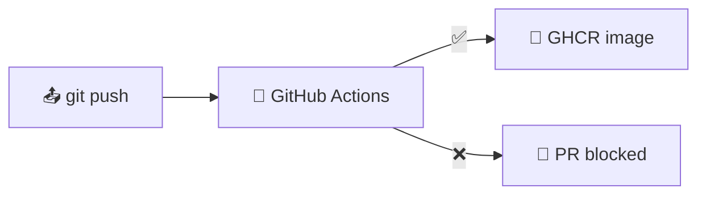
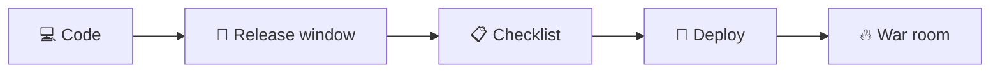
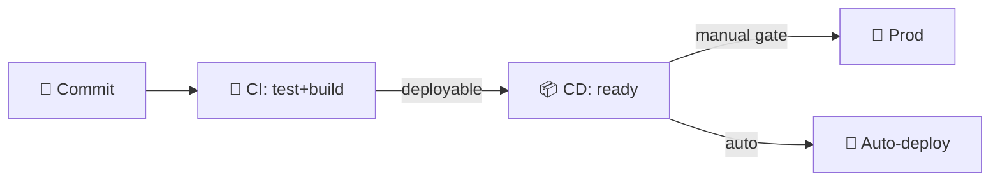
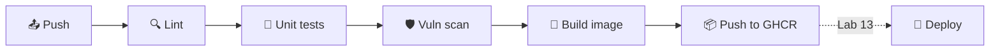
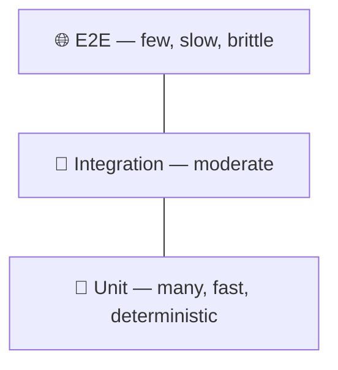
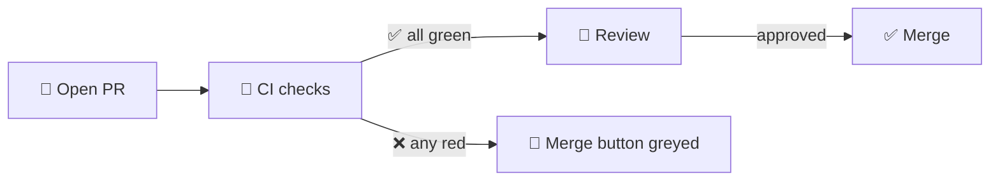
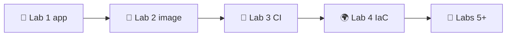

# 📌 Lecture 3 — Continuous Integration: From "Merge Week" to Green on Every Push

## 📍 Slide 1 – 🤖 Welcome to CI/CD

* 🐳 Lecture 2 ended with an image that "works everywhere" — but only if you remember to rebuild, scan, and push it
* 🤖 **Continuous Integration** makes that "if" a "when": every commit runs the same pipeline, on the same runner, with the same scanner
* 🎯 This lecture: build the GitHub Actions workflow Lab 3 asks for — test → lint → scan → build → publish, gated on every PR
* 🔗 **Lab 3 builds this exact workflow** for the Python service from Lab 1 and the image from Lab 2



> 📚 **Frame:** CI is the bridge between "I changed code on my laptop" (Lec 1) and "this exact image runs in K8s" (Lec 9). Skip CI and the bridge is a leap of faith.

---

## 📍 Slide 2 – 🎯 Learning Outcomes

| # | Outcome |
|---|---------|
| 1 | 🧠 Define CI, CD, and CDeploy in Humble & Farley's terms |
| 2 | 🔺 Apply the test pyramid — unit-heavy, integration-thin, E2E-rare |
| 3 | 📝 Read and write a GitHub Actions workflow from scratch |
| 4 | 🛡️ Gate merges on Trivy vulnerability scans and required checks |
| 5 | 🏷️ Choose SemVer vs CalVer and tag images accordingly |
| 6 | ⚡ Diagnose slow CI — caching, matrices, path filters, concurrency |

---

## 📍 Slide 3 – 🛠️ Tech Stack (Pinned for May 2026)

| Component | Version | Why pinned |
|-----------|--------:|------------|
| Runner | `ubuntu-24.04` | LTS; `ubuntu-latest` rotates and breaks reproducibility |
| `actions/checkout` | `@v4` | Node 20 runtime; v3 was deprecated Feb 2024 |
| `actions/setup-python` | `@v5` | Built-in `cache: pip` keyed off `requirements.txt` |
| `docker/build-push-action` | `@v6` | BuildKit + multi-platform; v5 EOL April 2025 |
| `docker/metadata-action` | `@v5` | SemVer/CalVer/SHA tags in one step |
| Trivy | `v0.69.3+` | ⚠️ Mar 2026 supply-chain attack (v0.69.4 malicious — see Slide 15); CVE DB updated daily; alternatives: Grype, Snyk (paid) |
| Cosign | `2.4` | Sigstore client; image signing covered in DevSecOps elective |
| pytest | `8.3+` | Python 3.13 compatible |

> 📌 **Pin actions to a major tag** (`@v4`), pin tools to a minor version, pin base images by digest in production. Lab 3 enforces the first two.

---

## 📍 Slide 4 – ❓ The Big Question

* 📊 **DORA 2024:** elite teams deploy on-demand, multiple times per day; low performers deploy less than once a month
* 🐛 **Capers Jones (2012):** fixing a prod bug costs **30–100×** the cost of catching it in dev
* 🔍 **Sonatype 2024:** 1 in 8 open-source downloads carries a known vulnerability — deps are the attack surface

> 💬 *"If it hurts, do it more often."* — Martin Fowler, *Continuous Integration* (2006)

---

## 📍 Slide 5 – 🔥 The Problem: Manual Testing Hell

A team without CI looks like this:

* 📋 50-step manual checklist before each release
* 🗓️ Releases monthly because each one takes a full day
* 😴 The QA engineer forgot to test `/health` again
* 💥 Production breaks; nobody can replay what was deployed



> 📖 Lecture 1 named this *Manual Release Hell*. CI is the practice that retires it.

---

## 📍 Slide 6 – 💥 The Integration Problem ("Merge Week")

Before CI, integrating long-lived branches was a scheduled event:

* 🌿 Five devs on feature branches for **3 weeks**
* 📅 "Integration Friday" — everyone merges into `main` at once
* 🔀 Hours of conflict resolution; nobody understands the diffs
* 💀 `main` broken for a week; nobody can ship

> 📖 Kent Beck (*Extreme Programming*, 1999) prescribed the cure: **integrate at least daily**. Humble & Farley codified it in *Continuous Delivery* (2010).

**The fix:** small commits, trunk-based development, every push validated by CI.

---

## 📍 Slide 7 – 🔓 The Security Gap

Lecture 2 ended with `trivy image`. Run it once, by hand, and you'll forget — and a CVE published next Tuesday won't ring any bells.

* 🔍 **Sonatype 2024:** average enterprise app pulls **180+ open-source dependencies**
* ⏱️ Median time-to-detect a vulnerable dep without scanning: **218 days** (Snyk *State of Open Source 2024*)
* 🤖 **GitGuardian 2024:** leaked credentials in public repos are found by scanner bots in **under 5 minutes**

> 🔥 **CI is where security shifts left** — the scan runs on every PR, not "when we have time".

---

## 📍 Slide 8 – 💡 What CI/CD Actually Is

Three terms, often conflated. Humble & Farley's *Continuous Delivery* (2010) draws the lines:

| Term | Definition | Trigger |
|------|------------|---------|
| 🤖 **Continuous Integration** | Every commit is built and tested in a shared trunk | Push / PR |
| 📦 **Continuous Delivery** | Every passing commit is **deployable** at any time | Merge to `main` |
| 🚀 **Continuous Deployment** | Every passing commit is **automatically deployed** to prod | Merge to `main` |



> 📖 Jez Humble: *"Continuous Delivery is not Continuous Deployment. The difference is who pushes the button."*

---

## 📍 Slide 9 – 🔄 Pipeline Anatomy

Every modern CI pipeline has the same skeleton — Lab 3 builds the boxed steps:



* 🔍 **Lint** — `ruff` / `flake8` / `pylint`. Seconds.
* 🧪 **Test** — `pytest` against Lab 1's endpoints. Tens of seconds.
* 🛡️ **Scan** — Trivy or Grype on deps and image. ~1 min.
* 🐳 **Build** — Lab 2's multi-stage Dockerfile, BuildKit cached.
* 📦 **Publish** — GHCR (free for public, GitHub-native, `GITHUB_TOKEN`).

> 🔗 Deploy (dashed) is Lecture 13 / Lab 13 — ArgoCD watches the registry.

---

## 📍 Slide 10 – 🔺 The Testing Pyramid

Mike Cohn's pyramid (*Succeeding with Agile*, 2009) is still the model:



| Layer | Share | Speed | Catches |
|-------|------:|------:|---------|
| 🧪 Unit | ~70% | ms | Logic bugs in pure functions |
| 🔗 Integration | ~20% | seconds | Wrong HTTP status, DB query shape |
| 🌐 E2E | ~10% | minutes | Cross-service flows, UI |

> ⚠️ **Inverted pyramid (E2E-heavy) = slow, flaky CI.** Google's *Testing Blog* calls it the *ice-cream cone* anti-pattern. Lab 3 stays at the unit layer; integration tests appear in Lab 7+.

---

## 📍 Slide 11 – 📝 GitHub Actions Workflow Anatomy

A workflow is a YAML file under `.github/workflows/`. Read these keys top-to-bottom:

```yaml
name: Python CI                    # 👁️ shown in the Actions tab
on:                                # ⚡ triggers
  push: { branches: [main] }
  pull_request:
permissions:                       # 🔒 minimum required
  contents: read
  packages: write                  # for GHCR push
concurrency:                       # ♻️ cancel superseded runs on the same PR
  group: ci-${{ github.ref }}
  cancel-in-progress: true

jobs:
  test:
    runs-on: ubuntu-24.04          # 📌 pinned, not :latest
    steps:
      - uses: actions/checkout@v4
      - uses: actions/setup-python@v5
        with: { python-version: "3.13", cache: pip }
      - run: pip install -r requirements.txt -r requirements-dev.txt
      - run: ruff check .
      - run: pytest -q
```

> 📌 **Pin actions to a major tag** (`@v4`). Pinning to `@main` lets an upstream compromise silently land in your CI (cf. **tj-actions/changed-files** supply-chain attack, **March 14-15, 2025**, **CVE-2025-30066** — 23,000+ repos leaked secrets in CI logs; fixed in v46.0.1).

---

## 📍 Slide 12 – 🧩 Jobs, Steps, Needs, Matrices

* 🧱 **Workflow** → many **jobs** → many **steps**
* 🧱 **Jobs run in parallel** by default; sequence them with `needs:`
* 🧱 **Each job is a fresh VM** — files don't carry between jobs unless you `upload-artifact`/`download-artifact`
* 🧱 **Matrices** fan out one job over many parameters

```yaml
jobs:
  test:
    strategy:
      fail-fast: false             # don't kill 3.12 when 3.13 fails
      matrix:
        python-version: ["3.11", "3.12", "3.13"]
    runs-on: ubuntu-24.04
    steps:
      - uses: actions/setup-python@v5
        with: { python-version: "${{ matrix.python-version }}" }
      - run: pytest

  docker:
    needs: test                    # 🔗 only runs if every matrix cell passed
    runs-on: ubuntu-24.04
    steps: ...
```

> 💡 **Concurrency × matrix:** 3 jobs × N PRs can drain free-tier minutes fast. Always set `cancel-in-progress` (Slide 11).

---

## 📍 Slide 13 – 🎮 Scenario 1: No Tests → pytest in CI

**The failure:**

```python
# app.py from Lab 1
@app.route("/")
def home():
    return {"message": "Hello", "hostname": os.environ["HOSTNAME"]}
```

A typo in `os.environ` raises `KeyError`. It works on the dev's laptop because their `HOSTNAME` is set; it crashes in the container where it isn't.

**The fix — pytest under CI:**

```python
# tests/test_app.py
def test_home_returns_hostname_field(client, monkeypatch):
    monkeypatch.delenv("HOSTNAME", raising=False)
    r = client.get("/")
    assert r.status_code == 200
    assert "hostname" in r.get_json()

def test_health_endpoint(client):
    r = client.get("/health")
    assert r.status_code == 200
    assert r.get_json()["status"] == "healthy"
```

> 🔗 **Lab 3 Task 1** asks you to write exactly these tests for `/` and `/health` — and to justify pytest vs unittest. Pytest's fixtures + plain `assert` win for most projects.

---

## 📍 Slide 14 – 🎮 Scenario 2: Manual Docker Builds → build-push-action

**The failure (Lab 2's manual flow):**

```bash
docker build -t myapp:latest .
docker tag myapp:latest ghcr.io/me/myapp:v1.2.3
docker login ghcr.io                       # ← typed by hand
docker push ghcr.io/me/myapp:v1.2.3
docker push ghcr.io/me/myapp:latest
# 😱 forgot to push :v1.2.3 → prod runs yesterday's bug
```

**The fix:**

```yaml
docker:
  needs: test
  runs-on: ubuntu-24.04
  permissions: { contents: read, packages: write }
  steps:
    - uses: actions/checkout@v4
    - uses: docker/login-action@v3
      with:
        registry: ghcr.io
        username: ${{ github.actor }}
        password: ${{ secrets.GITHUB_TOKEN }}    # 🔒 ephemeral, no secret to rotate
    - uses: docker/metadata-action@v5
      id: meta
      with:
        images: ghcr.io/${{ github.repository }}
        tags: |
          type=semver,pattern={{version}}
          type=sha,prefix=git-
          type=raw,value=latest,enable={{is_default_branch}}
    - uses: docker/build-push-action@v6
      with:
        context: ./app_python
        push: true
        tags: ${{ steps.meta.outputs.tags }}
        cache-from: type=gha
        cache-to: type=gha,mode=max
```

> 🔗 **Lab 3 Task 2** builds this exact job. `GITHUB_TOKEN` is auto-provisioned per run — no Docker Hub credentials to manage.

---

## 📍 Slide 15 – 🎮 Scenario 3: Vulnerable Dependencies → Trivy + Dependabot

**The failure:**

```
# requirements.txt
flask==2.0.1            # CVE-2023-30861 (high) — session cookie disclosure
requests==2.25.0        # CVE-2023-32681 (medium) — proxy auth leak
```

Lecture 2 introduced `trivy image`. CI runs it on every PR.

```yaml
- uses: aquasecurity/trivy-action@0.35.0   # 📌 v0.35.0+ post-incident-safe (see callout)
  with:
    scan-type: fs                      # scan requirements.txt + lockfiles
    severity: HIGH,CRITICAL
    exit-code: "1"                     # 🚫 fail the job
    ignore-unfixed: true               # skip CVEs with no patch yet
```

> ⚠️ **The Trivy supply-chain attack (March 19, 2026 — CVE-2026-33634).** A malicious **Trivy v0.69.4** binary was published to the official GitHub release page after the maintainer's signing keys were compromised. Any CI job that pinned `trivy-action` to floating `master`/`latest`, or that called `curl -sfL .../install.sh | sh` on Mar 19-20, executed attacker code on the runner — with full access to the CI secret store. The fix shipped within 24h (Trivy **v0.69.3** rolled back to the last-known-good build; `trivy-action **v0.35.0+`**, `setup-trivy **v0.2.6+`** are post-incident-safe). **Lesson for this lecture:** the *scanner itself* is in your supply chain. Pin it. Verify its signature. The exact same pattern (compromised maintainer → malicious release) sank tj-actions/changed-files a year earlier — twice in 12 months for two of the most-used security tools in CI/CD.


**Pair with Dependabot** (`.github/dependabot.yml` — native, no token, no third party):

```yaml
version: 2
updates:
  - package-ecosystem: pip
    directory: /app_python
    schedule: { interval: weekly }
  - package-ecosystem: github-actions  # 🔒 keep actions/checkout@v4 fresh
    directory: /
    schedule: { interval: weekly }
```

> 🛡️ **Tool choice:** Trivy (Aqua, Apache-2.0) and Grype (Anchore, Apache-2.0) are first-class FOSS. Snyk is feature-rich but paid past the free tier. Lab 3 accepts any of the three.

---

## 📍 Slide 16 – 🎮 Scenario 4: Slow CI → Caching

```
[Run 1] pip install ........................ 2m 18s
[Run 2] pip install ........................ 2m 14s     # identical deps
[Run 3] pip install ........................ 2m 21s     # 😴 still downloading
```

**The fix — built into `setup-python`:**

```yaml
- uses: actions/setup-python@v5
  with:
    python-version: "3.13"
    cache: pip
    cache-dependency-path: app_python/requirements.txt
```

The cache key is `runner.os + python-version + hash(requirements.txt)`. Touch `requirements.txt` and the cache invalidates automatically.

**Add Docker BuildKit cache** (Slide 14 already shows it):

```yaml
cache-from: type=gha
cache-to: type=gha,mode=max
```

**Path filters skip workflows for unrelated changes:**

```yaml
on:
  push:
    paths: ["app_python/**", ".github/workflows/python-ci.yml"]
```

**Measured impact on a typical Lab 3 setup:** 5m 30s → 45s on warm cache. ~7× faster.

> ⚠️ **Don't cache `~/.cache/pip` manually unless `setup-python` doesn't suit you** — the built-in cache handles invalidation correctly.

---

## 📍 Slide 17 – 📊 Coverage — Useful, Not Sacred

```yaml
- run: pytest --cov=app_python --cov-report=xml --cov-fail-under=70
- uses: codecov/codecov-action@v4
  with: { files: ./coverage.xml }
```

| Coverage | Reading |
|---------:|---------|
| < 50% | Likely no real test culture |
| 70–85% | Healthy for most application code |
| 95%+ | Library / safety-critical territory |
| 100% | Almost always wasteful — diminishing returns |

> 🔥 **Martin Fowler:** *coverage is a useful tool for finding untested code; it isn't a useful target.* High coverage with weak assertions is theatre.

---

## 📍 Slide 18 – 🔁 Reusable Bits

As your CI grows, copy-paste rots. GitHub gives you two reuse primitives:

| Tool | Scope | When |
|------|-------|------|
| 🧩 **Composite action** (`action.yml`) | A bundle of **steps** | "Setup Python + cache + install deps" |
| 🔁 **Reusable workflow** (`uses: org/repo/.github/workflows/x.yml@v1`) | A whole **job** | "Standard CI for every Python service" |

> 🔗 **Lab 3 doesn't require this** but production monorepos lean on it heavily. We'll revisit in Lecture 13.

---

## 📍 Slide 19 – 🏷️ Versioning: SemVer

`MAJOR.MINOR.PATCH` — Tom Preston-Werner's spec (semver.org, 2013).

| Bump | When | Example |
|------|------|---------|
| **MAJOR** | Breaking API change | `1.4.2 → 2.0.0` |
| **MINOR** | New backward-compatible feature | `1.4.2 → 1.5.0` |
| **PATCH** | Bug fix only | `1.4.2 → 1.4.3` |

`docker/metadata-action` can derive SemVer tags from a git tag (`git tag v1.2.3 && git push --tags`):

```yaml
tags: |
  type=semver,pattern={{version}}    # 1.2.3
  type=semver,pattern={{major}}.{{minor}}    # 1.2
  type=semver,pattern={{major}}    # 1
```

**Use SemVer for:** libraries, SDKs, APIs that downstream consumers pin.

---

## 📍 Slide 20 – 📅 Versioning: CalVer

`YYYY.MM.DD` or `YYYY.MM.PATCH` — calver.org, popularised by Ubuntu (`24.04`) and pip (`24.3`).

```yaml
- id: ver
  run: echo "v=$(date -u +%Y.%m.%d)" >> $GITHUB_OUTPUT
- uses: docker/build-push-action@v6
  with:
    tags: |
      ghcr.io/${{ github.repository }}:${{ steps.ver.outputs.v }}
      ghcr.io/${{ github.repository }}:latest
```

**Use CalVer for:** services with continuous deployment where "breaking change" doesn't apply because nobody else pins you (your own service, deployed by your own CI).

> 🚫 **Never deploy `:latest` to production.** It's mutable; tomorrow's image with the same tag is a different artifact. Pin by SemVer or by digest. (Same lesson as Lecture 2.)

---

## 📍 Slide 21 – 🛡️ Branch Protection: CI is Only Useful if It Blocks

A green CI badge is decoration. **Required status checks** are the gate.

In `Settings → Branches → Branch protection rules` for `main`:

* ✅ Require a pull request before merging (≥1 review)
* ✅ Require status checks to pass before merging — pick `test`, `docker`, `trivy`
* ✅ Require branches to be up to date before merging
* ✅ Require linear history (no merge commits) — keeps `git bisect` honest
* ✅ Do not allow bypassing the above (even admins)
* ✅ Restrict pushes that create matching branches



> 🔗 **Lab 3 Task 3** includes adding this protection to your fork.

---

## 📍 Slide 22 – 🚫 CI Anti-Patterns

| ❌ Anti-pattern | ✅ Fix |
|----------------|------|
| `runs-on: ubuntu-latest` | Pin: `ubuntu-24.04` |
| `actions/checkout@main` | Pin to a major tag (or SHA for high-risk actions) |
| Secrets in `env:` at workflow scope | Pass via `secrets:` at job scope, scope minimum permissions |
| 30-minute CI that everyone skips | Cache + path-filter + matrix-prune; target < 10 min |
| Tests that depend on prod URLs | Mocks/fixtures; the runner has no creds for a reason |
| `--ignore-unfixed` left on forever | Track unfixed CVEs in an issue; revisit weekly |
| Single workflow file, 800 lines | Split by concern; reusable workflows for shared jobs |
| Skipping CI with `[skip ci]` | Don't. The next person merges the regression. |

---

## 📍 Slide 23 – 📈 CI Metrics That Matter

Track these alongside your DORA metrics (Lec 1, Slide 23):

| Metric | Healthy target | Why |
|--------|---------------:|-----|
| ⏱️ **Pipeline duration (p50)** | < 10 min | Feedback latency — Forsgren's *Accelerate* correlates with deploy frequency |
| ✅ **Main-branch CI pass rate** | > 95% | Below that, flakes erode trust; people start ignoring red |
| 🔄 **Mean time to green** after red | < 1 hour | How fast you fix `main` |
| 🛡️ **CVEs caught in CI vs prod** | Mostly CI | Inverse of "leaked vulnerability lifetime" |
| 📦 **Cache hit rate** | > 80% | Direct cost driver on hosted runners |

> 📊 **Sources:** Forsgren et al., *Accelerate* (2018); CircleCI *State of Software Delivery 2024*.

---

## 📍 Slide 24 – 🏢 CI at Scale — Real Numbers

* 🐙 **GitHub itself** — ~100M Actions runs/month across public repos; every PR to `github/github` runs ~30k tests
* 🛒 **Shopify** — production deploys dozens of times per day; CI feedback under 5 minutes on the main monolith (Shopify Engineering, 2024)
* 🎬 **Netflix** — every microservice built and tested per commit; ~3000+ builds/day
* 🔍 **Google** — single trunk, **two billion** LOC, ~100M tests/day on Bazel (Winters et al., *Software Engineering at Google*, 2020)
* 🏦 **Capital One** — 50+ teams on shared reusable workflows; a platform team owns the pipeline so product teams don't reinvent it

> 🔥 **Common thread:** slow CI taxes every engineer, every day. A minute saved per run pays back across the org.

---

## 📍 Slide 25 – 🎯 Key Takeaways

1. 🤖 **CI integrates frequently** — every push, on a clean runner, on the same workflow
2. 🔺 **Pyramid: unit-heavy, integration-thin, E2E-rare** — the inverse is flaky and slow
3. 📌 **Pin everything** — runner OS, action major versions, base images by digest in prod
4. 🛡️ **Scan in CI, fix in PR** — Trivy or Grype on filesystem + image; Dependabot keeps deps fresh
5. ⚡ **Cache the right things** — `setup-python` for pip, BuildKit GHA cache for layers, path filters for irrelevant pushes
6. 🏷️ **SemVer for libraries, CalVer for services; never deploy `:latest`**
7. 🚦 **Required checks > badges** — branch protection is the part that matters
8. 📊 **Measure pipeline duration + pass rate** — slow, flaky CI gets ignored

> 💡 **A good pipeline is fast, deterministic, and boring. Excitement in CI is a smell.**

---

## 📍 Slide 26 – 🚀 What Comes Next

**📚 Next lecture: *Infrastructure as Code — Terraform & Pulumi*.** Your CI builds an image; Lecture 4 covers how the cloud resources that *run* the image get created reproducibly, in code, reviewed and applied through the same kind of pipeline you built today.

* 🌍 Declarative vs imperative provisioning
* 🏗️ Terraform 1.15 modules; Pulumi 3.x for code-native infra
* 🔐 Backend state, locking, drift detection
* 🧪 `terraform plan` as a CI gate — the same idea you applied to tests

**🔬 Lab 3 deliverable:**

* `app_python/tests/` with pytest covering `/` and `/health`
* `.github/workflows/python-ci.yml` — lint → test → Trivy → build → push to GHCR
* Branch protection on `main` requiring those checks
* Status + coverage badges in the README
* Bonus: a second workflow for your compiled-language app behind a `paths:` filter



**👋 See you in Lecture 4.**

---

## 📚 Resources

**📕 Books:**
* *Continuous Delivery* — Jez Humble & David Farley (Addison-Wesley, 2010). The canonical text.
* *Continuous Integration* — Duvall, Matyas, Glover (2007). Pre-cloud, principles unchanged.
* *Accelerate* — Forsgren, Humble, Kim (2018). The DORA science.
* *Software Engineering at Google* — Winters, Manshreck, Wright (2020). CI at trunk scale.

**🔗 Links:**
* 🌐 [docs.github.com/actions](https://docs.github.com/actions) — official reference
* 🌐 [github.com/aquasecurity/trivy](https://github.com/aquasecurity/trivy) / [anchore/grype](https://github.com/anchore/grype)
* 🌐 [semver.org](https://semver.org) / [calver.org](https://calver.org)
* 🌐 [martinfowler.com/articles/continuousIntegration.html](https://martinfowler.com/articles/continuousIntegration.html) — Fowler, 2006

**🛠️ Local tooling:** [`act`](https://github.com/nektos/act) (run Actions locally), [`actionlint`](https://github.com/rhysd/actionlint) (lint workflows), [`gh`](https://cli.github.com/) (`gh run watch`).

**🎓 Quiz:** post-lecture quiz feeds the weeks 1–3 leaderboard window (see `README.md` → Grading).
