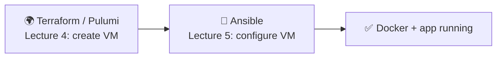
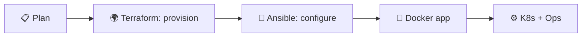
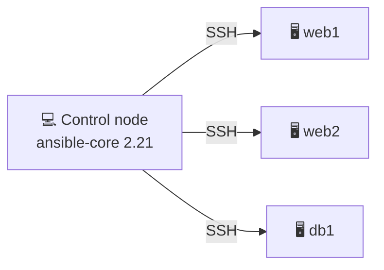
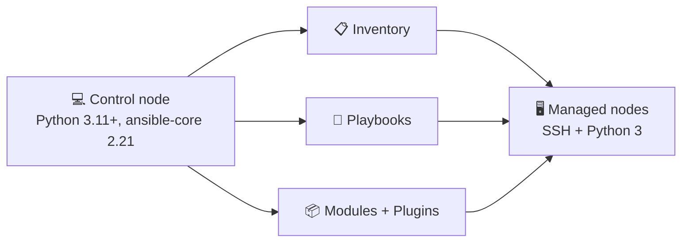
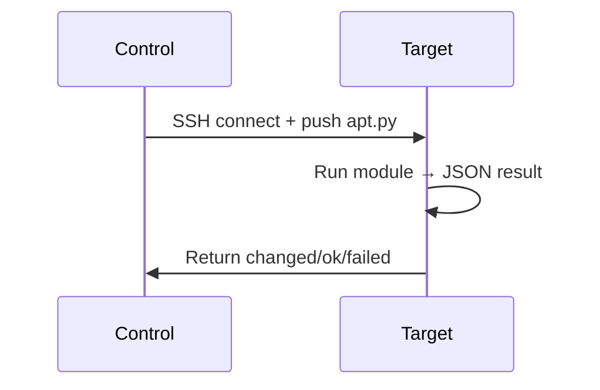
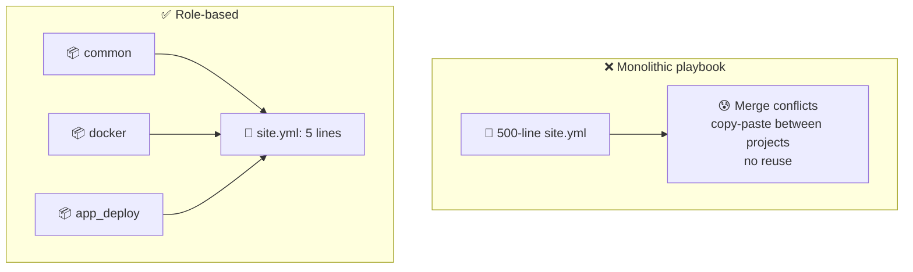
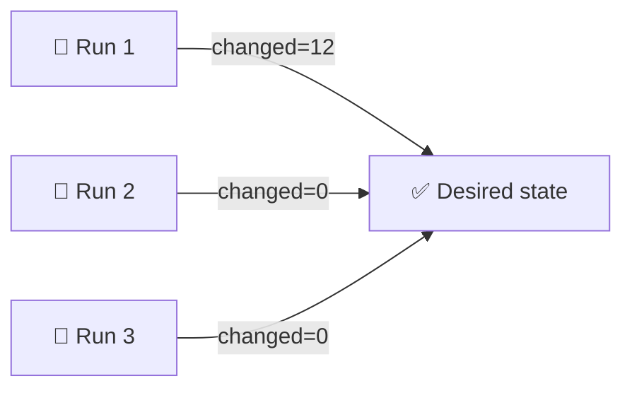
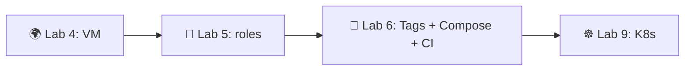

# 📌 Lecture 5 — Ansible Fundamentals: Configuration Management That Doesn't Bite

## 📍 Slide 1 – 🔧 Welcome to Configuration Management

* 🌍 **Lecture 4 provisioned the box** — Terraform/Pulumi created the VM, gave it an IP, opened ports
* 🤔 But the box is empty: no Docker, no app user, no nginx config, no TLS, no daemon settings
* 🔧 **Ansible configures what's inside** — packages, files, services, secrets — declaratively, with `ansible-core 2.21` (May 2026)



> 🔗 **Tie-in to Lab 5:** you'll build three roles (`common`, `docker`, `app_deploy`) and use them to provision the VM from Lab 4 and run your Lab 2 container image on it.

---

## 📍 Slide 2 – 🎯 Learning Outcomes

| # | Outcome |
|---|---------|
| 1 | 🧠 Explain agentless, push-based configuration and how it differs from agent-based tools |
| 2 | 📋 Write and structure a static inventory; know when to switch to dynamic |
| 3 | 📝 Author idempotent playbooks using the right modules (`apt`, `service`, `template`, `lineinfile`) |
| 4 | 📦 Organise reusable logic into roles (tasks / handlers / defaults / templates) |
| 5 | 🔐 Encrypt secrets with Ansible Vault and pass them to playbooks safely |

**Tech stack pinned for May 2026:** `ansible-core` **2.21** (community package **ansible 13.6.0**, April 2026), Python **3.11+** on the control node, `ansible-galaxy` for collections, OpenSSH on managed nodes.

> 📌 **A note on "LTS":** Ansible-core has **no formal LTS label.** Red Hat ships *Ansible Automation Platform* with extended support, but the open-source `ansible-core` only commits to ~6 months of security fixes per minor release. The currently-supported open-source versions are **2.18, 2.19, 2.20, 2.21**. Older slides on the internet that say "2.17 LTS" predate the policy clarification — ignore them.

---

## 📍 Slide 3 – 🆚 Ansible vs the Rest of IaC

* 🌍 **Terraform / Pulumi (Lec 4)** = *provisioning* — "create 3 VMs, 1 LB, 1 RDS instance"
* 🔧 **Ansible (Lec 5)** = *configuration* — "install Docker, render `daemon.json`, start the service"
* 🐳 **Docker (Lec 2)** = *packaging* — "freeze the app and its runtime"
* ☸️ **Kubernetes (Lec 9+)** = *orchestration* — "run N replicas, restart on failure, roll out updates"

> 🔥 **Don't confuse them.** Terraform makes the box exist. Ansible makes the box useful. Both live in Git; both belong in CI.



---

## 📍 Slide 4 – 🔥 Section 1: The Configuration Problem

```bash
# 😱 The bash script that "works" — once
#!/bin/bash
apt-get update
apt-get install -y nginx
echo "Welcome" > /var/www/html/index.html
systemctl start nginx
```

Run it twice — `apt-get install` is fine, but `echo >` overwrites the file every single time. Run it on Ubuntu 22.04 vs 24.04 — package names drift. Run it on a server where someone hand-edited `index.html` — your edit silently wipes theirs.

**That's the problem in one slide.** Shell scripts are imperative recipes; they don't describe the *end state*, only the *steps*. Anything that doesn't match the author's mental model breaks them.

---

## 📍 Slide 5 – 📝 Documentation Drift

* 📝 Docs written once, server modified a hundred times — nobody updates the wiki
* 🚪 The engineer who knew the real config left in 2024
* 💀 Reality ≠ documentation; the team trusts whichever fails them less today
* 🔇 "The runbook says X but production does Y now" — a phrase you'll hear in every postmortem
* 🧪 Disaster recovery test fails because the *real* config was never written down

> ⚠️ **Outdated docs are worse than no docs** — they actively mislead.

---

## 📍 Slide 6 – 💸 The Cost of Hand-Configured Servers

| 🔥 Failure mode | 💥 Impact |
|---|---|
| 🐢 Manual patching, server-by-server | Critical CVEs sit unpatched for weeks |
| 📋 Hand-edits over SSH | Typos cause production outages |
| 👉 Snowflake servers | "Works on server 1, broken on server 2" |
| 🙈 No audit trail | Compliance audits fail; nobody knows who changed `sshd_config` |
| 🐶 Pet servers | One dies, nobody can rebuild it from scratch |

> 📖 **2024 Verizon DBIR:** ~85% of breaches involve human-element factors — misconfiguration tops the list for cloud incidents. The goal of Ansible is to delete this entire table.

---

## 📍 Slide 7 – 💡 Section 2: What Ansible Is

* 🔧 **Configuration management tool** — describes the *desired state* of a fleet of machines
* 🌐 **Agentless** — talks over SSH (Linux) or WinRM (Windows); no daemon to install or patch on the targets
* 📤 **Push-based** — the control node pushes commands when you run it; no pull cycle, no agent heartbeat
* 📝 **YAML + Jinja2** — declarative-ish syntax, version-controllable like any code
* 🔄 **Idempotent by design** — running the same playbook twice converges to the same state



> 📖 **Definition:** Ansible is an open-source automation engine that uses SSH and YAML to put a fleet of machines into a documented, version-controlled state.

---

## 📍 Slide 8 – 📜 A Brief History of Ansible

* 📅 **2012** — Michael DeHaan releases Ansible; explicit reaction to Puppet/Chef agent complexity
* 📅 **2013** — AnsibleWorks founded; first commercial release
* 📅 **2015** — **Red Hat acquires AnsibleWorks** for ~$150M
* 📅 **2019** — IBM buys Red Hat; Ansible stays open-source
* 📅 **2021** — Project split: **`ansible-core`** (the engine) vs **`ansible`** (community package with hundreds of pre-bundled collections)
* 📅 **2024+** — Collections become the canonical distribution unit; `community.ansible` package bundles hundreds
* 📅 **May 2026** — `ansible-core 2.21` (community package **ansible 13.6.0**) is what you'll use in Lab 5

> 🤔 **Notice:** Ansible's bet — *no agents* — predates "GitOps" by years and is still the right call for fleet config.

---

## 📍 Slide 9 – 🚫 What Ansible is NOT

| ❌ Myth | ✅ Reality |
|---|---|
| "Replaces Terraform" | 🤝 Terraform provisions, Ansible configures. Different layer. |
| "Requires agents on every server" | 🌐 SSH only. The whole point. |
| "Only Linux" | 🪟 Windows works via WinRM/PowerShell; network gear via API modules |
| "Just bash with YAML" | 📦 Idempotent modules + state model + handlers + Jinja2 |
| "Slow for big fleets" | ⚡ Default forks=5, scale up with `forks=50`, mitogen, or AAP |

> 🔥 **Hot take:** the moment your team has more than three servers, you need Ansible (or an equivalent). Hand-SSH does not scale.

---

## 📍 Slide 10 – 🏗️ Architecture



| 🧱 Component | 🎯 Purpose |
|---|---|
| 💻 **Control node** | Your laptop or CI runner. Python 3.11+ and `ansible-core 2.21`. |
| 🖥️ **Managed nodes** | The servers you configure. SSH + Python 3. |
| 📋 **Inventory** | Static INI/YAML or dynamic cloud plugin. Lists hosts, groups, vars. |
| 📦 **Modules** | Python units of work (`apt`, `service`, `template`, `copy`, `file`). |
| 📚 **Collections** | Packaging unit. Installed via `ansible-galaxy collection install`. |

---

## 📍 Slide 11 – 🔁 How One Task Actually Runs

1. 📋 Read inventory → resolve target hosts
2. 🔐 SSH into each host (parallel, `forks=5` by default)
3. 📤 Push a small Python module file into a temp dir, run it with the target's Python
4. 📊 Module returns JSON: `{"changed": true, "msg": "..."}`
5. 🧹 Clean up temp files, close SSH



> 📝 **Implication:** the target needs Python — already on every Ubuntu 22.04+ box. That's the only "agent" Ansible needs.

---

## 📍 Slide 12 – 📋 Inventory: Static (INI / YAML)

```ini
# inventory/hosts.ini
[webservers]
web1 ansible_host=10.0.1.10
web2 ansible_host=10.0.1.11

[databases]
db1  ansible_host=10.0.2.10

[production:children]
webservers
databases

[all:vars]
ansible_user=ubuntu
ansible_ssh_private_key_file=~/.ssh/lab4_id_ed25519
```

* 🏷️ **Groups** organise hosts by role, environment, or geography
* 🪆 **Group of groups** (`:children`) builds hierarchies: `production` ⊃ `webservers`+`databases`
* 🎯 **Targeting**: `hosts: webservers`, `hosts: all`, `hosts: production:!web2` (exclude one host)

---

## 📍 Slide 13 – 🌐 Inventory: Dynamic (Cloud Plugins)

Static lists rot the moment a VM is recreated and gets a new IP. Inventory plugins query the cloud provider at runtime.

```yaml
# inventory/aws.yml
plugin: amazon.aws.aws_ec2
regions:
  - eu-central-1
filters:
  tag:Project: devops-core
  instance-state-name: running
keyed_groups:
  - key: tags.Role
    prefix: role
compose:
  ansible_host: public_ip_address
```

```bash
ansible-galaxy collection install amazon.aws
ansible-inventory -i inventory/aws.yml --graph
```

| Cloud | Collection | Plugin |
|---|---|---|
| AWS | `amazon.aws` | `aws_ec2` |
| GCP | `google.cloud` | `gcp_compute` |
| Azure | `azure.azcollection` | `azure_rm` |
| Yandex Cloud | `yandex.cloud` | `yandex_compute` |

> 🔗 **Lab 5 bonus task** uses this against the VM you created in Lab 4 with Terraform/Pulumi.

---

## 📍 Slide 14 – 📝 First Playbook — Read Twice

```yaml
---
- name: Configure web servers
  hosts: webservers
  become: true                # 🔐 sudo to root
  gather_facts: true          # 🧠 collect ansible_distribution, ansible_memtotal_mb, ...

  tasks:
    - name: Update apt cache (max 1h old)
      ansible.builtin.apt:
        update_cache: yes
        cache_valid_time: 3600

    - name: Install nginx
      ansible.builtin.apt:
        name: nginx
        state: present

    - name: Ensure nginx is running and enabled
      ansible.builtin.service:
        name: nginx
        state: started
        enabled: yes
```

```bash
ansible-playbook -i inventory/hosts.ini playbook.yml
```

> 📌 **Read the FQCN**: `ansible.builtin.apt` says collection `ansible.builtin`, module `apt`. Since the 2021 split this is the *canonical* way to reference modules.

---

## 📍 Slide 15 – 🎨 Reading the Output

```text
TASK [Install nginx] ********************************************************
changed: [web1]
TASK [Ensure nginx is running and enabled] **********************************
ok: [web1]

PLAY RECAP ******************************************************************
web1 : ok=3  changed=1  unreachable=0  failed=0
```

| Color | Status | Meaning |
|---|---|---|
| 🟢 | **ok** | Already in desired state — no change needed |
| 🟡 | **changed** | Module had to act to reach the desired state |
| 🔴 | **failed** | Module raised an error |
| ⚫ | **skipped** | A `when:` condition was false |

> 🎯 **Goal of a mature playbook:** first run is mostly yellow. Every subsequent run is entirely green.

---

## 📍 Slide 16 – 📦 The Modules You'll Use Most

| Module | Job | Idempotent? |
|---|---|---|
| 🧰 `ansible.builtin.apt` | Install/remove .deb packages | ✅ |
| ⚙️ `ansible.builtin.service` / `systemd` | Manage services | ✅ |
| 📄 `ansible.builtin.template` | Render Jinja2 → remote file | ✅ |
| 🗃️ `ansible.builtin.copy` | Push static file | ✅ |
| 🧷 `ansible.builtin.file` | Manage permissions, symlinks, directories | ✅ |
| ➕ `ansible.builtin.lineinfile` / `blockinfile` | Edit a config file by line/block | ✅ |
| 👤 `ansible.builtin.user` / `group` | Manage Linux accounts | ✅ |
| 🐳 `community.docker.docker_container` | Run a container | ✅ |
| 💥 `ansible.builtin.shell` / `command` | Run arbitrary commands | ❌ — escape hatch |

> ⚠️ **`shell` and `command` are last resorts.** They have no state model — Ansible has no idea whether your `echo >> file` changed anything. Reach for the idempotent module first; only fall back when no module exists.

---

## 📍 Slide 17 – 🎭 `command` vs `shell`: pick the right one

```yaml
# command — exec(), no shell. Safer. No pipes, no redirects, no $VARS.
- ansible.builtin.command: /usr/bin/curl https://example.com/health

# shell — full /bin/sh. Use ONLY when you actually need shell features.
- ansible.builtin.shell: |
    set -euo pipefail
    journalctl -u nginx | grep -c "200 OK" > /tmp/ok_count

# When you must use them, bolt idempotency on with creates: / removes:
- name: Run init script only if marker file is missing
  ansible.builtin.command: /usr/local/bin/init-once
  args:
    creates: /var/lib/myapp/.initialized
```

`creates:` and `removes:` are how you bolt idempotency onto a one-shot script.

---

## 📍 Slide 18 – 📦 Section 3: Roles

A *role* is just a directory tree with conventional subfolders. It packages tasks + variables + templates + handlers so you can drop them into any playbook with one line.

```text
roles/
└── docker/
    ├── tasks/main.yml          # the work
    ├── handlers/main.yml       # event reactions
    ├── defaults/main.yml       # variables (lowest precedence)
    ├── vars/main.yml           # variables (high precedence)
    ├── templates/daemon.json.j2
    ├── files/install.sh
    └── meta/main.yml           # dependencies, supported platforms
```

> 🔥 **One rule:** if you copy-paste the same block of tasks between two playbooks, it's a role.

---

## 📍 Slide 19 – 📁 Why Roles Beat One Giant Playbook



* 🔄 **Reusable** — share roles across projects, organisations, even via Ansible Galaxy
* 📁 **Discoverable** — every role has the same layout; new engineers find their way in minutes
* 🧪 **Testable** — Molecule spins each role up in a container and runs its playbook independently
* 🔬 **Composable** — a `webserver` role can depend on `common` via `meta/main.yml`

---

## 📍 Slide 20 – 🐳 Role Example: `docker` (Lab 5's main deliverable)

```yaml
# roles/docker/tasks/main.yml
---
- name: Install prerequisites
  ansible.builtin.apt:
    name: [apt-transport-https, ca-certificates, curl, gnupg, lsb-release]
    state: present
    update_cache: yes

- name: Add Docker APT key
  ansible.builtin.apt_key:
    url: https://download.docker.com/linux/ubuntu/gpg
    state: present

- name: Add Docker repository
  ansible.builtin.apt_repository:
    repo: "deb https://download.docker.com/linux/ubuntu {{ ansible_distribution_release }} stable"
    state: present

- name: Install Docker Engine
  ansible.builtin.apt:
    name: [docker-ce, docker-ce-cli, containerd.io]
    state: present
  notify: restart docker

- name: Add user to docker group
  ansible.builtin.user:
    name: "{{ docker_user }}"
    groups: docker
    append: yes
```

> 🔗 **Notice the Jinja2 fact:** `{{ ansible_distribution_release }}` resolves to `noble` on Ubuntu 24.04, `jammy` on 22.04. One role, both distros.

---

## 📍 Slide 21 – 🔔 Handlers — Restart Only When You Actually Changed Something

```yaml
# roles/docker/handlers/main.yml
---
- name: restart docker
  ansible.builtin.service:
    name: docker
    state: restarted
```

```yaml
# roles/docker/tasks/main.yml (continued)
- name: Render /etc/docker/daemon.json
  ansible.builtin.template:
    src: daemon.json.j2
    dest: /etc/docker/daemon.json
    mode: "0644"
  notify: restart docker     # 🔔 only fires if template changed
```

**Key handler semantics:**
* 🎯 **Triggered by `notify:`** — only when the notifying task reports `changed: true`
* ⏱️ **Run once at the end of the play** — multiple notifies of the same handler collapse to one restart
* 🚦 **Skipped on second run** — the file is already correct, no change, no restart, no downtime

> 💡 **This is the whole point.** A naive `service restart` on every run kicks Docker — and your containers — every single time. Handlers restart only when config actually drifted.

---

## 📍 Slide 22 – 📊 Variables: Where They Live and Who Wins

```yaml
# roles/docker/defaults/main.yml    (lowest precedence — easy to override)
---
docker_user: ubuntu
docker_data_root: /var/lib/docker
docker_log_max_size: "10m"
```

**Precedence — abbreviated, lowest to highest:**
1. 📁 Role `defaults/main.yml`
2. 📋 Inventory group_vars / host_vars
3. 📄 Playbook `vars:` block
4. 🔧 Role `vars/main.yml`
5. ⚡ `-e var=value` on the CLI (**always wins**)

> 📖 **Convention:** *overridable* defaults in `defaults/`, *fixed* values in `vars/`. If a user shouldn't change it, it belongs in `vars/`.

---

## 📍 Slide 23 – 🔄 Section 4: Idempotency — Ansible's Killer Feature



**A task is idempotent when** running it twice has the same effect as running it once.

Modules achieve this by checking state *before* acting:
* `apt: state=present` → query dpkg, install only if missing
* `service: state=started` → query systemd, start only if stopped
* `file: state=directory` → stat the path, create only if absent
* `template:` → diff rendered output against current file, write only if different

```bash
# Dry-run: report changes without making them
ansible-playbook playbook.yml --check --diff
```

> 🧪 **The acceptance test:** second consecutive run reports `changed=0`. If anything still changes, a task isn't idempotent — usually a stray `shell:` or a templated file with timestamps. **Lab 5 grades you on this.**

---

## 📍 Slide 24 – 🔐 Ansible Vault — Secrets in Git Without Tears

```bash
# Create / edit / view encrypted files (AES-256)
ansible-vault create  group_vars/all/vault.yml
ansible-vault edit    group_vars/all/vault.yml

# Encrypt a string inline
ansible-vault encrypt_string 'supersecret' --name dockerhub_password
```

```yaml
# group_vars/all/vault.yml (encrypted at rest)
dockerhub_username: lab5student
dockerhub_password: dckr_pat_xxxxxxxxxxxxxxxxxxxxxxxxxx
```

```bash
ansible-playbook deploy.yml --ask-vault-pass                       # prompt
ansible-playbook deploy.yml --vault-password-file ~/.vault_pass    # file (gitignored)
ansible-playbook deploy.yml --vault-id dev@~/.vd --vault-id prod@prompt   # multi-env
```

> 🔗 **Lab 11 ties this to OpenBao** — for production you graduate from Vault-the-file-encryptor to Vault-the-secret-store. Lab 5 uses Ansible Vault because it's the right scope: a few credentials, encrypted in Git, no extra infra.

---

## 📍 Slide 25 – 🌍 Real-World Ansible

* 🛡️ **NASA JPL** — manages Mars-mission ground systems (public talks since 2016)
* 🏦 **Capital One** — Ansible Tower drives nightly compliance across tens of thousands of EC2 instances
* 🎮 **Riot Games** — League of Legends server fleet provisioning
* 🔭 **CERN** — patch management on the LHC compute grid
* 🐧 **Red Hat** — OpenShift installer is essentially a giant Ansible playbook collection

> 🔥 **Common thread:** every fleet bigger than ~50 machines runs *some* config-management tool. Ansible is the most common answer because the agentless model lowers the barrier to "yes" by an order of magnitude.

---

## 📍 Slide 26 – ⚡ Before vs After Ansible

| 😰 Before | 🚀 After |
|---|---|
| 📞 SSH into 30 servers one by one | One `ansible-playbook` invocation |
| 📝 "Run these 14 commands" runbook | YAML in Git, diffable in PR |
| 🐶 Each server hand-tuned, fragile | Roles guarantee identical state |
| 😨 Patch-day takes the team a full day | Patch-day takes one CI run |
| 📚 Documentation drifts from reality | The playbook *is* the documentation |
| 🔥 Recovery = rebuild from memory | Recovery = `terraform apply` + `ansible-playbook` |

---

## 📍 Slide 27 – 🎯 Key Takeaways

1. 🔧 **Ansible is agentless** — SSH + Python on the target is the whole "agent"
2. 📋 **Inventory is half the battle** — static for labs, dynamic for production fleets
3. 📦 **Roles are the unit of reuse** — `tasks/`, `handlers/`, `defaults/`, `templates/`
4. 🔄 **Idempotency is a feature** — `changed=0` on a second run is the acceptance test
5. 🔔 **Handlers prevent flapping** — restart Docker only when its config actually changed
6. 📌 **Use FQCN modules** — `ansible.builtin.apt`, not bare `apt`; future-proof since the 2021 split
7. 🛑 **`shell:` is a last resort** — wrap with `creates:` / `removes:` when unavoidable
8. 🔐 **Vault encrypts secrets at rest** — bridge to Lab 11's OpenBao for production

> 💡 **The mindset shift:** stop telling the server *how* to get there. Tell it *where to end up*. Ansible figures out the rest.

---

## 📍 Slide 28 – 🚀 What Comes Next

**📚 Lecture 6: *Advanced Ansible & Continuous Deployment*** — picks up from your Lab 5 roles and pushes them to production-grade:

* 🏷️ **Tags** — `ansible-playbook --tags docker` to run a subset
* 🧱 **Blocks + `rescue:` / `always:`** — try/catch for tasks
* 🚀 **Deployment strategies** — rolling, serial, max_fail_percentage
* 🐙 **Docker Compose templates** rendered by Ansible
* 🤖 **CI/CD** — running Ansible from GitHub Actions on every push to `main`

**🔬 Lab 5 deliverables (this week):**
* `roles/common` — base packages, timezone
* `roles/docker` — install Docker (the example on slide 20)
* `roles/app_deploy` — pull your Lab 2 image, run as a container, expose port 5000, verify `/health`
* `group_vars/all/vault.yml` — encrypted Docker Hub credentials
* `docs/LAB05.md` — idempotency proof (output of two consecutive runs)
* Optional bonus: **dynamic inventory** against your Lab 4 cloud



**👋 See you in Lecture 6.**

---

## 📚 Resources

* 📕 *Ansible for DevOps* — Jeff Geerling (updated yearly; the practical reference)
* 📕 *Ansible: Up & Running* — Hochstein & Moser, O'Reilly (3rd ed. covers `ansible-core`)
* 🎥 [Jeff Geerling's Ansible 101 series](https://www.youtube.com/playlist?list=PL2_OBreMn7FqZkvMYt6ATmgC0KAGGJNAN) — free on YouTube
* 🌐 [docs.ansible.com](https://docs.ansible.com/ansible-core/2.21/) — official `ansible-core 2.21` docs
* 🌐 [galaxy.ansible.com](https://galaxy.ansible.com) — community roles and collections
* 🌐 [Molecule](https://ansible.readthedocs.io/projects/molecule/) — role testing framework

**🎓 Post-lecture quiz feeds the weeks 4–6 leaderboard window.**
