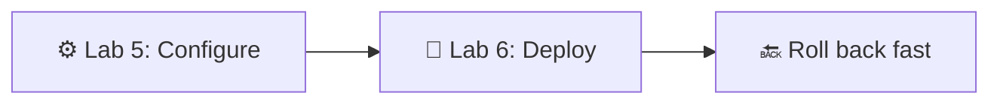
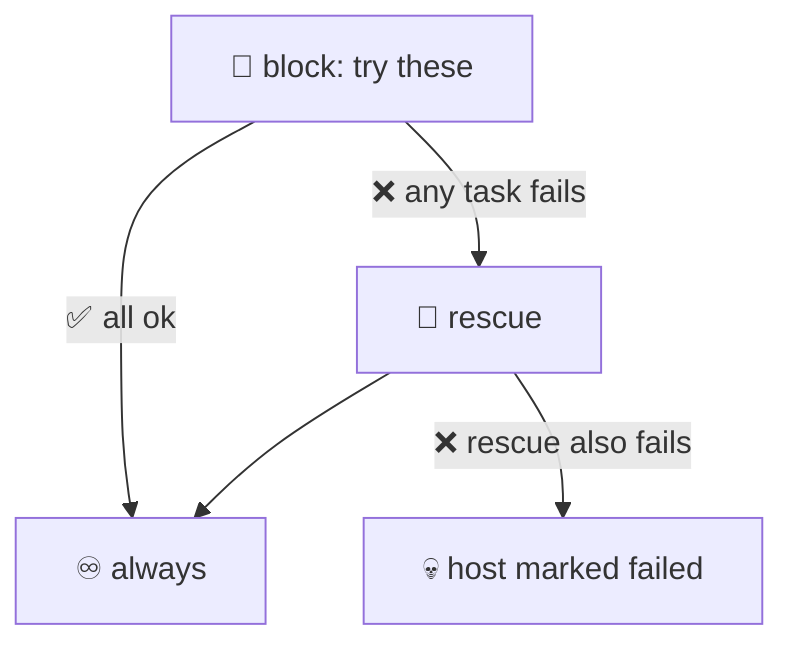
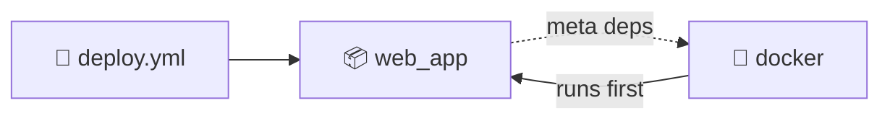
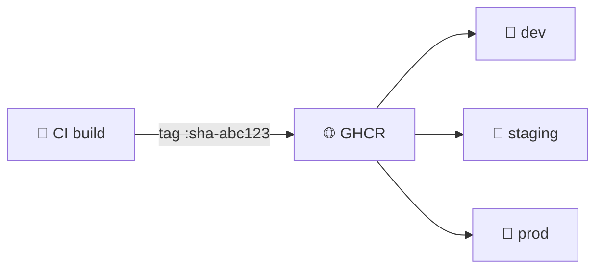
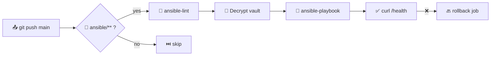
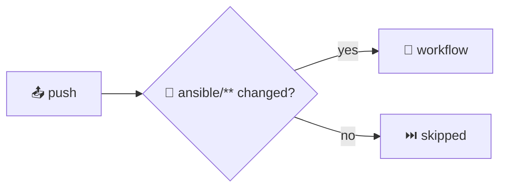
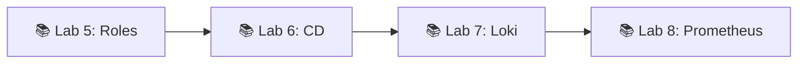

# 📌 Lecture 6 — Advanced Ansible & Continuous Deployment

## 📍 Slide 1 – 🚀 Welcome to Continuous Deployment

* 🧩 Lecture 5 gave you **playbooks, roles, inventory, idempotency, basic modules** — you can configure a server
* 🚀 Today: turn that into a **deployment pipeline** — push to `main`, app on the box, rollback in minutes
* 🛠️ Production patterns: `block`/`rescue`/`always`, tags, Jinja2-templated Docker Compose, GitHub Actions runners
* 🎯 Stack pinned for May 2026: **ansible-core 2.21**, **Docker Compose v2**, `community.docker` 4.x



> 🔗 **Tie-in to Lab 6:** you refactor Lab 5's playbooks with blocks + tags, template a `docker-compose.yml.j2`, add `web_app_wipe` clean-reinstall logic, and trigger the whole thing from GitHub Actions on every push to `ansible/**`.

---

## 📍 Slide 2 – 🎯 Learning Outcomes

| # | Outcome |
|---|---------|
| 1 | 🧱 Use `block` / `rescue` / `always` for fail-fast playbooks |
| 2 | 🏷️ Design a tag strategy that supports `--tags` and `--skip-tags` |
| 3 | 📝 Template `docker-compose.yml` with Jinja2 + `community.docker.docker_compose_v2` |
| 4 | 🧹 Implement double-gated wipe logic (variable + tag) |
| 5 | 🤖 Run Ansible from GitHub Actions with secrets and path filters |
| 6 | 🔙 Reason about rolling, all-at-once, and serial-percentage rollouts |

> ⚙️ **Prerequisites from Lecture 5:** YAML playbook syntax, role layout (`tasks/`, `handlers/`, `defaults/`, `meta/`), inventory + group_vars, Ansible Vault. We will **not** re-introduce those.

---

## 📍 Slide 3 – 🔥 From Configuration to Delivery

Lecture 5 ended with: *"the server is configured — now what?"*

* 📦 Configuration management answers **what should be installed**
* 🚀 Continuous deployment answers **what version is running, right now**
* 🔄 Same playbook engine, different cadence — provision once a quarter, deploy ten times a day

> 🔥 **Hot take:** if your deploy script is a Bash file someone SSHs into the box to run, you have automation **for setup** but not **for delivery**. Same gap as Dev vs Ops in Lecture 1.

---

## 📍 Slide 4 – 😱 Manual Deploy Hell

The real-world script most teams start with:

```bash
ssh prod-1
cd /opt/app && git pull
docker stop app; docker rm app
docker pull myorg/app:latest && docker run -d --name app -p 80:8080 myorg/app:latest
```

Why it breaks at scale:

* 🐢 SSH to N hosts in sequence — minutes per deploy, hours at 50 hosts
* 🤷 No record of *what* shipped *when* — `:latest` is mutable
* 💥 Failure on host 3 leaves 1+2 on new code, 3-N on old — **split-brain prod**
* 🌙 Nobody dares deploy on Friday because there is no rollback button

> 📊 DORA 2024: **change failure rate** for low performers is **46–60%**. Most are bad manual deploys, not bad code.

---

## 📍 Slide 5 – 🔙 Rollback Nightmares

Reverting code is the easy part. What about:

| 🔥 Concern | 💥 What blows up |
|------------|------------------|
| 💾 Database migration | New schema deployed; old binary can't read it |
| ⚙️ Config drift | Restarted container picks up new env vars only |
| 🏷️ Mutable tag | `myorg/app:latest` now points to the broken build |
| 🔐 Secret rotation | New Vault value already pulled; rollback hits 403s |

> ⚠️ **Rule of thumb:** if you can't roll back in **under 5 minutes**, you don't really deploy — you *commit*. Lab 6's wipe logic + immutable tag (`docker_tag: 1.2.3`) is the floor.

---

## 📍 Slide 6 – 🧱 Blocks: Group + Handle Errors

In Lab 5 you wrote linear task lists. A `block` groups tasks under shared directives **and** lets you handle failures.

```yaml
- name: Install Docker engine
  block:
    - ansible.builtin.apt_repository:
        repo: "deb https://download.docker.com/linux/ubuntu jammy stable"
    - ansible.builtin.apt: { name: docker-ce, update_cache: true }
  rescue:
    - name: GPG / mirror flake — retry
      ansible.builtin.apt: { name: docker-ce, update_cache: true }
      retries: 3
      delay: 10
  always:
    - ansible.builtin.systemd: { name: docker, enabled: true }
  become: true
  tags: [docker, docker_install]
```

> 📖 `block` accepts `become`, `when`, `tags`, `vars` — applied to every task inside. Way cleaner than copy-pasting `become: true` everywhere.

---

## 📍 Slide 7 – 🎯 Block / Rescue / Always Semantics



* 🟢 `block` succeeds → `always` runs
* 🔴 task in `block` fails → `rescue` runs → `always` runs → host **continues** if rescue succeeded
* ⛔ `rescue` also fails → host marked failed, `always` still runs (cleanup is sacred)

> ⚠️ `rescue` does **not** mean "ignore errors" — it means "I have a recovery plan." Without rescue, the playbook stops on the failing host.

---

## 📍 Slide 8 – ⚡ Fail-Fast vs Forgive

| 🎚️ Strategy | When | Example |
|--------------|------|---------|
| ❌ **Fail fast** (default) | Provisioning, migrations | A failed Docker install must stop the run |
| 🔄 **Rescue + retry** | Flaky network, GPG mirrors | Re-run `apt update` after 10s |
| 😶 `ignore_errors: yes` | Cosmetic cleanups | `rm /tmp/stale.lock` you don't care about |
| 🔁 `until:` + `retries:` | Health checks | Wait up to 10 × 6s for `/health` 200 |

```yaml
- name: Wait for app to come up
  ansible.builtin.uri:
    url: "http://localhost:{{ app_port }}/health"
    status_code: 200
  register: hc
  retries: 10
  delay: 6
  until: hc.status == 200
```

> 🔥 **Anti-pattern:** sprinkling `ignore_errors: yes` to green up CI. You just turned a deploy into a coin flip.

---

## 📍 Slide 9 – 🏷️ Tags: Run Only What You Need

Tags label tasks so you can pick subsets at run time. Every task, block, or role can be tagged.

```bash
ansible-playbook site.yml --tags "docker,app_deploy"
ansible-playbook site.yml --skip-tags "common"
ansible-playbook site.yml --list-tags
ansible-playbook site.yml --tags "docker" --check     # dry-run
```

* 🏷️ Tags **inherit** down — a tag on a block applies to every task inside
* 🔒 Two **special tags**: `always` (always runs unless skipped) and `never` (never runs unless asked)
* 📦 Roles can be tagged at import time: `roles: [{ role: docker, tags: [docker] }]`

> 🔥 **In Lab 6** you tag at three levels — role, block, individual task — so `--tags docker_install` reaches the right slice without dragging in unrelated work.

---

## 📍 Slide 10 – 🗂️ A Tag Strategy That Survives

Pick **three tag axes** and stick to them:

| 🧭 Axis | Tag names | Example |
|---------|-----------|---------|
| 🧩 **Component** | `common`, `docker`, `web_app` | `--tags docker` to touch only the docker role |
| 🛠️ **Action** | `install`, `config`, `deploy`, `wipe` | `--tags deploy` skips installs |
| ⚠️ **Risk gate** | `web_app_wipe`, `db_migrate` | Dangerous, opt-in only |

```yaml
- name: Application deployment
  block: [...]
  tags: [web_app, app_deploy, deploy]

- name: Application wipe
  block: [...]
  when: web_app_wipe | bool
  tags: [web_app, web_app_wipe]   # gated by both when + tag
```

> 📖 **Source:** Ansible docs — *Tags* and *Common Tagging Patterns*. A clean tag taxonomy is the difference between a 10-minute deploy and a 90-minute one.

---

## 📍 Slide 11 – 📝 Jinja2 — The Templating Layer

Ansible's `template` module renders **Jinja2** files at runtime. Lecture 5 used it in passing; Lab 6 leans on it heavily.

```jinja
{# roles/web_app/templates/docker-compose.yml.j2 #}
services:
  {{ app_name }}:
    image: {{ docker_image }}:{{ docker_tag }}
    ports:
      - "{{ app_port }}:{{ app_internal_port }}"
    environment:

      {{ k }}: "{{ v }}"

    restart: {{ restart_policy | default('unless-stopped') }}
```

* `{{ var }}` — interpolation
* `` / `` — control flow
* `| default('x')`, `| upper`, `| to_json` — **filters** chain with `|`

> ⚠️ Compose v2 dropped the `version:` top-level field. If a tutorial still writes `version: '3.8'`, it predates 2023 — leave it off.

---

## 📍 Slide 12 – 🎛️ Useful Jinja2 Filters

```yaml
image_tag: "{{ docker_tag | default('latest') }}"
when:      "{{ web_app_wipe | bool }}"            # '-e wipe=true' is a string!
api_key:   "{{ lookup('env', 'API_KEY') | b64encode }}"
```

| 🎛️ Filter | What it does |
|------------|--------------|
| `default(x)` | Fallback when var is undefined |
| `bool` | Coerce `"true"`/`"false"` strings |
| `to_nice_yaml`, `to_json` | Render structured config |
| `combine(dict2)` | Merge two dicts (group_vars + host_vars) |
| `regex_replace(p, r)` | Inline sed |

> 📚 Full filter list: `ansible-doc -t filter -l` (ships with ansible-core).

---

## 📍 Slide 13 – 🐳 Docker Compose via Ansible

Use `community.docker.docker_compose_v2` (Python `docker` SDK + the Compose plugin — **not** the deprecated `docker_compose` v1 module).

```yaml
- name: Render compose file
  ansible.builtin.template:
    src: docker-compose.yml.j2
    dest: "{{ compose_project_dir }}/docker-compose.yml"
    mode: "0644"

- name: docker compose up -d
  community.docker.docker_compose_v2:
    project_src: "{{ compose_project_dir }}"
    state: present
    pull: always              # always re-pull the tag
    remove_orphans: true
  register: compose_result
```

* 🔌 Install the collection: `ansible-galaxy collection install community.docker`
* 🐍 Needs `python3-docker` on the **target** (not the controller)
* ♻️ Idempotent — re-run shows `changed=0` if the rendered file is identical

> 🔗 **Lab 6 §2.5** walks the whole thing end to end.

---

## 📍 Slide 14 – 🔗 Role Dependencies (`meta/main.yml`)

A role can declare what must run first. Lecture 5 covered role layout; we now exploit `meta/main.yml`.

```yaml
# roles/web_app/meta/main.yml
---
dependencies:
  - role: docker
    vars:
      docker_users: ["{{ ansible_user }}"]
```



* ✅ `ansible-playbook deploy.yml` with `roles: [web_app]` now also runs `docker`
* ⚠️ Deps run **once per play**, not per role import — keep them lean
* 🚫 Don't chain three layers deep; you lose execution-order intuition fast

---

## 📍 Slide 15 – 🧹 Wipe Logic: Why and How

**Why:** clean reinstall is sometimes the only safe rollback (corrupted volume, broken cache, secrets rotated). You need a button — and you need it **gated**.

**Double-gate pattern** (Lab 6 §3):

```yaml
# roles/web_app/tasks/wipe.yml
- name: Wipe web application
  block:
    - name: Compose down
      community.docker.docker_compose_v2:
        project_src: "{{ compose_project_dir }}"
        state: absent
    - name: Remove compose dir
      ansible.builtin.file:
        path: "{{ compose_project_dir }}"
        state: absent
  when: web_app_wipe | bool   # gate 1: variable
  tags: [web_app_wipe]        # gate 2: tag
```

| Invocation | Wipe? |
|------------|-------|
| `deploy.yml` | ❌ var false, tag not requested |
| `deploy.yml --tags web_app_wipe` | ❌ `when` blocks it |
| `deploy.yml -e web_app_wipe=true` | ✅ wipe **then** deploy (clean reinstall) |
| `deploy.yml -e web_app_wipe=true --tags web_app_wipe` | ✅ wipe only |

> 🔥 **Why not the `never` tag alone?** A typo in `--tags` could still trigger it. Two independent gates = a typo can't destroy prod by itself.

---

## 📍 Slide 16 – 🌍 Multi-Environment Inventories

Same role, different **group_vars** per environment.

```
ansible/inventories/
  dev/hosts.ini       group_vars/all.yml   → docker_tag: main
  staging/hosts.ini   group_vars/all.yml   → docker_tag: 1.2.3-rc1
  prod/hosts.ini      group_vars/all.yml   → docker_tag: 1.2.2   # pinned
```

```bash
ansible-playbook -i inventories/staging deploy.yml
ansible-playbook -i inventories/prod    deploy.yml --check    # dry-run prod first
```

* 🎯 **Promote** the same artifact: dev → staging → prod uses identical roles + image
* 🔐 Vault files **per env** so a leak in dev doesn't expose prod
* 🚫 Don't branch the playbook on `inventory_hostname == 'prod'` — branch on vars

---

## 📍 Slide 17 – 📦 Promoting an Image Through Envs



* 🏷️ **One immutable tag** (SHA or SemVer) flows through every env — never retag
* 📌 Pin `docker_tag` per env in group_vars; bump it in a PR, not by SSH

> 🔥 **From Lecture 2:** "never deploy `:latest` to production." Lab 6 enforces that — `docker_tag` is required in `group_vars` and validated by `ansible-lint`.

---

## 📍 Slide 18 – 🤖 CI/CD Integration: The Big Picture



* 🔄 Trigger: push to `main` **or** `workflow_dispatch` for manual deploys
* 🧹 Lint first — failed YAML on prod is the dumbest outage
* 🚀 Then deploy via `ansible-playbook` against the right inventory
* ✅ Verify with HTTP probe before declaring success

> 🔗 **Lab 6 §4** writes `.github/workflows/ansible-deploy.yml` from scratch.

---

## 📍 Slide 19 – 🛠️ GitHub Actions Workflow Skeleton

```yaml
# .github/workflows/ansible-deploy.yml
name: Ansible Deploy
on:
  push:
    branches: [main]
    paths: ['ansible/**', '.github/workflows/ansible-deploy.yml']
  workflow_dispatch:

jobs:
  lint:
    runs-on: ubuntu-24.04
    steps:
      - uses: actions/checkout@v4
      - uses: actions/setup-python@v5
        with: { python-version: '3.12' }
      - run: pip install 'ansible-core==2.21.*' ansible-lint
      - run: ansible-lint ansible/

  deploy:
    needs: lint
    runs-on: ubuntu-24.04
    environment: production    # GH approval gate + per-env secrets
    steps:
      - uses: actions/checkout@v4
      - env:
          VAULT: ${{ secrets.VAULT_PASS }}
          SSH:   ${{ secrets.SSH_KEY }}
        run: |
          install -m 600 /dev/stdin ~/.ssh/id_ed25519 <<< "$SSH"
          install -m 600 /dev/stdin /tmp/vault       <<< "$VAULT"
          ansible-playbook -i ansible/inventories/prod \
            ansible/playbooks/deploy.yml --vault-password-file /tmp/vault
```

> 🔧 Pin `ansible-core==2.21.*` for the semester to match Lab 5/6 lockfiles. (Ansible-core has **no LTS label** — pin the exact minor that matches your collection lockfile.)

---

## 📍 Slide 20 – 🔐 Secrets, OIDC, and Self-Hosted Runners

Three secret-handling tiers, weakest → strongest:

| 🔐 Tier | Mechanism | Trade-off |
|---------|-----------|-----------|
| 🟡 Repo secret as env | `secrets.SSH_KEY` → `~/.ssh/id_ed25519` | Simple; never echo to logs |
| 🟠 GitHub Environment | Per-env secrets + manual approval | Needed for prod; small ops overhead |
| 🟢 **OIDC + cloud IAM** | Short-lived federated tokens | No long-lived keys at all — recommended |

```yaml
# OIDC example: assume an AWS role with no static creds
- uses: aws-actions/configure-aws-credentials@v4
  with:
    role-to-assume: arn:aws:iam::123:role/ansible-deploy
    aws-region: eu-central-1
```

* 🖥️ **Self-hosted runner** on the target network = no SSH key in CI, faster runs
* ⚠️ Self-hosted runners are **trust boundaries** — never run on PRs from forks

> 🔥 **Hot take:** in 2026, putting a long-lived SSH key in `secrets.SSH_KEY` is the new "password in source." Use OIDC where the target supports it.

---

## 📍 Slide 21 – 📁 Path Filters: Don't Burn CI Minutes

```yaml
on:
  push:
    paths:
      - 'ansible/**'
      - '!ansible/docs/**'                # exclude docs
      - '.github/workflows/ansible-deploy.yml'
  pull_request:
    paths: ['ansible/**']
```

* ⚡ Doc-only PR → no deploy run, no minutes burned
* 🎯 Path filter on the **workflow file itself** so editing it triggers a self-test
* ❗ `paths-ignore` and `paths` are mutually exclusive; pick one



> 💰 GitHub bills minutes on private repos. A team of 20 with no path filters can burn 10× more CI than needed.

---

## 📍 Slide 22 – 🚀 Deployment Strategies

For N hosts, Ansible exposes a single magic knob: `serial:`.

```yaml
- name: Deploy web tier
  hosts: webservers
  serial: "25%"          # 25% of hosts at a time
  max_fail_percentage: 10  # abort if >10% of a batch fails
  roles: [web_app]
```

| 🚀 Strategy | `serial:` | When |
|-------------|-----------|------|
| 🔄 **Rolling** | `1` or `25%` | Zero-downtime; load balancer keeps draining hosts |
| 🐤 **Canary** | `1` (first batch only, then pause) | Test on one host, observe, continue |
| 💥 **All at once** | omit `serial:` | Dev/staging only — outage on prod |
| 🔵 **Blue/green** | two inventories (`blue`, `green`) + LB cutover | Heavier setup, instant rollback |

> 📖 Ansible's strategy is **push-based**: the controller drives the cadence. K8s (Lab 9+) flips this to pull-based, but the patterns transfer.

---

## 📍 Slide 23 – ✅ Verification + 🔙 Rollback

A deploy isn't done when `ansible-playbook` exits 0 — it's done when **the app responds**.

```yaml
- name: Smoke test
  ansible.builtin.uri:
    url: "http://{{ inventory_hostname }}:{{ app_port }}/health"
    status_code: 200
  register: hc
  retries: 10
  delay: 6
  until: hc.status == 200

- name: Roll back on failure
  community.docker.docker_compose_v2:
    project_src: "{{ compose_project_dir }}"
    state: present
  vars:
    docker_tag: "{{ previous_tag }}"
  when: hc is failed
```

**Rollback checklist:**
* 🏷️ Previous immutable tag captured **before** deploy (`previous_tag` fact)
* 💾 DB migrations are forward-compatible OR rolled back separately
* 🔔 Alert fires on the verify failure so a human knows

> ⏱️ **DORA "failed deployment recovery time"**: elite < 1h, low > 1 month. Automated rollback is the gap.

---

## 📍 Slide 24 – 🌍 Real-World Patterns

* 🎬 **Netflix Spinnaker** — versioned artifact per commit; automated canary analysis (open-sourced 2015)
* 🏦 **Capital One** — Ansible for OS provisioning, container CD on top; one role catalog across AWS and on-prem
* 📦 **Shopify** — 30+ deploys/day via "shipit" with per-stage approval gates
* 🇺🇸 **Red Hat AAP** — Ansible Automation Platform as the standard CD layer for non-K8s workloads
* 🚀 **GitLab Pages** — serial rollouts to hundreds of edge nodes from Ansible

> 🔥 **Common thread:** small, automated, observable deploys. Big-bang quarterly releases are an artefact of a different era.

---

## 📍 Slide 25 – 🎯 Key Takeaways

1. 🧱 **Blocks** group tasks and give you `rescue` + `always` — use them at every error boundary
2. 🏷️ **Tags** are a strategy, not labels — three axes (component, action, risk) keep them maintainable
3. 📝 **Jinja2 templates** turn one role into N apps via `group_vars` / `vars_files`
4. 🐳 `community.docker.docker_compose_v2` is the only Compose module to use in 2026
5. 🧹 **Wipe logic is double-gated** — variable AND tag, never one or the other
6. 🤖 **GitHub Actions + path filters** make Ansible push-button — lint, run, verify, rollback
7. 🚀 `serial:` + `max_fail_percentage:` is your deployment-strategy knob

> 💡 **A good deploy is small, automated, observable, and reversible.** Three out of four still hurts.

---

## 📍 Slide 26 – 🚀 What Comes Next

**📚 Next lecture: *Loki Logging*** — you've shipped the app; now find out what it said.

* 📋 Why log aggregation matters once you have >1 host
* 🛠️ Loki + Promtail + Grafana architecture
* 🔍 LogQL: `{job="web_app"} |= "ERROR"`
* 🧪 Lab 7 deploys the logging stack with the very Ansible patterns you just learned



**🔬 Lab 6 deliverables recap:** refactored `common` + `docker` roles with blocks/rescue/tags; `web_app` role with `docker-compose.yml.j2` + `community.docker.docker_compose_v2`; double-gated `web_app_wipe`; `.github/workflows/ansible-deploy.yml` running lint → deploy → verify.

**👋 See you in Lecture 7.**

---

## 📚 Resources

* 📕 *Continuous Delivery* — Jez Humble, David Farley (2010) — the canonical text
* 📕 *Ansible for DevOps* — Jeff Geerling (2024 edition; ansible-core has moved on to 2.21 but the patterns are unchanged)
* 🌐 [Ansible Blocks](https://docs.ansible.com/ansible/latest/user_guide/playbooks_blocks.html)
* 🌐 [Ansible Tags](https://docs.ansible.com/ansible/latest/user_guide/playbooks_tags.html)
* 🌐 [`community.docker.docker_compose_v2`](https://docs.ansible.com/ansible/latest/collections/community/docker/docker_compose_v2_module.html)
* 🌐 [GitHub Actions: `paths` filters](https://docs.github.com/en/actions/using-workflows/triggering-a-workflow#using-filters)
* 🌐 [GitHub OIDC for cloud deploys](https://docs.github.com/en/actions/deployment/security-hardening-your-deployments/about-security-hardening-with-openid-connect)

> 🎓 Post-lecture quiz feeds the weeks 4–6 leaderboard window.
