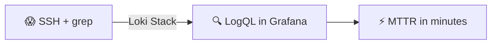
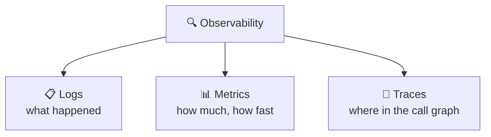
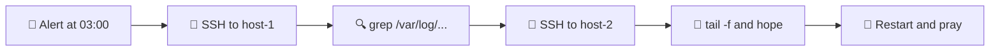
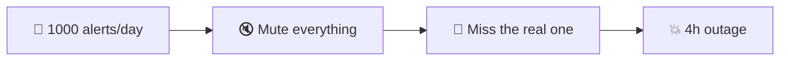
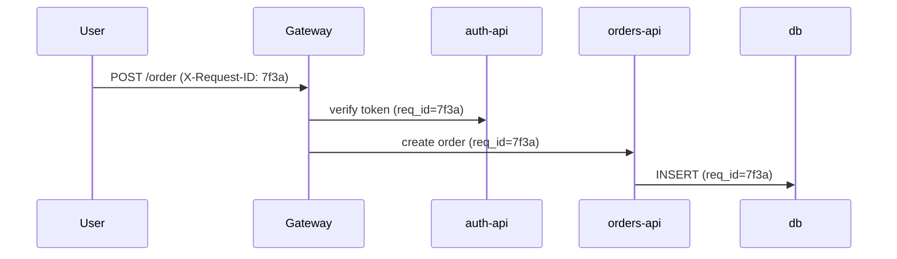
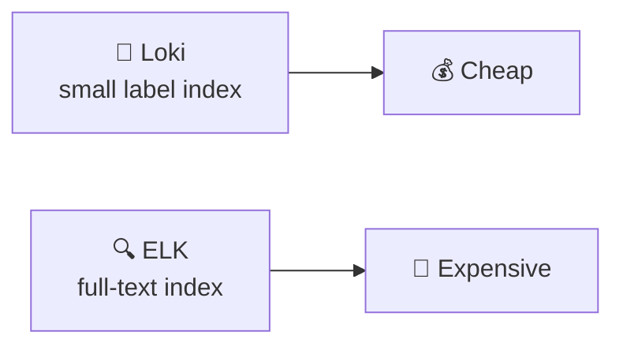
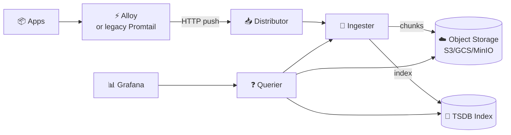
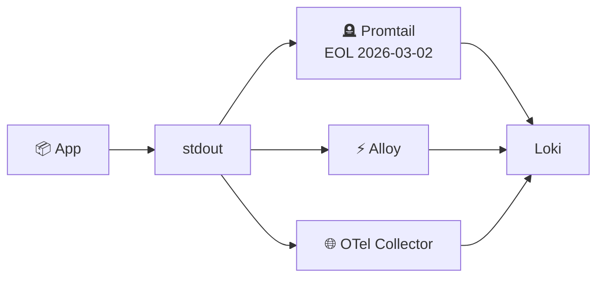
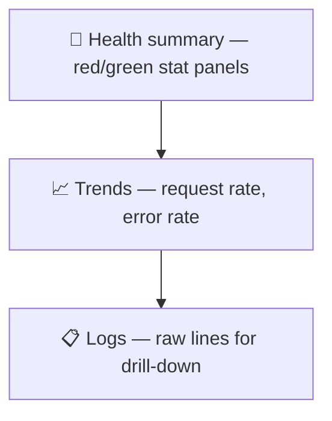
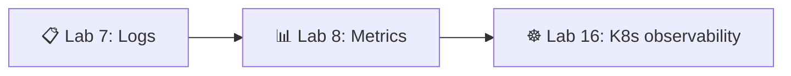

# 📌 Lecture 7 — Observability & Logging: From Blind Operations to Insight

## 📍 Slide 1 – 🔍 Welcome to Observability

* 🌍 **Your app runs in production** — but do you actually know what it's doing?
* 😰 Lecture 1 named the failure mode: **Scenario 4 — Blind Operations** (users on Twitter, no metrics, no logs, restart in desperation)
* 🔧 This is the lecture that **fixes it**: centralised logs you can query in seconds
* 🎯 Today: deploy the Loki stack and learn to ask questions of your production logs



> 🔗 **Lab 7 tie-in:** you'll deploy Loki 3.7 + **Grafana Alloy** + Grafana 13 via docker-compose, ship JSON logs from your Lab 1 Python app, and build a 4-panel dashboard. (Promtail is preserved in slides 14–15 below as historical context — it reached **End-of-Life on March 2, 2026**.)

---

## 📍 Slide 2 – 🎯 Learning Outcomes

| # | Outcome |
|---|---------|
| 1 | 🧠 Distinguish the three pillars: **logs, metrics, traces** — and what each is for |
| 2 | 🔍 Explain how Loki indexes by **labels**, not full text, and why that controls cost |
| 3 | 📝 Emit **structured JSON logs** with correlation IDs from a Python service |
| 4 | 🛠️ Write **LogQL** stream selectors, line filters, and log-range queries |
| 5 | 📊 Build a Grafana log dashboard answering one operational question per panel |

**Tech stack pinned for May 2026:**
* 💾 **Loki 3.7** (3.0 launched May 2024; 3.x stabilised TSDB schema v13)
* 📊 **Grafana 13** (13.0.1+security-01, released May 12 2026)
* ⚡ **Grafana Alloy 1.16.1** (May 6 2026) — the canonical agent; **use this for new deployments**
* 🪦 **Promtail** reached **End-of-Life on March 2, 2026**. Still works on existing setups, no further fixes. Slides 14–15 cover it for context only.

---

## 📍 Slide 3 – 🧱 The Three Pillars of Observability



| 📊 Pillar | 🎯 Question | 🛠️ This course |
|-----------|------------|----------------|
| 📋 **Logs** | *What event occurred?* | **Lecture 7 + Lab 7** (Loki) |
| 📊 **Metrics** | *How much / how fast / how often?* | Lecture 8 + Lab 8 (Prometheus) |
| 🔗 **Traces** | *Where in the request did time go?* | Out of scope for Core — covered in SRE-Intro elective |
| ☸️ **K8s view** | *All three on the cluster* | Lectures 15–16, Lab 16 |

> 📖 **Charity Majors** (Honeycomb co-founder, *Observability Engineering*, 2022): *"Observability is the ability to ask new questions of your system without shipping new code."*

---

## 📍 Slide 4 – 🙈 The Visibility Problem

Without centralised logs, debugging looks like this:



* 📁 Each host has its own log files, in its own format, with its own rotation
* 🔍 Correlating one request across three services means three SSH sessions
* 📅 Logs older than the rotation window are simply **gone** when you need them
* 💀 By the time you find the relevant line, the incident has run an extra hour

> 🔥 **Reality check (DORA 2024):** elite teams recover from incidents in under 1 hour. You can't do that with SSH + grep.

---

## 📍 Slide 5 – 🚨 Alert Fatigue & "Works for Me"

Two pathologies that signal you need observability, not more dashboards:

**1. Alert fatigue** — 200 warnings/day, every one a false positive. Real outages get muted.

**2. "It's working for me"** — users say the app is slow, the team can't reproduce, there's no data to settle the argument. Hours of cargo-cult debugging follow.



> 📖 **Cindy Sridharan**, *Distributed Systems Observability* (O'Reilly, 2018): the cure is **high-cardinality, structured data** you can slice on demand — not more pre-baked alerts.

---

## 📍 Slide 6 – 💸 The Cost of Flying Blind

| 🔥 Symptom | 💥 Cost |
|-----------|---------|
| 🐢 Slow debugging | 4+ hour MTTR, escalations, missed SLOs |
| 📋 No correlation across services | Microservice outages take days to triangulate |
| 👉 No data → blame culture | Senior engineers leave |
| 🙈 Silent failures | Issues only surface when customers tweet |

**📈 Concrete benchmark (DORA 2024 + Google SRE Book):**
* MTTR without observability: **4+ hours** typical
* MTTR with a Loki-class stack: **under 30 minutes**
* Self-hosted Loki on object storage: **single-digit dollars/month** for tens of GB/day

> 🔥 **Hot take:** observability is the cheapest insurance policy in your stack. The break-even versus one prevented outage is measured in **seconds**.

---

## 📍 Slide 7 – 💡 Observability ≠ Monitoring

A distinction popularised by Charity Majors and the Honeycomb team:

| ❓ Question | 📊 Monitoring | 🔍 Observability |
|------------|---------------|------------------|
| What it answers | *"Is the system up?"* | *"Why is the system doing this?"* |
| Failure modes covered | **Known knowns** (pre-defined alerts) | **Unknown unknowns** (novel issues) |
| Data shape | Low-cardinality time series | High-cardinality structured events |
| You design alerts for… | Specific failure modes | Service-level objectives |

> 💬 **Charity Majors:** *"Monitoring is for known unknowns. Observability is for unknown unknowns."*

**🎯 Practical implication:** a healthy stack does both. Prometheus alerts (Lecture 8) handle the known. Loki + structured logs let you investigate the unknown.

---

## 📍 Slide 8 – 📝 Why Structured Logging (JSON)

**❌ Unstructured — write-only:**
```
2026-04-15 10:23:45 ERROR Connection to database failed on server-1 for user alice (req=7f3a)
```

To filter on `user=alice` you write a regex. To aggregate by host you write a worse regex.

**✅ Structured (JSON) — queryable:**
```json
{"ts":"2026-04-15T10:23:45Z","level":"ERROR","service":"user-api",
 "msg":"db connection failed","user":"alice","host":"server-1","req_id":"7f3a"}
```

Now `level="ERROR" and user="alice"` is one LogQL clause. Aggregating errors per host is a one-liner.

> 🔥 **Rule:** if a human reads your logs more often than a machine, you've already lost. Logs are an API for your future on-call self.

---

## 📍 Slide 9 – 🔗 Correlation IDs — One Request, Many Services

A single user click can touch 5+ services. Without a correlation ID, you can't follow it across log streams.



**The pattern:**
1. 🆔 Gateway generates a UUID per inbound request → `X-Request-ID` header
2. 📨 Every downstream call forwards the header
3. 📝 Every log line includes the ID as a JSON field
4. 🔍 In Grafana: `{service=~".+"} | json | req_id="7f3a"` → the entire request, in order

> 📖 The OpenTelemetry spec calls this `traceparent` — the same idea, standardised.

---

## 📍 Slide 10 – ⚡ Loki vs ELK: Why Loki Won for Logs

The traditional log stack — Elasticsearch + Logstash + Kibana — indexes **every word** of every log. That's expensive.

| 📊 Aspect | 💾 Loki | 🔍 ELK |
|-----------|---------|--------|
| Index | **Labels only** (service, env, level…) | **Full text** of every line |
| Storage | Cheap object store (S3/GCS/MinIO) | Local SSD for hot index |
| Cost at 100GB/day | ~$10–30/mo | ~$500–2000/mo |
| Query language | LogQL (Prometheus-style) | Lucene |
| Best for | Cloud-native, label-driven | Free-text forensics |



> 💬 **Grafana Labs' pitch (2019):** *"Like Prometheus, but for logs."* — same labels, same federation model, same querier ergonomics.

---

## 📍 Slide 11 – 🏗️ Loki Architecture



* 📥 **Distributor** — receives pushes, validates, fans out to ingesters
* 💾 **Ingester** — buffers in memory, flushes compressed chunks to object storage
* ❓ **Querier** — answers LogQL by reading the TSDB index, then fetching matching chunks
* 📇 **TSDB index** (default since Loki 3.0, schema v13) — small, fast, replaces the old boltdb-shipper

> 🔧 **Two deployment modes:** *single-binary* (one container, fine up to ~100GB/day — what Lab 7 uses) and *microservices* (each component scales independently — production at scale).

---

## 📍 Slide 12 – 🏷️ Labels: The One Thing You Must Get Right

Loki indexes by **labels**. Each unique label combination = one **stream**. Every stream costs index space and memory.

**✅ Good labels — low cardinality:**
* `service="user-api"` (10s of services)
* `env="prod"` (3 values)
* `level="ERROR"` (5 values)

**❌ Bad labels — high cardinality:**
* `user_id="12345"` (millions of users → **millions of streams** → ingester OOM)
* `request_id="7f3a..."` (one per request → instant collapse)
* `trace_id`, `email`, `path` with IDs in it…

> 🔥 **The rule:** if a value is unique per request or per user, **it goes in the log line, not the label.** Use `| json | user_id="12345"` at query time.

```logql
# ✅ Good — small label set, filter on parsed JSON field
{service="user-api", env="prod"} | json | user_id="12345"
```

---

## 📍 Slide 13 – ⚙️ Loki Single-Binary Config (Lab 7 baseline)

```yaml
# loki/config.yml — Loki 3.7, schema v13, single-binary
auth_enabled: false

server:
  http_listen_port: 3100

common:
  path_prefix: /loki
  storage:
    filesystem:
      chunks_directory: /loki/chunks
      rules_directory: /loki/rules
  replication_factor: 1
  ring:
    kvstore: { store: inmemory }

schema_config:
  configs:
    - from: 2024-01-01
      store: tsdb              # 🚀 Replaces boltdb-shipper
      object_store: filesystem # 🪣 Swap to s3/gcs in production
      schema: v13              # 📐 Latest stable
      index: { prefix: index_, period: 24h }

limits_config:
  retention_period: 168h       # 🗓️ 7 days

compactor:
  working_directory: /loki/compactor
  retention_enabled: true      # ⚠️ Required when retention is set
```

> ⚠️ **Common gotcha:** enabling `retention_period` without the `compactor` block = logs never actually delete. Loki silently ignores the limit.

---

## 📍 Slide 14 – 🔧 Alloy, Promtail, and the OTel Collector

**Three ways to ship logs into Loki in 2026:**

| Agent | Status (May 2026) | When to pick |
|-------|-------------------|--------------|
| ⚡ **Grafana Alloy 1.16.1** | **Canonical agent** — Promtail + Prometheus agent + OTel in one binary | **All new deployments** (including Lab 7); all three pillars from one agent |
| 🪦 **Promtail 3.x** | **End-of-Life March 2, 2026** — no further releases, no security fixes | Existing setups you haven't migrated yet; understanding legacy configs |
| 🌐 **OpenTelemetry Collector** | Vendor-neutral CNCF standard | Multi-backend (Loki + Datadog + …), traces too |



> 🔗 **Lab 7 walks through Alloy** because Promtail is no longer maintained. The Promtail config on the next slide is preserved so you can read and migrate brownfield deployments — but **do not stand up a new Promtail in 2026**.

---

## 📍 Slide 15 – 🪦 Promtail Config (legacy / historical context)

> ⚠️ **Promtail is EOL since March 2, 2026.** This slide is preserved so you can read existing configs in production and migrate them to Alloy. Do **not** stand up a new Promtail.

```yaml
# promtail/config.yml — LEGACY, see Alloy slide for the modern equivalent
server:
  http_listen_port: 9080

positions:
  filename: /tmp/positions.yaml  # 📍 Resume reading after restart

clients:
  - url: http://loki:3100/loki/api/v1/push

scrape_configs:
  - job_name: docker
    docker_sd_configs:
      - host: unix:///var/run/docker.sock
        refresh_interval: 5s
        filters:
          - name: label
            values: ["logging=promtail"]   # 🏷️ Opt-in via container label
    relabel_configs:
      - source_labels: ['__meta_docker_container_label_app']
        target_label: 'app'
      - source_labels: ['__meta_docker_container_name']
        regex: '/(.*)'
        target_label: 'container'
```

* 📍 **`positions`** — survives restarts so you don't double-ship
* 🐳 **Docker SD** — auto-discovers any container with `logging=promtail` label
* 🏷️ **Relabel** — promotes Docker labels to Loki labels (cardinality-controlled)

**Migration to Alloy** (`config.alloy`, River syntax — Lab 7 ships this):

```hcl
discovery.docker "containers" {
  host             = "unix:///var/run/docker.sock"
  refresh_interval = "5s"
  filter { name = "label" values = ["logging=alloy"] }
}

loki.source.docker "containers" {
  host    = "unix:///var/run/docker.sock"
  targets = discovery.docker.containers.targets
  forward_to = [loki.write.default.receiver]
}

loki.write "default" {
  endpoint { url = "http://loki:3100/loki/api/v1/push" }
}
```

> 🔁 Same three steps (discover → scrape → push), but Alloy speaks Prometheus + OTel from the same binary.

---

## 📍 Slide 16 – 🔍 LogQL Part 1: Stream Selectors & Line Filters

LogQL has two halves: **log queries** (return log lines) and **metric queries** (return numbers from logs).

**Anatomy:**
```logql
{service="user-api", env="prod"}    |= "error"   != "healthcheck"   |~ "5\\d\\d"
└── stream selector ──────────────┘ └─ contains ┘ └─ excludes ────┘ └─ regex ─┘
```

| 🔧 Operator | 🎯 Meaning |
|-------------|-----------|
| `{label="v"}` | Exact label match |
| `{label=~"re"}` | Regex label match |
| `\|= "x"` | Line contains `x` |
| `!= "x"` | Line does **not** contain `x` |
| `\|~ "re"` | Line matches regex |
| `!~ "re"` | Line does not match regex |

> 💡 **Filters cascade left-to-right.** Put the cheapest, most-selective filter first — it cuts the data the others have to process.

---

## 📍 Slide 17 – 🔍 LogQL Part 2: Parsers & Field Filters

Once logs are JSON, you can pull fields out and filter on them:

```logql
# Parse JSON, keep only ERRORs from one user
{service="user-api"} | json | level="ERROR" | user_id="alice"

# logfmt instead (key=value lines)
{service="proxy"} | logfmt | status >= 500

# Format the output line
{service="user-api"} | json | line_format "{{.level}} {{.user_id}} {{.msg}}"
```

| 🔧 Stage | 🎯 Purpose |
|----------|-----------|
| `\| json` | Parse JSON → fields become filterable |
| `\| logfmt` | Parse `key=value` format |
| `\| regexp "..."` | Extract via named capture groups |
| `\| line_format "..."` | Rewrite the displayed line |
| `\| label_format` | Rewrite/add labels post-query |

> 🔥 **High-cardinality without the pain:** because `user_id` lives in the JSON body (not in labels), Loki doesn't index it — but you can still filter on it at query time.

---

## 📍 Slide 18 – 📊 LogQL Part 3: Metrics from Logs

Log-range aggregations turn streams into time series — perfect for Grafana graphs and alert rules.

```logql
# 📈 Request rate per service (logs/sec)
sum by (service) (rate({env="prod"} [1m]))

# 📈 Error rate per service
sum by (service) (rate({env="prod"} |= "ERROR" [1m]))

# 🥧 Distribution of log levels
sum by (level) (count_over_time({env="prod"} | json [5m]))

# 🐢 P95 latency from JSON field
quantile_over_time(0.95,
  {service="user-api"} | json | unwrap duration_ms [5m])
```

| 🔧 Function | 🎯 Use case |
|-------------|-------------|
| `rate([range])` | Lines per second |
| `count_over_time([range])` | Total in window |
| `bytes_rate([range])` | Bytes/sec (cost monitoring) |
| `quantile_over_time(q, ...)` | P50/P95/P99 from numeric fields |

---

## 📍 Slide 19 – 🐍 Structured Logging in Python

**Lab 1's Python app** gets one upgrade — JSON output. Two idiomatic paths:

```python
# Option A — python-json-logger (drop-in, no app changes)
import logging
from pythonjsonlogger.json import JsonFormatter

handler = logging.StreamHandler()
handler.setFormatter(JsonFormatter(
    "%(asctime)s %(levelname)s %(name)s %(message)s",
    rename_fields={"asctime": "ts", "levelname": "level"},
))
logging.basicConfig(level=logging.INFO, handlers=[handler])
logging.info("user login", extra={"user_id": 12345, "req_id": "7f3a"})
```

```python
# Option B — structlog (richer, context vars, recommended for new code)
import structlog
log = structlog.get_logger()
log.info("user login", user_id=12345, req_id="7f3a", path="/login")
# → {"event": "user login", "level": "info", "user_id": 12345, ...}
```

> 🔗 **Lab 7 deliverable:** add JSON logging to your Lab 1 service, log startup, every HTTP request (method, path, status, client IP), and every error. Tests pass when `curl localhost:8000/health` produces a JSON line in `docker logs`.

---

## 📍 Slide 20 – 📊 Grafana Dashboard Design Principles

A dashboard answers **one question** for **one audience**. If you can't summarise it in a sentence, split it.



* 🎯 **One question per dashboard** — *"Is user-api healthy?"*, not *"Show me everything."*
* 🚦 **Stat panels at the top** — red/green, glanceable in 2 seconds
* 📈 **Time series in the middle** — context for the stats
* 📋 **Log panel at the bottom** — raw lines, scoped to the same time range
* 🔁 **Variables** for `$service` and `$env` — one dashboard, many environments

> 📖 *"The Hierarchy of Visual Communication"* — Tufte's law applied: most-important data takes the most pixels and the brightest colour.

---

## 📍 Slide 21 – 📊 Lab 7's Four Panels (LogQL)

The Lab 7 dashboard ships four panels covering the most common questions:

```logql
# 1️⃣ Logs panel — recent activity, all your apps
{app=~"devops-.*"}

# 2️⃣ Request rate (time series) — traffic per app
sum by (app) (rate({app=~"devops-.*"} [1m]))

# 3️⃣ Errors only (logs panel) — drill into failures
{app=~"devops-.*"} | json | level="ERROR"

# 4️⃣ Level distribution (pie) — health at a glance
sum by (level) (count_over_time({app=~"devops-.*"} | json [5m]))
```

| Panel | Visualisation | Answers |
|-------|---------------|---------|
| 1 | Logs | *"What's happening right now?"* |
| 2 | Time series | *"How busy are we?"* |
| 3 | Logs | *"What broke?"* |
| 4 | Pie / Stat | *"How noisy is the app?"* |

> 🔗 **Evidence required:** screenshot of all four panels with real data generated by `curl` loops against your app.

---

## 📍 Slide 22 – 🏭 Production Considerations

Single-binary Loki on a laptop is Lab 7. Production needs four more decisions:

| 🔧 Decision | 🪜 Lab default | 🏭 Production |
|-------------|----------------|---------------|
| 💾 Storage | `filesystem` | **S3 / GCS / MinIO** — cheap, durable, scales independently |
| 👥 Tenancy | `auth_enabled: false` | **Multi-tenant** with `X-Scope-OrgID` header; each team isolated |
| 🗓️ Retention | 168h (7 days) | **Tiered** — 30d for INFO, 1y for security/audit logs |
| 📦 Topology | Single binary | **Microservices mode** — distributor, ingester, querier scale separately |
| 🔐 Auth | None | **OIDC / mTLS** at the Grafana edge + Loki tenancy header |
| 💰 Cost guard | None | **Rate limits + ingestion quotas** per tenant |

> ⚠️ **Cost trap:** unbounded log volume is the #1 way teams burn through their observability budget. Set per-tenant `ingestion_rate_mb` and `max_streams_per_user` from day one.

---

## 📍 Slide 23 – 🌍 Logging in Real Companies

* 🎬 **Netflix** — Atlas for metrics, **Mantis** + custom log platform; thousands of microservices stream structured events
* 🦄 **GitHub** — Splunk for security audit + Loki for application logs (~PB/month combined)
* 🚀 **SpaceX** — *"telemetry-everything"* — every launch streams ~3,000 sensor channels into a time-series store
* 🏦 **Stripe** — structured logs are an API; every line is a JSON event with a stable schema, used by data scientists and on-call alike
* 🎮 **Riot Games** — Loki + Grafana for player-session telemetry across 100M+ monthly actives
* 📦 **Spotify** — Loki at ~1.5PB ingested/month, multi-tenant per squad

> 🔥 **Common thread:** every one of them logs in **structured JSON** with **correlation IDs** and treats logs as a queryable data source, not a debug dump.

---

## 📍 Slide 24 – 🎯 Key Takeaways

1. 🔍 **Observability = logs + metrics + traces.** This lecture covered logs. Lecture 8 covers metrics.
2. 📝 **Structured JSON or you're not really logging** — you're writing a diary nobody can search.
3. 🆔 **Correlation IDs** stitch one request across many services. Generate at the edge, propagate everywhere.
4. 🏷️ **Loki indexes labels, not text.** Keep label cardinality low. High-cardinality fields belong in the JSON body and `| json` at query time.
5. 🛠️ **LogQL** = stream selector → line filter → parser → metric function. Cheapest filter first.
6. 📊 **Dashboards answer one question** for one audience. Red/green at the top, raw logs at the bottom.
7. ⚡ **Promtail is EOL (March 2, 2026), Alloy is canonical.** Pick Alloy 1.16.1+ for every new deployment; OTel Collector if you need multi-backend.

> 💡 **You can't fix what you can't see. Today you gave production eyes.**

---

## 📍 Slide 25 – 🧠 The Mindset Shift

| 😰 Old | 🔍 Observable |
|-------|---------------|
| 🔌 "SSH and grep" | 📊 "Open Grafana and LogQL" |
| 📁 "Check the logs on server-3" | 🌐 "All logs, one place, one query" |
| 👉 "It's probably the database" | 📊 "Data shows it's the cache layer" |
| 😨 "Debugging takes hours" | ⚡ "Root cause in 5 minutes" |
| 💻 "Works on my machine" | 📋 "Production says otherwise — here's the log line" |

> ❓ Which column describes your team's last incident review?

---

## 📍 Slide 26 – 🚀 What Comes Next

**📚 Next lecture: *Monitoring with Prometheus*** — the metrics pillar.

* 📊 Why time-series metrics complement logs (and where each wins)
* 🔢 PromQL — same query model you just learned in LogQL, applied to numbers
* 📈 Instrumenting the Python app with `prometheus_client` (counters, histograms, gauges)
* 🚨 Alert rules with thresholds, durations, and SLO-style burn rates
* 📊 Building a Prometheus + Grafana dashboard for Lab 1's service

**🔬 Lab 7:** deploy Loki 3.7 + Grafana Alloy 1.16.1 + Grafana 13 via docker-compose, add JSON logging to your Lab 1 Python app, build the 4-panel dashboard, harden for production (resource limits, health checks, no anonymous Grafana). Bonus 2.5 pts: automate the whole thing with an Ansible role from Lab 6.



**👋 See you in Lecture 8.**

---

## 📚 Resources & Further Reading

**📕 Books:**
* *Observability Engineering* — Charity Majors, Liz Fong-Jones, George Miranda (O'Reilly, 2022). The reference.
* *Distributed Systems Observability* — Cindy Sridharan (O'Reilly, 2018). Free PDF at humio.com.
* *Site Reliability Engineering* — Beyer et al. — Chapters 10–12 on monitoring philosophy. Free at sre.google/books.

**🔗 Links:**
* 🌐 [grafana.com/docs/loki/latest](https://grafana.com/docs/loki/latest/) — Loki 3.x docs
* 🌐 [grafana.com/docs/alloy/latest](https://grafana.com/docs/alloy/latest/) — Alloy (Promtail's successor)
* 🌐 [LogQL reference](https://grafana.com/docs/loki/latest/query/) — every operator, with examples
* 🌐 [opentelemetry.io](https://opentelemetry.io) — the CNCF observability standard
* 🌐 [structlog.org](https://www.structlog.org) — the Python structured-logging library

**🎓 Quiz:** post-lecture quiz feeds the weeks 7–9 leaderboard window.
