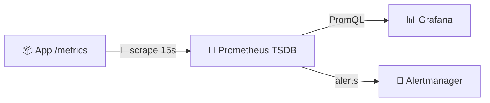
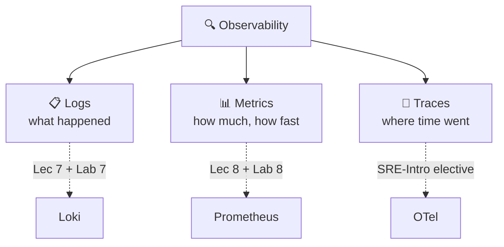
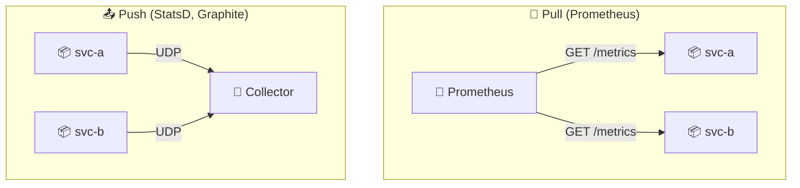
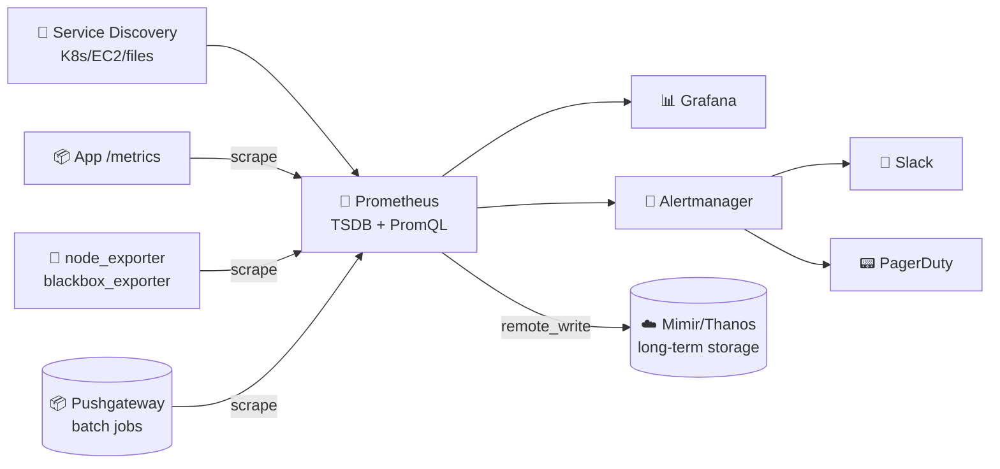
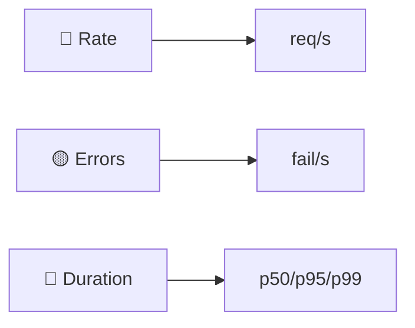
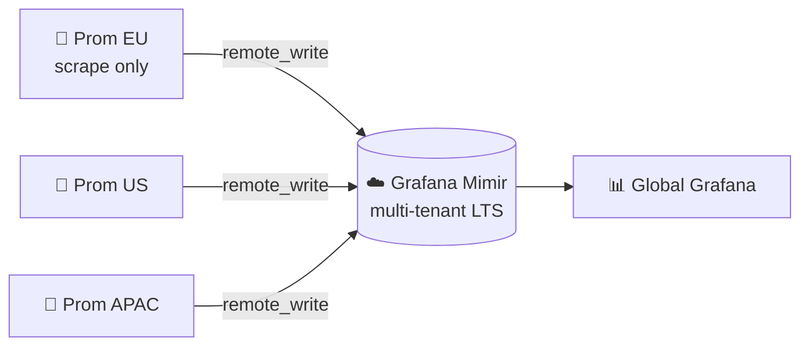
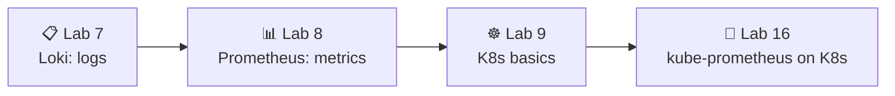

# 📌 Lecture 8 — Metrics & Monitoring with Prometheus: From Guessing to Measuring

## 📍 Slide 1 – 📊 Welcome to the Metrics Pillar

* 🌍 **Lecture 7 gave production eyes — logs.** This lecture gives it a *pulse* — metrics.
* ⏱️ Logs answer *"what happened?"*. Metrics answer *"how much, how fast, how often?"* — every 15 seconds, forever.
* 📊 **Prometheus** is the CNCF-graduated standard for metrics; it powers monitoring at Spotify, GitHub, DigitalOcean, and most Kubernetes deployments on Earth.
* 🎯 Today: scrape model, metric types, PromQL, RED + USE methods, and the dashboard you'll build in Lab 8.



> 🔗 **Lab 8 tie-in:** you'll instrument your Lab 1 Python app with `prometheus_client`, deploy Prometheus 3.x + Grafana 13 alongside last week's Loki stack, write PromQL for the **RED method**, and ship a 6-panel dashboard.

---

## 📍 Slide 2 – 🎯 Learning Outcomes

| # | Outcome |
|---|---------|
| 1 | 🧠 Pick the right metric type — **counter, gauge, histogram, summary, native histogram** — for any signal |
| 2 | 🔄 Explain why Prometheus is **pull-based** and what that buys you operationally |
| 3 | 🐍 Instrument a Python service with `prometheus_client` and control **label cardinality** |
| 4 | 🔍 Write **PromQL** for rates, percentiles, and per-service aggregations |
| 5 | 📊 Design dashboards around the **RED** method (services) and **USE** method (resources) |

**Tech stack pinned for May 2026:**
* 💾 **Prometheus 3.12** (latest stable, May 2026) / **3.5 LTS** (supported through Jul 31 2026)
* 📊 **Grafana 13.0.1+security-01** (May 12 2026)
* 🐍 **`prometheus_client` 0.23+** for Python (lab pins 0.23.1; 0.25 is latest)
* 📦 **`prom/prometheus:v3.9.0`** container image used by Lab 8

> 🆕 **Prometheus 3.x defaults** (vs 2.x): UTF-8 in metric/label names, **native histograms GA**, OTLP receiver built-in, new remote-write 2.0 protocol. Seven feature flags were promoted to defaults at 3.0.

---

## 📍 Slide 3 – 🧱 Where Metrics Fit (Recap from Lec 7)



* 📋 **Logs (Loki):** unbounded text, high cardinality, kept days–weeks, perfect for *forensics*
* 📊 **Metrics (Prometheus):** numeric time series, low cardinality, kept months, perfect for *alerts + trends*
* 🔗 **Traces:** request-level latency breakdown; out of Core scope, covered in the SRE-Intro elective

> 🔥 **Together, not instead.** A 5xx alert from Prometheus fires the page. A LogQL query in Grafana finds the stack trace. A trace tells you which downstream call was slow. Three pillars, one Grafana.

---

## 📍 Slide 4 – 💸 Without Metrics You're Flying Blind

Logs alone don't answer the questions your boss asks at 09:00:

* *"How many users hit the API yesterday?"* — you need a counter.
* *"Is the p95 latency creeping up week over week?"* — you need a histogram.
* *"Are we close to running out of database connections?"* — you need a gauge.
* *"Did the deploy 20 minutes ago change the error rate?"* — you need a graph, not a `grep`.

| 🔥 Symptom | 💥 Cost |
|-----------|---------|
| 🐢 No baseline | Can't tell normal from broken |
| 📅 No trend | Can't predict capacity exhaustion |
| 🚨 No alerts | Users (or Twitter) detect outages first |
| 🤷 No attribution | Microservice slowdowns become unsolved mysteries |

> 💬 **Brendan Gregg, Netflix:** *"You can't optimise what you can't measure, and you can't measure what you don't instrument."*

---

## 📍 Slide 5 – 🔄 Pull vs Push — Why Prometheus Chose Pull



| 🔧 Aspect | 🔄 Pull | 📤 Push |
|-----------|---------|---------|
| Target health | **Free** — a failed scrape = `up == 0` alert | Hard — silence ≠ healthy |
| Scrape rate control | Prometheus owns it | Each app decides (chaos) |
| Service discovery | Native (K8s, EC2, Consul, files) | Apps must know the collector |
| Firewall direction | Outbound from monitor | Inbound to collector (often blocked) |
| Short-lived jobs | ⚠️ Need **Pushgateway** | Native fit |

> 🔥 **Rule of thumb:** pull for long-running services; push (via Pushgateway) only for cron-style jobs that finish before the next scrape. **Don't use Pushgateway as a metric proxy** — it's a hack for the batch-job case only.

---

## 📍 Slide 6 – 🏗️ Prometheus Architecture



| 🧱 Component | 🎯 Role |
|-------------|---------|
| 💾 **Prometheus server** | Scrapes, stores in TSDB, evaluates rules, serves PromQL |
| 🔌 **Exporters** | Translate non-Prometheus systems (Postgres, Redis, Linux) into `/metrics` |
| 🧭 **Service discovery** | Find targets dynamically (Kubernetes API, EC2 tags, Consul…) |
| 🚨 **Alertmanager** | Deduplicate, group, route, silence alerts |
| 📦 **Pushgateway** | Receive metrics from short-lived batch jobs (use sparingly) |
| ☁️ **Mimir / Thanos** | Horizontal scale + multi-tenant long-term storage (Slide 19) |

---

## 📍 Slide 7 – 🔌 Exporters: The Translation Layer

You will rarely run vanilla Prometheus alone. The ecosystem is dozens of **exporters** that expose existing systems on `/metrics`:

| 🔌 Exporter | 🎯 Exposes |
|-------------|-----------|
| `node_exporter` | Linux host metrics (CPU, RAM, disk, network) |
| `postgres_exporter` | Postgres replication lag, connections, slow queries |
| `redis_exporter` | Redis ops/sec, memory, keyspace |
| `blackbox_exporter` | Synthetic probes — HTTP/HTTPS/TCP/DNS/ICMP |
| `cAdvisor` | Per-container CPU/memory (built into kubelet) |
| `kube-state-metrics` | Kubernetes object state — deployment replicas, pod phase |

* 📦 **One exporter per dependency.** Lab 8 scrapes Loki and Grafana directly (both ship `/metrics` natively — no exporter needed).
* 🐍 **For your own apps:** instrument with a **client library** (`prometheus_client` for Python) instead of writing an exporter.

> 💡 **OpenMetrics** is the IETF-track spec born from the Prometheus exposition format — every exporter and client library speaks it.

---

## 📍 Slide 8 – 📊 Metric Types: Counter

A **counter** only ever increases. Reset to zero when the process restarts.

```python
from prometheus_client import Counter

http_requests_total = Counter(
    "http_requests_total", "Total HTTP requests",
    ["method", "endpoint", "status"],
)
http_requests_total.labels("GET", "/", "200").inc()
```

**You almost never query the counter directly — you query its `rate()`:**

```promql
# requests per second, last 5 minutes
rate(http_requests_total[5m])

# error rate per endpoint
sum by (endpoint) (rate(http_requests_total{status=~"5.."}[5m]))
```

> ⚠️ **Counters can reset** (pod restart). `rate()` and `increase()` handle the wraparound automatically — `irate()` and raw subtraction do **not**. Stick with `rate()` for graphs.

---

## 📍 Slide 9 – 📊 Metric Types: Gauge

A **gauge** goes up *and* down. Snapshot of "right now".

```python
from prometheus_client import Gauge

queue_depth = Gauge("worker_queue_depth", "Pending jobs")
queue_depth.set(42)
queue_depth.inc()      # +1
queue_depth.dec(5)     # -5
in_flight = Gauge("http_in_flight", "Concurrent requests")
in_flight.track_inprogress()  # context-managed
```

**Query patterns:**

```promql
# current value across all instances
sum(worker_queue_depth)

# how fast is memory growing? (derivative)
deriv(process_resident_memory_bytes[10m])

# fastest-growing pods
topk(5, rate(container_memory_working_set_bytes[5m]))
```

> 🎯 **Use a gauge for:** active connections, queue depth, temperature, memory in use, current replica count. **Anything that can shrink.**

---

## 📍 Slide 10 – 📊 Metric Types: Histogram

Counters tell you *how many*. Histograms tell you *how the values are distributed* — perfect for **latency**.

```python
from prometheus_client import Histogram

request_latency = Histogram(
    "http_request_duration_seconds", "Request latency",
    ["method", "endpoint"],
    buckets=(0.005, 0.01, 0.025, 0.05, 0.1, 0.25, 0.5, 1.0, 2.5, 5.0),
)
with request_latency.labels("GET", "/api").time():
    handle_request()
```

**A classic histogram exposes three families** of time series per bucket set:
* `*_bucket{le="0.1"}` — cumulative count of observations ≤ 0.1s
* `*_sum` — total time
* `*_count` — total observations

**The killer query — percentiles, server-side:**

```promql
# p95 latency, last 5 minutes
histogram_quantile(0.95,
  sum by (le) (rate(http_request_duration_seconds_bucket[5m])))
```

> ⚠️ **Bucket choice matters.** Buckets that don't bracket the real distribution give wildly wrong percentiles. Start with the SRE default `(.005, .01, .025, .05, .1, .25, .5, 1, 2.5, 5, 10)` and tune from production data.

---

## 📍 Slide 11 – ✨ Native Histograms (Prometheus 3.x GA)

**Classic histograms** force you to pre-pick buckets. Get them wrong and your p99 lies to you. **Native histograms** (GA since Prometheus 3.x, stable in v3.8) fix this with **exponential bucket schemas** chosen automatically.

| 🔧 Aspect | 📊 Classic Histogram | ✨ Native Histogram |
|-----------|---------------------|---------------------|
| Buckets | Manually defined per metric | Auto, exponential, dynamic |
| Time series per metric | One per bucket (10–20) | **One** |
| Resolution | Fixed | Configurable schema (powers of 2) |
| Storage | High (each bucket = a series) | ~5× cheaper |
| `histogram_quantile()` | Works | Works — same function |

```python
# Python client (0.23+): opt in by passing `native_histogram_bucket_factor`
Histogram(
    "http_request_duration_seconds", "Latency",
    native_histogram_bucket_factor=1.1,  # ~10% resolution
)
```

> 🆕 **In Prometheus 3.x they're a default-on feature** (the `native-histograms` flag was promoted to default at 3.0). Mix freely: a single metric can expose both classic *and* native — clients negotiate via the scrape protocol.

---

## 📍 Slide 12 – 📊 Counter vs Gauge vs Histogram vs Summary

| 📊 Type | ⬆️⬇️ Behaviour | 🎯 Use for | 🔍 Query with |
|---------|----------------|-----------|----------------|
| 🔢 **Counter** | Only up (resets on restart) | Events: requests, errors, bytes | `rate()`, `increase()` |
| 📈 **Gauge** | Up and down | State: temperature, queue depth | direct, `avg()`, `max()` |
| 📊 **Histogram (classic)** | Multiple time series per metric | Latency, size, durations | `histogram_quantile()` server-side |
| ✨ **Native histogram** | One time series, auto buckets | Same as histogram, ~5× cheaper | `histogram_quantile()` — same fn |
| 📐 **Summary** | Quantiles computed in-process | Legacy quantile reporting | Direct — but **can't aggregate across instances** |

> 🔥 **Default to histograms (native if Prometheus 3.x).** Summaries are last-resort: their pre-computed quantiles can't be merged across pods, so they break the moment you scale past one replica.

---

## 📍 Slide 13 – 🐍 Instrumenting the Lab 1 Python App

Two-file change to add metrics to your Flask/FastAPI service:

```python
# app.py
from prometheus_client import Counter, Histogram, Gauge, generate_latest
from flask import Flask, Response, request
import time

app = Flask(__name__)

REQS = Counter("http_requests_total", "HTTP requests",
               ["method", "endpoint", "status"])
LAT  = Histogram("http_request_duration_seconds", "Latency",
                 ["method", "endpoint"])
INF  = Gauge("http_requests_in_progress", "In-flight requests")

@app.before_request
def _before():
    request._t0 = time.perf_counter()
    INF.inc()

@app.after_request
def _after(resp):
    dur = time.perf_counter() - request._t0
    endpoint = request.url_rule.rule if request.url_rule else "unknown"
    REQS.labels(request.method, endpoint, resp.status_code).inc()
    LAT.labels(request.method, endpoint).observe(dur)
    INF.dec()
    return resp

@app.route("/metrics")
def metrics():
    return Response(generate_latest(), mimetype="text/plain")
```

```txt
# requirements.txt
prometheus-client==0.23.1
```

> 🔗 **Lab 8 deliverable:** the `/metrics` endpoint above plus one **business metric** (e.g. `devops_info_endpoint_calls`) — graded under Task 1.

---

## 📍 Slide 14 – 🏷️ Label Cardinality — The #1 Way to OOM Prometheus

Each unique label combination = one **time series**. A series costs ~3–5 KB in memory. Do the maths.

```python
# ❌ MELT YOUR PROMETHEUS — one series per user, forever
REQS.labels(user_id=u, request_id=r).inc()

# ✅ Use bounded enumerations only
REQS.labels(method="GET", endpoint="/api", status="200").inc()
```

| ✅ Good label (bounded) | ❌ Bad label (unbounded) |
|------------------------|--------------------------|
| `method` (8 values) | `user_id` (millions) |
| `endpoint` (dozens, normalised) | `request_id` (one per call) |
| `status_code` (~10) | `email`, `path` with IDs |
| `env="prod"` (3) | `timestamp`, `trace_id` |

**Targets:**
* 📊 **<1000** unique label combinations per metric is healthy.
* 🚨 **>100,000** and you're a few hours from an OOM.
* 🛡️ Track your series count with `prometheus_tsdb_head_series` and alert on growth.

> 🔥 **The rule:** if a value is unique per request or per user, **it doesn't go in a label**. Same lesson as Loki (Lec 7), same blast radius.

---

## 📍 Slide 15 – 🔍 PromQL Part 1: Instant vs Range Vectors

Every PromQL expression returns one of four types. The two you'll use constantly:

```promql
# 🎯 Instant vector — one sample per series, at evaluation time
http_requests_total{status="500"}

# 🎯 Range vector — all samples per series, over a duration
http_requests_total[5m]
```

You **can't graph a range vector directly** — you must collapse it with a function (`rate`, `avg_over_time`, …):

```promql
# req/sec averaged over 5-minute windows
rate(http_requests_total[5m])
```

| 🔧 Operator | 🎯 Meaning |
|-------------|-----------|
| `{label="v"}` / `{label!="v"}` | Exact match / negation |
| `{label=~"re"}` / `{label!~"re"}` | Regex / negated regex |
| `[5m]`, `[1h]` | Lookback window for range vectors |
| `offset 1h` | Shift the query back in time |
| `@ 1700000000` | Pin evaluation to a Unix timestamp |

> 💡 **Rule of thumb:** the range `[Xm]` should be ≥ **4× the scrape interval** so each evaluation has enough samples. With 15s scrapes, `[1m]` is the minimum that doesn't lie.

---

## 📍 Slide 16 – 🔍 PromQL Part 2: Aggregation & rate()

```promql
# Total req/s across the whole fleet
sum(rate(http_requests_total[5m]))

# Per-endpoint req/s (keep that label, sum away the rest)
sum by (endpoint) (rate(http_requests_total[5m]))

# Per-pod req/s, drop a noisy label
sum without (instance) (rate(http_requests_total[5m]))

# Top 5 slowest endpoints (p95)
topk(5,
  histogram_quantile(0.95,
    sum by (endpoint, le) (rate(http_request_duration_seconds_bucket[5m]))))

# Error ratio (5xx as a fraction of total)
sum(rate(http_requests_total{status=~"5.."}[5m]))
  / sum(rate(http_requests_total[5m]))
```

| 🔧 Aggregator | 🎯 Use case |
|---------------|-------------|
| `sum`, `avg`, `min`, `max` | Combine series |
| `count` | Number of series matching |
| `topk(N, expr)` / `bottomk` | The N highest/lowest |
| `quantile(0.5, expr)` | Fleet-level percentile |
| `group by (l) / without (l)` | Drop or keep label dimensions |

> ⚠️ **Don't average percentiles.** `avg(histogram_quantile(...))` is mathematical nonsense. Always `histogram_quantile()` *outside* the `sum by (le, …)`.

---

## 📍 Slide 17 – 🔍 PromQL Part 3: Recording Rules

Some queries are slow. Some you need many times a day. **Recording rules** evaluate a PromQL expression on a schedule and store the result as a new metric — like a materialised view.

```yaml
# prometheus.rules.yml
groups:
  - name: app_red
    interval: 30s
    rules:
      - record: job:http_requests:rate5m
        expr: sum by (job) (rate(http_requests_total[5m]))

      - record: job:http_errors:ratio5m
        expr: |
          sum by (job) (rate(http_requests_total{status=~"5.."}[5m]))
            / sum by (job) (rate(http_requests_total[5m]))

      - record: job:http_latency:p95_5m
        expr: |
          histogram_quantile(0.95,
            sum by (job, le) (rate(http_request_duration_seconds_bucket[5m])))
```

* 🏷️ **Naming convention:** `level:metric:operation` — e.g. `job:http_requests:rate5m`. The colons are intentional and reserved for recording rules.
* 🚀 **Dashboards stay fast** because they query the pre-computed series, not the raw histogram buckets.
* 🚨 **Alert rules** use the same syntax (`alert:` instead of `record:`) and fire to Alertmanager when their expression is non-empty for `for: Xm`.

---

## 📍 Slide 18 – 🔴 The RED Method (Tom Wilkie, Weaveworks, 2015)

**For every request-driven service, monitor three things:**

| 🔧 Metric | 🎯 Question | 📝 PromQL |
|-----------|-------------|------------|
| 🔴 **R**ate | How busy? | `sum by (svc) (rate(http_requests_total[5m]))` |
| 🟡 **E**rrors | How often failing? | `sum by (svc) (rate(http_requests_total{status=~"5.."}[5m]))` |
| 🔵 **D**uration | How slow? | `histogram_quantile(0.95, sum by (svc, le) (rate(http_request_duration_seconds_bucket[5m])))` |



* 📊 **Why these three?** They map directly to the user's experience: *"is the service up, is it correct, is it fast?"*
* 🪞 **Mirror the Four Golden Signals** from the Google SRE book (Rate + Errors + Latency + Saturation) — RED drops saturation because that's the **USE** method's job.
* 🎯 **If you only monitor three things per service, monitor these.**

> 📖 First presented by **Tom Wilkie at the London Prometheus meetup, 2015** while he was at Weaveworks. Now standard practice across CNCF.

---

## 📍 Slide 19 – 📊 The USE Method (Brendan Gregg, 2012)

**RED** is for services. **USE** is for **resources** — CPU, RAM, disk, network, file descriptors.

| 🔧 Metric | 🎯 Question | 📝 Example |
|-----------|-------------|-----------|
| 📊 **U**tilisation | How busy is the resource? | CPU at 80% |
| 🪣 **S**aturation | How much extra work is queued? | run-queue length > cores |
| ❌ **E**rrors | Are there error events? | disk I/O errors, NIC drops |

```promql
# Node CPU utilisation (node_exporter)
1 - avg by (instance) (rate(node_cpu_seconds_total{mode="idle"}[5m]))

# Memory saturation — swap-in pages per second
rate(node_vmstat_pswpin[5m])

# Disk error counter
rate(node_disk_io_errors_total[5m])
```

> 📖 Published by **Brendan Gregg (then Joyent, now Netflix/Intel) in 2012** as *"Thinking Methodically about Performance"* (ACM Queue). The companion checklists at brendangregg.com/usemethod.html are still the gold-standard tour of Linux performance counters.

**🎯 The recipe:** **RED for every service. USE for every resource. Together they cover both halves of every incident.**

---

## 📍 Slide 20 – 📊 Grafana Dashboards for Metrics

Same Grafana from Lab 7 — add Prometheus as a second data source:

```yaml
# grafana/provisioning/datasources/datasources.yml
datasources:
  - name: Prometheus
    type: prometheus
    url: http://prometheus:9090
    access: proxy
  - name: Loki
    type: loki
    url: http://loki:3100
```

**Panel-design principles (same as Lec 7):**
* 🎯 **One question per dashboard** — *"Is api healthy?"*, not *"show me everything"*.
* 🚦 **Stat panels on top** — red/green at a glance.
* 📈 **Time-series in the middle** — RED metrics, last hour, with thresholds.
* 🔥 **Heatmap at the bottom** — latency distribution (use `*_bucket` series straight to the heatmap panel).
* 🔁 **Template variables** for `$service`, `$env`, `$instance` — one dashboard, many slices.
* 🔗 **Drill-down from a metric spike** to the matching LogQL query (Grafana lets you data-source-link).

> 💡 **Heatmaps reveal what averages hide.** A p99 of 800ms can be "everyone is slow" or "1% of users are abandoned" — the heatmap shows which.

---

## 📍 Slide 21 – 📊 Lab 8's Dashboard Panels (PromQL)

The six (+) panels graded under Task 3:

```promql
# 1️⃣ Request rate per endpoint
sum by (endpoint) (rate(http_requests_total[5m]))

# 2️⃣ Error rate per endpoint
sum by (endpoint) (rate(http_requests_total{status=~"5.."}[5m]))

# 3️⃣ p95 latency
histogram_quantile(0.95,
  sum by (endpoint, le) (rate(http_request_duration_seconds_bucket[5m])))

# 4️⃣ Latency heatmap (drives the Grafana Heatmap panel directly)
sum by (le) (rate(http_request_duration_seconds_bucket[5m]))

# 5️⃣ In-flight requests
http_requests_in_progress

# 6️⃣ Service uptime (1 = up, 0 = down)
up{job="app"}
```

| Panel | Vis | Answers |
|-------|-----|---------|
| 1 | Time series | *"How busy?"* |
| 2 | Time series | *"How often failing?"* |
| 3 | Time series | *"How slow at the 95th?"* |
| 4 | Heatmap | *"What does the long tail look like?"* |
| 5 | Gauge | *"How many in flight right now?"* |
| 6 | Stat | *"Are we even alive?"* |

> 🔗 **Evidence required:** screenshots of all panels with live traffic from a `curl` loop hitting your app — graded under Lab 8 Task 3.

---

## 📍 Slide 22 – 🏭 Production: Federation, remote_write, Mimir

Lab 8 runs **one Prometheus container** with 15-day retention. Production needs four upgrades:

| 🔧 Concern | 🪜 Lab default | 🏭 Production |
|-----------|----------------|---------------|
| Storage | Local TSDB, 15 days | **`remote_write` to Mimir / Thanos** (years, multi-tenant) |
| HA | Single Prometheus | **Two Prometheus replicas** scraping the same targets; Alertmanager dedupes |
| Scale | Single binary | **Federation** — leaf Prometheus per cluster, global Prometheus aggregates |
| Retention | 15 d local | Local 24 h + Mimir for long-term (cheap object storage) |
| Cardinality guard | None | `remote_write` `relabel_configs` to drop high-card series before they ship |



> 🆕 **Mimir** (Grafana Labs, AGPL/open) replaces Cortex and scales to **1B+ active series**. **Thanos** (CNCF) is the sidecar-based alternative — pick Thanos if you already run vanilla Prometheus, Mimir if you're starting fresh.

---

## 📍 Slide 23 – 🌍 Prometheus in the Wild

* 🎵 **SoundCloud** — birthplace; open-sourced 2012, inspired by Google's internal **Borgmon**.
* ☁️ **DigitalOcean** — ~1B active series across regional Prometheus + Cortex/Mimir.
* 🐙 **GitHub** — Prometheus + Grafana for infra; the public status page is Prometheus alerts dressed up.
* 🚀 **SpaceX** — telemetry pipelines feed Prometheus + custom TSDB for engine and avionics monitoring.
* 🎬 **Netflix** — **Atlas** (their in-house TSDB) for product metrics, Prometheus widely for infra; Brendan Gregg's USE method came out of this team.
* 🏛️ **CNCF** — Prometheus was the **second project to graduate** (Aug 2018, after Kubernetes). The exposition format begat **OpenMetrics**, now an IETF draft.

> 🔥 **Common pattern:** Prometheus scrapes locally for fast queries and alerting; everything ships to a long-term store (Mimir / Thanos / VictoriaMetrics / Cortex) for cross-region dashboards.

---

## 📍 Slide 24 – 🎯 Key Takeaways

1. 📊 **Metrics are the second pillar.** Logs say *what*, metrics say *how much / how fast*. Use both.
2. 🔄 **Pull beats push for services** — Prometheus owns the scrape, target health is free.
3. 📈 **Counter, gauge, histogram, summary, native histogram** — pick by the *question*, not the *value*. Counters need `rate()`. Histograms unlock server-side percentiles. Native histograms (Prom 3.x GA) are ~5× cheaper than classic.
4. 🏷️ **Label cardinality is the foot-gun.** No user IDs, no request IDs, no timestamps. <1000 series per metric.
5. 🔍 **PromQL = stream selector → range vector → aggregation → quantile.** Recording rules pre-compute the expensive queries.
6. 🔴 **RED** (Wilkie, 2015) for **services** — Rate, Errors, Duration.
7. 📊 **USE** (Gregg, 2012) for **resources** — Utilisation, Saturation, Errors.
8. 🆕 **Prometheus 3.x** ships UTF-8 names, native histograms GA, OTLP receiver, remote-write 2.0 — modernise when you upgrade.

> 💡 **You can't fix what you can't measure — and you can't measure what you don't instrument.**

---

## 📍 Slide 25 – 🚀 What Comes Next

**📚 Next lecture: *Kubernetes Fundamentals*** — Pods, Deployments, Services, the kubectl basics, and why every observability concept from Lec 7–8 gets rebuilt as a CRD.

* ☸️ Pods, ReplicaSets, Deployments, Services
* 🔄 Self-healing & rolling updates
* 🌐 Service discovery & ClusterIP / NodePort / LoadBalancer
* 🧪 Lab 9: deploy your Lab 1 Python app + Lab 7/8 monitoring to a real Kubernetes cluster

**🔬 Lab 8 deliverables (this week):** add `prometheus_client` to your Python app, deploy `prom/prometheus:v3.9.0` + Grafana 13 alongside Lab 7's Loki stack, write PromQL for the RED method, ship a 6+ panel dashboard, harden for production (healthchecks, resource limits, retention, volumes). Bonus 2.5 pts: extend the Ansible role from Lab 6/7 to template the whole stack.



> 🆕 **Lab 16 preview:** today's docker-compose stack will become a **`kube-prometheus-stack` Helm chart** (~v85, May 2026) with **ServiceMonitor** and **PodMonitor** CRDs auto-discovering targets — same metrics, same PromQL, Kubernetes-native plumbing.

**👋 See you in Lecture 9.**

---

## 📚 Resources & Further Reading

**📕 Books:**
* *Prometheus: Up & Running* — **Julien Pivotto & Brian Brazil** (O'Reilly, 2nd ed. 2023). The reference; Brazil is a core dev, Pivotto a server maintainer.
* *Site Reliability Engineering* — Beyer et al. — Ch. 6 (Monitoring) and Ch. 10 (Practical Alerting). Free at sre.google/books.
* *Observability Engineering* — Majors, Fong-Jones, Miranda (O'Reilly, 2022) — places metrics in the wider three-pillars picture.

**🔗 Links:**
* 🌐 [prometheus.io/docs](https://prometheus.io/docs/) — official docs (3.x)
* 🌐 [Prometheus 3.0 announcement](https://prometheus.io/blog/2024/11/14/prometheus-3-0/) — UTF-8, native histograms, OTLP
* 🌐 [PromQL basics](https://prometheus.io/docs/prometheus/latest/querying/basics/)
* 🌐 [RED method by Tom Wilkie (Grafana Labs blog)](https://grafana.com/blog/the-red-method-how-to-instrument-your-services/)
* 🌐 [USE method by Brendan Gregg](https://www.brendangregg.com/usemethod.html)
* 🌐 [Grafana Mimir](https://grafana.com/oss/mimir/) — horizontally scalable Prometheus storage
* 🌐 [kube-prometheus-stack Helm chart](https://github.com/prometheus-community/helm-charts/tree/main/charts/kube-prometheus-stack) — Lab 16 preview

**🎓 Quiz:** post-lecture quiz feeds the weeks 7–9 leaderboard window.
