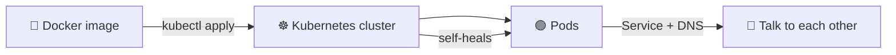
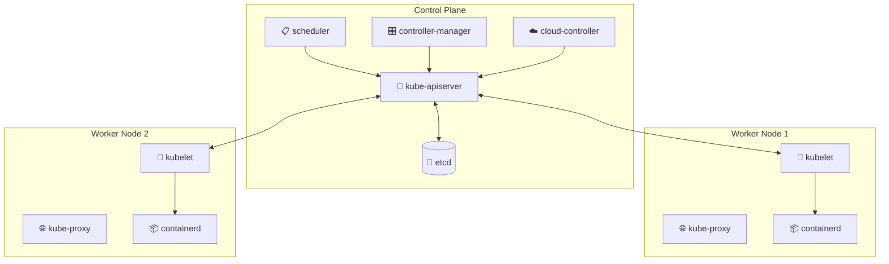
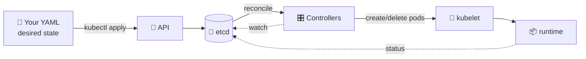
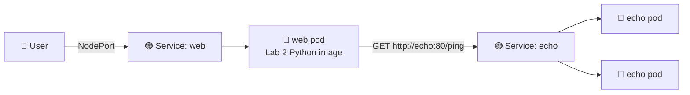
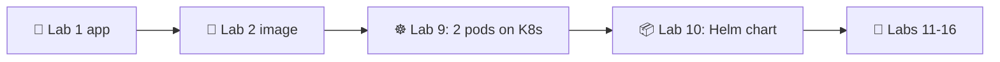

# 📌 Lecture 9 — Kubernetes Fundamentals: Container Orchestration

## 📍 Slide 1 – ☸️ Welcome to Kubernetes

* 🌍 **Lectures 2 and 7-8 gave you a Docker image, logs, and metrics.** Now we orchestrate.
* 🚢 **Kubernetes (K8s)** = the de-facto container orchestrator, born at Google in 2014, runs your image at scale, self-heals, rolls forward and back
* 🎯 This lecture: the mental model + just enough API to deploy your Lab 2 image as a real *cloud-native* workload
* 🔗 **Tie-in to Lab 9:** you'll spin up a local cluster with **k3d** (k3s-in-Docker), deploy two pods (your Python service + a provided Go echo plumbing service), and meet them through `Service` and kube-DNS



---

## 📍 Slide 2 – 🎯 Learning Outcomes

| # | Outcome |
|---|---------|
| 1 | 🧠 Explain why orchestration exists and what problems Compose can't solve |
| 2 | 🏗️ Read & write `Pod`, `Deployment`, `ReplicaSet`, `Service`, `Namespace` manifests |
| 3 | 🛠️ Drive a cluster with `kubectl`: `get`, `describe`, `logs`, `exec`, `apply`, `port-forward` |
| 4 | 🔗 Understand label/selector binding — the glue of every K8s resource |
| 5 | 🌐 Reason about kube-DNS and inter-service networking (the *whole point* of running 2 pods) |
| 6 | 🩺 Configure liveness, readiness, and startup probes |

**Tech stack pinned for May 2026:** Kubernetes **1.36** "Haru" (released Apr 22 2026), **kubectl 1.36**, **k3d 5.7+** (k3s-in-Docker — the course's standard local cluster), manifests in plain YAML (Helm comes next lecture).

---

## 📍 Slide 3 – ❓ Why Compose Stops Being Enough

You've shipped a single Python service (Labs 1-2), wired it through CI (Lab 3), provisioned a VM (Lab 4), configured it (Labs 5-6), and watched its logs + metrics (Labs 7-8). One service, one host, `docker compose up`. Why is that not the end of the story?

* 💀 **No self-healing.** If the host dies, your service dies. Restart? You do it.
* 📈 **No horizontal scaling.** Add traffic, add a second instance? You manually run a second `docker run` and put nginx in front.
* 🔄 **No rolling updates.** Deploying = stop / start. There is downtime.
* 🌐 **No service discovery.** Two services on two hosts need IP-and-port glue you maintain by hand.
* 🛡️ **No resource isolation across tenants.** Compose is "one project per directory" not "ten teams in a cluster".

Kubernetes solves all five — but at the cost of a steeper learning curve.

> 🔥 **Reality check:** for a single small service, Compose is *still* the right answer. K8s is for when you have ≥ 3 services, multiple environments, or you need self-healing at 3am.

---

## 📍 Slide 4 – 📜 A Brief History

* 📅 **2003** — Google launches **Borg** internally. Most engineering staff use it daily; nobody outside Google knows it exists.
* 📅 **2014 (June)** — Google open-sources Kubernetes as the spiritual successor to Borg. Joe Beda, Brendan Burns, Craig McLuckie are the original team.
* 📅 **2015** — **Kubernetes 1.0** announced. CNCF (Cloud Native Computing Foundation) founded with K8s as its seed project.
* 📅 **2016-2017** — *"Kubernetes the Hard Way"* (Kelsey Hightower) becomes required reading. Helm, ArgoCD, Istio appear.
* 📅 **2018** — CNCF graduates Kubernetes; managed offerings (EKS, GKE, AKS) mature.
* 📅 **2020** — K8s deprecates Docker as a runtime (uses **containerd** directly). Your *images* still work — they're OCI.
* 📅 **2024-2025** — Sidecar containers go GA (1.29 → 1.33). Pod security admission replaces PodSecurityPolicy (gone for good).
* 📅 **2026 (Apr 22)** — Kubernetes **1.36 "Haru"** — 70 enhancements: 18 graduating to Stable, 25 entering Beta, 25 new Alpha. Focus areas: security hardening, AI/ML workload support, API scalability.

> 📖 *Kubernetes Up & Running* (Burns, Beda, Hightower) — the standard intro book. The 3rd edition (2022) is still accurate at the API level for 1.36.

---

## 📍 Slide 5 – 🏗️ Architecture: Control Plane + Nodes



* 🚪 **kube-apiserver** — the only component clients (and other plane components) talk to. RESTful gRPC over HTTP.
* 💾 **etcd** — the source of truth. Every Pod, every Secret, every label lives here. (Plan your DR around it.)
* 📋 **scheduler** — picks which node a pending Pod should run on.
* 🎛️ **controller-manager** — runs reconciliation loops (ReplicaSet controller, Node controller, etc.). The "make reality match desired state" engine.
* 🧠 **kubelet** — the node agent. Talks to the runtime (containerd), reports node + pod status back to API.
* 🌐 **kube-proxy** — programs iptables/IPVS/nftables rules so `Service` virtual IPs route to live pods.

> 🤔 **Think:** what happens if etcd loses quorum? *(Answer: cluster freezes. No new pods, no deletions. Existing ones keep running.)*

---

## 📍 Slide 6 – 🎯 The Declarative Model

You don't tell Kubernetes *what to do*; you tell it *what you want*. The control plane figures out the rest by reconciling **desired state** (your YAML) against **observed state** (what's actually running).



* ✏️ You **edit** YAML and `kubectl apply`. Done.
* 🔁 Controllers continuously close the gap between desired and observed.
* 🛡️ Kill a pod manually? The ReplicaSet controller spawns another within seconds.

> 📚 **This is the same paradigm as Terraform** (Lec 4) — declarative IaC, with a reconciliation loop *built into the platform itself*.

---

## 📍 Slide 7 – 🟢 Pod — The Atom of K8s

A **Pod** is one or more containers that share the same network namespace and storage volumes — scheduled together, lifecycle-managed together.

```yaml
apiVersion: v1
kind: Pod
metadata:
  name: hello-pod
  labels:
    app: hello
spec:
  containers:
    - name: web
      image: ghcr.io/innodevops/lab2-app:v1.0.0
      ports:
        - containerPort: 8080
```

Key facts:
* 🆔 Each pod gets its own IP — accessible by other pods in the cluster
* 💥 Pods are **mortal**. They die, they get rescheduled, IPs change. *Never* rely on a pod's IP from outside it.
* 📦 Multi-container pods exist for the **sidecar pattern** (logging agent, proxy, init helper)
* 🏷️ **Labels** are how every other resource finds this pod

> ⚠️ **Anti-pattern:** running a Pod directly. You'll lose it on the first node reboot. Always wrap with a workload controller (Deployment / StatefulSet / DaemonSet / Job).

---

## 📍 Slide 8 – 🎁 Deployment + ReplicaSet — How You Actually Run Things

A **Deployment** declares *N pods of a given template*. It manages a **ReplicaSet** under the hood (you almost never touch ReplicaSets directly).

```yaml
apiVersion: apps/v1
kind: Deployment
metadata:
  name: hello
spec:
  replicas: 3
  selector:
    matchLabels:
      app: hello
  template:
    metadata:
      labels:
        app: hello
    spec:
      containers:
        - name: web
          image: ghcr.io/innodevops/lab2-app:v1.0.0
          ports: [{containerPort: 8080}]
          resources:
            requests: {cpu: 100m, memory: 64Mi}
            limits:   {cpu: 500m, memory: 256Mi}
```

* 🔄 `kubectl set image deployment/hello web=…:v1.0.1` → **rolling update** (default: 25% maxUnavailable, 25% maxSurge)
* ⏪ `kubectl rollout undo deployment/hello` → roll back to the previous ReplicaSet
* 📈 `kubectl scale deployment/hello --replicas=10` → scale up

> 🔥 **Hot take:** every "modern" stateless workload in K8s is a Deployment + Service. Master that pair and you understand 70% of cluster operations.

---

## 📍 Slide 9 – 🌐 Service — Stable Address for a Moving Target

Pods come and go; their IPs change. A **Service** is a stable virtual IP + DNS name that load-balances across all pods matching its selector.

```yaml
apiVersion: v1
kind: Service
metadata:
  name: hello
spec:
  type: ClusterIP   # default — internal only
  selector:
    app: hello
  ports:
    - port: 80
      targetPort: 8080
```

| Type | Where it's reachable | When to use |
|------|---------------------|-------------|
| **ClusterIP** | Inside the cluster only | Inter-service traffic (default) |
| **NodePort** | Every node's IP:30000-32767 | Dev / quick external access |
| **LoadBalancer** | Cloud provider provisions an external LB | Production external traffic on managed K8s |
| **ExternalName** | DNS CNAME to an external host | Migration / legacy proxying |

* 🌐 Inside the cluster, the DNS name `hello.default.svc.cluster.local` (short: `hello`) resolves to the ClusterIP
* ⚖️ `kube-proxy` programs iptables/IPVS rules; traffic is round-robin'd across healthy pods
* 🚪 For HTTP ingress from outside, use `Ingress` or `Gateway API` (touched in Lab 9 bonus + Lab 13)

---

## 📍 Slide 10 – 🔗 Why Two Pods Suddenly Makes Sense

Up through Lab 8 you ran **one** service. `Service` and kube-DNS felt like overkill — "why a stable IP for one thing?"

**Lab 9 introduces a SECOND service** (a small Go "echo" companion, shipped by the course as plumbing in `app_go_echo/`). Now the picture changes:



Suddenly:
* 🌐 **kube-DNS does real work** — `echo` resolves to a load-balanced ClusterIP
* ⚖️ **Service load-balances** across two `echo` pods — kill one, traffic keeps flowing
* 🏷️ **Labels matter** — `app=echo` is how `Service: echo` finds its targets, regardless of which node they land on
* 🩺 **Probes start earning their keep** — the `web` pod's readiness probe might fail if `echo` is down (depending on how you wire it)

> 🔗 **This is the pedagogical core of Lab 9.** The 2nd service isn't busywork — it's the smallest topology in which "the K8s networking model" stops being abstract.

---

## 📍 Slide 11 – 🏷️ Labels & Selectors — The Glue

Labels are key/value tags on any K8s object. Selectors query objects by their labels. **Almost every controller works by selector**:

* 🎁 `Deployment.spec.selector` → finds the pods it owns
* 🌐 `Service.spec.selector` → finds the pods it routes to
* 🛡️ `NetworkPolicy.podSelector` → finds the pods it firewalls
* 📊 `ServiceMonitor.spec.selector` → finds the services to scrape (Lab 16)

```yaml
metadata:
  labels:
    app: hello                   # 🎯 functional
    version: v1.2.3              # 📌 release tracking
    env: prod                    # 🚦 environment
    team: payments               # 🤝 ownership
    tier: backend                # 🧱 architecture role
```

```bash
kubectl get pods -l app=hello,env=prod         # 🎯 AND selector
kubectl get pods -l 'tier in (frontend,api)'   # 🔀 set-based selector
```

> 🔥 **Convention:** use `app.kubernetes.io/name`, `app.kubernetes.io/version`, `app.kubernetes.io/managed-by` — the "recommended labels" namespace. Helm and ArgoCD set these automatically.

---

## 📍 Slide 12 – 🛠️ kubectl — The Survival Toolkit

You will run these every day. Memorize them.

```bash
kubectl get pods,svc,deploy -A              # 🔍 list everything across all namespaces
kubectl get pod hello-abc -o yaml           # 📄 show full manifest
kubectl describe pod hello-abc              # 🩺 events + state details — your debugging starting point
kubectl logs hello-abc -f                   # 📋 tail logs; -c <container> for multi-container pods
kubectl logs hello-abc --previous           # ⏪ logs from the previous (crashed) container
kubectl exec -it hello-abc -- /bin/sh       # 🐚 shell into the pod
kubectl port-forward svc/hello 8080:80      # 🚪 tunnel a service to localhost
kubectl apply -f manifest.yaml              # ✏️ create/update declaratively
kubectl delete -f manifest.yaml             # 🗑️ delete what's in that file
kubectl rollout status deploy/hello         # 📊 watch a rolling update
kubectl rollout undo deploy/hello           # ⏪ revert to previous ReplicaSet
kubectl top pod                             # 📊 live CPU/mem (needs metrics-server)
```

> 🔧 **Setup tip:** `alias k=kubectl` and `kubectl completion bash` (or zsh). Run `kubectl explain pod.spec.containers` for inline schema docs.

---

## 📍 Slide 13 – 💻 Local Clusters with k3d

Production K8s runs on managed services (EKS, GKE, AKS). For learning and CI you need a cluster on your laptop. **This course standardizes on k3d** — it wraps **k3s** (Rancher's lightweight, CNCF-certified Kubernetes) inside Docker containers.

```bash
k3d cluster create devops \
  --image rancher/k3s:v1.36.1-k3s1 \
  --agents 2 \
  -p "8080:80@loadbalancer" -p "8443:443@loadbalancer"
```

Why k3d over the alternatives:
* ⚡ **Fastest + lightest** — a cluster comes up in seconds; far smaller footprint than minikube's VM
* 🧱 **Free multi-node** — `--agents N` adds worker containers, so pod scheduling across nodes is observable
* 🔋 **Batteries included** — built-in **Traefik** ingress and **klipper** LoadBalancer mean `Ingress` and `type: LoadBalancer` work with no extra install
* 🔁 **Throwaway** — `k3d cluster delete devops` and start fresh

> 💡 **Tradeoff to know:** k3d runs k3s, which trims some legacy APIs and ships **Traefik** (not ingress-nginx) plus klipper-lb. For everything in this course those differences are invisible; the one place it shows up is `ingressClassName: traefik`. Don't use Docker Desktop's bundled K8s — it lags upstream.

---

## 📍 Slide 14 – 📦 Namespaces — Multi-Tenancy Within a Cluster

A **Namespace** scopes most resources (pods, services, configmaps, secrets, deployments). It's how you carve a cluster up across teams or environments.

```bash
kubectl create namespace dev
kubectl apply -f manifest.yaml -n dev       # 🧱 deploy into dev
kubectl get pods -n dev                     # 🔍 list pods in dev
kubectl config set-context --current --namespace=dev   # 🎯 stick to dev
```

Default namespaces every cluster has:
* `default` — where stuff lands if you don't say
* `kube-system` — control plane components (don't touch)
* `kube-public` — world-readable; mostly cluster info
* `kube-node-lease` — node heartbeats

> 🚫 **Anti-pattern:** running everything in `default`. Always pick a namespace per app or environment.

---

## 📍 Slide 15 – ⚖️ Resource Requests, Limits, and QoS

Every container declares **requests** (the scheduler reserves this much) and **limits** (the kernel kills it if it goes over).

```yaml
resources:
  requests:
    cpu: 100m       # 0.1 of a CPU core
    memory: 64Mi
  limits:
    cpu: 500m       # 0.5 core; CPU is *throttled* past this, not killed
    memory: 256Mi   # memory is *killed* (OOMKill) past this
```

| Class | Requests vs Limits | Eviction priority |
|-------|--------------------|--------------------|
| **Guaranteed** | requests == limits, all containers | last to evict |
| **Burstable** | requests < limits | middle |
| **BestEffort** | no requests or limits | first to evict |

> ⚠️ **Production rule:** always set requests for CPU and memory; set memory limits aggressively, set CPU limits *only* when noisy-neighbor is hurting other workloads. CPU throttling is a frequent silent latency killer.

---

## 📍 Slide 16 – 🩺 Probes: liveness, readiness, startup

K8s checks your pod's health through three probes. **They are not interchangeable.**

```yaml
livenessProbe:    # 💀 if this fails, restart the container
  httpGet: {path: /healthz, port: 8080}
  initialDelaySeconds: 15
  periodSeconds: 10
readinessProbe:   # 🚦 if this fails, take the pod out of Service rotation (don't restart)
  httpGet: {path: /ready, port: 8080}
  periodSeconds: 5
startupProbe:     # 🐢 for slow-starting apps; disables the other two until it passes once
  httpGet: {path: /healthz, port: 8080}
  failureThreshold: 30
  periodSeconds: 10
```

* 💀 **Liveness** = "should I be killed and restarted?" — for deadlocks, not transient errors
* 🚦 **Readiness** = "should traffic come to me right now?" — for warmup, dependency outages
* 🐢 **Startup** (since 1.16, GA in 1.20) = "give me a long initial window without flapping"

> 🔥 **Common mistake:** using `livenessProbe: /` against the app's main HTTP root. If your app slows down under load, K8s restarts it, making things worse. Liveness should check a *cheap, in-process* signal.

---

## 📍 Slide 17 – ✨ What's New in Kubernetes 1.36 "Haru"

Released April 22 2026. Highlights worth knowing:

* 🛡️ **Pod Security Admission (PSA)** matures further — the replacement for the long-deprecated PodSecurityPolicy
* 🤖 **AI/ML workload support** — Device Resource Allocation API, better GPU sharing primitives (alpha → beta)
* 📈 **API scalability** — improvements to apiserver caching reduce control-plane load on large clusters
* 🧱 **Sidecar containers** (`restartPolicy: Always` on init containers) — GA since 1.33; standard in observability stacks (Alloy, Istio)
* 🚫 **Gone for good:** several legacy `v1beta1` APIs continue retiring
* 📦 **Image volumes** (alpha) — mount an OCI image as a read-only volume. Useful for ML models.

The N-2 support policy means clusters running **1.34, 1.35, 1.36** are in standard support. **1.33 entered extended support** as of April 2026.

> 📚 **Source:** [Kubernetes 1.36 release blog](https://kubernetes.io/blog/2026/04/22/kubernetes-v1-36-release/).

---

## 📍 Slide 18 – ☁️ Production: Managed vs Self-Hosted

| Approach | Examples | When |
|----------|----------|------|
| ☁️ **Managed** | EKS (AWS), GKE (Google), AKS (Azure), DOKS, OKE | 99% of teams — you don't run the control plane |
| 🪛 **Self-hosted on VMs** | kubeadm + Ansible, kops, RKE2, Talos | Air-gapped, regulated, cost-driven, or strong K8s expertise on staff |
| 🚫 **DIY from scratch** | "Kubernetes the Hard Way" (Hightower) | Educational only — never run this in prod |

**Cost realism (May 2026):** an empty 3-node managed cluster (control plane + 3× small workers) lands around **$200-300/month** on AWS or GCP for entry-tier. That cost climbs fast with autoscaling and persistent volumes.

> 🔥 **Hot take:** unless your CIO has a specific reason, use a managed cluster. The control plane is the messy bit; let the cloud run it.

---

## 📍 Slide 19 – 🌍 Kubernetes in the Wild

* 🎬 **Netflix** — was actually a Mesos shop until ~2019; now ~1000 microservices on K8s
* 💬 **GitHub** — Actions runners are ephemeral K8s pods; ~100M pod-runs/month
* 🏦 **Goldman Sachs** — internal "Marquee" trading platform runs on K8s across thousands of clusters
* 🇨🇳 **Alibaba** — operates K8s clusters with **>10,000 nodes** each; submitted scalability patches upstream
* 🛰️ **SpaceX** — Starlink ground station services run on K8s

> 📊 **CNCF Annual Survey 2024:** 96% of organizations are using or evaluating Kubernetes. The container orchestration war ended; K8s won.

---

## 📍 Slide 20 – 🎯 Key Takeaways

1. ☸️ **Kubernetes is declarative orchestration.** You describe desired state; controllers reconcile.
2. 🟢 **Pod = smallest deployable unit; Deployment = how you actually run it; Service = how you reach it.**
3. 🏷️ **Labels are the glue.** Every controller binds by selector.
4. 🌐 **Service + kube-DNS is the killer feature.** It only makes sense once you have ≥ 2 services — which is exactly what Lab 9 sets up.
5. 🩺 **Probes ≠ interchangeable.** Liveness restarts; readiness gates traffic; startup buys warmup time.
6. ⚖️ **Always set requests; be surgical with limits.** CPU throttling is silent and painful.
7. 🪨 **For local dev this course uses k3d** — k3s-in-Docker: fast, multi-node, batteries included.

> 💡 **The pattern:** YAML → API → etcd → controllers → kubelet → containerd → your container. Every K8s mystery resolves to that chain.

---

## 📍 Slide 21 – 🧠 The Mindset Shift

| 😰 Pre-K8s | ☸️ K8s-native |
|---------|---------|
| "SSH in and restart the service" | `kubectl rollout restart deployment/...` |
| "Add an instance? edit nginx + a Compose file" | `kubectl scale deploy/... --replicas=N` |
| "What's the prod IP?" | "DNS name is `svc.namespace`" |
| "We need a load balancer" | "It's a `Service`" |
| "Onboard a new dev = 3-page README" | `git clone && kubectl apply -k overlays/dev` |
| Hand-rolled health checks via cron | Probes are first-class in the manifest |

---

## 📍 Slide 22 – 🚀 What Comes Next

**📚 Next lecture: *Helm Package Manager (Helm 4)*** — because writing raw YAML for every environment doesn't scale.

* 📦 Why Helm exists (DRY for K8s manifests)
* 🧱 Chart anatomy: `Chart.yaml`, `values.yaml`, `templates/`, `_helpers.tpl`
* 🎨 Go template language + Sprig functions
* 🪝 Hooks: pre-install, post-upgrade, etc.
* 🆕 Helm **4.1** — what changed vs Helm 3, and why we use 4 in Lab 10

**🔬 Lab 9 deliverables:**
* Stand up a k3d cluster (1 server + 2 agents)
* Deploy the Lab 2 Python image as a Deployment
* Add the provided Go echo service (plumbing)
* Wire both with `Service` + verify `curl http://echo:80/ping` from inside the Python pod
* Bonus 2 pts: enable Ingress with a TLS cert (NIP.io domain or self-signed)



> 🌊 From single container to cluster — one manifest at a time.

---

## 📚 Resources

* 📕 *Kubernetes Up & Running* (3e, 2022) — Burns, Beda, Hightower (still accurate at the API level for 1.36)
* 📕 *Kubernetes in Action* (2e, 2023) — Marko Lukša (Manning)
* 📕 *Programming Kubernetes* — Hausenblas & Schimanski (O'Reilly, 2019) — for writing controllers
* 🎥 *Kubernetes the Hard Way* — Kelsey Hightower (free, GitHub) — install K8s yourself, once
* 🌐 [kubernetes.io/docs](https://kubernetes.io/docs/) — official; the concepts section is excellent
* 🌐 [Kubernetes 1.36 release notes](https://kubernetes.io/blog/2026/04/22/kubernetes-v1-36-release/)
* 🌐 [learnk8s.io](https://learnk8s.io/) — visual, scenario-based explainers (Daniele Polencic)
* 🌐 [CNCF Cloud Native Landscape](https://landscape.cncf.io) — every tool in the ecosystem mapped

**🎓 Quiz:** post-lecture quiz feeds the weeks 7-9 leaderboard window.
